# 2일차 - Lab 2. 실습 환경 세팅(Cloud9)

ⓘ AWS Cloud9을 사용하여 실습 환경을 구성한다.

---

- [2일차 - Lab 2. 실습 환경 세팅(Cloud9)](<#2일차---lab-2.-실습-환경-세팅(cloud9)>)
  - [1. AWS Default VPC 생성하기](#🔴-1.-aws-default-vpc-생성하기)
  - [2. AWS Cloud9 실습 환경 구성하기](#🔴-2.-aws-cloud9-실습-환경-구성하기)
  - [3. AWS Cloud9 권한 설정 및 툴 설치](#🔴-3.-aws-cloud9-권한-설정-및-툴-설치)

---

## 🔴 1. AWS Default VPC 생성하기

### ✔ 1-0. 설명

- 실습 환경은 AWS에서 각 Region 마다 기본으로 제공하는 Default VPC(기본 VPC)에 구축할 예정이다. 본 과정에서 수강생에게 제공하는 AWS 계정은 Default VPC가 없는 경우가 있기 때문에, 실습 Region에 Default VPC가 존재하는지 확인하고, 만약 없다면 새로 생성한다.

### ✔ 1-1. AWS Console VPC 페이지

- AWS Console에 접속하여 [VPC](https://ap-northeast-2.console.aws.amazon.com/vpc/home?region=ap-northeast-2#vpcs:) 서비스로 이동하고, 좌측의 `Your VPCs` 메뉴를 클릭한다.

> 실습 Region : `ap-northeast-2 (Seoul)`

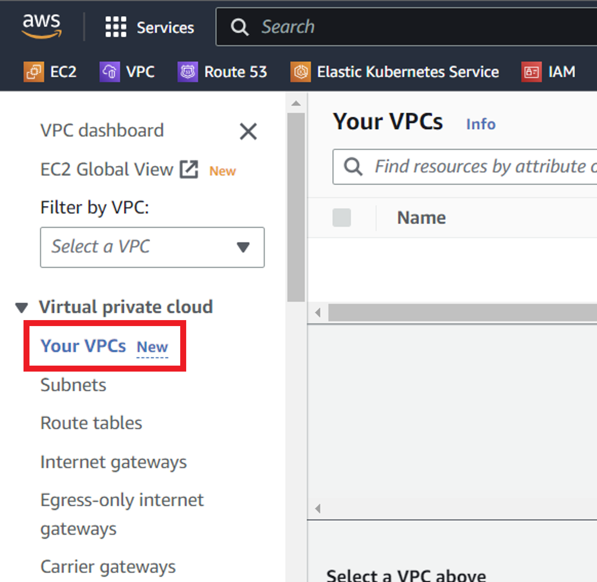

<br>

### ✔ 1-2. Default VPC가 존재하는지 확인

- 우측 VPC 리스트에 Default VPC가 존재하는지 확인한다.
- Default VPC가 존재하는 경우 : 아래와 같이 Default VPC 항목(우측으로 스크롤 이동하여 확인 가능)이 `Yes`로 되어 있는 VPC가 이미 있다면 [2. AWS Cloud9 실습 환경 구성하기](#-2-aws-cloud9-실습-환경-구성하기)로 이동한다.

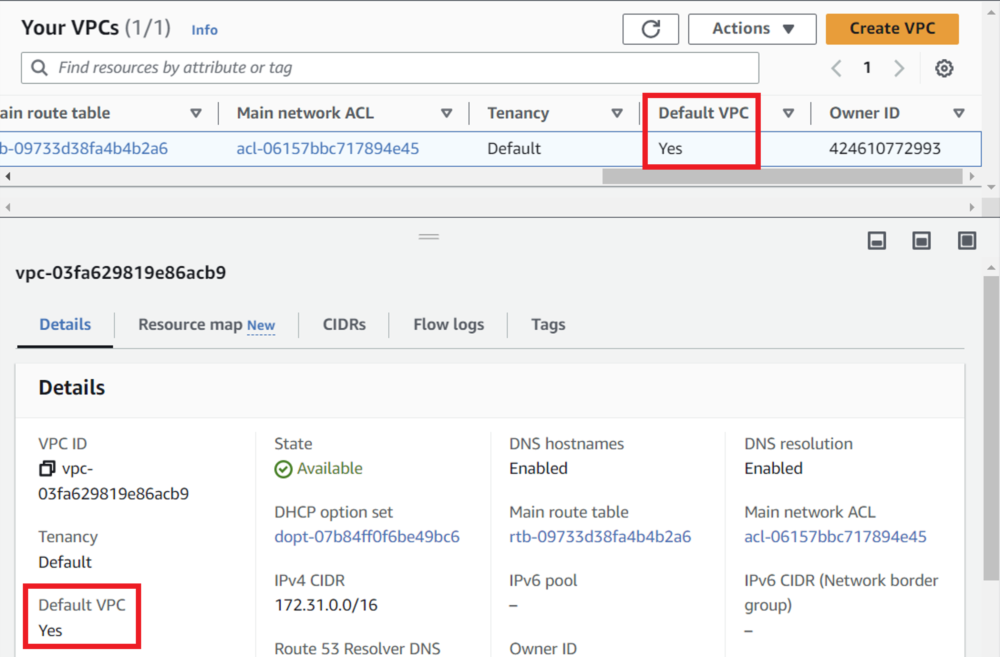

- Default VPC가 존재하지 않는 경우 : 아래와 같이 리스트에 VPC가 없거나, VPC는 있지만 Default VPC 항목(우측으로 스크롤 이동하여 확인 가능)이 `No`로 되어 있다면 새로운 Default VPC를 생성해줘야 한다.

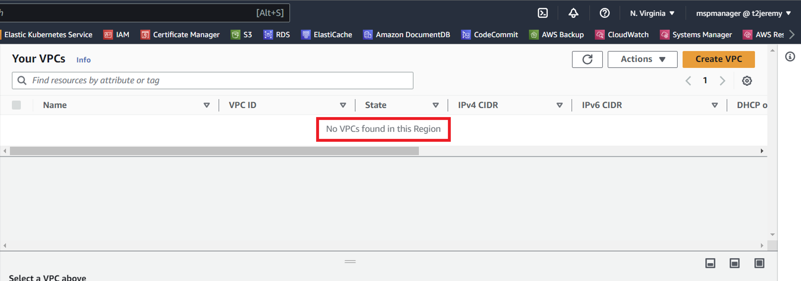

<br>

### ✔ 1-3. Create default VPC 페이지 진입

- Your VPC 우측 상단의 `Actions` > `Create default VPC`를 클릭한다.

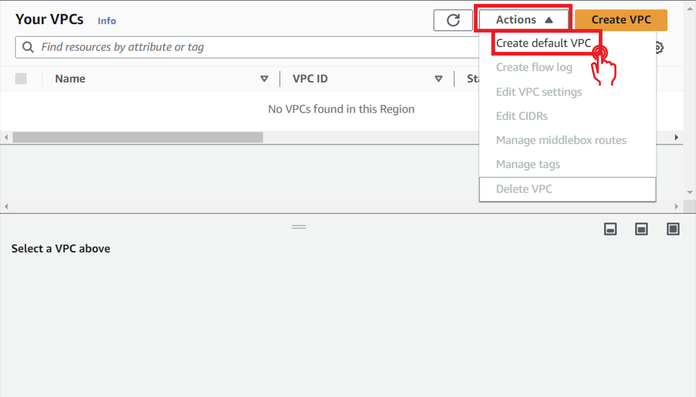

<br>

### ✔ 1-4. Create default VPC

- `Create default VPC` 버튼을 클릭한다.

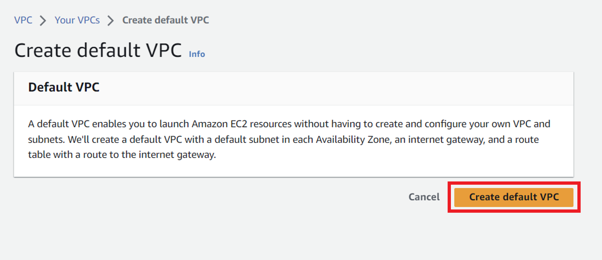

<br>

### ✔ 1-5. VPC 확인

- 성공적으로 vpc가 생성되었다는 문구가 나타나면서, Details > Default VPC 항목에 Yes로 표기되어 있음을 확인할 수 있다.

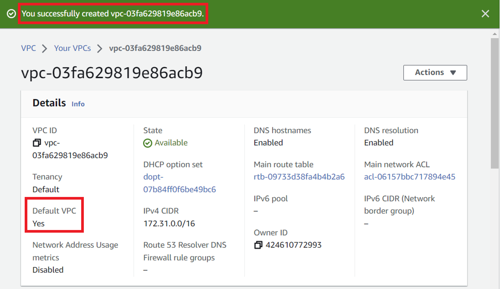

<br>

## 🔴 2. AWS Cloud9 실습 환경 구성하기

- Cloud9은 클라우드 기반의 IDE(통합 개발 환경)를 제공하며, 실습에 필요한 AWS CLI, Terraform 등 도구가 미리 설치되어 있다.

### ✔ 2-1. Cloud9 페이지 이동

- AWS Console에서 [Cloud9](https://ap-northeast-2.console.aws.amazon.com/cloud9control/home?region=ap-northeast-2#/) 서비스로 이동한다.

> 실습 Region : `ap-northeast-2 (Seoul)`

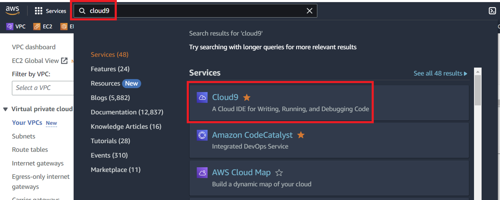

<br>

### ✔ 2-2. `Create environment`

- 우측 상단의 `Create environment` 버튼을 클릭한다.

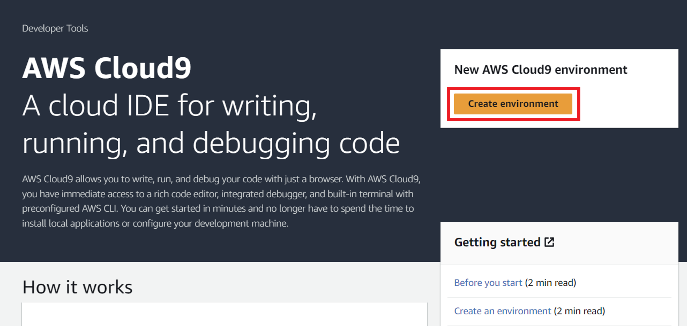

<br>

### ✔ 2-3. 정보입력 및 생성

- Create Environment 화면에서 아래와 같이 입력하고 하단의 `Create` 버튼을 클릭한다.

> | 항목                                         | 내용                                     | 액션                |
> | -------------------------------------------- | ---------------------------------------- | ------------------- |
> | ➕ Details > Name                            | `cta-environment`                        | 🧲복사 & 📋붙여넣기 |
> | ➕ New EC2 instance > Instance Type          | `t3.medium`                              | 👆🏻라디오버튼 선택   |
> | ➕ New EC2 instance > Timeout                | `1 day`                                  | 👆🏻셀렉트박스 선택   |
> | ➕ Network settings > VPC settings > VPC     | `{DEFAULT_VPC_ID}`                       | 👆🏻셀렉트박스 선택   |
> | ➕ Network settings > VPC settings > Sunbnet | `ap-northeast-2a` 혹은 `ap-northeast-2c` | 👆🏻셀렉트박스 선택   |

### ✔ 2-4. 생성확인

- `cta-environment` 이름의 개발환경이 생성된 것을 확인할 수 있다.

❗❗`cta-environment` 개발환경이 생성된 후, EC2 > Instances 메뉴로 접속해보면 Instance 하나가 생성된 것을 확인할 수 있다. 해당 Instance는 절대로 <b>삭제하지 않도록 주의</b>하자❗❗

<br>

### ✔ 2-5. Cloud9 접속

- 목록에서 `Open` 링크를 클릭하면 새탭에서 Cloud9 개발환경에 접속된다.

<br>

### ✔ 2-6. Cloud9 화면 구성

- Cloud9 화면 구성에 대한 간략한 설명은 아래와 같다.

  - File Explorer(화면 좌측) : File과 Folder 구성
  - File Contents Editor(Main 화면) : 파일 상세 확인 및 수정
  - Terminal Window(화면 하단) : Bash Shell

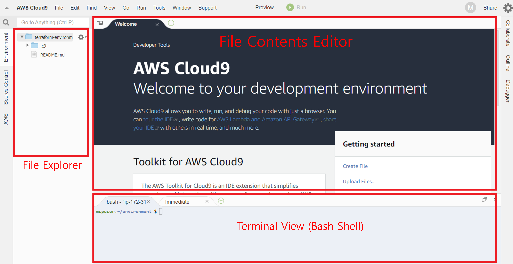

<br>

### ✔ 2-7. Cloud9 테마

- Welcome Page 우측에 메인 테마 및 에디터 테마를 변경할 수 있는 옵션이 제공된다. 취향에 맞는 테마를 선택하자.

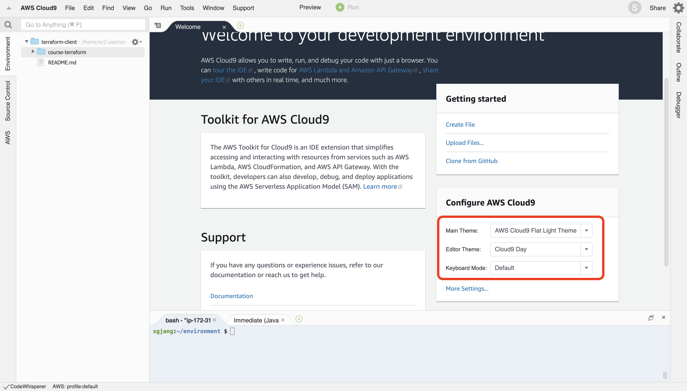

<br>

## 🔴 3. AWS Cloud9 권한 설정 및 툴 설치

### ✔ 3-1. IAM Role 생성

- Administrator access 정책을 가진 IAM Role을 생성한다.

#### 3-1-1. IAM 페이지 이동

- AWS Console에 접속하여 [IAM](https://us-east-1.console.aws.amazon.com/iam/home?region=ap-southeast-1#/home) 서비스로 이동

- `ROLES(역할)` > `Create Role` 클릭

#### 3-1-2. Trusted entity(신뢰할 수 있는 엔터티) 선택

> | 항목                   | 내용          | 액션               |
> | ---------------------- | ------------- | ------------------ |
> | ➕ Trusted entity type | `AWS service` | 👆🏻라디오버튼 선택  |
> | ➕ Use case            | `EC2`         | 👆🏻셀렉트 박스 선택 |

- 선택후 `Next`

#### 3-1-3. 권한 추가

- `AdministratorAccess` 검색 후 선택
- 선택후 `Next`

#### 3-1-4. Role 이름 지정

> | 항목         | 내용                | 액션              |
> | ------------ | ------------------- | ----------------- |
> | ➕ Role name | `role-cloud9-admin` | ✏텍스트 박스 입력 |

- 입력후 `Create Role`

<br>

### ✔ 3-2. Cloud9에서 IAM 설정 업데이트

- AWS Cloud9 credentials 비활성화하고 IAM Role을 부여합니다.

#### 3-2-1. AWS Console EC2

- AWS Console에 접속하여 [EC2-Instances](https://ap-northeast-2.console.aws.amazon.com/ec2/home?region=ap-northeast-2#Instances:) 서비스로 이동합니다.

#### 3-2-2. Cloud9 인스턴스의 IAM role 변경

- Cloud9용 인스턴스 선택 > `Actions` > `Security` > `Modify IAM Role`

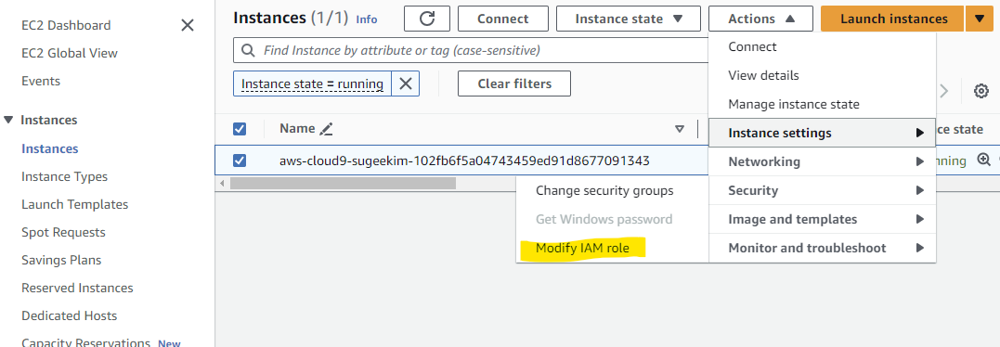

- `role-cloud9-admin` 선택 > `Update IAM role`

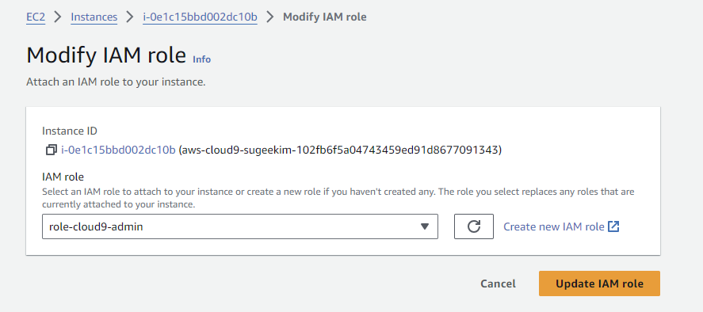

#### 3-2-3. Cloud9 세팅 변경

- Cloud9 화면에서 진행합니다.
- Cloud9 IDE > 우측 상단 기어 아이콘 클릭

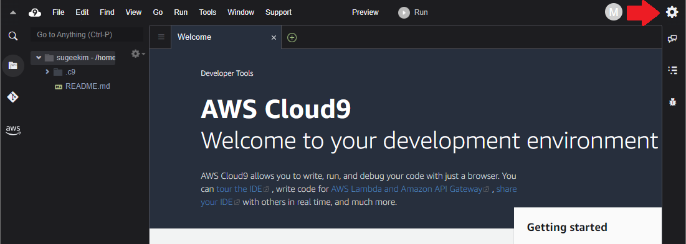

- 사이드 바의 `AWS SETTINGS` > `Credentials` > `AWS managed temperature credits` 비활성화

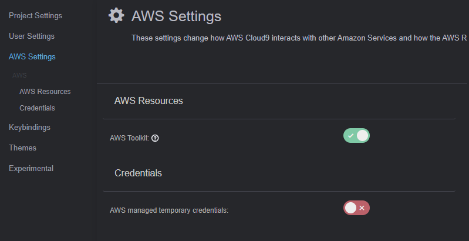

#### 3-2-4. 기존의 자격 증명 파일도 제거

```bash
rm -vf ${HOME}/.aws/credentials
```

#### 3-2-5. 확인

- Cloud9 IDE가 올바른 IAM Role을 사용하고 있는지 확인

```bash
aws sts get-caller-identity
```

- 결과 예시

```
{
    "Account": "000000000000",
    "UserId": "AROAYPGKIIIIIZGAYYYYY:i-0436079f403eeeeee",
    "Arn": "arn:aws:sts::582392222222:assumed-role/e-cloud9-admin/i-0436079f403eeeeee"
}
```

<br>

### ✔ 3-3. kubectl

#### 3-3-1 kubectl 설치 (1.28)

- kubectl 1.28버전을 사용합니다.
- 설치 참고 링크: https://docs.aws.amazon.com/eks/latest/userguide/install-kubectl.html

```bash
curl -O https://s3.us-west-2.amazonaws.com/amazon-eks/1.28.5/2024-01-04/bin/linux/amd64/kubectl
```

```bash
chmod +x ./kubectl
```

```bash
mkdir -p $HOME/bin && cp ./kubectl $HOME/bin/kubectl && export PATH=$HOME/bin:$PATH
```

```bash
echo 'export PATH=$HOME/bin:$PATH' >> ~/.bashrc
```

- kubectl 설치 확인

```bash
kubectl version --client
```

- 결과 예시

```
Client Version: v1.28.5-eks-5e0fdde
Kustomize Version: v5.0.4-0.20230601165947-6ce0bf390ce3
```

#### 3-3-2 kubectl 자동완성

```bash
kubectl completion bash >>  ~/.bash_completion
. /etc/profile.d/bash_completion.sh
. ~/.bash_completion
```

<br>

### ✔ 3-4. jq

#### 3-4-1 jq 설치

- json을 다루는 유틸리티

```bash
sudo yum install -y jq
```

<br>

### ✔ 3-5. Homebrew

#### 3-5-1 ec2-user 패스워드

- homebrew설치할때 패스워드 묻기 때문에 미리 설정합니다.

```bash
sudo passwd ec2-user
```

#### 3-5-2 homebrew 설치

https://brew.sh/

- 위 url타고 들어가면 아래랑 비슷한 명령어를 확인 할 수 있습니다. 실행합니다.

```bash
/bin/bash -c "$(curl -fsSL https://raw.githubusercontent.com/Homebrew/install/HEAD/install.sh)"
```

- 인스톨후 나오는 아래 두개 명령어를 실행합니다. (명령어가 달라질 수 있으니 실행전 확인을 합니다.)

```bash
(echo; echo 'eval "$(/home/linuxbrew/.linuxbrew/bin/brew shellenv)"') >> /home/ec2-user/.bash_profile
```

```bash
eval "$(/home/linuxbrew/.linuxbrew/bin/brew shellenv)"
```

#### 3-5-3 설치 확인

```
brew -v
```

<br>

### ✔ 3-6. helm

#### 3-6-1 helm 설치

```
brew install helm
```

#### 3-6-2 helm 버전 확인

```
helm version
``
```
