# 2일차 - Lab 3. GitHub 구성

ⓘ 실습목표 : GitOps 활용을 위해 Git을 준비한다.

---

- [2일차 - Lab 3. GitHub 구성](#2일차---lab-3.-github-구성)
  - [1. Github 설정하기](#🔴-1.-github-설정하기)
  - [2. Pipeline Workspace용 repository 생성](#🔴-2.-pipeline-workspace용-repository-생성)

---

 

> **📌 [메모사항]**
>
> ➕ **<< github_username>>** :  
>  ➕ **<< github_token>>** :

 

 

## 🔴 1. Github 설정하기

- 각자의 GitHub 계정으로 로그인한다.

 

### ✔ 1-1. Github 회원가입

- [참고] Github 계정이 없으면 https://github.com/ 에 방문한 후 아래와 같이 회원 가입을 한다.

 😎 [참고 - 펼치기👇] 회원 가입 참고

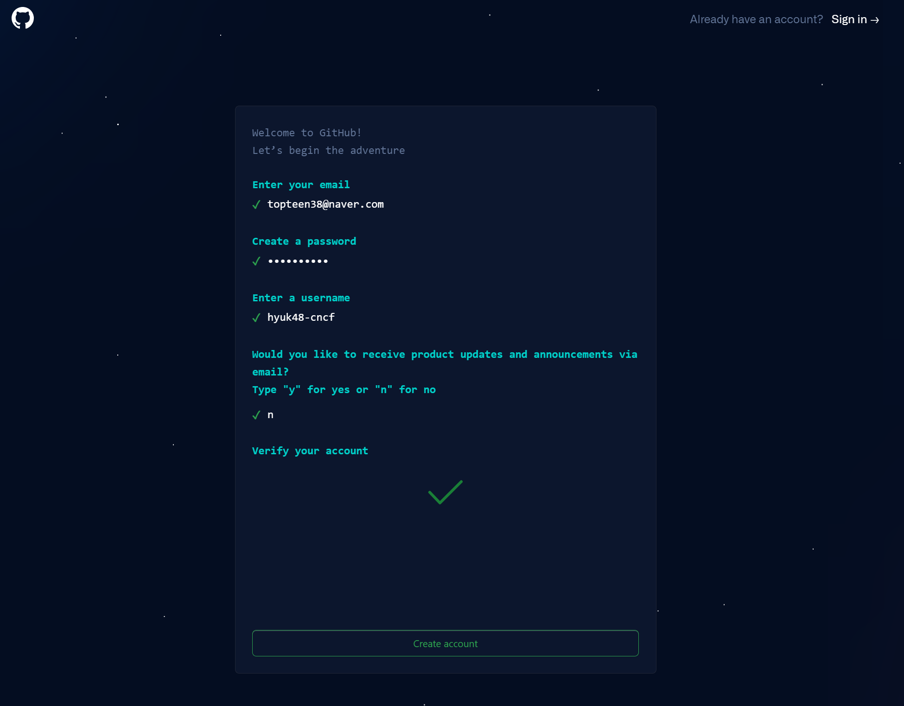

 

### ✔ 1-2. Github 로그인

- Github 사이트에 로그인 한다. (https://github.com/)

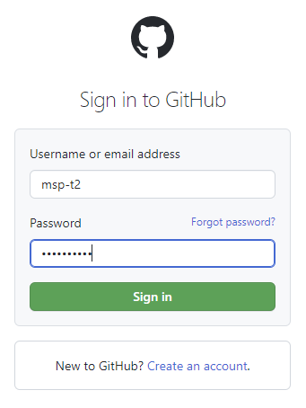

 

### ✔ 1-3. github username 확인

- 우측 상단 아이콘을 클릭하여, 빨간 박스 안의 github username 을 확인한다.

📌 해당 값은 github 설정 시 필요한 값으로 `<<github_username>>` 에 메모한다.

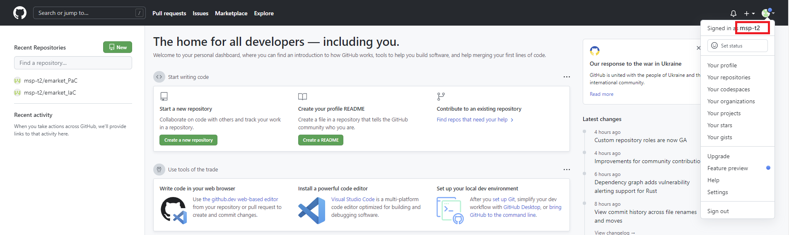

 

### ✔ 1-4. Github token 생성

- Git에서는 password 대신 Personal Access Token 인증을 사용하기 때문에 생성하며, 
  이후 GitOps Console이나 Admin server 등에서 본인의 Git repository에 접근하기 위해서 git token 값을 사용한다.

❗❗ 이전에 발급했던 Token을 그대로 사용할 경우, CTA 과정 진행 중 유효기간 만료로 지장이 초래되니 반드시 새로 생성한다. ❗❗

 

Step 1) 우측 상단 `Settings` 선택한다.

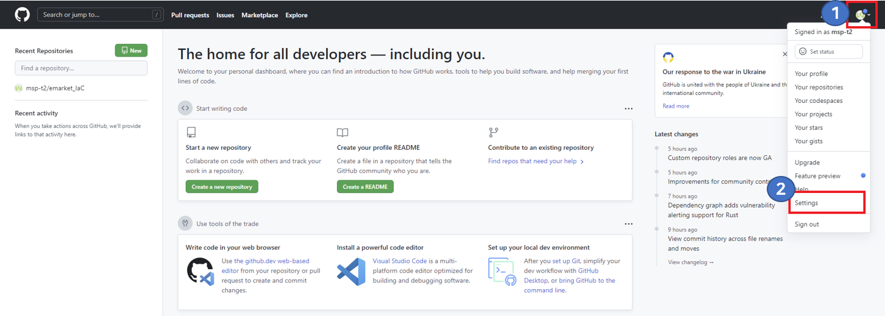

 

Step 2) 좌측 메뉴 `Developer settings` 선택한다.

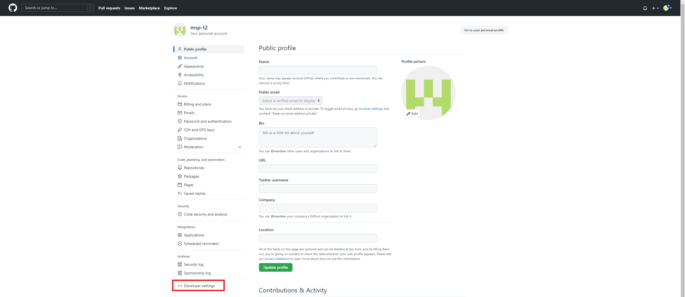

 

Step 3) 좌측 메뉴 `Personal access tokens` 선택 후 `Tokens(classic)` 을 클릭한다.

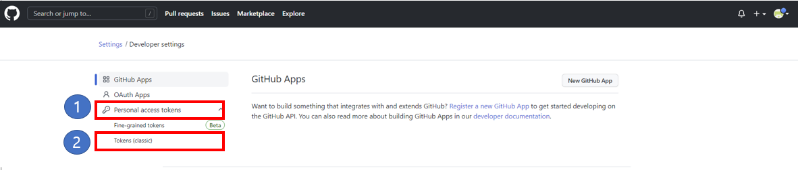

 

Step 4) `Generate new token` 선택 후 `Generate new token(classic)` 을 클릭한다.

- [참고] `Fine-grained token`은 조직, 사용자, Repo 의 모든 API별로 읽기/쓰기 동작 등을 상세 제어 가능하여 
  개발자 및 조직에게 향상된 보안 기능을 제공함. 
  교육 과정에선 기존 `Personal Access Token(PAT)`을 이용하여 모든 Repo에 대한 접근을 관리할 예정이다.

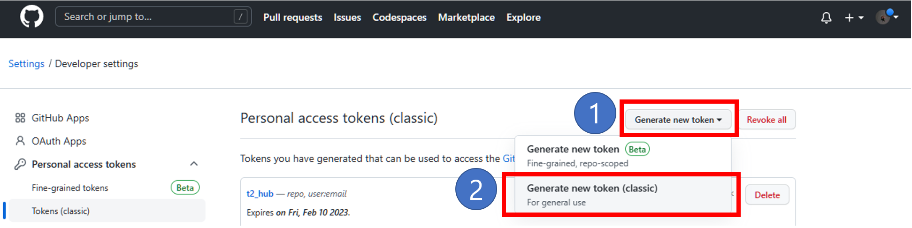

- 다시 한번 인증을 요구할 경우, 패스워드를 입력하고 'Confirm'을 클릭한다.

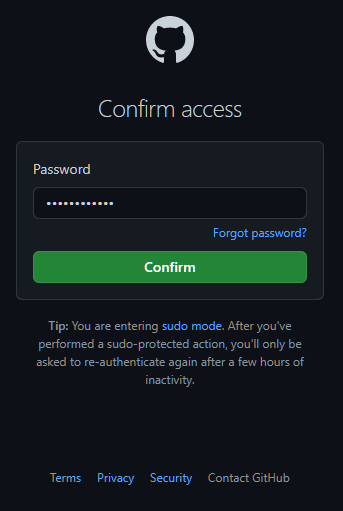

 

Step 5) Note에 `t3_hub`를 입력하고, `repo` 체크 후 `Generate token` 버튼 클릭하여 token 생성한다.

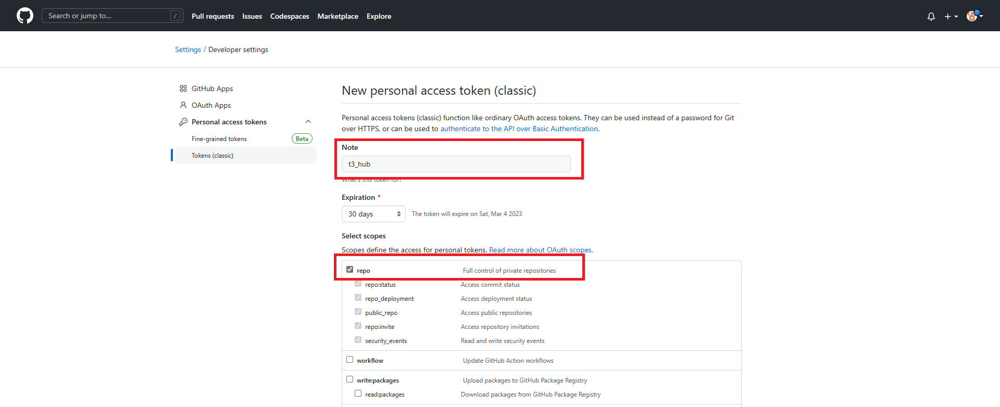

 

### ✔ 1-5. Github Personal Access token 저장

📌 해당 값은 GitOps Console이나 EC2 인스턴스에서 github 접근 시 필요한 값으로 `<<github_token>>` 에 메모한다.

❗❗ 생성된 Token은 이 화면을 벗어난 이후 다시 확인이 불가능하니 반드시 저장한다. ❗❗

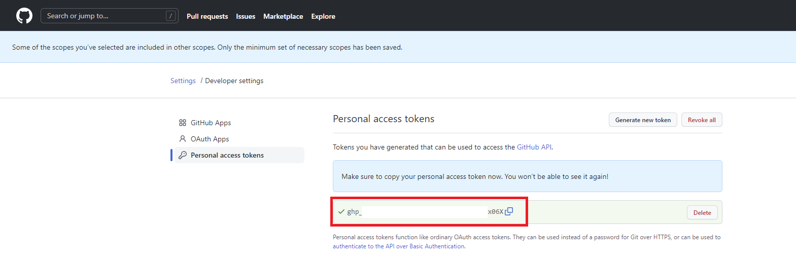

  

---

  

## 🔴 2. Pipeline Workspace용 repository 생성

▶ 개인의 GitHub에 Pipeline Workspace용 repository 생성

 

### ✔ 2-1. Repository 생성 화면이동

- Github icon을 클릭하여 Home으로 이동 후, 녹색의 `Create repository` 혹은 `New` 버튼을 클릭한다.

- network_pipeline repository 를 생성한다.

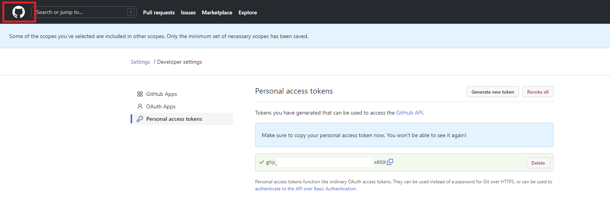

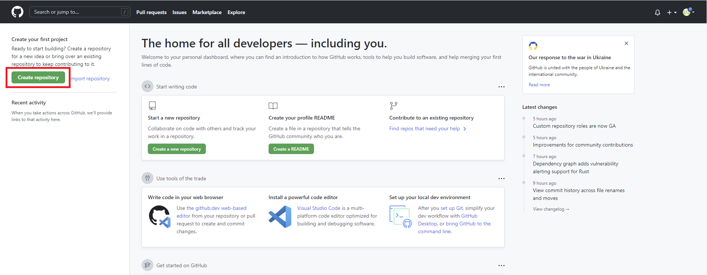

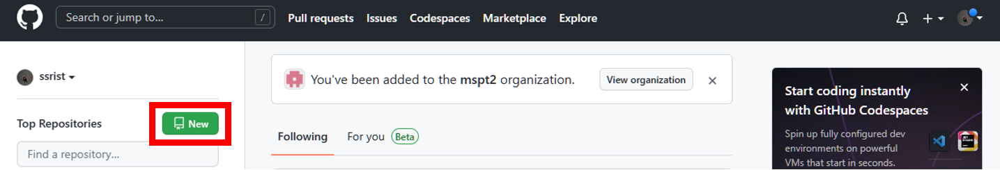

 

### ✔ 2-2. Repository 정보 입력 및 생성

- 아래와 같이 입력하고 `Create repository` 버튼을 눌러서 repository를 생성한다.

> | 항목               | 내용               | 액션                |
> | ------------------ | ------------------ | ------------------- |
> | ➕ Repository name | `network_pipeline` | 🧲복사 & 📋붙여넣기 |
> | ➕ Public/Private  | `Private`          | 👆🏻라디오버튼 선택   |

❗❗ Repository name의 대소문자에 주의한다. ❗❗  
❗❗ Repository type은 반드시 Private로 선택한다. ❗❗

  
