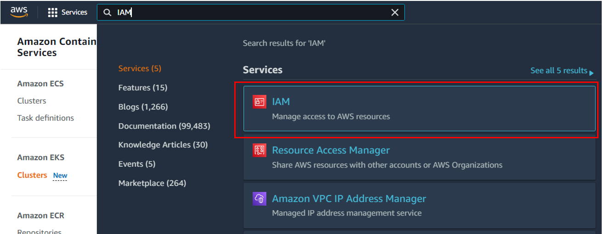
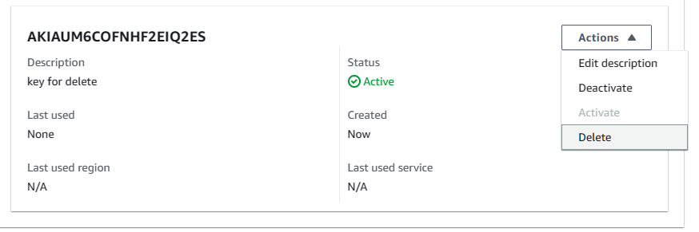
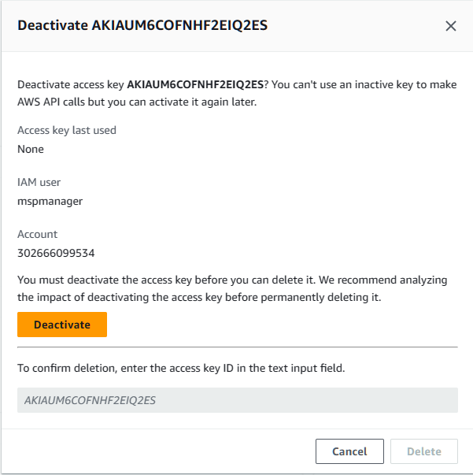
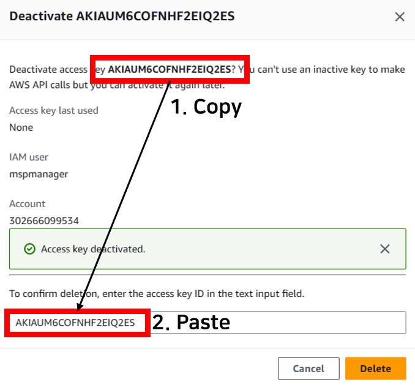
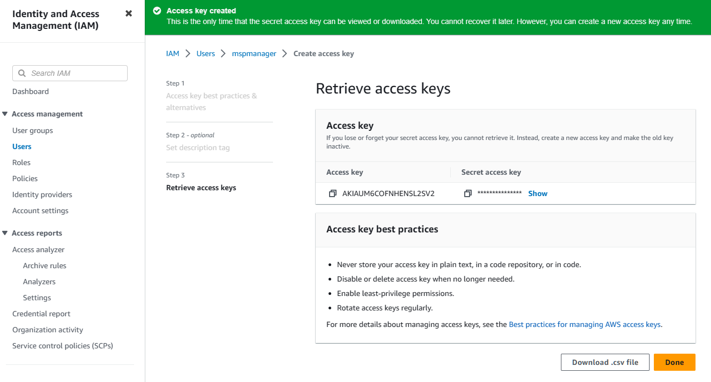

# 2일차 - Lab 4. AWS 액세스 키 발급하기

---

- [2일차 - Lab 4. AWS 액세스 키 발급하기](#2일차---lab-4.-aws-액세스-키-발급하기)
  - [1. AWS 액세스 키 발급하기](#✔-1.-aws-액세스-키-발급하기)
  - [2. AWS console - IAM](#✔-2.-aws-console---iam)
  - [3. User 클릭](#✔-3.-user-클릭)
  - [4. Create access key](#✔-4.-create-access-key)
  - [5. 저장](#✔-5.-저장)

---

> **📌 [실습 중 메모사항]**
>
> ➕ _<< AWS Access Key ID>>_ :  
>  ➕ _<< AWS Secret Access key>>_ :

 

## ✔ 1. AWS 액세스 키 발급하기

- GitOps Console과 Admin server에서 본인의 AWS 자원에 접근할 수 있도록 IAM 서비스에서 액세스 키를 생성한다.

- 만약 T3 기본 과정이나 CTA 3일차 과정 중에 생성했던 `AWS Access key`와 `Secret access key`를 저장해둔 경우, 
  해당 키를 그대로 이용해 이후 수업을 진행해도 무방하다. 
  📌 **Access Key ID**는 `<<AWS Access Key ID>>`에 메모하고, 
  &nbsp; &nbsp; &nbsp; **Secret access key**는 `<<AWS Secret Access key>>`에 메모하여 저장한다. 

 

## ✔ 2. AWS console - IAM

- AWS 콘솔(https://console.aws.amazon.com/)에 로그인 한 후, `IAM` 서비스로 이동한다.

 

## ✔ 3. User 클릭

- IAM 서비스 좌측의 `Users` 메뉴를 클릭한 후, **(수강생 : mspuser )** / (강사 : mspmanager )인 사용자를 클릭한다.
  

 

## ✔ 4. Create access key

- `Security credentials` 탭을 클릭하고, `Access Keys` 항목에서 `Create access key` 버튼을 클릭한다.

- Access key는 동시에 `최대 2개`만 보유할 수 있다. 
  이미 생성해둔 Key가 2개인 경우, 먼저 1개를 삭제하고 진행한다.

- `Access key best practices & alternatives` 화면에서는 `Other`을 선택하고 `Next` 클릭

- `Set description tag - optional` 화면은 선택사항이니 바로 `Create Access Key` 클릭

 😎 [참고 - 펼치기👇] Access key 삭제 방법 

 

- 삭제하려는 Access key 우측의 `Actions` 클릭하고, `Delete` 클릭.

 

- `Deactivate` 클릭.

 

- `Access key`를 복사해서 삭제확인 입력 창에 붙여넣기 후, `Delete` 클릭.

 

## ✔ 5. 저장

- 생성된 Key는 `Show`를 클릭하고 복사 하여 메모하고, `Download .csv file` 버튼을 클릭하여 저장한다.

📌 **Access Key ID**는 `<<AWS Access Key ID>>`에 메모하고, 
&nbsp; &nbsp; &nbsp; **Secret access key**는 `<<AWS Secret Access key>>`에 메모하여 저장한다.

❗ **`Download .csv file` 버튼을 반드시 클릭하여 로컬 저장소에 보관**한다. 해당 화면을 벗어난 이후에는 Key 정보를 확인할 수 없다!

