# 2일차 - Lab 5. 인프라 - 네트워크 생성 실습

---

- [2일차 - Lab 5. 인프라 - 네트워크 생성 실습](#2일차---lab-5.-인프라---네트워크-생성-실습)
  - [1. Gitops Console 로그인](#🔴-1.-gitops-console-로그인)
  - [2. Pipeline Worksapce 생성](#🔴-2.-pipeline-worksapce-생성)
  - [3. Pipeline 설정](#🔴-3.-pipeline-설정)
  - [4. Pipeline 실행](#🔴-4.-pipeline-실행)

---

## 🔴 1. Gitops Console 로그인

 

### ✔ 1-1. Gitops Console 로그인

- https://t3.gitopsconsole.com
- 각자 발급받은 ID/PW로 로그인 합니다.

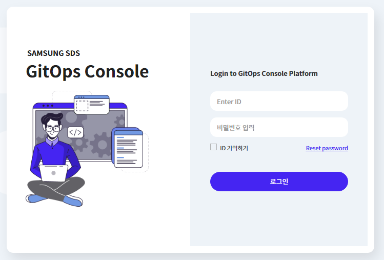

 

## 🔴 2. Pipeline Worksapce 생성

### ✔ 2-1. Pipeline Workspace 생성

- `Workspace` > `Pipeline Workspace` > `Create Pipeline Workspace`

 

### ✔ 2-2. Pipeline Workspace 정보입력 및 생성

- 🔥🔥🔥Workspace Name은 Globally 유니크 해야합니다.🔥🔥🔥

- **📌 [입력]**

> | 항목                     | 내용                                      | 액션                          |
> | ------------------------ | ----------------------------------------- | ----------------------------- |
> | ➕ Workspace Name        | `network-<<gitopsconsole_ID>>-<<YYMMDD>>` | 🧲복사 & 📋붙여넣기           |
> | ➕ CSP                   | `AWS`                                     | 👆🏻셀렉트박스 선택             |
> | ➕ New Credentials       | `Yes`                                     | 👆🏻라디오버튼 선택             |
> | ➕ Credentials           | `cta-2024-aws-credential`                 | 🧲복사 & 📋붙여넣기           |
> | ➕ AWS Access Key ID     | `<<발급받은 Access Key>>`                 | ✏메모내용 🧲복사 & 📋붙여넣기 |
> | ➕ AWS Secret Access key | `<<발급받은 AWS Secret Access key>>`      | ✏메모내용 🧲복사 & 📋붙여넣기 |
> | ➕ Repository Use Case   | `Register`                                | 👆🏻라디오버튼 선택             |
> | ➕ GIT for IaC           | `<<자신의 git repository 주소>>`          | ✏메모내용 🧲복사 & 📋붙여넣기 |
> | ➕ User Name for Git     | `<<자신의 git name>>`                     | ✏메모내용 🧲복사 & 📋붙여넣기 |
> | ➕ Access Token for Git  | `<<발급 받은 git token>>`                 | ✏메모내용 🧲복사 & 📋붙여넣기 |
> | ➕ Source Of IaC         | `Catalog`                                 | 👆🏻셀렉트박스 선택             |
> | ➕ Catalog               | `aws vpc`                                 | 👆🏻카탈로그 선택               |

- 입력후 Create 클릭

 

### ✔ 2-3. Pipeline Workspace 생성확인

- 다음과 같은 화면을 확일 할 수 있다

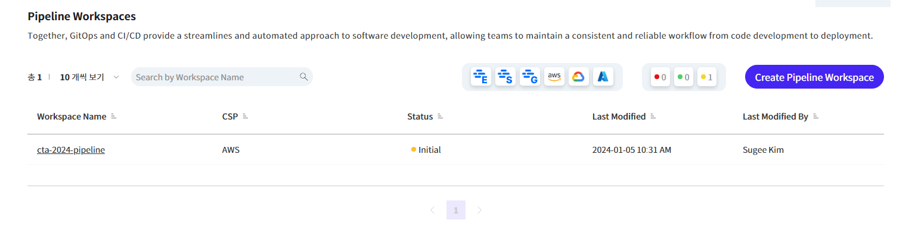

- 상세화면

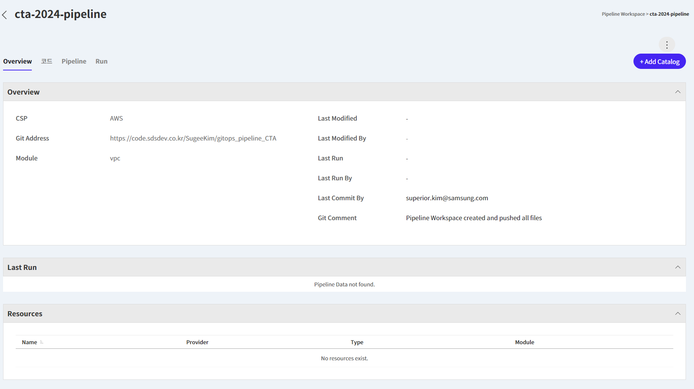

- Github에 파일을 확인할 수 있다.

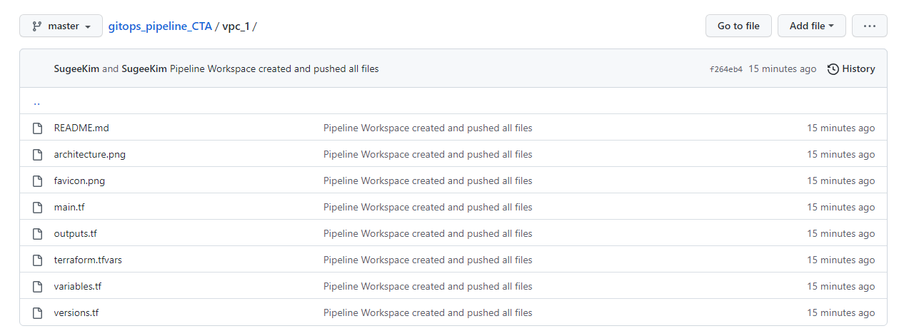

 

## 🔴 3. Pipeline 설정

### ✔ 3-1. Pipeline 구성

- `Pipeline` > `Create Pipeline` 클릭
- Pipeline Name 입력후 `Save`

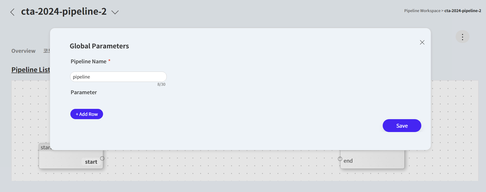

 

### ✔ 3-2. Task 추가

- `IAC Task` 선택 > `Add Task` 클릭

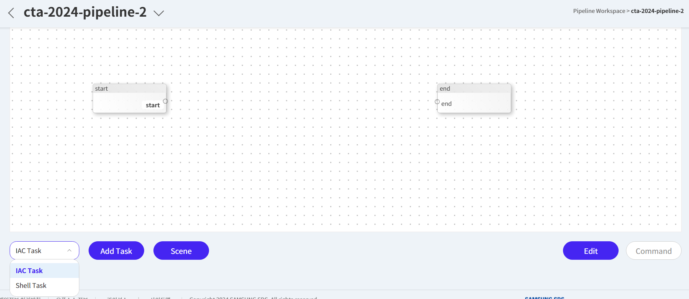

 

### ✔ 3-3. Pipeline 연결

- 아래의 이미지와 같이 생성된 task를 start/end와 연결

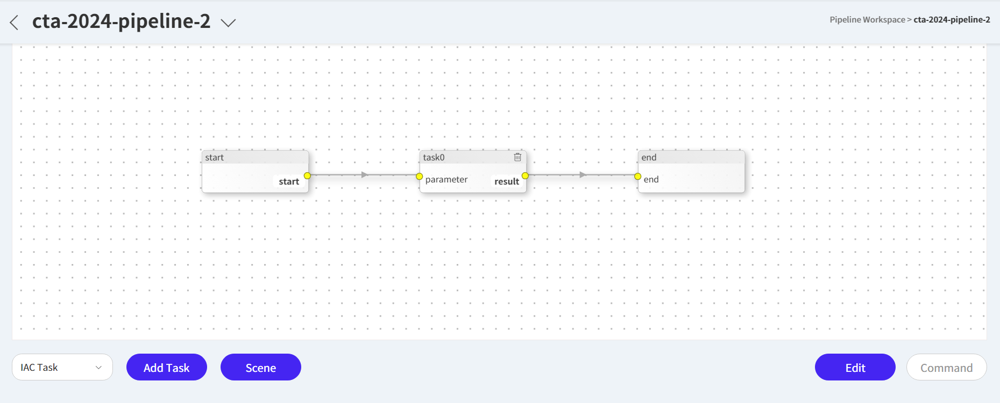

 

### ✔ 3-4. task 상세 설정

- Task를 더블클릭하여 task의 정보 입력
- **📌 [입력]**

> | 항목       | 내용    | 액션                |
> | ---------- | ------- | ------------------- |
> | ➕ Name    | `vpc`   | 🧲복사 & 📋붙여넣기 |
> | ➕ Source  | `vpc_1` | 👆🏻셀렉트박스 선택   |
> | ➕ project | `cta`   | 🧲복사 & 📋붙여넣기 |

- 입력후 `Save`

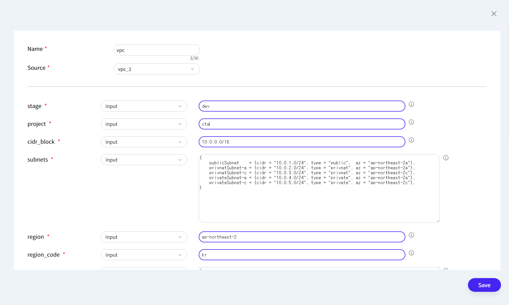

- `Command` > `Yes` 클릭하여 정보 저장

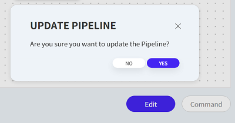

 

## 🔴 4. Pipeline 실행

### ✔ 4-1. Plan

- task를 더블클릭 후 `Plan` 클릭
- Plan이 완료되면 아래와 같은 화면

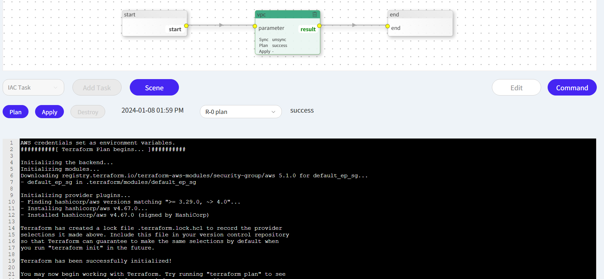

 

### ✔ 4-2. Apply

- 이번에는 `Apply` 클릭
- Apply가 완료되면 아래와 같은 화면

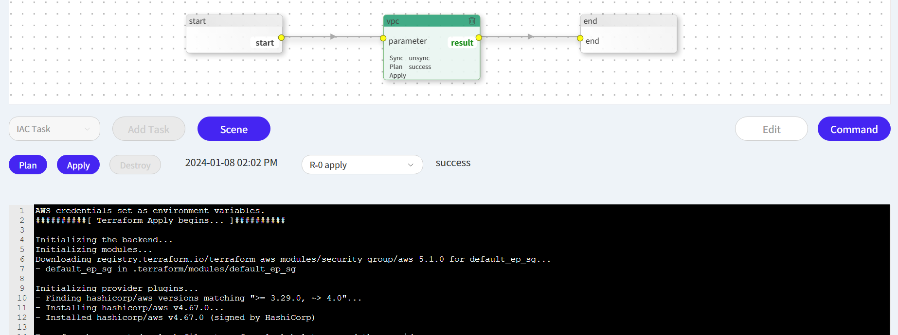

 

### ✔ 4-3. 생성된 VPC 확인 (Gitops Console)

- `Overview` 탭 클릭

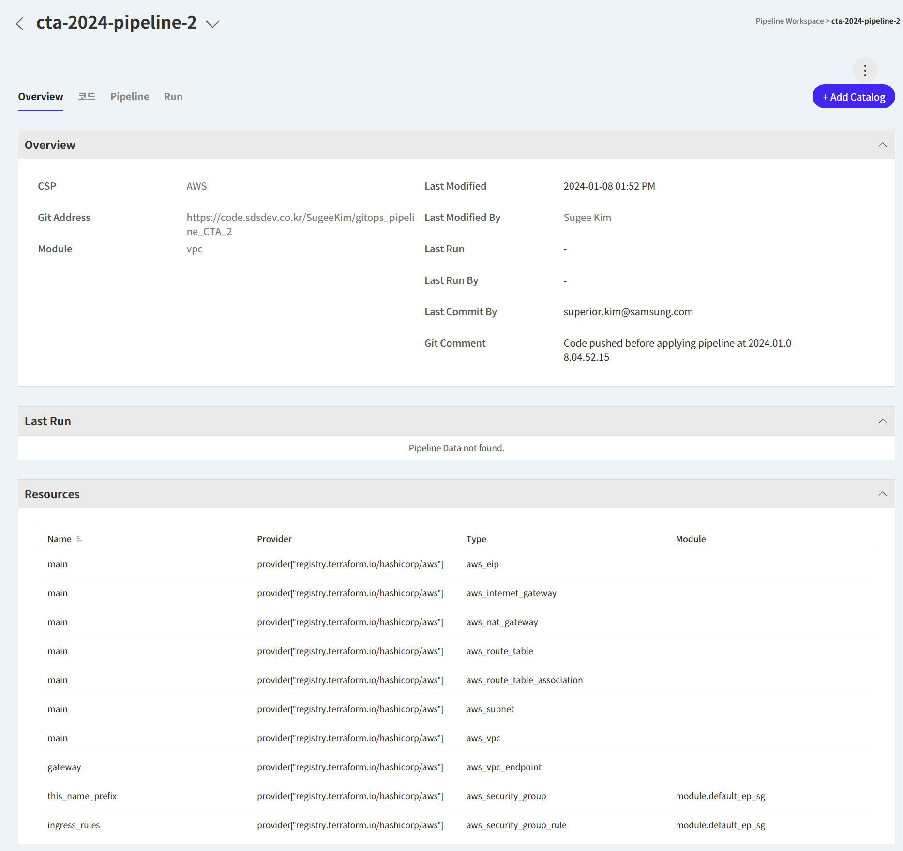

### ✔ 4-4. 생성된 VPC 확인 (AWS Console)

- `AWS 콘솔 로그인` > `VPC`
- 🔗[[VPC 확인하기]](https://ap-northeast-2.console.aws.amazon.com/vpcconsole/home?region=ap-northeast-2#vpcs:)

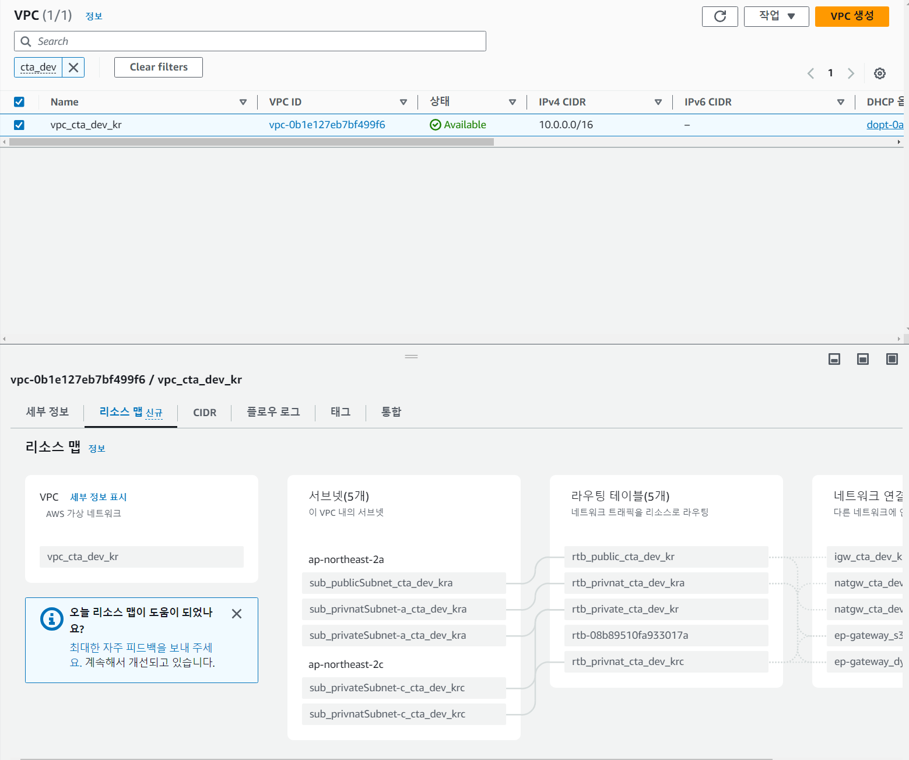

 

### ✔ 4-5. Destroy

- 다시 `Pipeline`탭 클릭 > `vpc Task` 클릭 > 하단 `Destroy` 클릭
- Destroy가 완료되면 아래와 같은 화면

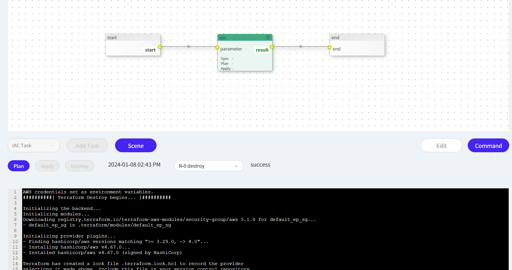

 

### ✔ 4-6. Destroy된 VPC 확인 (Gitops Console)

- `Overview` 탭 클릭

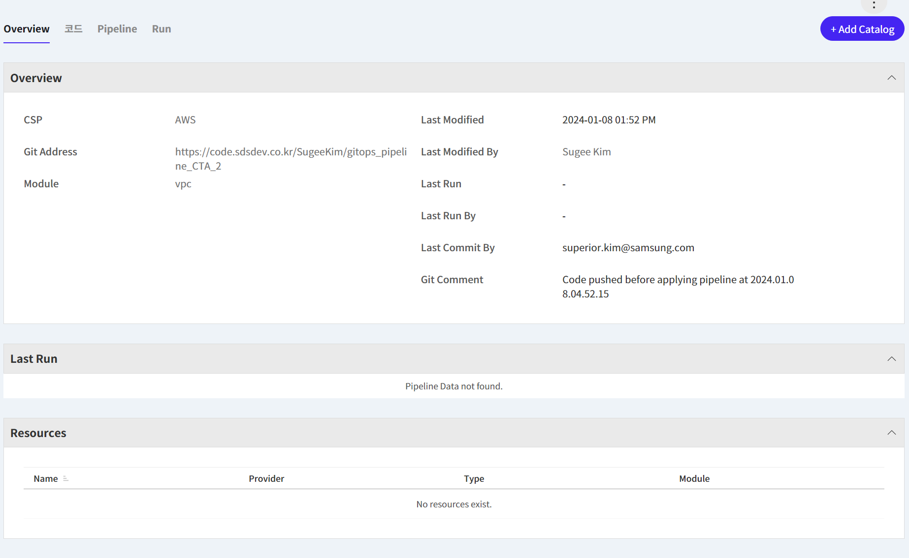

### ✔ 4-7. Destroy된 VPC 확인 (AWS Console)

- `AWS 콘솔 로그인` > `VPC`
- 🔗[[VPC 확인하기]](https://ap-northeast-2.console.aws.amazon.com/vpcconsole/home?region=ap-northeast-2#vpcs:)

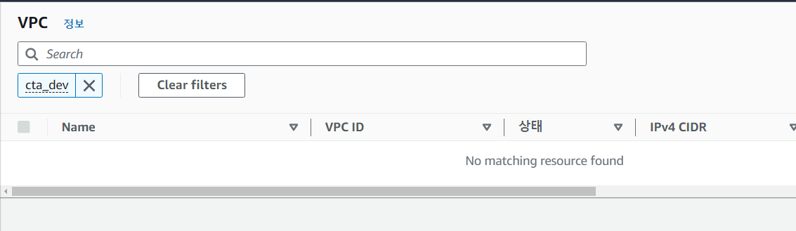
