# 2일차 - Lab 6. 인프라-컴퓨팅 자원 실습

- `인프라 - 네트워크 생성 실습`에 이어서 진행합니다.

---

- [2일차 - Lab 6. 인프라-컴퓨팅 자원 실습](#2일차---lab-6.-인프라-컴퓨팅-자원-실습)
  - [1. Pipeline Catalog 추가](#🔴-1.-pipeline-catalog-추가)
  - [2. Security Group](#🔴-2.-security-group)
  - [3. KeyPair](#🔴-3.-keypair)
  - [4. Bastion](#🔴-4.-bastion)
  - [5. 접속 확인](#🔴-5.-접속-확인)

---

## 🔴 1. Pipeline Catalog 추가

### ✔ 1-1. Pipeline 페이지

- `Gitops Console` > `Workspace` > `Pipeline Workspace` > 생성된 파이프라인 클릭

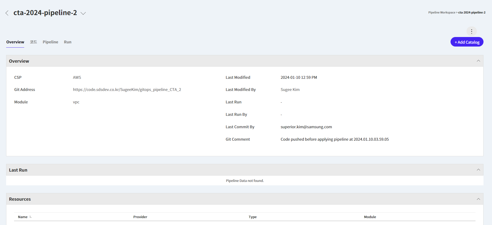

<br>

### ✔ 1-2. Pipeline Catalog 추가

- `Add Catalog` 클릭
- `ec2`와 `securitygroup` 선택 후 `Select`

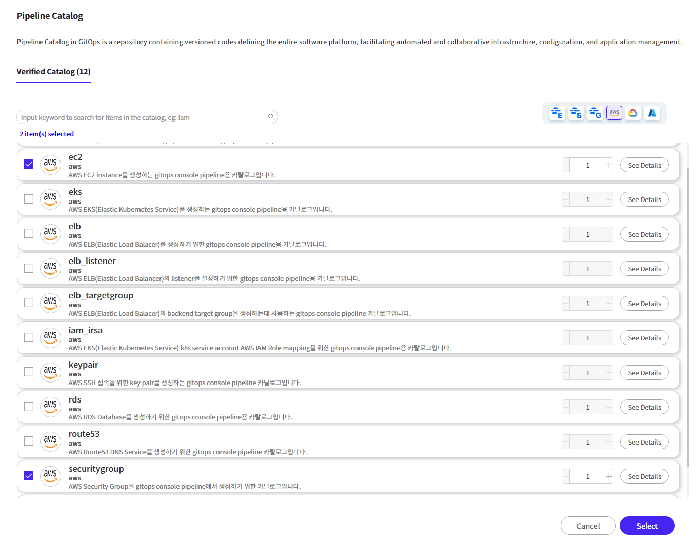

<br>

### ✔ 1-3. 추가된 Catalog 확인

- Module에 ec2와 securitygroup이 추가된것을 확인할 수 있습니다.

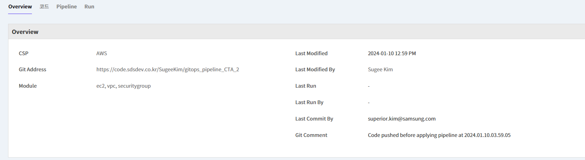

<br>

## 🔴 2. Security Group

### ✔ 2-1. Pipeline Flow 진입

- `Pipeline` 탭 클릭 > `pipeline` 클릭

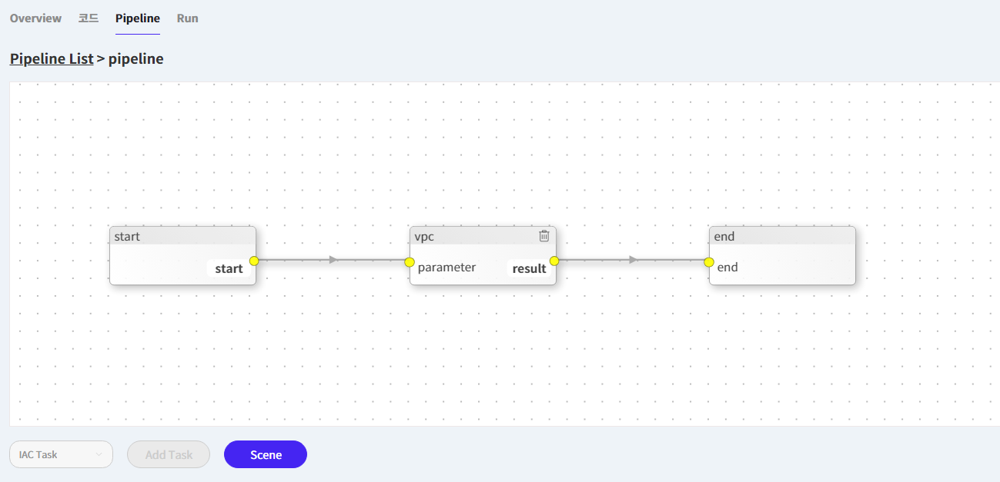

<br>

### ✔ 2-2. Task 추가 및 pipeline 구성

- `Edit` 클릭하여 Edit모드 진입
- `Add Task`클릭
- 아래와 같이 pipeline 구성

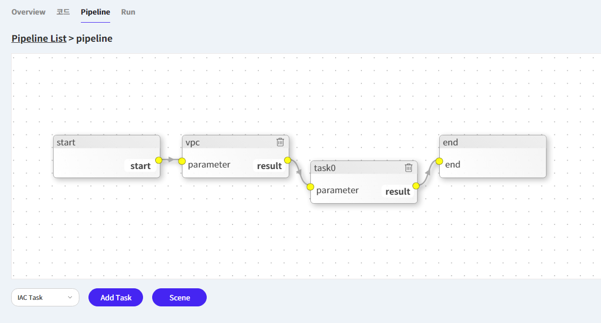

<br>

### ✔ 2-3. SecuriyGroup task 상세 정보 입력

- 생성된 테스크를 더블클릭하여 아래의 내용 입력
- **📌 [입력]**

> | 항목               | 내용                      | 액션                |
> | ------------------ | ------------------------- | ------------------- |
> | ➕ Name            | `securitygroup`           | 🧲복사 & 📋붙여넣기 |
> | ➕ Source          | `securitygroup_1`         | 👆🏻셀렉트박스 선택   |
> | ➕ vpc_id          | `vpc`, `id`               | 👆🏻셀렉트박스 선택   |
> | ➕ project         | `cta_bastion_sg`          | 🧲복사 & 📋붙여넣기 |
> | ➕ security_groups | 🔽아래 내용 복사&붙여넣기 | 🧲복사 & 📋붙여넣기 |

```
{
    "bastion" = {
        description = "Bastion server security group"
        ingresses   = [
            {
                cidr_blocks = ["0.0.0.0/0"]
                port_ranges = ["22", "2022"]
                description = "allow ssh inbound traffic"
            }
        ]
        egresses    = [
            {
                cidr_blocks = ["0.0.0.0/0"]
                port_ranges = ["443"]
                description = "allow all outbound https traffic"
            }
        ]
    }
}
```

- 입력후 `Save`

<br>

### ✔ 2-4. Pipeline 변경사항 저장

- `Command` 클릭 > `Yes`

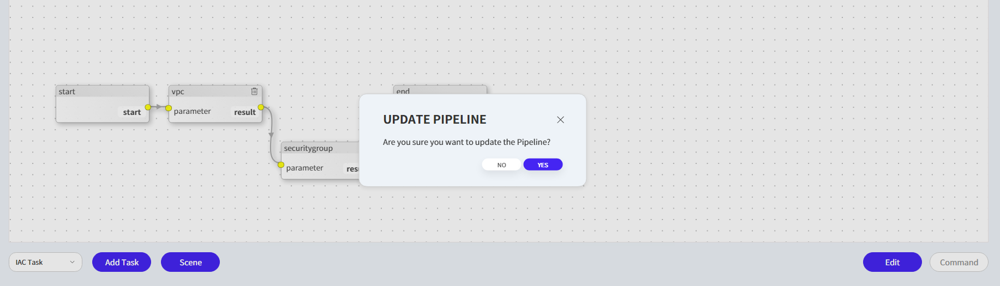

<br>

### ✔ 2-5. Pipeline 실행

- securitygroup task를 더블클릭 > `Plan` > `Apply`

<br>

### ✔ 2-6. 생성된 SecurityGroup 확인

- AWS Console에서 🔗[Security Group](https://ap-northeast-2.console.aws.amazon.com/ec2/home?region=ap-northeast-2#SecurityGroups:) 서비스로 이동한다.
- AWS Console > EC2 > Security Group

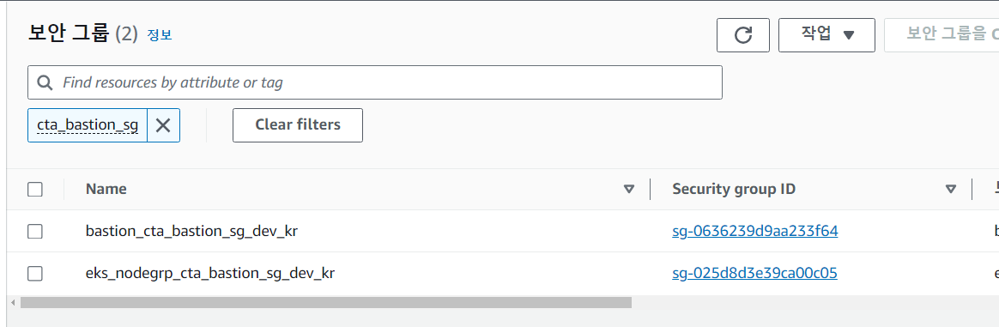

<br>

## 🔴 3. KeyPair

- KeyPair는 AWS Console에서 직접 생성합니다.

<br>

### ✔ 3-1. Key Pair 생성화면

- AWS Console에서 🔗[Key Pair](https://ap-northeast-2.console.aws.amazon.com/ec2/home?region=ap-northeast-2#KeyPairs:) 서비스로 이동한다.
- AWS Console > EC2 > Key Pair
- `Create Key pair` 클릭

<br>

### ✔ 3-2. Key Pair 정보 입력 및 생성

- **📌 [입력]**

> | 항목                       | 내용              | 액션                |
> | -------------------------- | ----------------- | ------------------- |
> | ➕ Name                    | `cta_bastion_key` | 🧲복사 & 📋붙여넣기 |
> | ➕ Key pair type           | `RSA`             | 👆🏻라디오버튼 선택   |
> | ➕ Private key file format | `.pem`            | 👆🏻라디오버튼 선택   |

- 입력후 `Create key pair` 클릭

💥다운로드 받아진 Key 파일을 본인의 Cloud9에 소중히 보관합니다💥

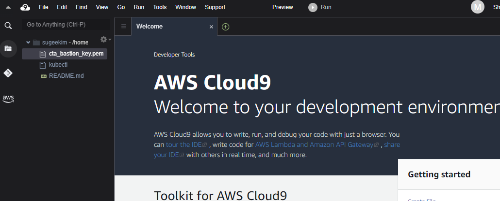

<br>

## 🔴 4. Bastion

### ✔ 4-1. Pipeline Flow 진입

- `Pipeline` 탭 클릭 > `pipeline` 클릭

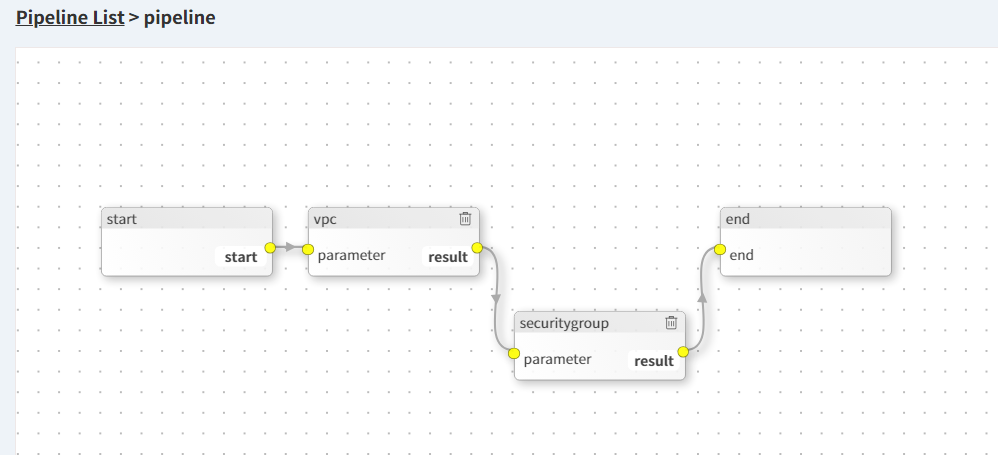

<br>

### ✔ 4-2. Task 추가 및 pipeline 구성

- `Edit` 클릭하여 Edit모드 진입
- `Add Task`클릭
- 아래와 같이 pipeline 구성

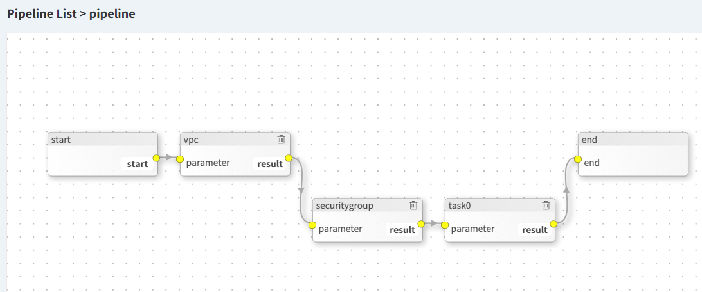

<br>

### ✔ 4-3. Bastion task 상세 정보 입력

- 생성된 테스크를 더블클릭하여 아래의 내용 입력
- **📌 [입력]**

> | 항목                    | 내용                                | 액션                |
> | ----------------------- | ----------------------------------- | ------------------- |
> | ➕ Name                 | `bastion`                           | 🧲복사 & 📋붙여넣기 |
> | ➕ Source               | `ec2_1`                             | 👆🏻셀렉트박스 선택   |
> | ➕ subnet               | `vpc`, `subnet_ids`, `publicSubnet` | 👆🏻셀렉트박스 선택   |
> | ➕ ssh_keypair_name     | `input`, `cta_bastion_key`          | 🧲복사 & 📋붙여넣기 |
> | ➕ names                | `["cta_bastion"]`                   | 🧲복사 & 📋붙여넣기 |
> | ➕ security_group_ids   | `securitygroup`,`ids`,`bastion`     | 👆🏻셀렉트박스 선택   |
> | ➕ enable_public_access | `input`, `true`                     | 🧲복사 & 📋붙여넣기 |

- 입력후 `Save`

<br>

### ✔ 4-4. Pipeline 변경사항 저장

- `Command` 클릭 > `Yes`

<br>

### ✔ 4-5. Pipeline 실행

- bastion task를 더블클릭 > `Plan` > `Apply`

<br>

### ✔ 4-6. 생성된 bastion ec2 확인

- AWS Console에서 🔗[EC2](https://ap-northeast-2.console.aws.amazon.com/ec2/home?region=ap-northeast-2#Instances:instanceState=running) 서비스로 이동한다.
- AWS Console > EC2 > Instances

💥💥💥만들어진 인스턴스의 public ip를 메모한다.💥💥💥

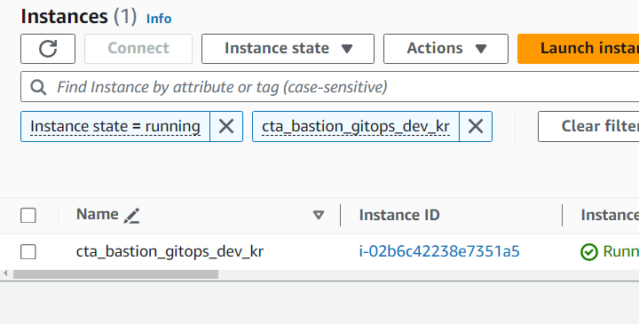

<br>

## 🔴 5. 접속 확인

- Cloud9에서 아래와 같은 명령어를 통해 Bastion 접속

```
ssh -i cta_bastion_key.pem <<생성된 IP>>
```

- 만약 퍼미션 경고가 나온다면

```
chmod 400 cta_bastion_key.pem
```
