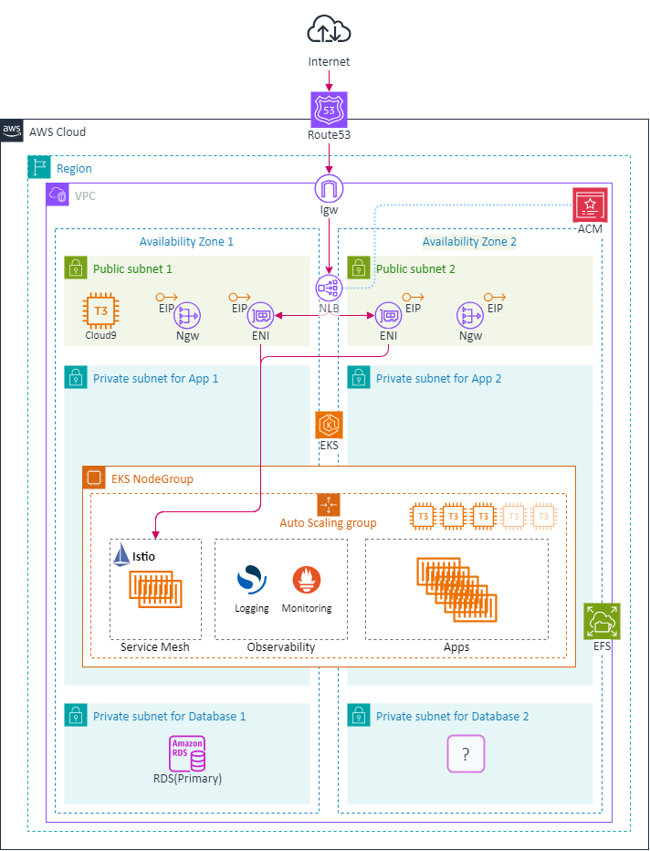
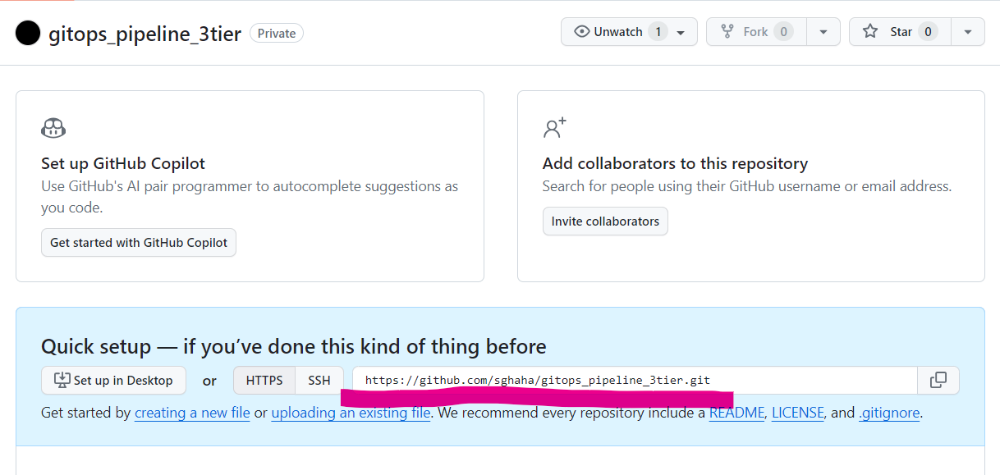
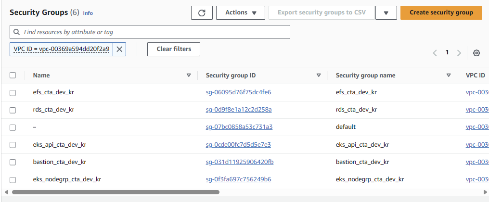
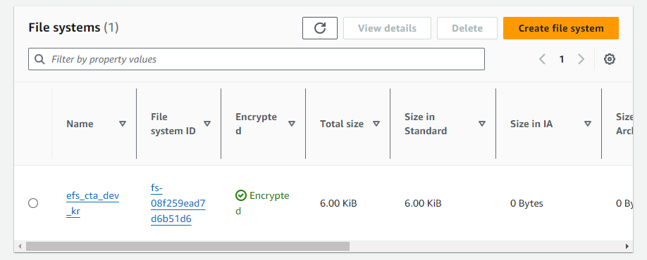
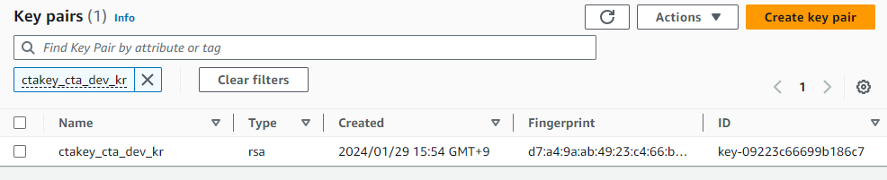
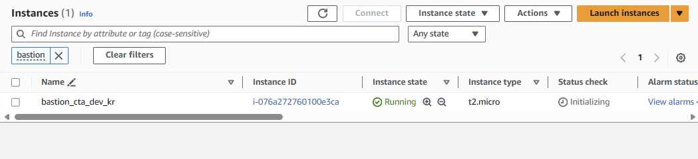
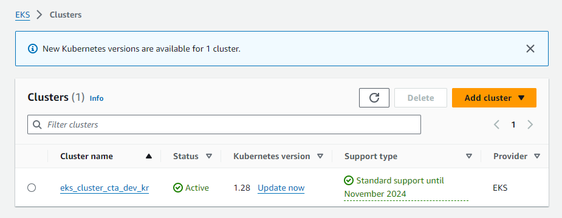
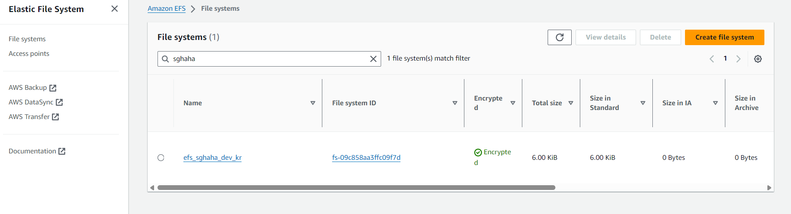

# 3일차 - Lab 1. 3-tier 아키텍처 설계 실습

---

- [3일차 - Lab 1. 3-tier 아키텍처 설계 실습](#3일차---lab-1.-3-tier-아키텍처-설계-실습)

  - [0. 목표](#🔴-0.-목표)
  - [1. Git Repository](#🔴-1.-git-repository)
  - [2.Pipeline 생성](#🔴-2.pipeline-생성)
  - [3. VPC 생성](#🔴-3.-vpc-생성)
  - [4. SecurityGroup 생성](#🔴-4.-securitygroup-생성)
  - [5. EFS 생성](#🔴-5.-efs-생성)
  - [6. keypair 생성](#🔴-6.-keypair-생성)
  - [7. bastion 생성](#🔴-7.-bastion-생성)
  - [8. RDS 생성](#🔴-8.-rds-생성)
  - [9. aws_auth_roles 생성](#🔴-9.-aws_auth_roles-생성)
  - [10. EKS 생성](#🔴-10.-eks-생성)
  - [11. Cloud9에서 클러스터 접근](#🔴-11.-cloud9에서-클러스터-접근)
  - [12. 추후 실습 준비](#🔴-12.-추후-실습-준비)

---

## 🔴 0. 목표

- 아래와 같은 인프라를 구성합니다



## 🔴 1. Git Repository

- 이번 실습을 진행할 Git Repository를 새로 생성합니다.

<br>

### ✔ 1-1. Github 로그인

- Github 사이트에 로그인 한다. (https://github.com/)

<br>

### ✔ 1-2. Repository 생성 화면이동

- Github icon을 클릭하여 Home으로 이동 후, 녹색의 `Create repository` 혹은 `New` 버튼을 클릭한다.

- gitops_pipeline_3tier repository 를 생성한다.


<br>

### ✔ 1-3. Repository 정보 입력 및 생성

- 아래와 같이 입력하고 `Create repository` 버튼을 눌러서 repository를 생성한다.

- **📌 [입력]**

> | 항목               | 내용                    | 액션                |
> | ------------------ | ----------------------- | ------------------- |
> | ➕ Repository name | `gitops_pipeline_3tier` | 🧲복사 & 📋붙여넣기 |
> | ➕ Public/Private  | `Private`               | 👆🏻라디오버튼 선택   |

❗❗ Repository name의 대소문자에 주의한다. ❗❗  
❗❗ Repository type은 반드시 Private로 선택한다. ❗❗  
❗❗ 교재에 기재된 내용 외에 변경하지 않도록 주의한다. ❗❗

<br>

### ✔ 1-4. 생성된 Repo URL 메모

- 생성된 Repository의 URL을 `gitops_pipeline_3tier URL`에 메모합니다.



<br>

## 🔴 2.Pipeline 생성

<br>

### ✔ 2-1. Gitops Console 로그인

- https://t3.gitopsconsole.com
- 각자 발급받은 ID/PW로 로그인 합니다.


<br>

### ✔ 2-2. Pipeline Workspace 생성

- `Workspace` > `Pipeline Workspace` > `Create Pipeline Workspace`


<br>

### ✔ 2-2. Pipeline Workspace 정보입력 및 생성

- 🔥🔥🔥Workspace Name은 Globally 유니크 해야합니다.🔥🔥🔥

- **📌 [입력]**

> | 항목                    | 내용                                        | 액션                          |
> | ----------------------- | ------------------------------------------- | ----------------------------- |
> | ➕ Workspace Name       | `pipeline-<<gitopsconsole_ID>>-<<YYMMDD>>`  | 🧲복사 & 📋붙여넣기           |
> | ➕ CSP                  | `AWS`                                       | 👆🏻셀렉트박스 선택             |
> | ➕ New Credentials      | `No`                                        | 👆🏻라디오버튼 선택             |
> | ➕ Credentials          | `cta-2024-aws-credential`                   | 🧲복사 & 📋붙여넣기           |
> | ➕ Repository Use Case  | `Register`                                  | 👆🏻라디오버튼 선택             |
> | ➕ GIT for IaC          | `<<메모해 놓은 gitops_pipeline_3tier URL>>` | ✏메모내용 🧲복사 & 📋붙여넣기 |
> | ➕ User Name for Git    | `<<자신의 git name>>`                       | ✏메모내용 🧲복사 & 📋붙여넣기 |
> | ➕ Access Token for Git | `<<발급 받은 git token>>`                   | ✏메모내용 🧲복사 & 📋붙여넣기 |
> | ➕ Source Of IaC        | `Stack`                                     | 👆🏻셀렉트박스 선택             |
> | ➕ Catalog              | `3tier-eks`                                 | 👆🏻카탈로그 선택               |

- 입력후 Create 클릭

<br>

## 🔴 3. VPC 생성

### ✔ 3-1. Pipeline 구성 확인

- Pipeline worksapce 화면 > `stackpipeline` > `Pipeline` > `3tier-eks-pipeline` 클릭


<br>

### ✔ 3-2. vpc task 상세 설정

- `Edit` 버튼 클릭하여 Edit모드로 진입 > vpc task를 클릭하여 상세 설정 진입
- 더블클릭하여 미리 설정되어있는 항목을 살펴봅니다.
- `Save` 버튼 클릭

### ✔ 3-3. vpc task plan & apply

- `Command` 버튼 > `YES` 버튼 클릭 하여 Command모드로 진입
- `vpc task` 클릭 > `Plan`클릭
- `Plan` 성공 후 `Apply` 클릭

### ✔ 3-4. 생성된 VPC 확인

- `AWS 콘솔 로그인` > `VPC`
- 🔗[[VPC 확인하기]](https://ap-northeast-2.console.aws.amazon.com/vpcconsole/home?region=ap-northeast-2#vpcs:)


<br>

## 🔴 4. SecurityGroup 생성

<br>

### ✔ 4-1. securitygroup task 상세 설정

- `Edit` 버튼 클릭하여 Edit모드로 진입 > securitygroup task를 클릭하여 상세 설정
- 더블클릭하여 미리 설정되어있는 항목을 살펴봅니다.
- `Save` 버튼 클릭

<br>

### ✔ 4-2. securitygroup task plan & apply

- `Command` 버튼 > `YES` 버튼 클릭 하여 Command모드로 진입
- `securitygroup task` 클릭 > `Plan`클릭
- `Plan` 성공 후 `Apply` 클릭

<br>

### ✔ 4-3. 생성된 SecurityGroup 확인

- AWS Console에서 🔗[Security Group](https://ap-northeast-2.console.aws.amazon.com/ec2/home?region=ap-northeast-2#SecurityGroups:) 서비스로 이동한다.
- AWS Console > EC2 > Security Group



<br>

## 🔴 5. EFS 생성

<br>

### ✔ 5-1. efs task 상세 설정

- `Edit` 버튼 클릭하여 Edit모드로 진입 > efs task를 클릭하여 상세 설정 진입
- 더블클릭하여 미리 설정되어있는 항목을 살펴봅니다.
- `Save` 버튼 클릭

<br>

### ✔ 5-2. 설명

1.  EKS에서 PV를 생성할때 EFS에 생성하도록 해줄것이기 때문에 EKS 생성이전에 EFS를 생성합니다.

<br>

### ✔ 5-3. efs task plan & apply

- `Command` 버튼 > `YES` 버튼 클릭 하여 Command모드로 진입
- `efs task` 클릭 > `Plan`클릭
- `Plan` 성공 후 `Apply` 클릭

<br>

### ✔ 5-4. 생성된 efs 확인

- AWS Console에서 🔗[EFS](https://ap-northeast-2.console.aws.amazon.com/efs/home?region=ap-northeast-2#/file-systems) 서비스로 이동한다.
- AWS Console > EFS > File systems



<br>

## 🔴 6. keypair 생성

<br>

### ✔ 6-1. keypair task 상세 설정

- `Edit` 버튼 클릭하여 Edit모드로 진입 > keypair task를 클릭하여 상세 설정 진입
- 더블클릭하여 미리 설정되어있는 항목을 살펴봅니다.
- `Save` 버튼 클릭

### ✔ 6-2. keypair task plan & apply

- `Command` 버튼 > `YES` 버튼 클릭 하여 Command모드로 진입
- `keypair task` 클릭 > `Plan`클릭
- `Plan` 성공 후 `Apply` 클릭

<br>

### ✔ 6-3. 생성된 keypair 확인

- AWS Console에서 🔗[key pairs](https://ap-northeast-2.console.aws.amazon.com/ec2/home?region=ap-northeast-2#KeyPairs:) 서비스로 이동한다.
- AWS Console > ec2 > Key Pairs



<br>

## 🔴 7. bastion 생성

<br>

### ✔ 7-1. bastion task 상세 설정

- `Edit` 버튼 클릭하여 Edit모드로 진입 > bastion task를 클릭하여 상세 설정 진입
- 더블클릭하여 미리 설정되어있는 항목을 살펴봅니다.
- `Save` 버튼 클릭

### ✔ 7-2. bastion task plan & apply

- `Command` 버튼 > `YES` 버튼 클릭 하여 Command모드로 진입
- `bastion task` 클릭 > `Plan`클릭
- `Plan` 성공 후 `Apply` 클릭

<br>

### ✔ 7-3. 생성된 bastion 확인

- AWS Console에서 🔗[ec2](https://ap-northeast-2.console.aws.amazon.com/ec2/home?region=ap-northeast-2#Instances:) 서비스로 이동한다.
- AWS Console > ec2 > Instances



<br>

## 🔴 8. RDS 생성

### ✔ 8-1. RDS task 상세 설정

- `Edit` 버튼 클릭하여 Edit모드로 진입 > rds task를 클릭하여 상세 설정 진입
- 더블클릭하여 미리 설정되어있는 항목을 살펴봅니다.
- `Save` 버튼 클릭

### ✔ 8-2. RDS task plan & apply

- `Command` 버튼 > `YES` 버튼 클릭 하여 Command모드로 진입
- `keypair task` 클릭 > `Plan`클릭
- `Plan` 성공 후 `Apply` 클릭

### ✔ 8-3. 생성된 RDS 확인

- AWS Console에서 🔗[RDS](https://ap-northeast-2.console.aws.amazon.com/rds/home?region=ap-northeast-2#) 서비스로 이동한다.
- AWS Console > RDS > Databases


<br>

## 🔴 9. aws_auth_roles 생성

- cloud9에서 eks에 접근하기 위해 설정할 role관련 arn을 얻습니다.

### ✔ 9-1. Cloud9에서 스크립트 생성

- cloud9에서 진행합니다.

```bash
mkdir ~/environment/script
```

```bash
cd ~/environment/script
```

```bash
cat << EOF > getrole.sh
#!/bin/bash

role_name="role-cloud9-admin"

role_arn=\$(aws iam get-role --role-name "\$role_name" --query 'Role.Arn' --output text)

user_arn=\$(aws sts get-caller-identity --query 'Arn' --output text | sed 's/\/[^\/]*$//')

echo "[
    {
        rolearn = \"\$role_arn\"
        username = \"\$user_arn\"
        groups = [\"system:masters\"]
    }
]"
EOF
```

### ✔ 9-2. 스크립트 실행

- 파일 권한 변경

```bash
chmod 744 getrole.sh
```

- 스크립트 실행

```bash
sh getrole.sh
```

- 결과 예시

```bash
mspmanager:~/environment/script $ sh getrole.sh
[
    {
        rolearn = "arn:aws:iam::699922782960:role/role-cloud9-admin"
        username = "arn:aws:sts::699922782960:assumed-role/role-cloud9-admin"
        groups = ["system:masters"]
    }
]

```

### ✔ 9-3. 메모📝

- 출력된 결과를 메모📝합니다.
- Gitops Console에서 EKS를 생성할떄 사용합니다.

<br>

## 🔴 10. EKS 생성

<br>

### ✔ 10-1. eks task 상세 설정

- `Edit` 버튼 클릭하여 Edit모드로 진입 > eks task를 클릭하여 상세 설정

- **📌 [입력]**

> | 항목                            | 내용                                   | 액션                |
> | ------------------------------- | -------------------------------------- | ------------------- |
> | ➕ public_access_cidrs          | `["0.0.0.0/0"]`                        | 🧲복사 & 📋붙여넣기 |
> | ➕ enable_additional_iam_access | `true`                                 | 👆🏻셀렉트박스 선택   |
> | ➕ enable_public_access         | `true`                                 | 👆🏻셀렉트박스 선택   |
> | ➕ aws_auth_roles               | `<<스크립트로 생성한 aws_auth_roles>>` | 🧲복사 & 📋붙여넣기 |

- `Save` 버튼 클릭

<br>

### ✔ 10-2. eks task plan & apply

- `Command` 버튼 > `YES` 버튼 클릭 하여 Command모드로 진입
- `eks task` 클릭 > `Plan`클릭
- `Plan` 성공 후 `Apply` 클릭

<br>

### ✔ 10-3. 생성된 eks 확인

- AWS Console에서 🔗[EKS](https://ap-northeast-2.console.aws.amazon.com/eks/home?region=ap-northeast-2#/clusters) 서비스로 이동한다.
- AWS Console > EKS > Clusters



<br>

## 🔴 11. Cloud9에서 클러스터 접근

### ✔ 11-1. Cloud9 접속

- AWS Console에서 🔗[Cloud9](https://ap-northeast-2.console.aws.amazon.com/cloud9control/home?region=ap-northeast-2#/) 서비스로 이동한다.
- AWS Console > Cloud9
- 자신의 Cloud9로 접속

### ✔ 11-2. kubeconfig 생성

- aws cli를 이용해 kubeconfig 파일을 생성합니다.

```bash
aws eks update-kubeconfig --region ap-northeast-2 --name eks_cluster_cta_dev_kr
```

- 참고 : 한국 리전의 EKS 첫 번째 클러스터 이름을 사용하여 kubeconfig 업데이트

```bash
aws eks update-kubeconfig --region ap-northeast-2 --name $(aws eks list-clusters --region ap-northeast-2 --query "clusters[0]" --output text)
```

### ✔ 11-3. 생성된 kubeconfig 파일 확인

```bash
cat ~/.kube/config
```

### ✔ 11-4. kubectl로 node 확인

```bash
kubectl get nodes
```

- 결과 확인

```
mspmanager:~/environment $ kubectl get nodes
NAME                                            STATUS   ROLES    AGE   VERSION
ip-10-0-3-111.ap-northeast-2.compute.internal   Ready    <none>   90m   v1.28.5-eks-5e0fdde
ip-10-0-3-166.ap-northeast-2.compute.internal   Ready    <none>   90m   v1.28.5-eks-5e0fdde
ip-10-0-4-199.ap-northeast-2.compute.internal   Ready    <none>   90m   v1.28.5-eks-5e0fdde
```

<br>

## 🔴 12. 추후 실습 준비

### ✔ 12-1. 추후 실습에 필요한 네임스페이스 생성

```bash
kubectl create ns logging
```

```bash
kubectl create ns monitoring
```

### ✔ 12-2. 나의 EFS fileSystemId 확인하기

- AWS Console에서 🔗[Amazon EFS](https://ap-northeast-2.console.aws.amazon.com/efs/home?region=ap-northeast-2#/file-systems) 서비스로 이동한다.
- AWS console - Amazon EFS - filesystem

<br>

- 나의 File system ID를 메모합니다.



### ✔ 12-4. 디렉토리 생성 및 이동

```bash
mkdir -p ~/environment/manifests
```

```bash
cd ~/environment/manifests
```

### ✔ 12-3. 추후 실습에 필요한 StorageClass 생성

- fileSystemId 값에 메모한 File system ID(ex : fs-09c858aa3ffc09f7d)를 입력해야합니다
- 🔥🔥🔥아래에서 <<나의 File system ID>>을 수정 한 후에 명령어를 실행 하세요🔥🔥🔥

```bash
cat << EOF > nfs-retain-app.yaml
apiVersion: storage.k8s.io/v1
kind: StorageClass
metadata:
  name: nfs-retain-app
parameters:
  archiveOnDelete: "false"
  directoryPerms: "755"
  fileSystemId: <<나의 File system ID>>
  gid: "0"
  pathPattern: \${.PVC.namespace}/\${.PVC.name}
  provisioningMode: efs-ap
  uid: "0"
provisioner: efs.csi.aws.com
reclaimPolicy: Retain
volumeBindingMode: Immediate
EOF
```

<br>
- SC 생성

```bash
kubectl create -f nfs-retain-app.yaml
```
