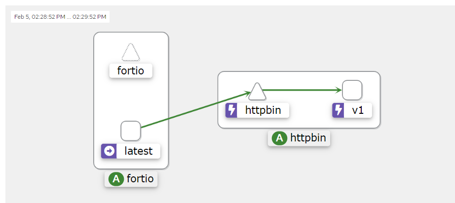

# 3일차 - Lab 11. Curcuit-breaking

ⓘ 실습목표 : Istio의 Curcuit-breaking 기능을 실습합니다.

---

- [3일차 - Lab 11. Curcuit-breaking](#3일차---lab-11.-curcuit-breaking)
  - [1. 서킷 브레이킹이란](#🔴-1.-서킷-브레이킹이란)
  - [2. 실습 환경 반영](#🔴-2.-실습-환경-반영)
  - [3. httpbin 배포](#🔴-3.-httpbin-배포)
  - [4. circuit breaker 구성](#🔴-4.-circuit-breaker-구성)
  - [5. 클라이언트 추가](#🔴-5.-클라이언트-추가)
  - [6. Tripping the circuit breaker](#🔴-6.-tripping-the-circuit-breaker)
  - [7. 리소스 정리](#🔴-7.-리소스-정리)

---

## 🔴 1. 서킷 브레이킹이란

- 만일 하나의 서비스가 장애가 발생하게 되면 장애 서비스를 호출하는 서비스는 대기 상태가 되고 다시 대기 중인 서비스를 호출하는 또 다른 서비스도 대기하게 되어 장애가 차례대로 전파 됩니다.
- Circuit Breaker 의 역할은 이렇게 문제가 되는 기능 자체를 동작하지 않도록해 리소스 점유의 증가로 장애가 전파되지 않도록 하는데 목적이 있습니다.

---

## 🔴 2. 실습 환경 반영

### ✔ 2-1. 디렉토리 생성 및 이동

```bash
mkdir -p ~/environment/istio/06_circuit_breaking
```

```bash
cd ~/environment/istio/06_circuit_breaking
```

### ✔ 2-2. 실습 namespace 생성

```bash
kubectl create ns istio-cb
```

### ✔ 2-3. 네임스페이스에 레이블 설정

- httpbin이 배포되어있는 istio-test 네임스페이스에 레이블을 설정해본다.

```bash
kubectl label namespace istio-cb istio-injection=enabled
```

### ✔ 2-4. 확인

```bash
kubectl get ns -L istio-injection
```

- (수행코드/결과 예시)

```
NAME              STATUS   AGE     ISTIO-INJECTION
default           Active   2d19h
istio-cb          Active   9s      enabled
istio-system      Active   2d15h
kube-node-lease   Active   2d19h
kube-public       Active   2d19h
kube-system       Active   2d19h
```

---

## 🔴 3. httpbin 배포

### ✔ 3-1. yaml 생성

```bash
cat << EOF > 01_httpbin.yaml
apiVersion: v1
kind: ServiceAccount
metadata:
  name: httpbin
  namespace: istio-cb
---
apiVersion: v1
kind: Service
metadata:
  name: httpbin
  namespace: istio-cb
  labels:
    app: httpbin
    service: httpbin
spec:
  ports:
    - name: http
      port: 8000
      targetPort: 80
  selector:
    app: httpbin
---
apiVersion: apps/v1
kind: Deployment
metadata:
  name: httpbin
  namespace: istio-cb
spec:
  replicas: 1
  selector:
    matchLabels:
      app: httpbin
      version: v1
  template:
    metadata:
      labels:
        app: httpbin
        version: v1
    spec:
      serviceAccountName: httpbin
      containers:
        - image: docker.io/kong/httpbin
          imagePullPolicy: IfNotPresent
          name: httpbin
          ports:
            - containerPort: 80
EOF
```

### ✔ 3-2. 배포

```bash
kubectl apply -f 01_httpbin.yaml
```

### ✔ 3-3. pod 확인

```bash
kubectl get po -n istio-cb
```

- 결과예시 (🔥🔥🔥꼭 컨테이너수가 2개임을 확인합니다.🔥🔥🔥)

```
NAME                       READY   STATUS    RESTARTS   AGE
httpbin-65975d4c6f-bz2sf   2/2     Running   0          25s
```

<br>

## 🔴 4. circuit breaker 구성

### ✔ 4-1. yaml 생성

```bash
cat << EOF > 02_httpbin-dr.yaml
apiVersion: networking.istio.io/v1alpha3
kind: DestinationRule
metadata:
  name: httpbin
  namespace: istio-cb
spec:
  host: httpbin
  trafficPolicy:
    connectionPool:
      tcp:
        maxConnections: 1
      http:
        http1MaxPendingRequests: 1
        maxRequestsPerConnection: 1
    outlierDetection:
      consecutive5xxErrors: 1
      interval: 1s
      baseEjectionTime: 3m
      maxEjectionPercent: 100
EOF
```

### ✔ 4-2. 배포

```bash
kubectl apply -f 02_httpbin-dr.yaml
```

### ✔ 4-3. 확인

```bash
kubectl get DestinationRule httpbin -o yaml -n istio-cb
```

- 결과 예시

```
apiVersion: networking.istio.io/v1beta1
kind: DestinationRule
metadata:
  annotations:
    kubectl.kubernetes.io/last-applied-configuration: |
      {"apiVersion":"networking.istio.io/v1alpha3","kind":"DestinationRule","metadata":{"annotations":{},"name":"httpbin","namespace":"istio-cb"},"spec":{"host":"httpbin","trafficPolicy":{"connectionPool":{"http":{"http1MaxPendingRequests":1,"maxRequestsPerConnection":1},"tcp":{"maxConnections":1}},"outlierDetection":{"baseEjectionTime":"3m","consecutive5xxErrors":1,"interval":"1s","maxEjectionPercent":100}}}}
  creationTimestamp: "2024-02-05T04:46:40Z"
  generation: 1
  name: httpbin
  namespace: istio-cb
  resourceVersion: "1006975"
  uid: dd668b81-1976-43f1-a8c7-1710d3d14678
spec:
  host: httpbin
  trafficPolicy:
    connectionPool:
      http:
        http1MaxPendingRequests: 1
        maxRequestsPerConnection: 1
      tcp:
        maxConnections: 1
    outlierDetection:
      baseEjectionTime: 3m
      consecutive5xxErrors: 1
      interval: 1s
      maxEjectionPercent: 100
```

<br>

## 🔴 5. 클라이언트 추가

- 트래픽을 보낼 클라이언트를 추가
- fortio라는 부하테스트 클라이언트 이용

### ✔ 5-1. yaml 생성

```bash
cat << EOF > 03_fortio-deploy.yaml
---
apiVersion: v1
kind: Service
metadata:
  name: fortio
  namespace: istio-cb
  labels:
    app: fortio
    service: fortio
spec:
  ports:
    - port: 8080
      name: http
  selector:
    app: fortio
---
apiVersion: apps/v1
kind: Deployment
metadata:
  name: fortio-deploy
  namespace: istio-cb
spec:
  replicas: 1
  selector:
    matchLabels:
      app: fortio
  template:
    metadata:
      annotations:
        # This annotation causes Envoy to serve cluster.outbound statistics via 15000/stats
        # in addition to the stats normally served by Istio. The Circuit Breaking example task
        # gives an example of inspecting Envoy stats via proxy config.
        proxy.istio.io/config: |-
          proxyStatsMatcher:
            inclusionPrefixes:
            - "cluster.outbound"
            - "cluster_manager"
            - "listener_manager"
            - "server"
            - "cluster.xds-grpc"
      labels:
        app: fortio
    spec:
      containers:
        - name: fortio
          image: fortio/fortio:latest_release
          imagePullPolicy: Always
          ports:
            - containerPort: 8080
              name: http-fortio
            - containerPort: 8079
              name: grpc-ping
EOF
```

### ✔ 5-2. 배포

```bash
kubectl apply -f 03_fortio-deploy.yaml
```

### ✔ 5-3. 테스트

- 아래 명령어를 이용하여 httpbin에 한번만 curl을 호출합니다.

```bash
export FORTIO_POD=$(kubectl get pods -l app=fortio -o 'jsonpath={.items[0].metadata.name}' -n istio-cb)
kubectl exec "$FORTIO_POD" -n istio-cb -c fortio -- /usr/bin/fortio curl -quiet http://httpbin:8000/get
```

- 결과예시

```
{
  "args": {},
  "headers": {
    "Host": "httpbin:8000",
    "User-Agent": "fortio.org/fortio-1.60.3",
    "X-B3-Parentspanid": "f5914d946fc04145",
    "X-B3-Sampled": "1",
    "X-B3-Spanid": "3aff933507ed8758",
    "X-B3-Traceid": "2b8a38d6aef960daf5914d946fc04145",
    "X-Envoy-Attempt-Count": "1",
    "X-Forwarded-Client-Cert": "By=spiffe://cluster.local/ns/istio-cb/sa/httpbin;Hash=90158c4c7c2590b42daae22670beccd0ed69d1ebb62220ea3e897545bd505d84;Subject=\"\";URI=spiffe://cluster.local/ns/istio-cb/sa/default"
  },
  "origin": "127.0.0.6",
  "url": "http://httpbin:8000/get"
}
HTTP/1.1 200 OK
server: envoy
date: Mon, 05 Feb 2024 05:01:30 GMT
content-type: application/json
content-length: 596
access-control-allow-origin: *
access-control-allow-credentials: true
x-envoy-upstream-service-time: 6
```

<br>

## 🔴 6. Tripping the circuit breaker

### ✔ 6-1. 한개 동시연결 20개 요청

```bash
kubectl exec "$FORTIO_POD" -n istio-cb -c fortio -- /usr/bin/fortio load -c 1 -qps 0 -n 20 -loglevel Warning http://httpbin:8000/get
```

### ✔ 6-2. 두 개의 동시 연결로 ( -c 2) 20개의 요청을 보냅니다( -n 20).

```bash
kubectl exec "$FORTIO_POD" -n istio-cb -c fortio -- /usr/bin/fortio load -c 2 -qps 0 -n 20 -loglevel Warning http://httpbin:8000/get
```

### ✔ 6-3. 세개의 동시 연결로 ( -c 3) 20개의 요청을 보냅니다( -n 20).

```bash
kubectl exec "$FORTIO_POD" -n istio-cb -c fortio -- /usr/bin/fortio load -c 3 -qps 0 -n 20 -loglevel Warning http://httpbin:8000/get
```

### 설명

- 서킷 브레이킹에 의해 요청 실패(Code 503) 비율이 상승하는 것을 확인 가능하다.
- 명령어를 반복해서 실행할수록 Code 503(503 Service Unavailable) 비율이 상승한다. (요청한 호스트가 차단 상태가 되어 요청에 대해 바로 503 에러가 발생하는 것)



---

<br>

## 🔴 7. 리소스 정리

### ✔ 7-1. fortio 삭제

```bash
kubectl delete -f 03_fortio-deploy.yaml
```

### ✔ 7-2. DestinationRule 삭제

```bash
kubectl delete -f 02_httpbin-dr.yaml
```

### ✔ 7-3. httpbin 삭제

```bash
kubectl delete -f 01_httpbin.yaml
```

### ✔ 7-4. namespace에 리소스 없는점 확인

```bash
kubectl get all -n istio-cb
```

- 결과 예시

```
No resources found in istio-cb namespace.
```

### ✔ 7-5. namespace 삭제

```bash
kubectl delete ns istio-cb
```
