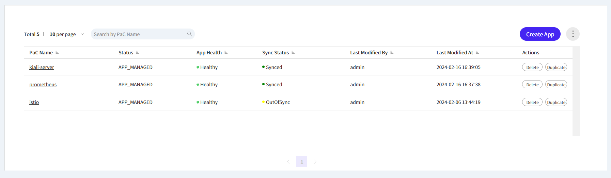

# 3일차 - Lab 12. deleting prometheus & kiali

ⓘ 실습목표 : 내일 실습을 위해 prometheus와 kiali를 삭제합니다

---

- [3일차 - Lab 12. deleting prometheus & kiali](#3일차---lab-12.-deleting-prometheus-%26-kiali)
  - [1. Kiali 삭제](#🔴-1.-kiali-삭제)
  - [2. Prometheus 삭제](#🔴-2.-prometheus-삭제)

---

## 🔴 1. Kiali 삭제

### ✔ 1-1. Gitops console 진입

- Gitops Console > Workspace > PaC Workspace > 생성한 cta-2024-pac workspace



### ✔ 1-2. Kiali 삭제

- 오른쪽 Delete 버튼을 클릭하여 삭제합니다.

### ✔ 1-3. Kiali 삭제 확인

- Cloud9에서 아래 명령어를 수행하여 `아무것도 출력되지 않음`을 확인합니다.

```bash
kubectl get all -n istio-system | grep kiali
```

<br>

## 🔴 2. Prometheus 삭제

### ✔ 1-1. Gitops console 진입

- Gitops Console > Workspace > PaC Workspace > 생성한 cta-2024-pac workspace

### ✔ 1-2. Prometheus 삭제

- Prometheus의 오른쪽 Delete 버튼을 클릭하여 삭제합니다.

### ✔ 1-3. Prometheus 삭제 확인

- Cloud9에서 아래 명령어를 수행하여 `아무것도 출력되지 않음`을 확인합니다.

```bash
kubectl get all | grep prometheus
```
