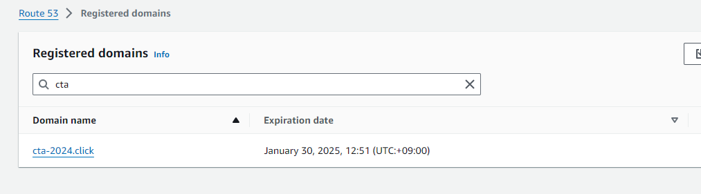
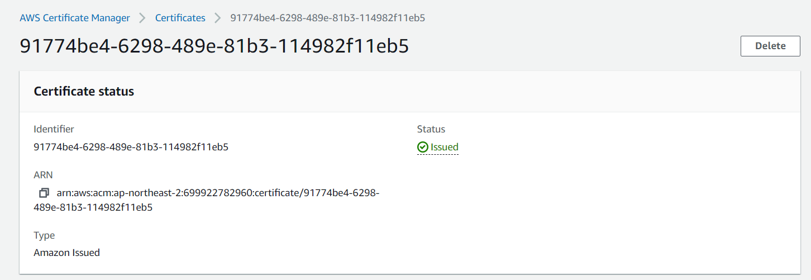
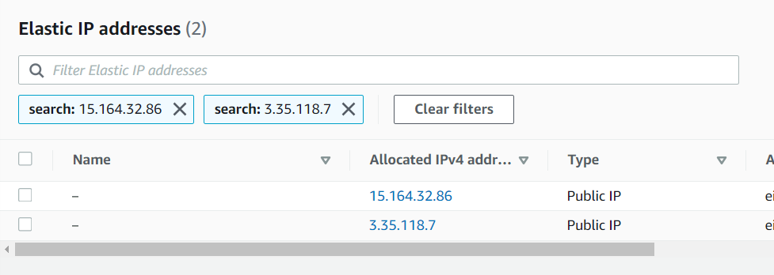
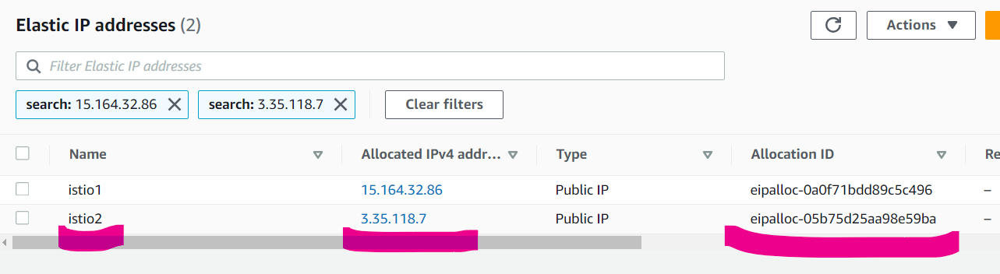
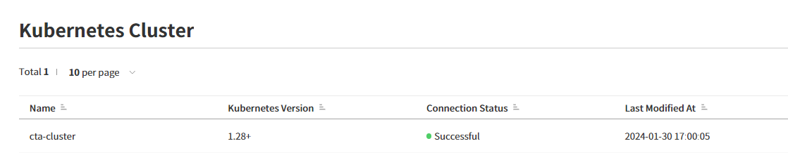
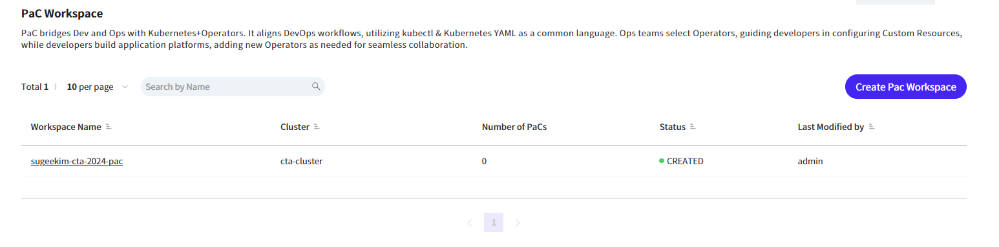
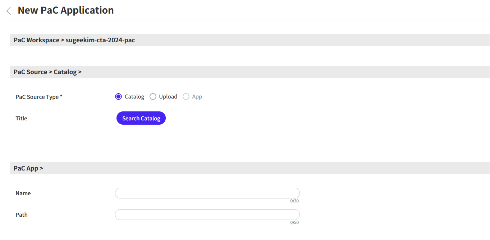
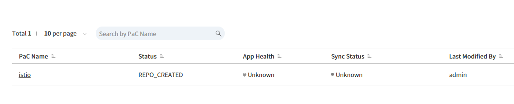
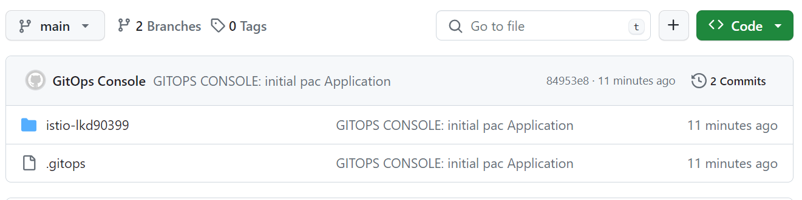
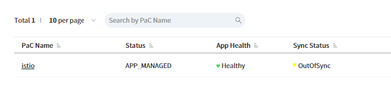

# 3일차 - Lab 2. Gitops Console Pac (1)

ⓘ 실습목표 : Gitops console을 이용해 istio를 설치합니다.

---

- [3일차 - Lab 2. Gitops Console Pac (1)](<#3일차---lab-2.-gitops-console-pac-(1)>)
  - [1. 도메인 및 ACM 확인](#🔴-1.-도메인-및-acm-확인)
  - [2. Elastic IP 생성](#🔴-2.-elastic-ip-생성)
  - [3. K8s 서비스 어카운트 생성](#🔴-3.-k8s-서비스-어카운트-생성)
  - [4. 클러스터 Url & certificate-authority-data 확인](#🔴-4.-클러스터-url-%26-certificate-authority-data-확인)
  - [5. Github Repository 생성](#🔴-5.-github-repository-생성)
  - [6. PaC Workspace 생성](#🔴-6.-pac-workspace-생성)
  - [7. 네임스페이스 생성](#🔴-7.-네임스페이스-생성)
  - [8. istio 설치](#🔴-8.-istio-설치)
  - [9. 도메인 연동](#🔴-9.-도메인-연동)

---

## 🔴 1. 도메인 및 ACM 확인

- istio에 연동할 도메인과 인증서를 확인합니다.

### ✔ 1-1. 도메인 확인

- AWS Console에서 🔗[Route53](https://us-east-1.console.aws.amazon.com/route53/domains/home?region=ap-northeast-2#/) 서비스로 이동한다.
- AWS Console > Route53 > Domains > Registered domains



### ✔ 1-2. 인증서 확인

- AWS Console에서 🔗[AWS Certificate Manager (ACM)](https://ap-northeast-2.console.aws.amazon.com/acm/home?region=ap-northeast-2#/certificates/list) 서비스로 이동한다.
- AWS Console > Certificate Manager > List certificates > 나의 인증서 클릭



- Identifier와 ARN을 메모📝 합니다.

<br>

## 🔴 2. Elastic IP 생성

- istio에 연동할 eip를 두개✌️ 생성합니다.

### ✔ 2-1. Elastic IPs 콘솔 접속

- AWS Console에서 🔗[Elastic IPs](https://ap-northeast-2.console.aws.amazon.com/ec2/home?region=ap-northeast-2#Addresses:) 서비스로 이동한다.
- AWS Console > EC2 > Elastic IPs

### ✔ 2-2. Elastic IP 생성

- `Allocate Elastic IP address` 버튼 클릭 > `Allocate` 버튼 클릭
- 두번✌️ 수행하여 EIP를 두개✌️ 생성합니다.



### ✔ 2-3. 생성한 EIP의 name 설정 및 메모

- 생성된 eip의 📝모양을 클릭하여 Name을 지정합니다.
- 생성된 `IP`와 `Allocation ID`를 메모✏️합니다.



<br>

## 🔴 3. K8s 서비스 어카운트 생성

- Gitops console PaC 워크스페이스에 등록하기 위해 cluster의 SA어카운트 토큰을 생성해야 합니다.

### ✔ 3-1. Cloud9 접속

- AWS Console에서 🔗[Cloud9](https://ap-northeast-2.console.aws.amazon.com/cloud9control/home?region=ap-northeast-2#/) 서비스로 이동한다.
- AWS Console > Cloud9
- 자신의 Cloud9로 접속

### ✔ 3-2. kubectl 동작 확인

```bash
kubectl get nodes
```

- 결과 확인

```
mspmanager:~/environment $ kubectl get nodes
NAME                                            STATUS   ROLES    AGE   VERSION
ip-10-0-3-111.ap-northeast-2.compute.internal   Ready    <none>   90m   v1.28.5-eks-5e0fdde
ip-10-0-3-166.ap-northeast-2.compute.internal   Ready    <none>   90m   v1.28.5-eks-5e0fdde
ip-10-0-4-199.ap-northeast-2.compute.internal   Ready    <none>   90m   v1.28.5-eks-5e0fdde
```

### ✔ 3-3. SA을 위한 Yaml파일 생성

```bash
mkdir -p ~/environment/manifests
```

```bash
cd ~/environment/manifests
```

```bash
cat << EOF > cluster-token-create.yaml
---
apiVersion: v1
kind: ServiceAccount
metadata:
  name: pac-account
  namespace: kube-system
---
apiVersion: rbac.authorization.k8s.io/v1
kind: ClusterRoleBinding
metadata:
  name: pac-account-rolebinding-manage
roleRef:
  apiGroup: rbac.authorization.k8s.io
  kind: ClusterRole
  name: cluster-admin
subjects:
- kind: ServiceAccount
  name: pac-account
  namespace: kube-system
---
apiVersion: v1
kind: Secret
metadata:
  name: pac-account-secret
  namespace: kube-system
  annotations:
    kubernetes.io/service-account.name: pac-account
type: kubernetes.io/service-account-token
EOF
```

### ✔ 3-4. SA 및 토큰 생성

```bash
kubectl apply -f cluster-token-create.yaml
```

### ✔ 3-5. token 확인

```bash
kubectl describe secret pac-account-secret -n kube-system
```

- 출력되는 토큰 값을 메모📝합니다

<br>

## 🔴 4. 클러스터 Url & certificate-authority-data 확인

### ✔ 4-1. kubeconfig 파일 확인

- cloud9에서 아래의 명령어를 수행

```bash
cat ~/.kube/config
```

- 출력되는 값 중 server url과 certificate-authority-data를 메모📝합니다.

<br>

## 🔴 5. Github Repository 생성

- PaC Workspace를 위한 Repository를 생성합니다.

> | 항목               | 내용         |
> | ------------------ | ------------ |
> | ➕ Repository Name | `gitops_pac` |

- 생성된 Repository의 URL을 메모📝합니다.

<br>

## 🔴 6. PaC Workspace 생성

### ✔ 6-1. Gitops Console 로그인

- https://t3.gitopsconsole.com
- 각자 발급받은 ID/PW로 로그인 합니다.


### ✔ 6-3. Kubenertes Cluster 생성

- `Settings` > `Kubernetes Cluster` > `New Kubernetes` 클릭

### ✔ 6-4. Kubenertes Cluster 정보입력 및 생성

- **📌 [입력]**

> | 항목                          | 내용                                     | 액션                          |
> | ----------------------------- | ---------------------------------------- | ----------------------------- |
> | ➕ Cluster Name               | `cta-cluster`                            | 🧲복사 & 📋붙여넣기           |
> | ➕ Input Type                 | `Manual`                                 | 👆🏻라디오버튼 선택             |
> | ➕ Server                     | `<<메모한 Cluster URL>>`                 | ✏메모내용 🧲복사 & 📋붙여넣기 |
> | ➕ Skip TLS Verify            | `No`                                     | 👆🏻라디오버튼 선택             |
> | ➕ Certificate Authority Data | `<<메모한 Certificate Authority Data >>` | ✏메모내용 🧲복사 & 📋붙여넣기 |
> | ➕ Service Account token      | `<<메모한 Service Account token >>`      | ✏메모내용 🧲복사 & 📋붙여넣기 |

- `Create` 버튼 클릭

### ✔ 6-5. Kubenertes Cluster 생성확인



### ✔ 6-6. PaC Workspace 생성

- `Workspace` > `Pipeline Workspace` > `Create PaC Workspace`

<br>

### ✔ 6-7. PaC Workspace 정보입력 및 생성

**📌 [입력]**

> | 항목                    | 내용                            | 액션                          |
> | ----------------------- | ------------------------------- | ----------------------------- |
> | ➕ Workspace Name       | `cta-2024-pac`                  | 🧲복사 & 📋붙여넣기           |
> | ➕ Cluster              | `cta-cluster`                   | 👆🏻셀렉트박스 선택             |
> | ➕ Repository Use Case  | `Register`                      | 👆🏻라디오버튼 선택             |
> | ➕ GIT for PaC          | `<<메모한 PAC Repository Url>>` | ✏메모내용 🧲복사 & 📋붙여넣기 |
> | ➕ Username for PaC     | `<<메모한 Github UserName>>`    | ✏메모내용 🧲복사 & 📋붙여넣기 |
> | ➕ Access Token for PaC | `<<메모한 Github Token>>`       | ✏메모내용 🧲복사 & 📋붙여넣기 |

- 입력후 Create 클릭

### ✔ 6-7. PaC Workspace 생성확인



<br>

## 🔴 7. 네임스페이스 생성

- istio를 설치하기 위해서는 istio-system 네임스페이스가 생성되어야 합니다.

### ✔ 7-1. istio-system 네임스페이스 생성

- `Cloud9`터미널에서 아래의 명령어를 수행합니다.

```bash
kubectl create namespace istio-system
```

### ✔ 7-2. istio-system 네임스페이스 생성확인

```bash
kubectl get ns
```

- 결과 예시

```bash
mspmanager:~/environment/manifests $ kubectl get ns
NAME              STATUS   AGE
default           Active   6h37m
istio-system      Active   2s
kube-node-lease   Active   6h37m
kube-public       Active   6h37m
kube-system       Active   6h37m
```

<br>

## 🔴 8. istio 설치

- 생성한 PaC Workspace를 이용하여 istio를 설치합니다.

### ✔ 8-1. App 설치 화면 진입

- `Gitops Console` > `Workspace` > `PaC Workspace` > 생성한 `cta-2024-pac` workspace > `Create App`



**📌 [입력]**

> | 항목               | 내용                            | 액션              |
> | ------------------ | ------------------------------- | ----------------- |
> | ➕ PaC Source Type | `Catalog`                       | 👆🏻라디오버튼 선택 |
> | ➕ Title           | `Search Catalog` > `istio` 선택 |                   |

- 입력후 Create 클릭

### ✔ 8-2. 생성된 PaC App 확인



### ✔ 8-3. Github Repository 확인



### ✔ 8-4. 현재 상황

- Git Repository에 Helm chart 저장
- Gitops 콘솔에 istio 등록
- cluster에 istio는 아직 생성안됨

### ✔ 8-5. istio Register

- `cta-2024-pac` workspace의 `istio`를 클릭하여 pac detail 페이지로 진입합니다.

**📌 [입력]**

> | 항목                | 내용           | 액션                |
> | ------------------- | -------------- | ------------------- |
> | ➕ Target Namespace | `istio-system` | 🧲복사 & 📋붙여넣기 |
> | ➕ Select File      | `values.yaml`  | 👆🏻셀렉트박스 선택   |

- `Source Code` 탭의 `values.yaml`파일 클릭
- 186번과 187번 라인을 아래와 같이 수정

```
autoscaleMin: 3  # 1 pod per node
autoscaleMax: 5  # 1 pod per node
```

- 194번과 195번 라인을 아래와 같이 수정 (🔥🔥🔥주의 : ,후 띄어쓰기 하면 안됨🔥🔥🔥)

```
service.beta.kubernetes.io/aws-load-balancer-eip-allocations: <<메모한 Allocation ID 1>>,<<메모한 Allocation ID 2>>
service.beta.kubernetes.io/aws-load-balancer-ssl-cert: <<메모한 인증서의 ARN>>
```

- `Save` 버튼 클릭 > Commit 메시지 입력후 `Commit`
- `Register` 버튼 클릭

### ✔ 8-6. istio sync

- `Sync` 버튼 클릭

### ✔ 8-7. PaC workspace Page에서 istio 확인

- 약 5분정도 기다린후
- PaC workspace Page에서 새로고침을 눌러 App Health가 `Healthy`로 되는 것을 확인한다.



### ✔ 8-8. kubectl을 이용한 istio 확인

- Cloud9에서 아래 명령어를 수행

```bash
kubectl get all -n istio-system
```

- 결과 예시

```bash
mspmanager:~/environment $ kubectl get all -n istio-system
NAME                                        READY   STATUS    RESTARTS   AGE
pod/istio-egressgateway-8558d8b48b-r5cqz    1/1     Running   0          15h
pod/istio-ingressgateway-7b58484644-4lrkr   1/1     Running   0          15h
pod/istiod-66467c77d9-jtv2v                 1/1     Running   0          15h

NAME                           TYPE           CLUSTER-IP      EXTERNAL-IP                                                                          PORT(S)                                      AGEservice/istio-egressgateway    ClusterIP      172.20.136.68   <none>                                                                               80/TCP,443/TCP,15443/TCP                     15hservice/istio-ingressgateway   LoadBalancer   172.20.62.48    a3f1af8ca5d724d52b31009c6e164ad2-7c223b8cbe27fe14.elb.ap-northeast-2.amazonaws.com   15021:32416/TCP,80:30161/TCP,443:30649/TCP   11hservice/istiod                 ClusterIP      172.20.93.222   <none>                                                                               15010/TCP,15012/TCP,443/TCP,15014/TCP        15hNAME                                   READY   UP-TO-DATE   AVAILABLE   AGE
deployment.apps/istio-egressgateway    1/1     1            1           15h
deployment.apps/istio-ingressgateway   1/1     1            1           15h
deployment.apps/istiod                 1/1     1            1           15h

NAME                                              DESIRED   CURRENT   READY   AGE
replicaset.apps/istio-egressgateway-8558d8b48b    1         1         1       15h
replicaset.apps/istio-ingressgateway-7b58484644   1         1         1       15h
replicaset.apps/istiod-66467c77d9                 1         1         1       15h

NAME                                                       REFERENCE                         TARGETS         MINPODS   MAXPODS   REPLICAS   AGE
horizontalpodautoscaler.autoscaling/istio-egressgateway    Deployment/istio-egressgateway    <unknown>/80%   1         5         1          15h
horizontalpodautoscaler.autoscaling/istio-ingressgateway   Deployment/istio-ingressgateway   <unknown>/80%   1         1         1          15h
horizontalpodautoscaler.autoscaling/istiod                 Deployment/istiod                 <unknown>/60%   1         5         1          15h
```

## 🔴 9. 도메인 연동

### ✔ 9-1. Route53 접속

- AWS Console에서 🔗[Hosted zones](https://us-east-1.console.aws.amazon.com/route53/v2/hostedzones#) 서비스로 이동한다.
- AWS Console > Route53 > Hosted zones

### ✔ 9-2. 도메인 선택

- 나의 도메인을 선택합니다.


### ✔ 9-3. Create Record

- `Create Record`을 클릭해 Record생성 화면으로 진입한후 아래의 정보를 입력합니다.

**📌 [입력]**

> | 항목                | 내용                             | 액션                |
> | ------------------- | -------------------------------- | ------------------- |
> | ➕ Record name      | `www`                            | 🧲복사 & 📋붙여넣기 |
> | ➕ Record Type      | `A`                              | 👆🏻셀렉트박스 선택   |
> | ➕ Alias            | `ON`                             | 🖱️클릭하여 활성화   |
> | ➕ Route traffic to | `Alias to Network Load Balancer` | 👆🏻셀렉트박스 선택   |
> | ➕ Route traffic to | `ap-northeast-2`                 | 👆🏻셀렉트박스 선택   |
> | ➕ Route traffic to | `<<나의 NLB DNS 선택>>`          | 👆🏻셀렉트박스 선택   |


- 입력후 `Create records`

<br>

## 🔴 10. 도메인 연동 - 추가

- 4-5일차에 실습할 내용을 위해 https://cta.`<나의도메인>` Record를 하나더 생성합니다.

### ✔ 10-1. Route53 접속

- AWS Console에서 🔗[Hosted zones](https://us-east-1.console.aws.amazon.com/route53/v2/hostedzones#) 서비스로 이동한다.
- AWS Console > Route53 > Hosted zones

### ✔ 10-2. 도메인 선택

- 나의 도메인을 선택합니다.


### ✔ 10-3. Create Record

- `Create Record`을 클릭해 Record생성 화면으로 진입한후 아래의 정보를 입력합니다.

**📌 [입력]**

> | 항목                | 내용                             | 액션                |
> | ------------------- | -------------------------------- | ------------------- |
> | ➕ Record name      | `cta`                            | 🧲복사 & 📋붙여넣기 |
> | ➕ Record Type      | `A`                              | 👆🏻셀렉트박스 선택   |
> | ➕ Alias            | `ON`                             | 🖱️클릭하여 활성화   |
> | ➕ Route traffic to | `Alias to Network Load Balancer` | 👆🏻셀렉트박스 선택   |
> | ➕ Route traffic to | `ap-northeast-2`                 | 👆🏻셀렉트박스 선택   |
> | ➕ Route traffic to | `<<나의 NLB DNS 선택>>`          | 👆🏻셀렉트박스 선택   |

- 입력후 `Create records`

## 🔴 11. 도메인 연동 - 추가 2

- 7일차에 실습할 내용을 위해 https://rollouts-demo.`<나의도메인>` Record를 하나더 생성합니다.

### ✔ 11-1. Route53 접속

- AWS Console에서 🔗[Hosted zones](https://us-east-1.console.aws.amazon.com/route53/v2/hostedzones#) 서비스로 이동한다.
- AWS Console > Route53 > Hosted zones

### ✔ 11-2. 도메인 선택

- 나의 도메인을 선택합니다.

### ✔ 11-3. Create Record

- `Create Record`을 클릭해 Record생성 화면으로 진입한후 아래의 정보를 입력합니다.

**📌 [입력]**

> | 항목                | 내용                             | 액션              |
> | ------------------- | -------------------------------- | ----------------- |
> | ➕ Record name      | `rollouts-demo                   |
> | `                   | 🧲복사 & 📋붙여넣기              |
> | ➕ Record Type      | `A`                              | 👆🏻셀렉트박스 선택 |
> | ➕ Alias            | `ON`                             | 🖱️클릭하여 활성화 |
> | ➕ Route traffic to | `Alias to Network Load Balancer` | 👆🏻셀렉트박스 선택 |
> | ➕ Route traffic to | `ap-northeast-2`                 | 👆🏻셀렉트박스 선택 |
> | ➕ Route traffic to | `<<나의 NLB DNS 선택>>`          | 👆🏻셀렉트박스 선택 |

- 입력후 `Create records`
