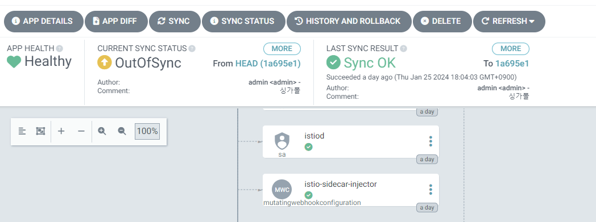
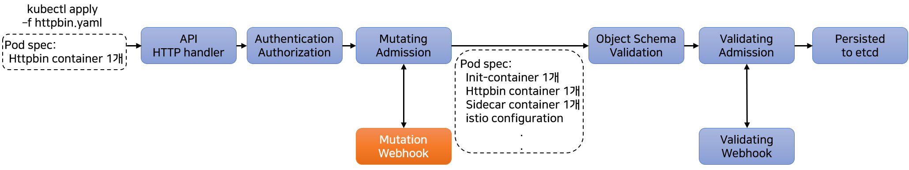

# 3일차 - Lab 4. Istio - Sidecar-injection

ⓘ 실습목표 : Istio의 Sidecar-injection을 실습합니다.

---

- [3일차 - Lab 4. Istio - Sidecar-injection](#3일차---lab-4.-istio---sidecar-injection)
  - [1. 실습준비](#🔴-1.-실습준비)
  - [2. httpbin](#🔴-2.-httpbin)
  - [3. Automatic-Sidecar-injection](#🔴-3.-automatic-sidecar-injection)
  - [4. Sidecar Injection 방법 알아보기](#🔴-4.-sidecar-injection-방법-알아보기)
  - [5. Sidecar Injection 피하기](#🔴-5.-sidecar-injection-피하기)
  - [6. httpbin 원복](#🔴-6.-httpbin-원복)
  - [7. 사이드카 인젝터 설정](#🔴-7.-사이드카-인젝터-설정)
  - [8. 리소스 정리](#🔴-8.-리소스-정리)

---

## 🔴 1. 실습준비

### ✔ 1-1. Cloud9에 디렉토리 생성 및 이동

- 실습을 진행항 디렉토리를 생성합니다.

```bash
mkdir -p ~/environment/istio/01_sidecar
```

- 해당 디렉토리로 이동합니다.

```bash
cd ~/environment/istio/01_sidecar
```

### ✔ 1-2. 실습용 Namespace 생성

- 이번 실습은 `istio-sidecar` namespace에서 진행합니다.

```bash
kubectl create namespace istio-sidecar
```

- (수행코드/결과 예시)

```bash
ubuntu@ip-10-1-10-79:~/k8s-istio$ kubectl create namespace istio-sidecar
namespace/istio-sidecar created
```

## 🔴 2. httpbin

- httpbin은 간단한 HTTP 요청 및 응답 서비스를 제공하는 Python 애플리케이션입니다.

### ✔ 2-1. httpbin.yaml 생성

```
cat << EOF > 01_httpbin.yaml
---
apiVersion: v1
kind: Service
metadata:
  name: httpbin
  namespace: istio-sidecar
  labels:
    app: httpbin
    service: httpbin
spec:
  ports:
  - name: http
    port: 8000
    targetPort: 80
  selector:
    app: httpbin
---
apiVersion: apps/v1
kind: Deployment
metadata:
  name: httpbin
  namespace: istio-sidecar
spec:
  replicas: 1
  selector:
    matchLabels:
      app: httpbin
      version: v1
  template:
    metadata:
      labels:
        app: httpbin
        version: v1
    spec:
      containers:
      - image: docker.io/kennethreitz/httpbin
        imagePullPolicy: IfNotPresent
        name: httpbin
        ports:
        - containerPort: 80
EOF
```

### ✔ 2-2. httpbin.yaml 배포

```bash
kubectl apply -f 01_httpbin.yaml
```

- (수행코드/결과 예시)

```bash
ubuntu@ip-10-1-10-79:~/k8s-istio$ kubectl apply -f 01_httpbin.yaml
service/httpbin created
deployment.apps/httpbin created
```

### ✔ 2-3. 확인

- 생성된 pod의 컨테이너 갯수와 이름을 확인해본다.

```bash
kubectl get po -n istio-sidecar
```

```bash
kubectl get po -n istio-sidecar -o jsonpath={.items..spec.containers[*].name}
```

- (수행코드/결과 예시)

```bash
ubuntu@ip-10-1-10-79:~/k8s-istio$ kubectl get po -n istio-sidecar
NAME                       READY   STATUS    RESTARTS   AGE
httpbin-7d79f467d4-rfxvm   1/1     Running   0          68s

ubuntu@ip-10-1-10-79:~/k8s-istio$ kubectl get po -n istio-sidecar -o jsonpath={.items..spec.containers[*].name}
httpbin
```

## 🔴 3. Automatic-Sidecar-injection

- Automatic-Sidecar-injection을 확인합니다.

### ✔ 3-1. 네임스페이스에 레이블 설정

- httpbin이 배포되어있는 istio-sidecar 네임스페이스에 레이블을 설정해본다.

```bash
kubectl label namespace istio-sidecar istio-injection=enabled
```

### ✔ 3-2. 확인

```bash
kubectl get ns -L istio-injection
```

- (수행코드/결과 예시)

```
NAME              STATUS   AGE     ISTIO-INJECTION
default           Active   2d22h
istio-sidecar     Active   50s     enabled
istio-system      Active   2d18h
kube-node-lease   Active   2d22h
kube-public       Active   2d22h
kube-system       Active   2d22h
```

### ✔ 3-3. httpbin pod를 확인

```bash
kubectl get po -n istio-sidecar
```

- (수행코드/결과 예시)

```bash
ubuntu@ip-10-1-10-79:~/k8s-istio$ kubectl get po -n istio-sidecar
NAME                       READY   STATUS    RESTARTS   AGE
httpbin-7d79f467d4-rfxvm   1/1     Running   0          3m29s
```

- httpbin pod의 컨테이너수는 한개입니다.

### ✔ 3-4. httpbin 삭제 후 재 생성

```bash
kubectl delete -f 01_httpbin.yaml
```

```bash
kubectl apply -f 01_httpbin.yaml
```

- (수행코드/결과 예시)

```bash
ubuntu@ip-10-1-10-79:~/k8s-istio$ kubectl delete -f httpbin.yaml
service "httpbin" deleted
deployment.apps "httpbin" deleted

ubuntu@ip-10-1-10-79:~/k8s-istio$ kubectl apply -f httpbin.yaml
service/httpbin created
deployment.apps/httpbin created
```

### ✔ 3-5. 새로 생성된 httpbin pod를 확인

```bash
kubectl get po -n istio-sidecar
```

- (수행코드/결과 예시)

```bash
ubuntu@ip-10-1-10-79:~/k8s-istio$ kubectl get po -n istio-sidecar
NAME                       READY   STATUS    RESTARTS   AGE
httpbin-7d79f467d4-q6t5r   2/2     Running   0          17s
```

### ✔ 3-6. httpbin pod에 들어있는 컨테이너 이름들을 확인

```bash
kubectl get po -n istio-sidecar -o jsonpath={.items..spec.containers[*].name}
```

- (수행코드/결과 예시)

```bash
ubuntu@ip-10-1-10-79:~/k8s-istio$ kubectl get po -n istio-sidecar -o jsonpath={.items..spec.containers[*].name}
httpbin istio-proxy
```

<details>
<summary> 😎 [참고 - 펼치기👇] pod 안에 있는 컨테이너를 상세하게 확인해보는 방법</summary>

<br>
  
- 아래 명령어로 istio-sidecar namespace에 생성된 httpbin pod의 이름을 확인한다.
```bash
kubectl get pod -n istio-sidecar
```

<br>

✔ **(수행코드/결과 예시)**

```bash
ubuntu@ip-10-1-10-86:~/k8s-istio$ kubectl get pod -n istio-sidecar
NAME                       READY   STATUS    RESTARTS   AGE
httpbin-7d79f467d4-qhvx4   2/2     Running   0          3m51s
```

- pod의 name이 `httpbin-7d79f467d4-qhvx4` 인 것을 확인한다.
- 예시이므로 pod의 name은 개인별로 다르게 생성된다.

<br>

- 아래 명령어로 pod의 상세 내용을 조회해본다.

```bash
kubectl describe pod httpbin-7d79f467d4-qhvx4 -n istio-sidecar
```

<br>

✔ **(수행코드/결과 예시)**

```bash
ubuntu@ip-10-1-10-86:~/k8s-istio$ kubectl describe po httpbin-7d79f467d4-qhvx4 -n istio-sidecar
Name:         httpbin-7d79f467d4-qhvx4
Namespace:    istio-sidecar
Priority:     0
Node:         ip-10-1-10-33.ec2.internal/10.1.10.33
Start Time:   Wed, 05 Apr 2023 16:32:22 +0900
Labels:       app=httpbin
              istio.io/rev=default
              pod-template-hash=7d79f467d4
              security.istio.io/tlsMode=istio
              service.istio.io/canonical-name=httpbin
              service.istio.io/canonical-revision=v1
              version=v1
Annotations:  kubectl.kubernetes.io/default-container: httpbin
              kubectl.kubernetes.io/default-logs-container: httpbin
              kubernetes.io/psp: eks.privileged
              prometheus.io/path: /stats/prometheus
              prometheus.io/port: 15020
              prometheus.io/scrape: true
              sidecar.istio.io/status:
                {"initContainers":["istio-init"],"containers":["istio-proxy"],"volumes":["istio-envoy","istio-data","istio-podinfo","istio-token","istiod-...
Status:       Running
IP:           10.1.10.50
IPs:
  IP:           10.1.10.50
Controlled By:  ReplicaSet/httpbin-7d79f467d4
Init Containers:
  istio-init:
    Container ID:  containerd://e8fd424d1579658695bed28d1898d885482ef4a5d3b396594db1dfdcf5443c38
    Image:         docker.io/istio/proxyv2:1.10.0
    Image ID:      docker.io/istio/proxyv2@sha256:88c6c693e67a0f2492191a0e7d8020ddc85603bfc704f252655cb9eb5eeb3f58
    Port:          <none>
    Host Port:     <none>
    Args:
      istio-iptables
      -p
      15001
      -z
      15006
      -u
      1337
      -m
      REDIRECT
      -i
      *
      -x

      -b
      *
      -d
      15090,15021,15020
    State:          Terminated
      Reason:       Completed
      Exit Code:    0
      Started:      Wed, 05 Apr 2023 16:32:22 +0900
      Finished:     Wed, 05 Apr 2023 16:32:22 +0900
    Ready:          True
    Restart Count:  0
    Limits:
      cpu:     2
      memory:  1Gi
    Requests:
      cpu:        100m
      memory:     128Mi
    Environment:  <none>
    Mounts:
      /var/run/secrets/kubernetes.io/serviceaccount from kube-api-access-5pvr6 (ro)
Containers:
  httpbin:
    Container ID:   containerd://844f5f48e5090ee79901810cf2a6279c49143e5e3cfdef3887da843e96de6bec
    Image:          docker.io/kennethreitz/httpbin
    Image ID:       docker.io/kennethreitz/httpbin@sha256:599fe5e5073102dbb0ee3dbb65f049dab44fa9fc251f6835c9990f8fb196a72b
    Port:           80/TCP
    Host Port:      0/TCP
    State:          Running
      Started:      Wed, 05 Apr 2023 16:32:23 +0900
    Ready:          True
    Restart Count:  0
    Environment:    <none>
    Mounts:
      /var/run/secrets/kubernetes.io/serviceaccount from kube-api-access-5pvr6 (ro)
  istio-proxy:
    Container ID:  containerd://8490ac0071aaa05ff52584cb9652e0772bfb4510d36e41d6a769a5ddf87e7c4e
    Image:         docker.io/istio/proxyv2:1.10.0
    Image ID:      docker.io/istio/proxyv2@sha256:88c6c693e67a0f2492191a0e7d8020ddc85603bfc704f252655cb9eb5eeb3f58
    Port:          15090/TCP
    Host Port:     0/TCP
    Args:
      proxy
      sidecar
      --domain
      $(POD_NAMESPACE).svc.cluster.local
      --serviceCluster
      httpbin.$(POD_NAMESPACE)
      --proxyLogLevel=warning
      --proxyComponentLogLevel=misc:error
      --log_output_level=default:info
      --concurrency
      2
    State:          Running
      Started:      Wed, 05 Apr 2023 16:32:23 +0900
    Ready:          True
    Restart Count:  0
    Limits:
      cpu:     2
      memory:  1Gi
    Requests:
      cpu:      100m
      memory:   128Mi
    Readiness:  http-get http://:15021/healthz/ready delay=1s timeout=3s period=2s #success=1 #failure=30
    Environment:
      JWT_POLICY:                    third-party-jwt
      PILOT_CERT_PROVIDER:           istiod
      CA_ADDR:                       istiod.istio-system.svc:15012
      POD_NAME:                      httpbin-7d79f467d4-qhvx4 (v1:metadata.name)
      POD_NAMESPACE:                 istio-sidecar (v1:metadata.namespace)
      INSTANCE_IP:                    (v1:status.podIP)
      SERVICE_ACCOUNT:                (v1:spec.serviceAccountName)
      HOST_IP:                        (v1:status.hostIP)
      CANONICAL_SERVICE:              (v1:metadata.labels['service.istio.io/canonical-name'])
      CANONICAL_REVISION:             (v1:metadata.labels['service.istio.io/canonical-revision'])
      PROXY_CONFIG:                  {}

      ISTIO_META_POD_PORTS:          [
                                         {"containerPort":80,"protocol":"TCP"}
                                     ]
      ISTIO_META_APP_CONTAINERS:     httpbin
      ISTIO_META_CLUSTER_ID:         Kubernetes
      ISTIO_META_INTERCEPTION_MODE:  REDIRECT
      ISTIO_METAJSON_ANNOTATIONS:    {"kubernetes.io/psp":"eks.privileged"}

      ISTIO_META_WORKLOAD_NAME:      httpbin
      ISTIO_META_OWNER:              kubernetes://apis/apps/v1/namespaces/istio-sidecar/deployments/httpbin
      ISTIO_META_MESH_ID:            cluster.local
      TRUST_DOMAIN:                  cluster.local
    Mounts:
      /etc/istio/pod from istio-podinfo (rw)
      /etc/istio/proxy from istio-envoy (rw)
      /var/lib/istio/data from istio-data (rw)
      /var/run/secrets/istio from istiod-ca-cert (rw)
      /var/run/secrets/kubernetes.io/serviceaccount from kube-api-access-5pvr6 (ro)
      /var/run/secrets/tokens from istio-token (rw)
Conditions:
  Type              Status
  Initialized       True
  Ready             True
  ContainersReady   True
  PodScheduled      True
Volumes:
  istio-envoy:
    Type:       EmptyDir (a temporary directory that shares a pod's lifetime)
    Medium:     Memory
    SizeLimit:  <unset>
  istio-data:
    Type:       EmptyDir (a temporary directory that shares a pod's lifetime)
    Medium:
    SizeLimit:  <unset>
  istio-podinfo:
    Type:  DownwardAPI (a volume populated by information about the pod)
    Items:
      metadata.labels -> labels
      metadata.annotations -> annotations
      limits.cpu -> cpu-limit
      requests.cpu -> cpu-request
  istio-token:
    Type:                    Projected (a volume that contains injected data from multiple sources)
    TokenExpirationSeconds:  43200
  istiod-ca-cert:
    Type:      ConfigMap (a volume populated by a ConfigMap)
    Name:      istio-ca-root-cert
    Optional:  false
  kube-api-access-5pvr6:
    Type:                    Projected (a volume that contains injected data from multiple sources)
    TokenExpirationSeconds:  3607
    ConfigMapName:           kube-root-ca.crt
    ConfigMapOptional:       <nil>
    DownwardAPI:             true
QoS Class:                   Burstable
Node-Selectors:              <none>
Tolerations:                 node.kubernetes.io/not-ready:NoExecute op=Exists for 300s
                             node.kubernetes.io/unreachable:NoExecute op=Exists for 300s
Events:
  Type    Reason     Age   From               Message
  ----    ------     ----  ----               -------
  Normal  Scheduled  74s   default-scheduler  Successfully assigned istio-sidecar/httpbin-7d79f467d4-qhvx4 to ip-10-1-10-33.ec2.internal
  Normal  Pulled     74s   kubelet            Container image "docker.io/istio/proxyv2:1.10.0" already present on machine
  Normal  Created    74s   kubelet            Created container istio-init
  Normal  Started    74s   kubelet            Started container istio-init
  Normal  Pulled     73s   kubelet            Container image "docker.io/kennethreitz/httpbin" already present on machine
  Normal  Created    73s   kubelet            Created container httpbin
  Normal  Started    73s   kubelet            Started container httpbin
  Normal  Pulled     73s   kubelet            Container image "docker.io/istio/proxyv2:1.10.0" already present on machine
  Normal  Created    73s   kubelet            Created container istio-proxy
  Normal  Started    73s   kubelet            Started container istio-proxy
```

- 위의 상세결과에서 다양한 정보를 확인할 수 있다.<br>
  이 중 `Containers:` 항목에서 `httpbin` 컨테이너와 `istio-proxy` 컨테이너를 확인할 수 있다.

</details>

## 🔴 4. Sidecar Injection 방법 알아보기

- 어떤 원리로 사이드카 컨테이너가 자동으로 pod에 인젝션 되는가?


### ✔ 4-1. Admission Control

- https://kubernetes.io/docs/reference/access-authn-authz/admission-controllers

> 쿠버네티스 API 서버에 대한 요청이 인증(Authentication)되고 인가(Authorization)된 후에,
> 요청 내용을 가로채어 추가적으로 요청내용에 대한 검증이나, 요청된 내용을 관리자가 강제로 변경하는 단계.

### ✔ 4-2. 두가지 유형의 admission Webhook 정의 가능

- Validating admission Webhook : 추가적으로 사용자 정의한(custom) 정책에 따른 검증
- Mutating admission webhook : 사용자 정의한(custom) 내용으로 요청을 강제로 변경

> Istio를 설치하면 'istio-sidecar-injector’라는 이름의 Mutating Webhook이 추가되는데,
> 이것이 Pod 생성 요청을 감지하고, 여러가지 설정값들을 검토하여 프록시 컨테이너를 Pod 안에 포함하도록 요청 내용을 변경하게됨. (결과적으로 sidecar proxy injection이 수행됨)



### ✔ 4-3. Istio의 mutatingwebhookconfiguration 일부분을 확인

```bash
kubectl get mutatingwebhookconfiguration istio-sidecar-injector -o yaml | grep " enabled" -C6
```

- (수행코드/결과 예시)

```bash
ubuntu@ip-10-1-10-79:~/k8s-istio$ kubectl get mutatingwebhookconfiguration istio-sidecar-injector -o yaml | grep " enabled" -C6
  name: namespace.sidecar-injector.istio.io
  namespaceSelector:          # 네임스페이스 셀렉터를 이용해 istio-injection 레이블 값이 enabled 로 설정된 경우 mutation 수행
    matchExpressions:
    - key: istio-injection
      operator: In
      values:
      - enabled
  objectSelector:
    matchExpressions:
    - key: sidecar.istio.io/inject
      operator: NotIn
      values:
      - "false"
```

### ✔ 4-4. 예외

- 특정 네임스페이스(kube-system 혹은 kube-public)에는 사이드카 인젝션이 불가능하다.

### ✔ 4-5. kube-apiserver에의 요청이 변경되는 과정



### ✔ 4-6. 현재 httpbin pod의 manifest를 yaml로 확인

- httpbin pod의 이름을 변수에 담고, 현재 클러스터에 배포되어있는 httpbin pod의 manifest를 yaml 형태로 출력해본다

```bash
export HTTPBIN_POD=$(kubectl get pod -l app=httpbin -n istio-sidecar -o jsonpath={.items..metadata.name})
```

```bash
kubectl get po $HTTPBIN_POD -n istio-sidecar -o yaml
```

- (수행코드/결과 예시)
- istio-sidecar-injector mutating webhook에 의해서, httpbin.yaml에 정의한 pod spec이 변형되어 적용된 것을 확인 가능하다.

```
ubuntu@ip-10-1-10-79:~/k8s-istio$ export HTTPBIN_POD=$(kubectl get pod -l app=httpbin -n istio-sidecar -o jsonpath={.items..metadata.name})
ubuntu@ip-10-1-10-79:~/k8s-istio$ kubectl get po $HTTPBIN_POD -n istio-sidecar -o yaml
apiVersion: v1
kind: Pod
metadata:
  annotations:
    kubectl.kubernetes.io/default-container: httpbin
    kubectl.kubernetes.io/default-logs-container: httpbin
    kubernetes.io/psp: eks.privileged
    prometheus.io/path: /stats/prometheus
    prometheus.io/port: "15020"
    prometheus.io/scrape: "true"
    sidecar.istio.io/status: '{"initContainers":["istio-init"],"containers":["istio-proxy"],"volumes":["istio-envoy","istio-data","istio-podinfo","istio-token","istiod-ca-cert"],"imagePullSecrets":null}'
  creationTimestamp: "2023-02-17T06:28:23Z"
  generateName: httpbin-7d79f467d4-
  labels:
    app: httpbin
    istio.io/rev: default
    pod-template-hash: 7d79f467d4
    security.istio.io/tlsMode: istio
    service.istio.io/canonical-name: httpbin
    service.istio.io/canonical-revision: v1
    version: v1
  name: httpbin-7d79f467d4-q6t5r
  namespace: istio-sidecar
  ownerReferences:
  - apiVersion: apps/v1
    blockOwnerDeletion: true
    controller: true
    kind: ReplicaSet
    name: httpbin-7d79f467d4
    uid: e23849ed-1eb7-48e7-b5fd-687673049387
  resourceVersion: "71341"
  uid: a83722d0-2a40-42ca-82b2-ea327e19606a
spec:
  containers:
  - image: docker.io/kennethreitz/httpbin
    imagePullPolicy: IfNotPresent
    name: httpbin
    ports:
    - containerPort: 80
      protocol: TCP
    resources: {}
    terminationMessagePath: /dev/termination-log
    terminationMessagePolicy: File
    volumeMounts:
    - mountPath: /var/run/secrets/kubernetes.io/serviceaccount
      name: kube-api-access-ddkkc
      readOnly: true
  - args:
    - proxy
    - sidecar
    - --domain
    - $(POD_NAMESPACE).svc.cluster.local
    - --serviceCluster
    - httpbin.$(POD_NAMESPACE)
    - --proxyLogLevel=warning
    - --proxyComponentLogLevel=misc:error
    - --log_output_level=default:info
    - --concurrency
    - "2"
    env:
    - name: JWT_POLICY
      value: third-party-jwt
    - name: PILOT_CERT_PROVIDER
      value: istiod
    - name: CA_ADDR
      value: istiod.istio-system.svc:15012
    - name: POD_NAME
      valueFrom:
        fieldRef:
          apiVersion: v1
          fieldPath: metadata.name
    - name: POD_NAMESPACE
      valueFrom:
        fieldRef:
          apiVersion: v1
          fieldPath: metadata.namespace
    - name: INSTANCE_IP
      valueFrom:
        fieldRef:
          apiVersion: v1
          fieldPath: status.podIP
    - name: SERVICE_ACCOUNT
      valueFrom:
        fieldRef:
          apiVersion: v1
          fieldPath: spec.serviceAccountName
    - name: HOST_IP
      valueFrom:
        fieldRef:
          apiVersion: v1
          fieldPath: status.hostIP
    - name: CANONICAL_SERVICE
      valueFrom:
        fieldRef:
          apiVersion: v1
          fieldPath: metadata.labels['service.istio.io/canonical-name']
    - name: CANONICAL_REVISION
      valueFrom:
        fieldRef:
          apiVersion: v1
          fieldPath: metadata.labels['service.istio.io/canonical-revision']
    - name: PROXY_CONFIG
      value: |
        {}
    - name: ISTIO_META_POD_PORTS
      value: |-
        [
            {"containerPort":80,"protocol":"TCP"}
        ]
    - name: ISTIO_META_APP_CONTAINERS
      value: httpbin
    - name: ISTIO_META_CLUSTER_ID
      value: Kubernetes
    - name: ISTIO_META_INTERCEPTION_MODE
      value: REDIRECT
    - name: ISTIO_METAJSON_ANNOTATIONS
      value: |
        {"kubernetes.io/psp":"eks.privileged"}
    - name: ISTIO_META_WORKLOAD_NAME
      value: httpbin
    - name: ISTIO_META_OWNER
      value: kubernetes://apis/apps/v1/namespaces/istio-sidecar/deployments/httpbin
    - name: ISTIO_META_MESH_ID
      value: cluster.local
    - name: TRUST_DOMAIN
      value: cluster.local
    image: docker.io/istio/proxyv2:1.10.0
    imagePullPolicy: IfNotPresent
    name: istio-proxy
    ports:
    - containerPort: 15090
      name: http-envoy-prom
      protocol: TCP
    readinessProbe:
      failureThreshold: 30
      httpGet:
        path: /healthz/ready
        port: 15021
        scheme: HTTP
      initialDelaySeconds: 1
      periodSeconds: 2
      successThreshold: 1
      timeoutSeconds: 3
    resources:
      limits:
        cpu: "2"
        memory: 1Gi
      requests:
        cpu: 100m
        memory: 128Mi
    securityContext:
      allowPrivilegeEscalation: false
      capabilities:
        drop:
        - ALL
      privileged: false
      readOnlyRootFilesystem: true
      runAsGroup: 1337
      runAsNonRoot: true
      runAsUser: 1337
    terminationMessagePath: /dev/termination-log
    terminationMessagePolicy: File
    volumeMounts:
    - mountPath: /var/run/secrets/istio
      name: istiod-ca-cert
    - mountPath: /var/lib/istio/data
      name: istio-data
    - mountPath: /etc/istio/proxy
      name: istio-envoy
    - mountPath: /var/run/secrets/tokens
      name: istio-token
    - mountPath: /etc/istio/pod
      name: istio-podinfo
    - mountPath: /var/run/secrets/kubernetes.io/serviceaccount
      name: kube-api-access-ddkkc
      readOnly: true
  dnsPolicy: ClusterFirst
  enableServiceLinks: true
  initContainers:
  - args:
    - istio-iptables
    - -p
    - "15001"
    - -z
    - "15006"
    - -u
    - "1337"
    - -m
    - REDIRECT
    - -i
    - '*'
    - -x
    - ""
    - -b
    - '*'
    - -d
    - 15090,15021,15020
    image: docker.io/istio/proxyv2:1.10.0
    imagePullPolicy: IfNotPresent
    name: istio-init
    resources:
      limits:
        cpu: "2"
        memory: 1Gi
      requests:
        cpu: 100m
        memory: 128Mi
    securityContext:
      allowPrivilegeEscalation: false
      capabilities:
        add:
        - NET_ADMIN
        - NET_RAW
        drop:
        - ALL
      privileged: false
      readOnlyRootFilesystem: false
      runAsGroup: 0
      runAsNonRoot: false
      runAsUser: 0
    terminationMessagePath: /dev/termination-log
    terminationMessagePolicy: File
    volumeMounts:
    - mountPath: /var/run/secrets/kubernetes.io/serviceaccount
      name: kube-api-access-ddkkc
      readOnly: true
  nodeName: ip-10-1-10-150.ec2.internal
  preemptionPolicy: PreemptLowerPriority
  priority: 0
  restartPolicy: Always
  schedulerName: default-scheduler
  securityContext:
    fsGroup: 1337
  serviceAccount: default
  serviceAccountName: default
  terminationGracePeriodSeconds: 30
  tolerations:
  - effect: NoExecute
    key: node.kubernetes.io/not-ready
    operator: Exists
    tolerationSeconds: 300
  - effect: NoExecute
    key: node.kubernetes.io/unreachable
    operator: Exists
    tolerationSeconds: 300
  volumes:
  - emptyDir:
      medium: Memory
    name: istio-envoy
  - emptyDir: {}
    name: istio-data
  - downwardAPI:
      defaultMode: 420
      items:
      - fieldRef:
          apiVersion: v1
          fieldPath: metadata.labels
        path: labels
      - fieldRef:
          apiVersion: v1
          fieldPath: metadata.annotations
        path: annotations
      - path: cpu-limit
        resourceFieldRef:
          containerName: istio-proxy
          divisor: 1m
          resource: limits.cpu
      - path: cpu-request
        resourceFieldRef:
          containerName: istio-proxy
          divisor: 1m
          resource: requests.cpu
    name: istio-podinfo
  - name: istio-token
    projected:
      defaultMode: 420
      sources:
      - serviceAccountToken:
          audience: istio-ca
          expirationSeconds: 43200
          path: istio-token
  - configMap:
      defaultMode: 420
      name: istio-ca-root-cert
    name: istiod-ca-cert
  - name: kube-api-access-ddkkc
    projected:
      defaultMode: 420
      sources:
      - serviceAccountToken:
          expirationSeconds: 3607
          path: token
      - configMap:
          items:
          - key: ca.crt
            path: ca.crt
          name: kube-root-ca.crt
      - downwardAPI:
          items:
          - fieldRef:
              apiVersion: v1
              fieldPath: metadata.namespace
            path: namespace
status:
  conditions:
  - lastProbeTime: null
    lastTransitionTime: "2023-02-17T06:28:24Z"
    status: "True"
    type: Initialized
  - lastProbeTime: null
    lastTransitionTime: "2023-02-17T06:28:25Z"
    status: "True"
    type: Ready
  - lastProbeTime: null
    lastTransitionTime: "2023-02-17T06:28:25Z"
    status: "True"
    type: ContainersReady
  - lastProbeTime: null
    lastTransitionTime: "2023-02-17T06:28:23Z"
    status: "True"
    type: PodScheduled
  containerStatuses:
  - containerID: containerd://86d126f23768dd1d547aff56dd8937b151278f8189679124bdf8faf869a241f5
    image: docker.io/kennethreitz/httpbin:latest
    imageID: docker.io/kennethreitz/httpbin@sha256:599fe5e5073102dbb0ee3dbb65f049dab44fa9fc251f6835c9990f8fb196a72b
    lastState: {}
    name: httpbin
    ready: true
    restartCount: 0
    started: true
    state:
      running:
        startedAt: "2023-02-17T06:28:24Z"
  - containerID: containerd://17b309f51141fcb0047cd0bb6416ab26ca86301135bef4f4b4706b5d3284b1fb
    image: docker.io/istio/proxyv2:1.10.0
    imageID: docker.io/istio/proxyv2@sha256:88c6c693e67a0f2492191a0e7d8020ddc85603bfc704f252655cb9eb5eeb3f58
    lastState: {}
    name: istio-proxy
    ready: true
    restartCount: 0
    started: true
    state:
      running:
        startedAt: "2023-02-17T06:28:24Z"
  hostIP: 10.1.10.150
  initContainerStatuses:
  - containerID: containerd://fa54ecca7bb4fad0f7f9feed687fb608cb77b639fa5702de187d8f8c551d440f
    image: docker.io/istio/proxyv2:1.10.0
    imageID: docker.io/istio/proxyv2@sha256:88c6c693e67a0f2492191a0e7d8020ddc85603bfc704f252655cb9eb5eeb3f58
    lastState: {}
    name: istio-init
    ready: true
    restartCount: 0
    state:
      terminated:
        containerID: containerd://fa54ecca7bb4fad0f7f9feed687fb608cb77b639fa5702de187d8f8c551d440f
        exitCode: 0
        finishedAt: "2023-02-17T06:28:24Z"
        reason: Completed
        startedAt: "2023-02-17T06:28:24Z"
  phase: Running
  podIP: 10.1.10.201
  podIPs:
  - ip: 10.1.10.201
  qosClass: Burstable
  startTime: "2023-02-17T06:28:23Z"
```

## 🔴 5. Sidecar Injection 피하기

### ✔ 5-1. httpbin.yaml 수정

- istio/01_sidecar/01_httpbin.yaml 파일의 deployment 정의 부분에 pod annotation을 추가한다.

```yaml
apiVersion: apps/v1
kind: Deployment
metadata:
  name: httpbin
  namespace: istio-sidecar
spec:
  replicas: 1
  selector:
    matchLabels:
      app: httpbin
      version: v1
  template:
    metadata:
      annotations: ##### 어노테이션 추가
        sidecar.istio.io/inject: "false" ##### 사이드카 인젝션 false 어노테이션
      labels:
        app: httpbin
        version: v1
    spec:
      containers:
        - image: docker.io/kennethreitz/httpbin
          imagePullPolicy: IfNotPresent
          name: httpbin
          ports:
            - containerPort: 80
```

### ✔ 5-2. httpbin의 변경된 설정을 적용

```bash
kubectl apply -f 01_httpbin.yaml
```

- (수행코드/결과 예시)

```bash
ubuntu@ip-10-1-10-79:~/k8s-istio$ kubectl apply -f httpbin.yaml
service/httpbin unchanged
deployment.apps/httpbin configured
```

### ✔ 5-3. 확인

```bash
kubectl get po -n istio-sidecar
```

```bash
kubectl get po -n istio-sidecar -o jsonpath={.items..spec.containers[*].name}
```

- (수행코드/결과 예시)

```bash
ubuntu@ip-10-1-10-79:~/k8s-istio$ kubectl get po -n istio-sidecar
NAME                       READY   STATUS    RESTARTS   AGE
httpbin-6444fb6bdf-mptrx   1/1     Running   0          62s

ubuntu@ip-10-1-10-79:~/k8s-istio$ kubectl get po -n istio-sidecar -o jsonpath={.items..spec.containers[*].name}
httpbin
```

## 🔴 6. httpbin 원복

### ✔ 6-1. httpbin.yaml 수정

- istio/01_sidecar/01_httpbin.yaml 파일의 deployment 정의 부분에 추가했었던 annotation을 삭제한다.

```yaml
apiVersion: apps/v1
kind: Deployment
metadata:
  name: httpbin
  namespace: istio-sidecar
spec:
  replicas: 1
  selector:
    matchLabels:
      app: httpbin
      version: v1
  template:
    metadata:
      labels:
        app: httpbin
        version: v1
    spec:
      containers:
        - image: docker.io/kennethreitz/httpbin
          imagePullPolicy: IfNotPresent
          name: httpbin
          ports:
            - containerPort: 80
```

### ✔ 6-2. 적용

```bash
kubectl apply -f 01_httpbin.yaml
```

- (수행코드/결과 예시)

```bash
ubuntu@ip-10-1-10-79:~/k8s-istio$ kubectl apply -f 01_httpbin.yaml
service/httpbin unchanged
deployment.apps/httpbin configured
```

### ✔ 6-3. 확인

```bash
kubectl get po -n istio-sidecar
```

```bash
kubectl get po -n istio-sidecar -o jsonpath={.items..spec.containers[*].name}
```

- (수행코드/결과 예시)

```bash
ubuntu@ip-10-1-10-79:~/k8s-istio$ kubectl get po -n istio-sidecar
NAME READY STATUS RESTARTS AGE
httpbin-7d79f467d4-dbcvg 2/2 Running 0 96s

ubuntu@ip-10-1-10-79:~/k8s-istio$ kubectl get po -n istio-sidecar -o jsonpath={.items..spec.containers[*].name}
httpbin istio-proxy
```

## 🔴 7. 사이드카 인젝터 설정

### ✔ 7-1. 기본 정책 확인

- 사이드카 인젝터 설정의 기본 정책을 확인해본다.

```bash
kubectl describe configmap istio-sidecar-injector -n istio-system | grep policy
```

- (수행코드/결과 예시)

```bash
ubuntu@ip-10-1-10-79:~/k8s-istio$ kubectl describe cm istio-sidecar-injector -n istio-system | grep policy
policy: enabled
```

> 만약 이 값을 disabled로 변경할 경우, istio-injection=enabled 레이블이 설정된 네임스페이스에 pod를 배포해도 사이드카 컨테이너가 인젝션되지 않는다.
> Pod 단위로 세밀하게 사이드카 인젝션을 제어하고 싶을 경우에 사용하며, 이런 경우 수동으로 pod annotation을 추가하여 사이드카 인젝션이 가능하다.

<br>

## 🔴 8. 리소스 정리

### ✔ 8-1. httpbin.yaml 삭제

```bash
kubectl delete -f 01_httpbin.yaml
```

### ✔ namespace 삭제

```bash
kubectl delete ns istio-sidecar
```
