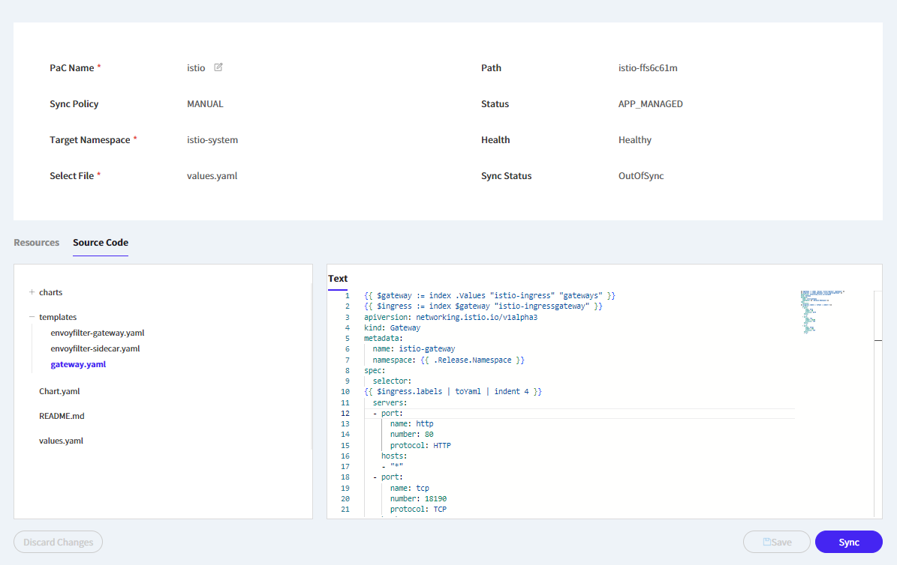
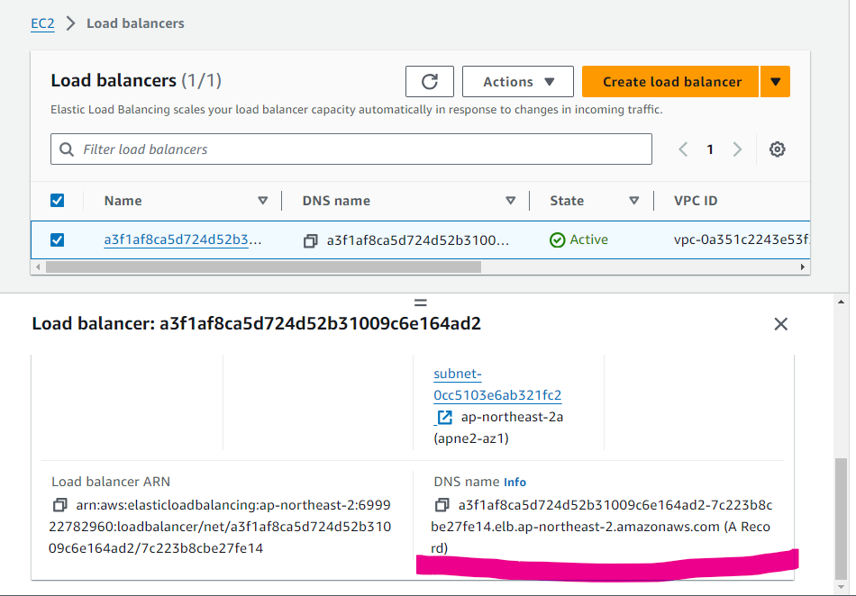
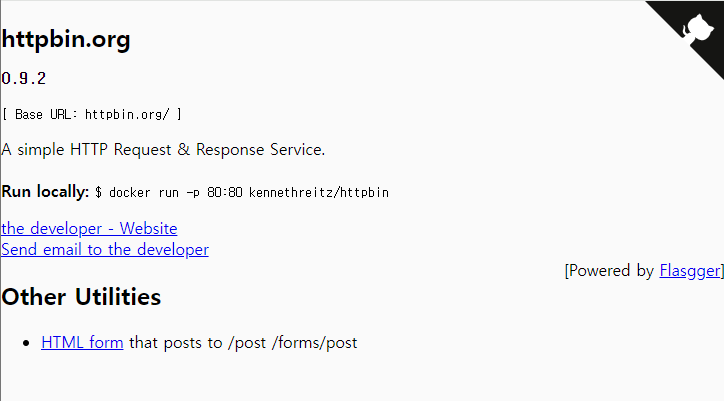
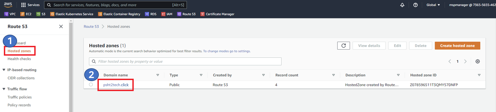
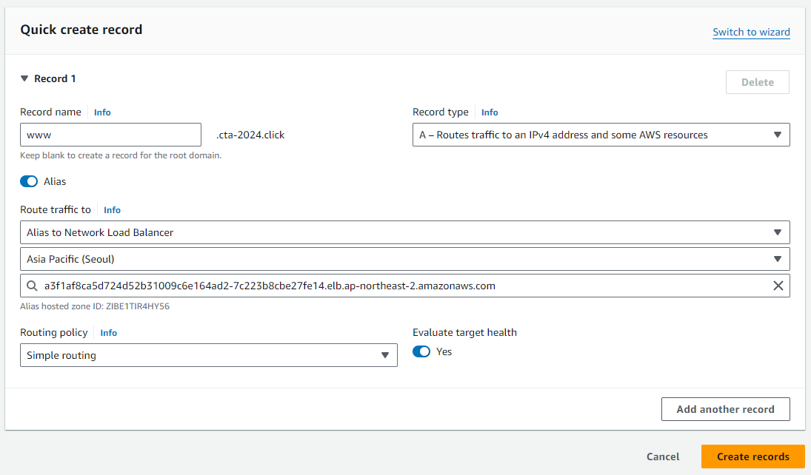
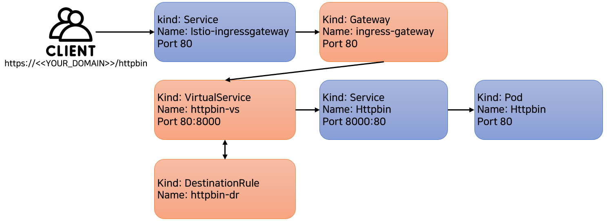

# 3일차 - Lab 5. Istio - Request-Routing

ⓘ 실습목표 : Istio의 Request-Routing을 실습합니다.

---

- [3일차 - Lab 5. Istio - Request-Routing](#3일차---lab-5.-istio---request-routing)
  - [0. 실습준비](#🔴-0.-실습준비)
  - [1. httpbin 배포](#🔴-1.-httpbin-배포)
  - [2. istio Gateway 확인](#🔴-2.-istio-gateway-확인)
  - [3. VirtualService 생성](#🔴-3.-virtualservice-생성)
  - [4. httpbin 접속](#🔴-4.-httpbin-접속)
  - [5. 도메인 연동](#🔴-5.-도메인-연동)
  - [6. istio Custom Resource 파악](#🔴-6.-istio-custom-resource-파악)
  - [7. Request Routing 흐름 파악](#🔴-7.-request-routing-흐름-파악)
  - [8. 리소스 정리](#🔴-8.-리소스-정리)

---

## 🔴 0. 실습준비

### ✔ 0-1. Cloud9에 디렉토리 생성 및 이동

- 실습을 진행항 디렉토리를 생성합니다.

```bash
mkdir -p ~/environment/istio/02_route
```

- 해당 디렉토리로 이동합니다.

```bash
cd ~/environment/istio/02_route
```

### ✔ 0-2. 실습 네임스페이스 생성

```bash
kubectl create ns istio-route
```

### ✔ 0-3. 네임스페이스에 레이블 설정

- httpbin이 배포되어있는 istio-route 네임스페이스에 레이블을 설정해본다.

```bash
kubectl label namespace istio-route istio-injection=enabled
```

### ✔ 0-4. 확인

```bash
kubectl get ns -L istio-injection
```

- (수행코드/결과 예시)

```
ubuntu@ip-10-1-10-79:~/k8s-istio$ kubectl label namespace istio-route istio-injection=enabled
namespace/istio-route labeled

ubuntu@ip-10-1-10-79:~/k8s-istio$ kubectl get ns -L istio-injection
NAME              STATUS   AGE     ISTIO-INJECTION
default           Active   4h20m
istio-system      Active   3h44m
istio-route        Active   7m29s   enabled
kube-node-lease   Active   4h20m
kube-public       Active   4h20m
kube-system       Active   4h20m
```

<br>

## 🔴 1. httpbin 배포

### ✔ 1-1. yaml파일 생성

```bash
cat << EOF > 01_httpbin.yaml
---
apiVersion: v1
kind: Service
metadata:
  name: httpbin
  namespace: istio-route
  labels:
    app: httpbin
    service: httpbin
spec:
  ports:
    - name: http
      port: 8000
      targetPort: 80
  selector:
    app: httpbin
---
apiVersion: apps/v1
kind: Deployment
metadata:
  name: httpbin
  namespace: istio-route
spec:
  replicas: 1
  selector:
    matchLabels:
      app: httpbin
      version: v1
  template:
    metadata:
      labels:
        app: httpbin
        version: v1
    spec:
      containers:
        - image: docker.io/kennethreitz/httpbin:test
          imagePullPolicy: IfNotPresent
          name: httpbin
          command:
            [
              "gunicorn",
              "--access-logfile",
              "-",
              "-b",
              "0.0.0.0:80",
              "httpbin:app",
            ]
          ports:
            - containerPort: 80
EOF
```

### ✔ 1-2. 배포

```bash
kubectl create -f 01_httpbin.yaml
```

### ✔ 1-3. httpbin가 제대로 배포되어있는지 확인

```bash
kubectl get po -n istio-route
```

- (수행코드/결과 예시)

```bash
mspmanager:~/environment/k8s-istio $ kubectl get po -n istio-route
NAME                      READY   STATUS    RESTARTS   AGE
httpbin-dc8b688f9-9pdt4   2/2     Running   0          60m
```

### ✔ 1-4. httpbin의 컨테이너 이름 확인

```bash
kubectl get po -n istio-route -o jsonpath={.items..spec.containers[*].name}
```

- (수행코드/결과 예시)

```bash
mspmanager:~/environment/k8s-istio $ kubectl get po -n istio-route -o jsonpath={.items..spec.containers[*].name}
istio-proxy httpbin
```

<br>

## 🔴 2. istio Gateway 확인

### ✔ 2-1. gateway.yaml 확인

- Gitops console의 istio 화면에서 gateway.yaml을 확인



### ✔ 2-2. gateway.yaml 내용

```yaml
{{ $gateway := index .Values "istio-ingress" "gateways" }}
{{ $ingress := index $gateway "istio-ingressgateway" }}
apiVersion: networking.istio.io/v1alpha3
kind: Gateway
metadata:
  name: istio-gateway
  namespace: {{ .Release.Namespace }}
spec:
  selector:
{{ $ingress.labels | toYaml | indent 4 }}
  servers:
  - port:
      name: http
      number: 80
      protocol: HTTP
    hosts:
    - "*"
  - port:
      name: tcp
      number: 18190
      protocol: TCP
    hosts:
    - "*"
  - port:
      name: https
      number: 443
      protocol: TCP
    hosts:
    - "*"
```

### ✔ 2-3. 배포된 Gateway 확인

- Cloud9에서 아래 명령어를 수행해 배포된 istio gateway를 확인

```bash
kubectl get gateway -n istio-system -o yaml
```

- (수행코드/결과 예시)

```yaml
apiVersion: v1
items:
  - apiVersion: networking.istio.io/v1beta1
    kind: Gateway
    metadata:
      annotations:
        kubectl.kubernetes.io/last-applied-configuration: |
          {"apiVersion":"networking.istio.io/v1alpha3","kind":"Gateway","metadata":{"annotations":{},"labels":{"argocd.argoproj.io/instance":"pac-temp-p13"},"name":"istio-gateway","namespace":"istio-system"},"spec":{"selector":{"app":"istio-ingressgateway","istio":"ingressgateway"},"servers":[{"hosts":["*"],"port":{"name":"http","number":80,"protocol":"HTTP"}},{"hosts":["*"],"port":{"name":"tcp","number":18190,"protocol":"TCP"}},{"hosts":["*"],"port":{"name":"https","number":443,"protocol":"TCP"}}]}}
      creationTimestamp: "2024-01-30T13:08:30Z"
      generation: 1
      labels:
        argocd.argoproj.io/instance: pac-temp-p13
      name: istio-gateway
      namespace: istio-system
      resourceVersion: "156459"
      uid: ce2c5455-fffa-4414-a020-d038d3dd0c76
    spec:
      selector:
        app: istio-ingressgateway
        istio: ingressgateway
      servers:
        - hosts:
            - "*"
          port:
            name: http
            number: 80
            protocol: HTTP
        - hosts:
            - "*"
          port:
            name: tcp
            number: 18190
            protocol: TCP
        - hosts:
            - "*"
          port:
            name: https
            number: 443
            protocol: TCP
kind: List
metadata:
  resourceVersion: ""
```

## 🔴 3. VirtualService 생성

### ✔ 3-1. httpbin-route.yaml 생성

```bash
cd ~/environment/istio/02_route
```

```bash
cat << EOF > 02_httpbin-route.yaml
---
apiVersion: networking.istio.io/v1alpha3
kind: VirtualService
metadata:
  name: httpbin-vs
  namespace: istio-route
spec:
  hosts:
  - "*"
  gateways:
  - istio-system/istio-gateway
  http:
  - match:
    - uri:
        exact: /httpbin
    - uri:
        prefix: /httpbin
    rewrite:
      uri: "/"
    route:
    - destination:
        host: httpbin
        port:
          number: 8000
---
apiVersion: networking.istio.io/v1alpha3
kind: DestinationRule
metadata:
  name: httpbin-dr
  namespace: istio-route
spec:
  host: httpbin
  trafficPolicy:
    tls:
      mode: DISABLE
EOF
```

### ✔ 3-2. VirtualService 생성

```bash
kubectl apply -f 02_httpbin-route.yaml
```

### ✔ 3-3. VirtualService 확인

```bash
kubectl get vs -n istio-route
```

- (수행코드/결과 예시)

```bash
mspmanager:~/environment/k8s-istio $ kubectl get vs -n istio-route
NAME         GATEWAYS                         HOSTS   AGE
httpbin-vs   ["istio-system/istio-gateway"]   ["*"]   56s
```

<br>

## 🔴 4. httpbin 접속

### ✔ 4-1. NLB 확인

- AWS Console에서 🔗[Load Balancers](https://ap-northeast-2.console.aws.amazon.com/ec2/home?region=ap-northeast-2#LoadBalancers:) 서비스로 이동한다.
- AWS Console > EC2 > Load Balancers

### ✔ 4-2. NLB의 DNS name 확인

- DNS name을 확인합니다.



### ✔ 4-3. httpbin 접속

- 브라우저에 `<<DNS name>>/httpbin`을 입력합니다.



<br>

## 🔴 5. 도메인 연동

- 🔥🔥🔥도메인 연동은 istio를 설치하며 진행했습니다. 만약 도멘인 연동이 안되어있다면 진행합니다🔥🔥🔥
- 이미 연동이 되어있다면 `5-4. 연동확인`의 내용을 진행합니다.

### ✔ 5-1. Route53 접속

- AWS Console에서 🔗[Hosted zones](https://us-east-1.console.aws.amazon.com/route53/v2/hostedzones#) 서비스로 이동한다.
- AWS Console > Route53 > Hosted zones

### ✔ 5-2. 도메인 선택

- 나의 도메인을 선택합니다.



### ✔ 5-3. Create Record

- `Create Record`을 클릭해 Record생성 화면으로 진입한후 아래의 정보를 입력합니다.

**📌 [입력]**

> | 항목                | 내용                             | 액션                |
> | ------------------- | -------------------------------- | ------------------- |
> | ➕ Record name      | `www`                            | 🧲복사 & 📋붙여넣기 |
> | ➕ Record Type      | `A`                              | 👆🏻셀렉트박스 선택   |
> | ➕ Alias            | `ON`                             | 🖱️클릭하여 활성화   |
> | ➕ Route traffic to | `Alias to Network Load Balancer` | 👆🏻셀렉트박스 선택   |
> | ➕ Route traffic to | `ap-northeast-2`                 | 👆🏻셀렉트박스 선택   |
> | ➕ Route traffic to | `<<나의 NLB DNS 선택>>`          | 👆🏻셀렉트박스 선택   |



- 입력후 `Create records`

### ✔ 5-4. 연동확인

- https://www.`<나의도메인>`/httpbin 을 통해 접속합니다.
- 인증서가 적용된것도 확인할 수 있습니다.

<br>

## 🔴 6. istio Custom Resource 파악

### ✔ 6-1. Virtual Service

- Istio의 Virtual Service는 Gateway를 통해 들어온 트래픽에 대한 라우팅 규칙을 정의함.
  목적지는 쿠버네티스 서비스가 됨.

```yaml
apiVersion: networking.istio.io/v1alpha3
kind: VirtualService
metadata:
  name: httpbin-vs
  namespace: istio-route
spec:
  hosts: # 트래픽이 전송되는 대상 호스트
    - "*"
  gateways: # 이 라우트를 적용해야 하는 Gateway의 이름
    - istio-system/istio-gateway # 다른 네임스페이스의 Gateway는 <Gateway namespace>/<Gateway 이름>으로 참조 가능, 생략하면 VirtualService의 네임스페이스와 동일
  http: # HTTP 트래픽에 대한 라우팅 규칙의 목록
    - match: # 규칙이 활성화되기 위해 충족할 일치 조건 (일치 블록 목록은 OR 의미 체계를 가짐)
        - uri: # 값을 일치시키는 URI (대소문자 구분)
            exact: /httpbin # exact: 정확한 문자열 일치를 위한 값
        - uri:
            prefix: /httpbin # prefix: 접두사 기반 일치 "값" (그 외 regex: 정규식 기반 일치 값)
      rewrite: # HTTP URI 및 권한 헤더를 다시 작성(rewrite) 함, 포워딩 전에 수행
        uri: "/"
      route:
        - destination: # 요청/연결이 전달(라우팅)되어야 하는 서비스를 식별
            host: httpbin # 서비스 레지스트리의 서비스 이름, FQDN 사용가능 (httpbin.istio-route.svc.cluster.local)
            port: # destination으로 지정된 호스트의 포트를 지정
              number: 8000
```

### ✔ 6-2. Destination Rule

- Istio의 Destination Rule은 Virtual Service를 통해 라우팅이 발생한 후 서비스를 위한 트래픽에 적용되는 정책을 정의함.
- 이러한 규칙은 로드 밸런싱 구성, 사이드카의 커넥션 풀 크기, 로드 밸런싱 풀에서 비정상 호스트를 감지하고 제거하기 위한 이상값 감지 설정 등을 지정함.

```yaml
apiVersion: networking.istio.io/v1alpha3
kind: DestinationRule
metadata:
  name: httpbin-dr
  namespace: istio-route
spec:
  host: httpbin # 서비스 레지스트리의 서비스 이름
  trafficPolicy: # 적용할 트래픽 정책(로드 밸런싱 정책, 커넥션 풀 크기, 이상 감지 등)
    tls:
      mode: DISABLE # TLS 연결 사용안함 설정
```

### ✔ 6-3. Authorization Policy

- Istio의 Authorization Policy는 메시의 워크로드에 대한 액세스 제어를 지원함.

```yaml
apiVersion: security.istio.io/v1beta1
kind: AuthorizationPolicy
metadata:
  name: httpbin-authz
  namespace: istio-system
spec:
  action: ALLOW # 요청이 규칙과 일치하는 경우 수행할 작업 (ALLOW / DENY / CUSTOM)
  rules: # 요청과 일치하는 규칙 목록
    - to: # 요청의 동작을 정의
        - operation:
            methods: ["GET", "POST"] # HTTP method 정의
            paths: ["/httpbin*"] # HTTP 요청의 path
```

## 🔴 7. Request Routing 흐름 파악



<br>

## 🔴 8. 리소스 정리

```bash
kubectl delete -f 02_httpbin-route.yaml
```

```bash
kubectl delete -f 01_httpbin.yaml
```

```bash
kubectl delete ns istio-route
```
