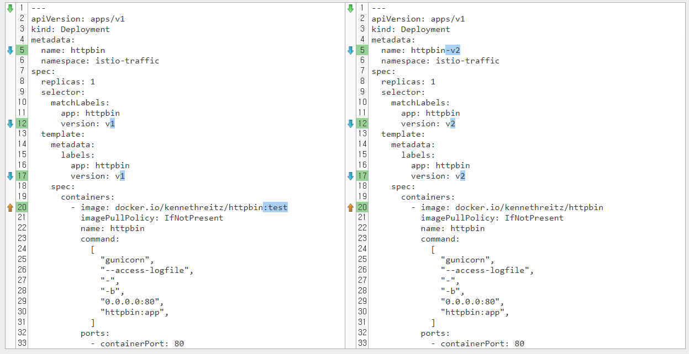
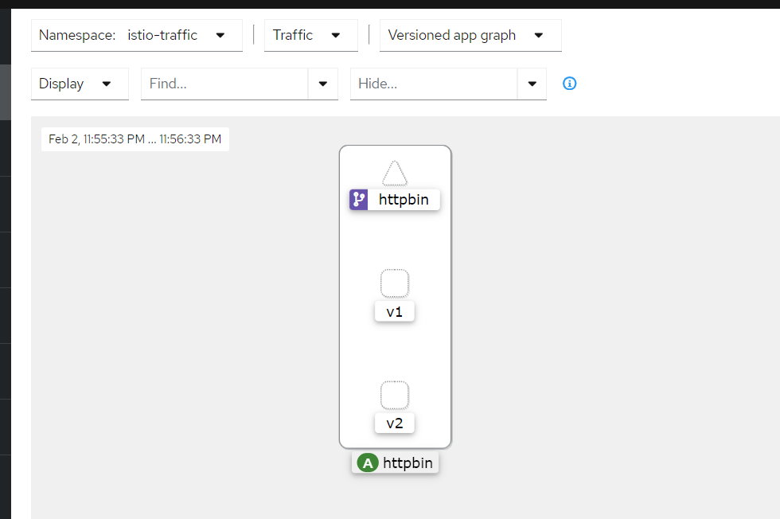
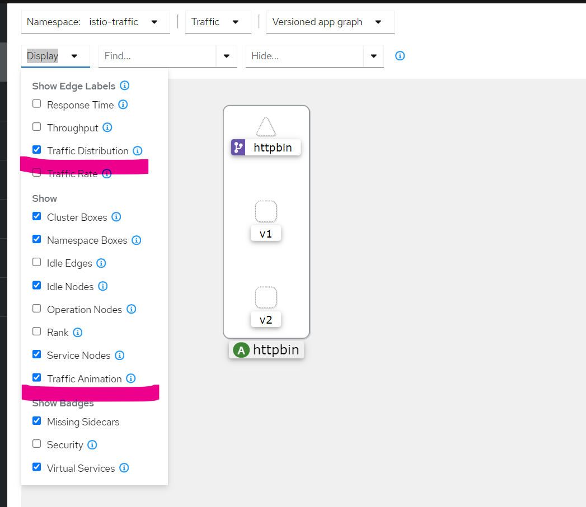
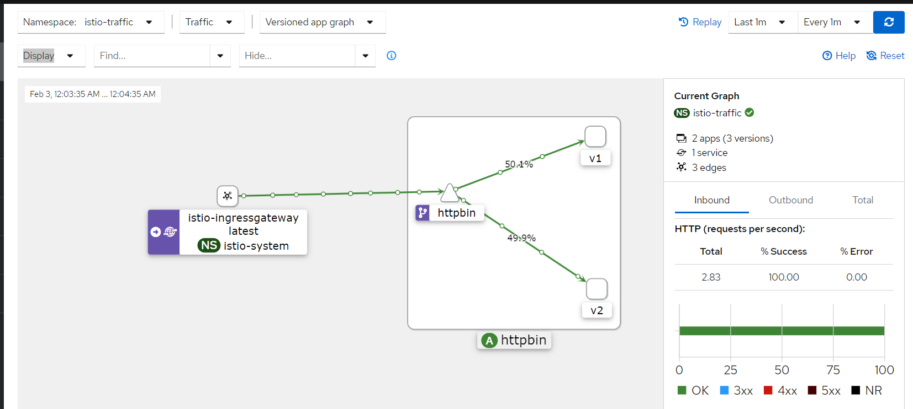
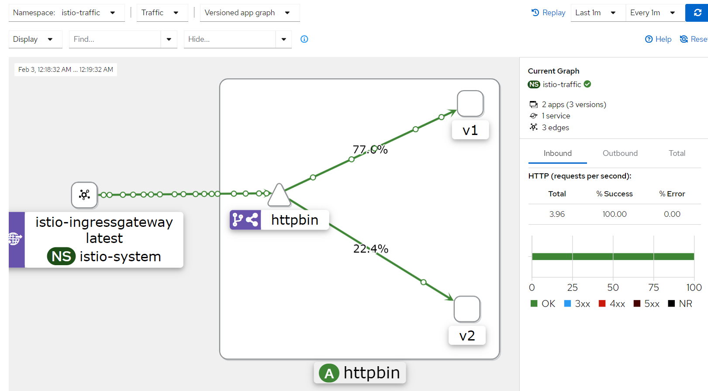

# 3일차 - Lab 6. Istio - Traffic Shifting

ⓘ 실습목표 : Istio의 Traffic Shifting을 실습합니다.

---

- [3일차 - Lab 6. Istio - Traffic Shifting](#3일차---lab-6.-istio---traffic-shifting)
  - [0. 실습준비](#🔴-0.-실습준비)
  - [1. httpbin deployment 배포](#🔴-1.-httpbin-deployment-배포)
  - [2. v1/v2 비교](#🔴-2.-v1%2Fv2-비교)
  - [3. httpbin Service배포](#🔴-3.-httpbin-service배포)
  - [4. 라우팅](#🔴-4.-라우팅)
  - [5. 확인](#🔴-5.-확인)
  - [6. Kiali를 이용해서 트래픽 확인](#🔴-6.-kiali를-이용해서-트래픽-확인)
  - [7. istio를 이용한 Traffic 분산](#🔴-7.-istio를-이용한-traffic-분산)
  - [8. 리소스 정리](#🔴-8.-리소스-정리)

---

<br>

## 🔴 0. 실습준비

### ✔ 0-1. Cloud9에 디렉토리 생성 및 이동

- 실습을 진행항 디렉토리를 생성합니다.

```bash
mkdir -p ~/environment/istio/03_traffic
```

- 해당 디렉토리로 이동합니다.

```bash
cd ~/environment/istio/03_traffic
```

### ✔ 0-2. 실습 네임스페이스 생성

```bash
kubectl create ns istio-traffic
```

### ✔ 0-3. 네임스페이스에 레이블 설정

- httpbin이 배포되어있는 istio-traffic 네임스페이스에 레이블을 설정해본다.

```bash
kubectl label namespace istio-traffic istio-injection=enabled
```

### ✔ 0-4. 확인

```bash
kubectl get ns -L istio-injection
```

- (수행코드/결과 예시)

```
mspmanager:~/environment/manifests $ kubectl get ns -L istio-injection
NAME              STATUS   AGE     ISTIO-INJECTION
default           Active   5h22m
istio-system      Active   64m
istio-traffic     Active   25s     enabled
kube-node-lease   Active   5h22m
kube-public       Active   5h22m
kube-system       Active   5h22m
```

<br>

## 🔴 1. httpbin deployment 배포

### ✔ 1-1. v1 deployment 배포

- yaml 파일 생성

```bash
cat << EOF > 01_httpbin-v1.yaml
---
apiVersion: apps/v1
kind: Deployment
metadata:
  name: httpbin
  namespace: istio-traffic
spec:
  replicas: 1
  selector:
    matchLabels:
      app: httpbin
      version: v1
  template:
    metadata:
      labels:
        app: httpbin
        version: v1
    spec:
      containers:
        - image: docker.io/kennethreitz/httpbin:test
          imagePullPolicy: IfNotPresent
          name: httpbin
          command:
            [
              "gunicorn",
              "--access-logfile",
              "-",
              "-b",
              "0.0.0.0:80",
              "httpbin:app",
            ]
          ports:
            - containerPort: 80
EOF
```

- 배포

```bash
kubectl apply -f 01_httpbin-v1.yaml
```

### ✔ 1-2. v1 deployment 배포 확인

```bash
kubectl get pods -o custom-columns=NAME:.metadata.name,STATUS:.status.phase,VERSION:.metadata.labels.version -n istio-traffic
```

- 출력 예시

```
NAME                       STATUS    VERSION
httpbin-769b677cc4-h2ndb   Running   v1
```

### ✔ 1-3. v2 deployment 배포

- yaml 파일 생성

```bash
cat << EOF > 02_httpbin-v2.yaml
---
apiVersion: apps/v1
kind: Deployment
metadata:
  name: httpbin-v2
  namespace: istio-traffic
spec:
  replicas: 1
  selector:
    matchLabels:
      app: httpbin
      version: v2
  template:
    metadata:
      labels:
        app: httpbin
        version: v2
    spec:
      containers:
        - image: docker.io/kennethreitz/httpbin
          imagePullPolicy: IfNotPresent
          name: httpbin
          command:
            [
              "gunicorn",
              "--access-logfile",
              "-",
              "-b",
              "0.0.0.0:80",
              "httpbin:app",
            ]
          ports:
            - containerPort: 80
EOF
```

- 배포

```bash
kubectl apply -f 02_httpbin-v2.yaml
```

### ✔ 1-4. v2 deployment 배포 확인

```bash
kubectl get pods -o custom-columns=NAME:.metadata.name,STATUS:.status.phase,VERSION:.metadata.labels.version -n istio-traffic
```

- 출력 예시

```bash
NAME                          STATUS    VERSION
httpbin-769b677cc4-h2ndb      Running   v1
httpbin-v2-7989978687-vhn7p   Running   v2
```

<br>

## 🔴 2. v1/v2 비교



<br>

## 🔴 3. httpbin Service배포

### ✔ 3-1. yaml 파일 생성

```bash
cat << EOF > 03_httpbin-svc.yaml
---
apiVersion: v1
kind: Service
metadata:
  name: httpbin
  namespace: istio-traffic
  labels:
    app: httpbin
    service: httpbin
spec:
  ports:
    - name: http
      port: 8000
      targetPort: 80
  selector:
    app: httpbin
EOF
```

### ✔ 3-2. 배포

```bash
kubectl apply -f 03_httpbin-svc.yaml
```

### ✔ 3-3. 서비스배포 확인

```bash
kubectl get svc -n istio-traffic
```

- 수행 결과 예시

```bash
NAME      TYPE        CLUSTER-IP      EXTERNAL-IP   PORT(S)    AGE
httpbin   ClusterIP   172.20.184.69   <none>        8000/TCP   3m3s
```

<br>

## 🔴 4. 라우팅

### ✔ 4-1. yaml 파일 생성

```bash
cat << EOF > 04_httpbin-route.yaml
---
apiVersion: networking.istio.io/v1alpha3
kind: VirtualService
metadata:
  name: httpbin-vs
  namespace: istio-traffic
spec:
  hosts:
    - "*"
  gateways:
    - istio-system/istio-gateway
  http:
    - match:
        - uri:
            exact: /httpbin-traffic
      rewrite:
        uri: "/"
      route:
        - destination:
            host: httpbin
            port:
              number: 8000

EOF
```

### ✔ 4-2. VirtualService 배포

```bash
kubectl apply -f 04_httpbin-route.yaml
```

<br>

## 🔴 5. 확인

- 브라우저에 `www.<<나의도메인>>.click/httpbin-traffic` 을 입력하여 페이지를 확인합니다.
- 여러번 새로고침을 해봅니다.

> `v0.9.0`과 `v0.9.2`이 무작위로 출력됩니다.

<br>

## 🔴 6. Kiali를 이용해서 트래픽 확인

### ✔ 6-1. Kiali 접속

- 브라우저에 `www.<<나의도메인>>.click/kiali` 을 입력하여 kiali에 접속합니다.

### ✔ 6-2. 로그인토큰 얻기 & 로그인

- cloud9에 아래의 명령어를 수행하여 토큰을 얻습니다.

```bash
kubectl -n istio-system create token kiali
```

- 얻은 토큰을 이용하여 로그인합니다.

### ✔ 6-3. 그래프확인

- 로그인 후 > `Graph` 클릭 > `Select Namespace` > `istio-traffic` > `Versioned app graph`



### ✔ 6-4. 그래프 display 옵션 변경

- `Traffic Distribution`과 `Traffic Animation`을 활성화 합니다.



### ✔ 6-5. 트래픽 발생

- 아래 명령어를 cloud9 터미널에서 실행시켜서 트래픽을 5000회 발생
- 🔥🔥🔥주의🔥🔥🔥 : <<나의도메인>>를 바꿔서 수행하세요

```
for i in $(seq 1 5000); do curl -o /dev/null "https://www.<<YOUR_DOMAIN>>.click/httpbin-traffic"; done
```

### ✔ 6-6. 트래픽 시각화 확인

- 조금 기다리거나 오른쪽 상단의 새로고침🔃 버튼을 클릭하면 트래픽이 이동하는 모습을 볼 수 있습니다.



### ✔ 6-7. 트래픽 중지

- 5000번의 트래픽이 발생하면 끝나지만, 그 이전에 끝내려면 cloud9 터미널에 Ctrl+C 를 입력합니다.

<br>

## 🔴 7. istio를 이용한 Traffic 분산

### ✔ 7-1. httpbin-route.yaml 수정

- 04_httpbin-route.yaml를 아래와 같이 수정한다

```yaml
---
apiVersion: networking.istio.io/v1alpha3
kind: VirtualService
metadata:
  name: httpbin-vs
  namespace: istio-traffic
spec:
  hosts:
    - "*"
  gateways:
    - istio-system/istio-gateway
  http:
    - match:
        - uri:
            exact: /httpbin-traffic
      rewrite:
        uri: "/"
      route:
        - destination:
            host: httpbin
            subset: v1
            port:
              number: 8000
          weight: 80
        - destination:
            host: httpbin
            subset: v2
            port:
              number: 8000
          weight: 20
---
apiVersion: networking.istio.io/v1alpha3
kind: DestinationRule
metadata:
  name: httpbin-dr
  namespace: istio-traffic
spec:
  host: httpbin
  subsets:
    - name: v1
      labels:
        version: v1
    - name: v2
      labels:
        version: v2
  trafficPolicy:
    tls:
      mode: DISABLE
```

### ✔ 7-2. httpbin-route.yaml 적용

```bash
kubectl apply -f 04_httpbin-route.yaml
```

### ✔ 7-3. 트래픽 발생

- 아래 명령어를 cloud9 터미널에서 실행시켜서 트래픽을 5000회 발생
- 🔥🔥🔥주의🔥🔥🔥 : <<나의도메인>>를 바꿔서 수행하세요

```
for i in $(seq 1 5000); do curl -o /dev/null "https://www.<<YOUR_DOMAIN>>.click/httpbin-traffic"; done
```

### ✔ 7-4. 트래픽 분배 확인



### ✔ 7-5. 트래픽 중지

- cloud9 터미널에 Ctrl+C 를 입력합니다.

<br>

## 🔴 8. 리소스 정리

- 리소스를 정리합니다.

### ✔ 8-1. 각종 리소스 삭제

```bash
kubectl delete -f 04_httpbin-route.yaml
```

```bash
kubectl delete -f 03_httpbin-svc.yaml
```

```bash
kubectl delete -f 02_httpbin-v2.yaml
```

```bash
kubectl delete -f 01_httpbin-v1.yaml
```

### ✔ 8-2. 삭제확인

```bash
kubectl get all -n istio-traffic
```

- 결과 예시

```
No resources found in istio-traffic namespace.
```

### ✔ 8-3. NS 삭제

```bash
kubectl delete ns istio-traffic
```
