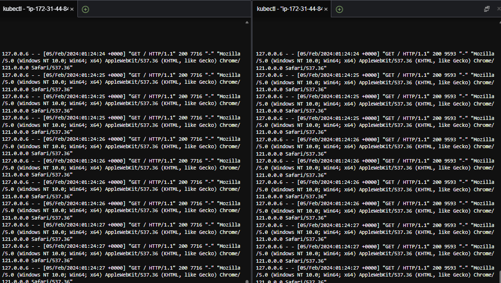

# 3일차 - Lab 7. Istio - Traffic mirroring

ⓘ 실습목표 : Istio의 Traffic mirroring을 실습합니다.

---

- [3일차 - Lab 7. Istio - Traffic mirroring](#3일차---lab-7.-istio---traffic-mirroring)
  - [0. 실습준비](#🔴-0.-실습준비)
  - [1. httpbin 배포](#🔴-1.-httpbin-배포)
  - [2. httpbin Service배포](#🔴-2.-httpbin-service배포)
  - [3. 라우팅](#🔴-3.-라우팅)
  - [4. 확인](#🔴-4.-확인)
  - [5. 로그확인](#🔴-5.-로그확인)
  - [6. 리소스 정리](#🔴-6.-리소스-정리)

---

## 🔴 0. 실습준비

### ✔ 0-1. Cloud9에 디렉토리 생성 및 이동

- 실습을 진행항 디렉토리를 생성합니다.

```bash
mkdir -p ~/environment/istio/04_mirroring
```

- 해당 디렉토리로 이동합니다.

```bash
cd ~/environment/istio/04_mirroring
```

### ✔ 0-2. 실습 네임스페이스 생성

```bash
kubectl create ns istio-mirroring
```

### ✔ 0-3. 네임스페이스에 레이블 설정

- httpbin이 배포되어있는 istio-mirroring 네임스페이스에 레이블을 설정해본다.

```bash
kubectl label namespace istio-mirroring istio-injection=enabled
```

### ✔ 0-4. 확인

```bash
kubectl get ns -L istio-injection
```

- (수행코드/결과 예시)

```
mspmanager:~/environment/k8s-istio-mirroring $ kubectl get ns -L istio-injection
NAME              STATUS   AGE     ISTIO-INJECTION
default           Active   2d15h
istio-mirroring   Active   6s      enabled
istio-system      Active   2d11h
istio-test        Active   2d10h   enabled
kube-node-lease   Active   2d15h
kube-public       Active   2d15h
kube-system       Active   2d15h
```

<br>

## 🔴 1. httpbin 배포

### ✔ 1-1. httpbin v1 Deployment yaml파일 생성

```bash
cat << EOF > 01_httpbin-v1.yaml
---
apiVersion: apps/v1
kind: Deployment
metadata:
  name: httpbin
  namespace: istio-mirroring
spec:
  replicas: 1
  selector:
    matchLabels:
      app: httpbin
      version: v1
  template:
    metadata:
      labels:
        app: httpbin
        version: v1
    spec:
      containers:
        - image: docker.io/kennethreitz/httpbin:test
          imagePullPolicy: IfNotPresent
          name: httpbin
          command:
            [
              "gunicorn",
              "--access-logfile",
              "-",
              "-b",
              "0.0.0.0:80",
              "httpbin:app",
            ]
          ports:
            - containerPort: 80
EOF
```

### ✔ 1-2. httpbin v1 Deployment 배포

```bash
kubectl apply -f 01_httpbin-v1.yaml
```

### ✔ 1-3. httpbin v1 Deployment 배포 확인

```bash
kubectl get pods -o custom-columns=NAME:.metadata.name,STATUS:.status.phase,VERSION:.metadata.labels.version -n istio-mirroring
```

- 출력 예시

```bash
NAME                       STATUS    VERSION
httpbin-769b677cc4-fxrch   Running   v1
```

### ✔ 1-4. httpbin v2 Deployment yaml파일 생성

- yaml 파일 생성

```bash
cat << EOF > 02_httpbin-v2.yaml
---
apiVersion: apps/v1
kind: Deployment
metadata:
  name: httpbin-v2
  namespace: istio-mirroring
spec:
  replicas: 1
  selector:
    matchLabels:
      app: httpbin
      version: v2
  template:
    metadata:
      labels:
        app: httpbin
        version: v2
    spec:
      containers:
        - image: docker.io/kennethreitz/httpbin
          imagePullPolicy: IfNotPresent
          name: httpbin
          command:
            [
              "gunicorn",
              "--access-logfile",
              "-",
              "-b",
              "0.0.0.0:80",
              "httpbin:app",
            ]
          ports:
            - containerPort: 80
EOF
```

### ✔ 1-5. 배포

```bash
kubectl apply -f 02_httpbin-v2.yaml
```

### ✔ 1-6. v2 deployment 배포 확인

```bash
kubectl get pods -o custom-columns=NAME:.metadata.name,STATUS:.status.phase,VERSION:.metadata.labels.version -n istio-mirroring
```

- 출력 예시

```bash
NAME                          STATUS    VERSION
httpbin-769b677cc4-fxrch      Running   v1
httpbin-v2-7989978687-pp69q   Pending   v2
```

<br>

## 🔴 2. httpbin Service배포

### ✔ 2-1. yaml 파일 생성

```bash
cat << EOF > 03_httpbin-svc.yaml
---
apiVersion: v1
kind: Service
metadata:
  name: httpbin
  namespace: istio-mirroring
  labels:
    app: httpbin
    service: httpbin
spec:
  ports:
    - name: http
      port: 8000
      targetPort: 80
  selector:
    app: httpbin
EOF
```

### ✔ 3-2. 배포

```bash
kubectl apply -f 03_httpbin-svc.yaml
```

### ✔ 3-3. 서비스배포 확인

```bash
kubectl get svc -n istio-mirroring
```

- 수행 결과 예시

```bash
NAME      TYPE        CLUSTER-IP      EXTERNAL-IP   PORT(S)    AGE
httpbin   ClusterIP   172.20.65.100   <none>        8000/TCP   5s
```

<br>

## 🔴 3. 라우팅

### ✔ 3-1. yaml 파일 생성

```bash
cat << EOF > 04_httpbin-route.yaml
---
apiVersion: networking.istio.io/v1alpha3
kind: VirtualService
metadata:
  name: httpbin-vs
  namespace: istio-mirroring
spec:
  hosts:
    - "*"
  gateways:
    - istio-system/istio-gateway
  http:
    - match:
        - uri:
            exact: /httpbin-mirroring
        - uri:
            prefix: /httpbin-mirroring
      rewrite:
        uri: "/"
      route:
        - destination:
            host: httpbin
            subset: v1
            port:
              number: 8000
          weight: 100
        - destination:
            host: httpbin
            subset: v2
            port:
              number: 8000
          weight: 0
      mirror: ## 트래픽 미러링 설정
        host: httpbin ## 대상 서비스
        subset: v2 ## 서브셋
      mirrorPercentage: ## 미러링 비율
        value: 100
---
apiVersion: networking.istio.io/v1alpha3
kind: DestinationRule
metadata:
  name: httpbin-dr
  namespace: istio-mirroring
spec:
  host: httpbin
  subsets:
    - name: v1
      labels:
        version: v1
    - name: v2
      labels:
        version: v2
  trafficPolicy:
    tls:
      mode: DISABLE
EOF
```

### ✔ 3-2. VirtualService 배포

```bash
kubectl apply -f 04_httpbin-route.yaml
```

<br>

## 🔴 4. 확인

- 브라우저에 `www.<<나의도메인>>.click/httpbin-mirroring` 을 입력하여 페이지를 확인합니다.
- 여러번 새로고침을 해봅니다.

> `v0.9.0`만 출력됩니다.

for i in $(seq 1 5000); do curl -o /dev/null "https://www.cta-2024.click/httpbin-mirroring"; done

<br>

## 🔴 5. 로그확인

### ✔ 5-1. httpbin v1 로그 확인

- 터미널에 아래 명령어로 v1의 로그를 확인합니다.

```bash
kubectl logs -f $(kubectl get po -l version=v1 -o jsonpath={.items..metadata.name} -n istio-mirroring) -n istio-mirroring
```

### ✔ 5-2. httpbin v2 로그 확인

- 터미널을 `하나 더 띄운 후` 아래 명령어로 v2의 로그를 확인합니다.

```bash
kubectl logs -f $(kubectl get po -l version=v2 -o jsonpath={.items..metadata.name} -n istio-mirroring) -n istio-mirroring
```

### ✔ 5-3. 브라우저로 페이지 접속후 로그확인

- 브라우저에 `www.<<나의도메인>>.click/httpbin-mirroring` 을 입력하여 페이지를 확인합니다.
- 브라우저에 표시되는 버전은 v1이지만 로그는 모두다 올라오는것을 확인 할 수 있습니다.



## 🔴 6. 리소스 정리

- 리소스를 정리합니다.

### ✔ 6-1. 각종 리소스 삭제

```bash
kubectl delete -f 04_httpbin-route.yaml
```

```bash
kubectl delete -f 03_httpbin-svc.yaml
```

```bash
kubectl delete -f 02_httpbin-v2.yaml
```

```bash
kubectl delete -f 01_httpbin-v1.yaml
```

### ✔ 6-2. 삭제확인

```bash
kubectl get all -n istio-mirroring
```

- 결과 예시

```
No resources found in istio-mirroring namespace.
```

### ✔ 6-3. NS 삭제

```bash
kubectl delete ns istio-mirroring
```
