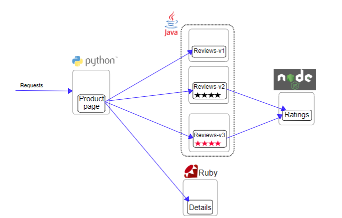
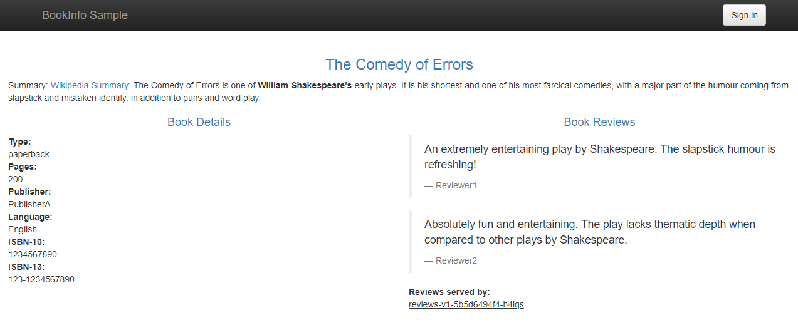
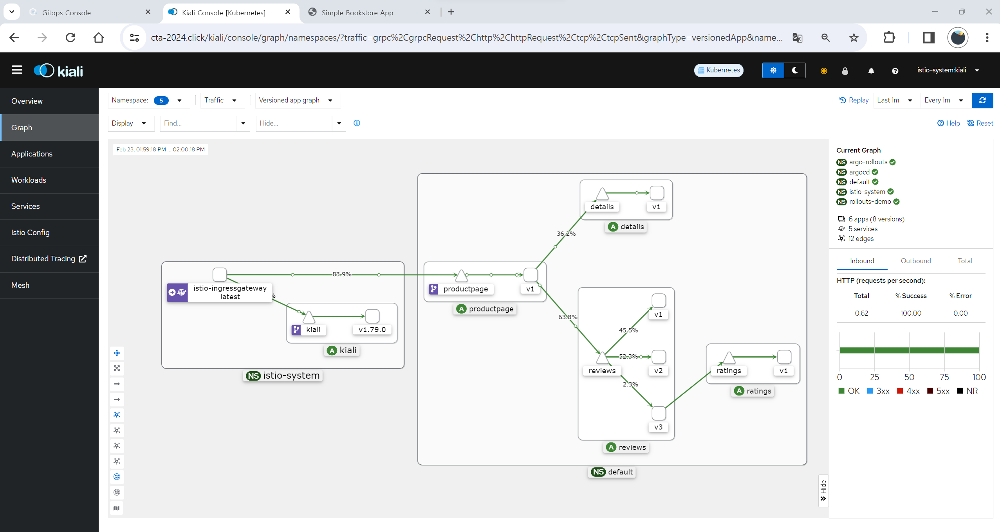

# 3일차 - Lab 8. bookinfo

ⓘ 실습목표 : istio의 추가 기능을 실습하기 이전에 bookinfo를 설치합니다.

---

- [3일차 - Lab 8. bookinfo](#3일차---lab-8.-bookinfo)
  - [1. Namespace 작업](#🔴-1.-namespace-작업)
  - [2. BookInfo 어플리케이션 배포](#🔴-2.-bookinfo-어플리케이션-배포)
  - [3. 서비스 외부 노출](#🔴-3.-서비스-외부-노출)

---

- 참고 : https://istio.io/latest/docs/examples/bookinfo/

- BookInfo 구조



## 🔴 1. Namespace 작업

### ✔ 1-1. default namespace에 사이드카 인젝션 허용

```bash
kubectl label namespace default istio-injection=enabled
```

### ✔ 1-2. default namespace에 사이드카 인젝션 허용 확인

```bash
kubectl get ns -L istio-injection
```

- 결과 예시

```bash
NAME              STATUS   AGE     ISTIO-INJECTION
default           Active   2d16h   enabled
istio-system      Active   2d12h
kube-node-lease   Active   2d16h
kube-public       Active   2d16h
kube-system       Active   2d16h
```

## 🔴 2. BookInfo 어플리케이션 배포

### ✔ 2-1. 디렉토리 생성 및 이동

```bash
mkdir -p ~/environment/istio/05_bookinfo
```

```bash
cd ~/environment/istio/05_bookinfo
```

### ✔ 2-2. yaml 다운로드

```bash
curl https://raw.githubusercontent.com/istio/istio/release-1.20/samples/bookinfo/platform/kube/bookinfo.yaml > 01_bookinfo.yaml
```

### ✔ 2-3. 배포

```bash
kubectl apply -f 01_bookinfo.yaml
```

- 결과예시

```
service/details created
serviceaccount/bookinfo-details created
deployment.apps/details-v1 created
service/ratings created
serviceaccount/bookinfo-ratings created
deployment.apps/ratings-v1 created
service/reviews created
serviceaccount/bookinfo-reviews created
deployment.apps/reviews-v1 created
deployment.apps/reviews-v2 created
deployment.apps/reviews-v3 created
service/productpage created
serviceaccount/bookinfo-productpage created
deployment.apps/productpage-v1 created
```

### ✔ 2-4. 서비스 확인

```bash
kubectl get service
```

- 결과 예시

```
NAME                 TYPE        CLUSTER-IP       EXTERNAL-IP   PORT(S)    AGE
details              ClusterIP   172.20.137.88    <none>        9080/TCP   45s
kube-state-metrics   ClusterIP   172.20.206.87    <none>        8080/TCP   2d12h
kubernetes           ClusterIP   172.20.0.1       <none>        443/TCP    2d16h
productpage          ClusterIP   172.20.135.14    <none>        9080/TCP   45s
prometheus-server    ClusterIP   172.20.157.79    <none>        80/TCP     2d12h
ratings              ClusterIP   172.20.86.19     <none>        9080/TCP   45s
reviews              ClusterIP   172.20.222.202   <none>        9080/TCP   45s
```

### ✔ 2-5. pod 확인

```bash
kubectl get pods
```

- 🔥🔥🔥꼭 컨테이너가 2개있음을 확인합시다!!🔥🔥🔥

- 결과예시

```
NAME                                  READY   STATUS    RESTARTS   AGE
details-v1-698d88b-z477z              2/2     Running   0          27s
kube-state-metrics-7599bb65b9-v59v9   1/1     Running   0          2d14h
productpage-v1-675fc69cf-phhnb        2/2     Running   0          27s
prometheus-server-774b9b4964-chlfg    2/2     Running   0          2d14h
ratings-v1-6484c4d9bb-w7g5v           2/2     Running   0          27s
reviews-v1-5b5d6494f4-84pcd           2/2     Running   0          27s
reviews-v2-5b667bcbf8-c2qqh           2/2     Running   0          27s
reviews-v3-5b9bd44f4-7pt8p            2/2     Running   0          27s
```

### ✔ 2-6. curl을 이용한 서비스 확인

```bash
kubectl exec "$(kubectl get pod -l app=ratings -o jsonpath='{.items[0].metadata.name}')" -c ratings -- curl -sS productpage:9080/productpage | grep -o "<title>.*</title>"
```

- 결과 예시

```
<title>Simple Bookstore App</title>
```

- 명령어 설명
  1.  `kubectl exec` 명령어를 사용하여 특정 팟(Pod) 내에서 커맨드를 실행합니다.
  2.  `"$(kubectl get pod -l app=ratings -o jsonpath='{.items[0].metadata.name}')" -c ratings` : app=ratings 라벨이 붙은 팟 중 첫 번째 파드의 이름을 가져옵니다.
  3.  `-c ratings` : 해당 파드 내의 'ratings' 컨테이너에서 명령어를 실행하라는 것을 의미합니다.
  4.  `curl -sS productpage:9080/productpage` : curl 명령어를 사용하여 productpage 서비스의 9080 포트에 HTTP 요청을 보냅니다. 여기서 productpage는 쿠버네티스 서비스의 이름입니다. (-sS 옵션 : 에러 메시지는 출력하지만, 진행 상황이나 기타 메시지는 숨기라는 의미)
  5.  `grep -o "<title>.*</title>"` : curl 명령어의 결과에서 <title>...</title> 태그를 포함하는 부분만을 추출 (-o 옵션은 정규 표현식과 일치하는 부분만을 출력)

<br>

## 🔴 3. 서비스 외부 노출

### ✔ 3-1. VirtualService yaml 생성

```bash
cd ~/environment/istio/05_bookinfo
```

```bash
cat << EOF > 02_bookinfo-route.yaml
---
apiVersion: networking.istio.io/v1alpha3
kind: VirtualService
metadata:
  name: bookinfo-vs
  namespace: default
spec:
  hosts:
  - "*"
  gateways:
  - istio-system/istio-gateway
  http:
  - match:
    - uri:
        exact: /productpage
    - uri:
        prefix: /static
    - uri:
        exact: /login
    - uri:
        exact: /logout
    - uri:
        prefix: /api/v1/products
    route:
    - destination:
        host: productpage
        port:
          number: 9080
EOF
```

```bash
kubectl apply -f 02_bookinfo-route.yaml
```

### ✔ 3-2. 서비스 버전 정의 (DestinationRule)

```bash
curl https://raw.githubusercontent.com/istio/istio/release-1.20/samples/bookinfo/networking/destination-rule-all.yaml > 03_destination-rule-all.yaml
```

```bash
kubectl apply -f 03_destination-rule-all.yaml
```

### ✔ 3-2. 접속확인

- 브라우저에 `www.<<나의도메인>>.click/productpage로` 을 입력하여 페이지를 확인합니다.

- 페이지를 여러 번 새로 고치면 productpage라운드 로빈 스타일(빨간색 별, 검은색 별, 별 없음)로 표시되는 다양한 버전의 리뷰가 표시됩니다 . 아직 Istio를 사용하여 버전 라우팅을 제어하지 않았기 때문입니다.



<br>

## 🔴 4. 실습과제

- Bookinfo의 trafiic흐름을 kiali를 통해 파악합니다.

### ✔ 4-1. 트래픽 생성

- cloud9에서 아래의 명령어를 입력하여 트래픽을 생성합니다.
- 🔥🔥🔥주의🔥🔥🔥 : `<<YOUR_DOMAIN>>` 부분을 각자의 도메인으로 변경합니다.

```bash
for i in $(seq 1 5000); do curl -o /dev/null "https://www.<<YOUR_DOMAIN>>.click/productpage"; done
```

### ✔ 4-2. Kiali에서 확인

- `https://www.<<YOUR_DOMAIN>>.click/kiali`에서 트래픽 흐름을 파악합니다.



### ✔ 4-3. 실습 과제 제출

- 위와 같은 스크린샷을 제출합니다.
- 🔥🔥🔥주의🔥🔥🔥 : 본인의 도메인을 꼭 포함해서 스크린샷을 찍어 주세요
