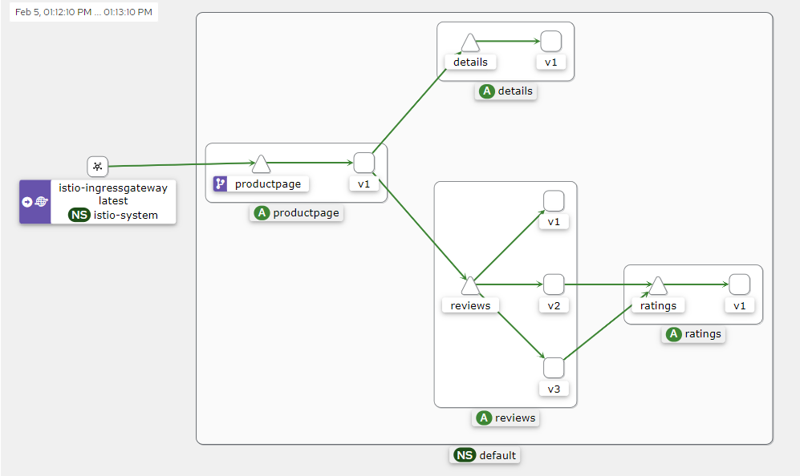
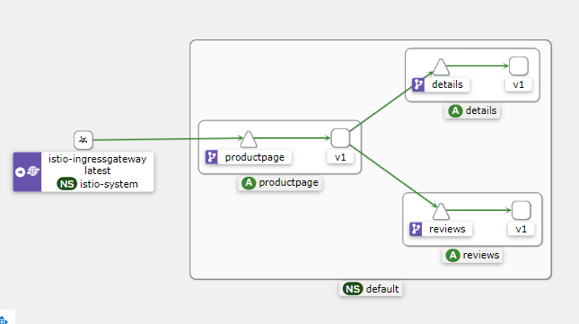
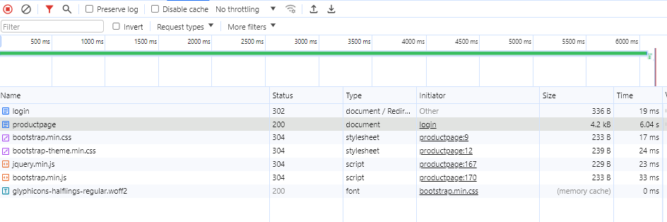
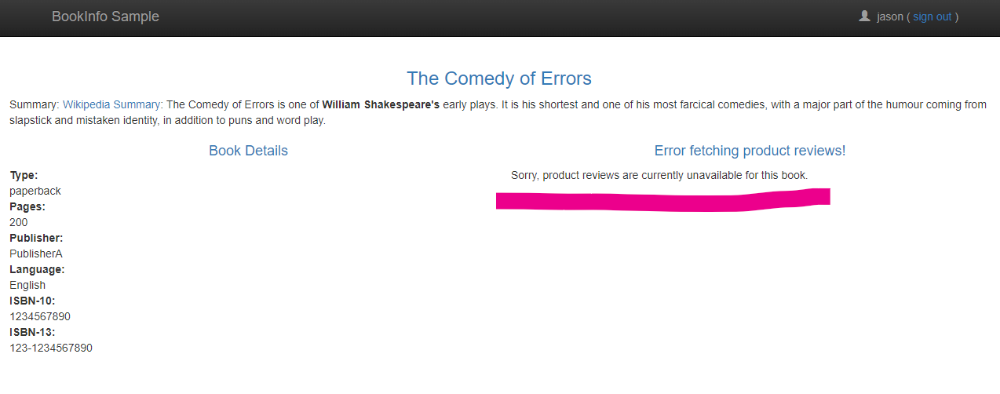

# 3일차 - Lab 9. Istio - Fault injection

ⓘ 실습목표 : istio의 Fault injection기능을 실습합니다.

---

- [3일차 - Lab 9. Istio - Fault injection](#3일차---lab-9.-istio---fault-injection)
  - [0. 참고사항](#🔴-0.-참고사항)
  - [1. Fault injection 이란?](#🔴-1.-fault-injection-이란%3F)
  - [2. BookInfo 구조](#🔴-2.-bookinfo-구조)
  - [3. 실습 환경 반영](#🔴-3.-실습-환경-반영)
  - [4. Injecting an HTTP delay fault](#🔴-4.-injecting-an-http-delay-fault)
  - [5. 테스트](#🔴-5.-테스트)
  - [6. Injecting an HTTP abort fault(HTTP 중단 오류 주입)](<#🔴-6.-injecting-an-http-abort-fault(http-중단-오류-주입)>)

---

## 🔴 0. 참고사항

- bookinfo 배포후 본 실습을 진행합니다.

<br>

## 🔴 1. Fault injection 이란?

- 결함을 주입하여 복원력을 테스트할수 있는 방법

<br>

## 🔴 2. BookInfo 구조




<br>

## 🔴 3. 실습 환경 반영

### ✔ 3-1. 디렉토리 생성 및 이동

```bash
mkdir -p ~/environment/istio/05_bookinfo/fault
```

```bash
cd ~/environment/istio/05_bookinfo/fault
```

### ✔ 3-2. yaml 파일 생성

```bash
curl https://raw.githubusercontent.com/istio/istio/release-1.20/samples/bookinfo/networking/virtual-service-all-v1.yaml > 01_virtual-service-all-v1.yaml
```

```bash
curl https://raw.githubusercontent.com/istio/istio/release-1.20/samples/bookinfo/networking/virtual-service-reviews-test-v2.yaml > 02_virtual-service-reviews-test-v2.yaml
```

### ✔ 3-3. VirtualService 반영

```bash
kubectl apply -f 01_virtual-service-all-v1.yaml
```

- 여기까지



### ✔ 3-4. VirtualService 반영 2

```bash
kubectl apply -f 02_virtual-service-reviews-test-v2.yaml
```

### ✔ 3-5. 현재의 구성

- productpage → reviews:v2 → ratings (only for user `jason`)
- productpage → reviews:v1 (for everyone else)


---

<br>

## 🔴 4. Injecting an HTTP delay fault

### ✔ 4-1. yaml 다운로드

```bash
curl https://raw.githubusercontent.com/istio/istio/release-1.20/samples/bookinfo/networking/virtual-service-ratings-test-delay.yaml > 03_virtual-service-ratings-test-delay.yaml
```

### ✔ 4-2. 반영

```bash
kubectl apply -f 03_virtual-service-ratings-test-delay.yaml
```

### ✔ 4-3. 반영확인

```bash
kubectl get virtualservice ratings -o yaml
```

- 결과 예시

```
apiVersion: networking.istio.io/v1beta1
kind: VirtualService
...
spec:
  hosts:
  - ratings
  http:
  - fault:
      delay:
        fixedDelay: 7s
        percentage:
          value: 100
    match:
    - headers:
        end-user:
          exact: jason
    route:
    - destination:
        host: ratings
        subset: v1
  - route:
```

## 🔴 5. 테스트

### ✔ 5-1. jason으로 로그인

- jason 으로 로그인하면 딜레이됨




### ✔ 5-2. 상황이해

- 우리는 rating 서비스에 7초 지연을 주었습니다..
- review-rating간 타임리밋 코딩은 10초라고 합니다.
- 그래서 review-rating 통신은 좀더 기다릴 수 있습니다..
- 하지만 productpage-reviews간 타임리밋이 6초라고 합니다(3초씩 두번 시도)
- 그래서 6초 정도에 페이지가 리턴 됩니다.
- 그래서 지연을 2초 정도로 줄이면 좀 늦지만 페이지의 리턴은 잘 동작합니다.

### ✔ 5-3. 지연 오류 주입 해제

```bash
kubectl delete -f 03_virtual-service-ratings-test-delay.yaml
```

<br>

## 🔴 6. Injecting an HTTP abort fault(HTTP 중단 오류 주입)

### ✔ 6-1. yaml 다운로드

```bash
curl https://raw.githubusercontent.com/istio/istio/release-1.20/samples/bookinfo/networking/virtual-service-ratings-test-abort.yaml > 04_virtual-service-ratings-test-abort.yaml
```

### ✔ 6-2. 배포

```bash
kubectl apply -f 04_virtual-service-ratings-test-abort.yaml
```

### ✔ 6-3. jason으로 로그인

- 아래와 같은 에러가 발생합니다.


- 다른 사람으로 로그인하거나 로그인안하면 어짜피 rating을 호출하지 않아서 보이진 않지만...잘 나옵니다

### ✔ 6-4. HTTP 중단 오류 주입 해제

```bash
kubectl delete -f 04_virtual-service-ratings-test-abort.yaml
```
