# 4일차 Observability
## Lab5. Grafana Alerting 기능을 활용한 Notification

 

---
- [4일차 Observability](#4일차-observability)
  - [Lab5. Grafana Alerting 기능을 활용한 Notification](#lab5-grafana-alering-기능을-활용한-notification)
    - [5-1. Alert Rule 등록하기](#5-1-alert-rule-등록하기)
    - [5-2. Notification 실습을 위한 Slack Webhook URL 발급받기](#5-2-notification-실습을-위한-slack-webhook-url-발급받기)
    - [5-3. Grafana와 Slack 연동하기](#5-3-grafana와-slack-연동하기)    
    - [5-4. Rule 조정을 통해 Notification 발생시켜보기](#5-4-rule-조정을-통해-notification-발생시켜보기)
    - [5-5. Alert의 내용 편집해보기](#5-5-alert의-내용-편집해보기)
    - [5-6. Alert 삭제](#5-6-alert-삭제)    
---

ⓘ 실습목표 : Grafana에서 Alert Rule을 통해 발생된 Alarm을 Notification으로 보내보는 방법을 학습한다.

---

### 5-1. Alert Rule 등록하기

▶ Node CPU를 기준으로 특정 값을 초과했을 때 Alert이 발생하도록 구성해보자.

 

5-1-1. `Alert rule` 메뉴에 접속하여 `New alert rule`버튼을 클릭한다.

 

5-1-2. `Name`과 `Query`를 입력한다.

>|항목|내용|액션|
>|---|---|---|
>➕ Name|`cta-slack`|🧲복사 & 📋붙여넣기|
>➕ Metrics Browser|`round((1 - avg(rate(node_cpu_seconds_total{mode="idle"}[1m])) by (instance)) * 100, 0.01)`|🧲복사 & 📋붙여넣기|
>➕ B|Reduce|휴지통 아이콘 클릭하여 삭제|
>➕ IS ABOVE|`80`|🧲복사 & 📋붙여넣기|

 

5-1-3. `Evaluation`을 위한 Folder와 Group을 생성한다.

 

- `Folder name`은 `cta`로 입력한다.

 

 

- `Evaluation group name`은 `cta`, `Evaluation interval`은 `10s`으로 입력한다.

 

- `Pending Period`를 `10s`로 입력한다.

 

5-1-4. `Annotations`를 추가한다.

>|항목|내용|액션|
>|---|---|---|
>➕ Summary|`Instance : {{ $labels.instance }}, CPU Usage : {{ $values.A }}`|🧲복사 & 📋붙여넣기|
>➕ Description|`Instance {{ $labels.instance }}'s CPU usage has exceeded 80%.`|🧲복사 & 📋붙여넣기|

 

5-1-5. `Label`을 추가한다.

>|항목|내용|액션|
>|---|---|---|
>➕ key|`cta`|🧲복사 & 📋붙여넣기|
>➕ value|`slack`|🧲복사 & 📋붙여넣기|

 

5-1-6. 우측 상단에 `Save rule and exit` 버튼을 클릭하여 저장한다.

 

5-1-7. 등록된 Alert Rule을 확인할 수 있고, `State`가 `Normal`임을 확인할 수 있다.

 

---

### 5-2. Notification 실습을 위한 Slack Webhook URL 발급받기

▶ Slack Webhook API로 Notification alarm을 수신받기 위해 수강생 개인별 자신만의 Slack Workspace를 생성해보자.

 

5-2-1. 우선 Slack에 로그인을 한다.

👉 접속 URL : <a href="https://slack.com" target="_blank">https://slack.com</a>

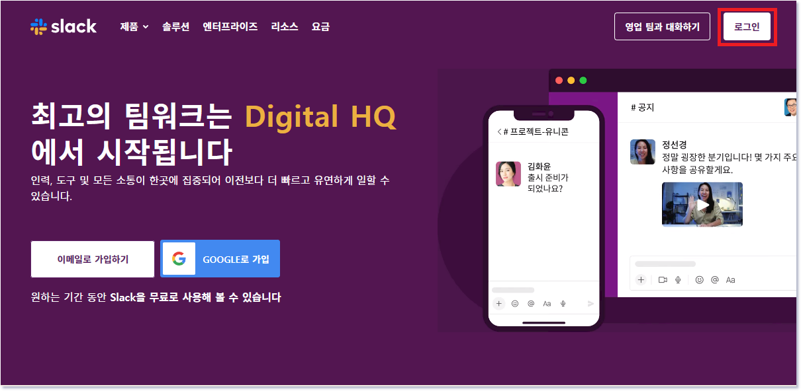

 

5-2-2. 수강생 각자의 e-mail 주소를 입력한다. 기존 실습용으로 사용하고 있는 Slack에 입력했던 e-mail과 동일한 주소를 사용한다.

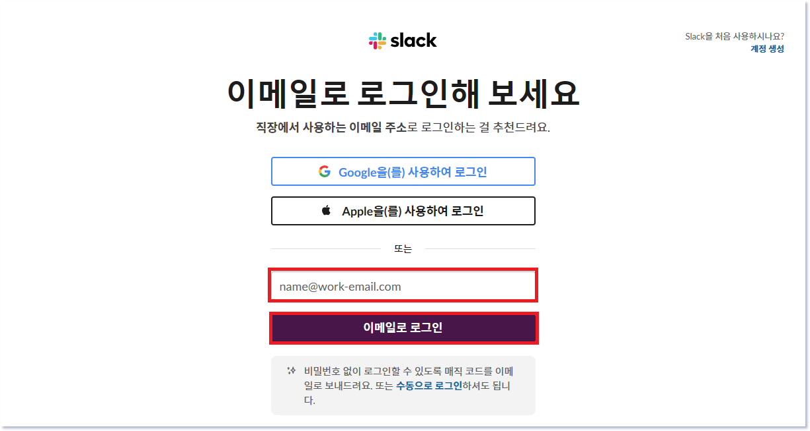

 

5-2-3. 입력한 e-mail 주소로 6자리의 인증 코드가 발급된다. 수신된 이메일을 확인하여 인증 코드를 입력해준다.

- 인증 코드 체크 화면

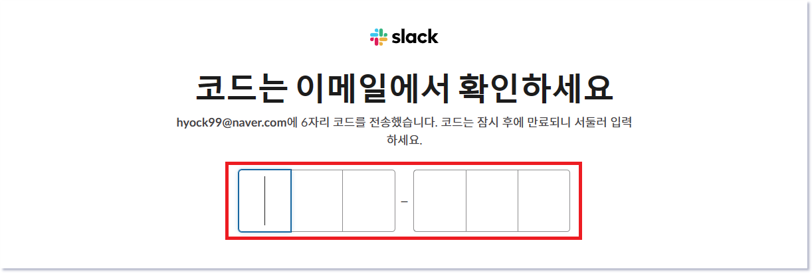

 

- 인증코드 수신 메일 예시

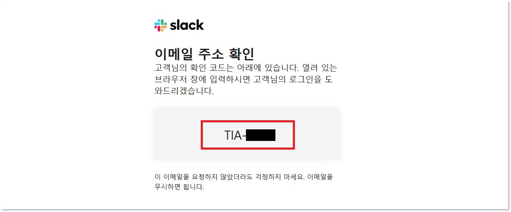

 

5-2-4. Slack Application에서 새로 생성된 Workspace의 정보를 입력할 수 있다.

- 로그인 후 `다른 워크스페이스 만들기` 버튼을 클릭한다.

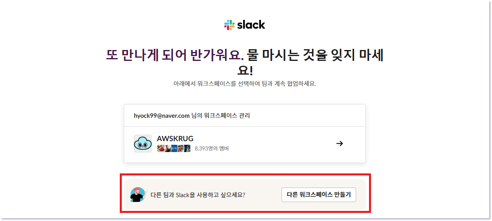

 

- 아래와 같이 필수사항(3 ~ 4개)에 체크하고 워크스페이스 생성을 클릭한다.

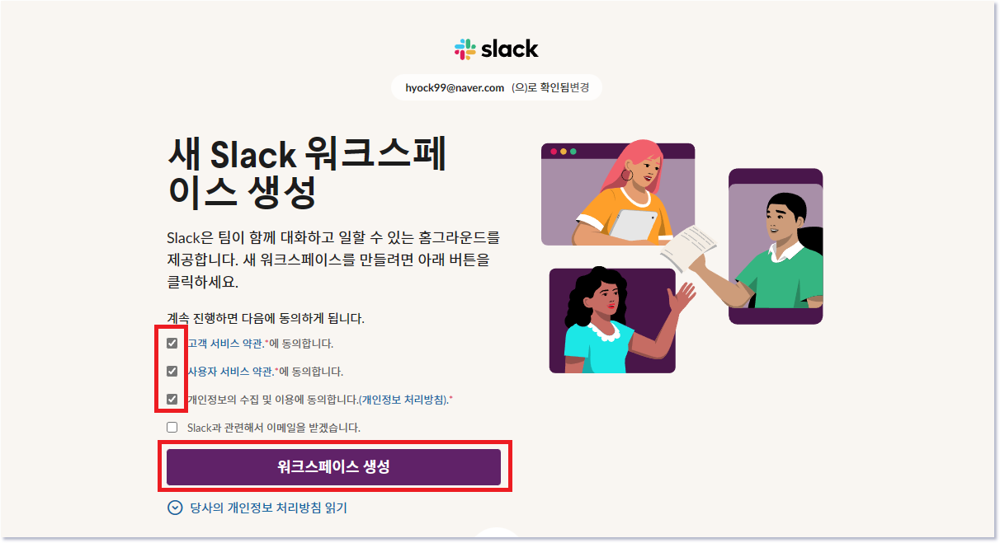

 

- Company 혹은 team의 이름을 입력하는 Step 1 이 보인다. 아래와 같이 입력 후 `다음` 버튼을 클릭한다.

>|항목|내용|액션|
>|---|---|---|
>➕ Workspace 이름 | `CTA-<<KNOX_ID>>` | ⌨️ 입력  ❗`<<KNOX_ID>>` 부분을 개인별 Knox ID 값으로 치환 |

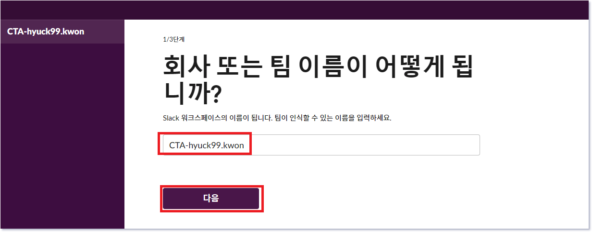

 

- Step 2에선 사용자 이름을 입력할 수 있다. 아래와 같이 입력 후 `다음` 버튼을 클릭한다.

>|항목|내용|액션|
>|---|---|---|
>➕ User 이름 | `<<KNOX_ID>>` | ⌨️ ❗`<<KNOX_ID>>` 부분을 개인별 Knox ID 값 입력 |

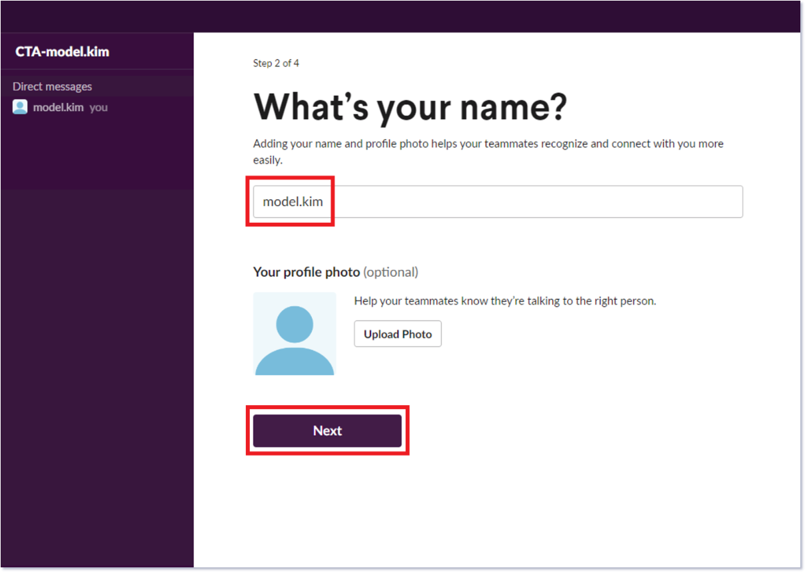

 

- Step 3에선 협업할 팀원을 초대할 수 있다. 하단의 `이 단계 건너뛰기`을 클릭하여 이번 과정은 생략한다.

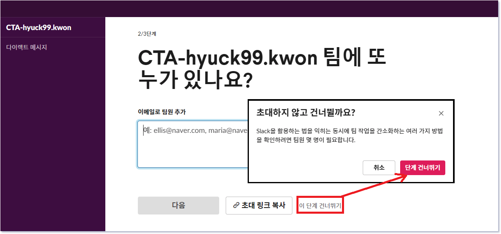

 

- Step 4에선 팀원과 소통할 수 있는 Channel name을 입력할 수 있다. 아래와 같이 입력 후 `다음` 버튼을 클릭한다.

>|항목|내용|액션|
>|---|---|---|
>➕ Channel name|`cta-alert`|🧲복사 & 📋붙여넣기|

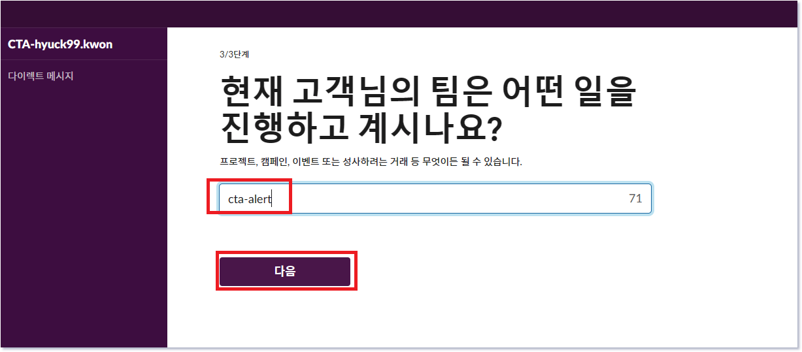

 

- Slack Application을 열 것인지 물어보는 팝업이 뜨면 `Open Slack` 버튼을 클릭해준다.

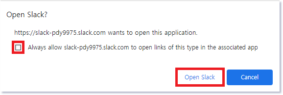

 

- 드디어 아래 그림과 같이 수강생 만의 Slack Workspace가 생성되었다.

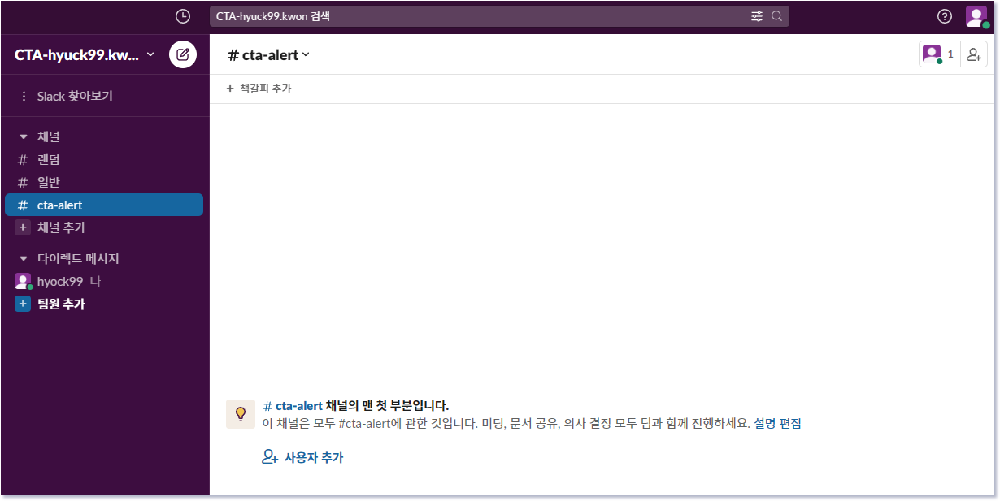

 

5-2-5. Workspace에 Webhook api를 보낼 수 있는 Slack Application을 생성해보자. 우선 아래 Slack api 홈페이지에 접속한다.

👉 접속 URL : <a href="https://api.slack.com" target="_blank">https://api.slack.com</a>

- slack api 웹 페이지 접속하여 `Create an app` 버튼 클릭한다.

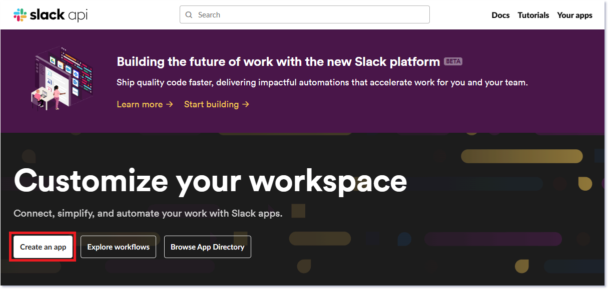

 

❗만약, 화면에 `Create an app` 버튼이 보이지 않는다면 아래와 같이 우측 상단의 `Your Apps` 버튼을 클릭하고 `Create your first app`을 누른다.

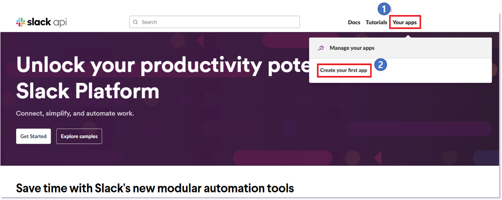

 

- Create an app 팝업이 뜨면 `From scratch`를 선택한다.

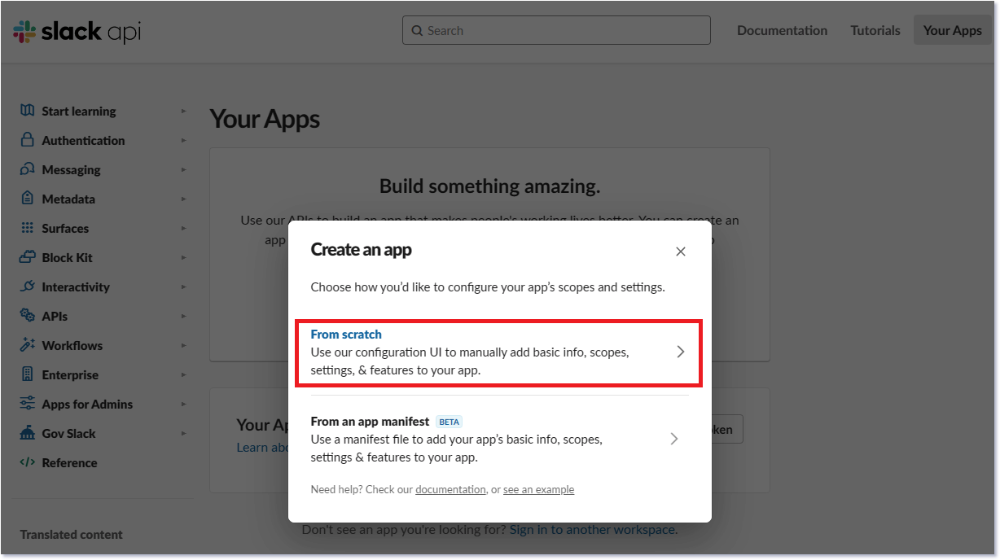

 

- App의 Name과 Workspace를 선택하는 팝업이 나타난다. 아래와 같이 입력 및 선택해주고 하단의 `Create App` 버튼을 클릭한다.

> |항목|내용|액션|
> |---|---|---|
> ➕ App Name  | `grafana` | 🧲복사 & 📋붙여넣기 |
> ➕ Workspace | `CTA-<<KNOX_ID>>` | 👆🏻셀렉트박스 선택 |
 

 

5-2-6. grafana라는 이름의 app이 생성되었다. 이제 App에 Webhook API를 수신 받을 수 있는 기능을 추가해보자.

- Basic Information 화면에서 `Incoming Webhooks` 버튼을 클릭한다.

 

- Activate Incoming Webhooks 우측의 `Off`를 `On`으로 토글해준다.

 

- 하단에 상세 설정을 추가해 줄 수있는 화면이 나타난다. `Add New Webhook to Workspace` 버튼을 클릭한다.

 

- grafana App이 Webhook API를 수신하여 게시할 Channel을 선택할 수 있다. 앞에서 Workspace를 생성할때 만들어준 `cta-alert` channel을 선택하여 `허용` 버튼을 클릭한다.

 

- 아래와 같이 Webhook API를 발송 할 수 있는 URL이 발급되었다. `Copy` 버튼을 클릭하여 복사 후 수강생 개인별 메모에 저장하자.

 

5-2-7. cta-alert channel에 grafana 이름의 integration이 추가되었다는 메세지를 확인할 수 있다.

 
 

---

### 5-3. Grafana와 Slack 연동하기

▶ Grafana에 Slack Webhook URL을 등록하여 Alerting 환경을 구성한다.

 

5-3-1. Grafana의 `Alerting` 메뉴에 접속한다.

 

5-3-2. `Alerting` 하위의 `Contact points` 메뉴에 접속한다.

 

5-3-3. `slack`의 `webhook`정보를 바탕으로 Contact point를 등록한다.

- `+ Add contact point` 버튼을 클릭한다.

 

- `Contact point` 정보를 아래와 같이 입력 후, `Test`버튼을 클릭한다.

> |항목|내용|
> |---|---|
> ➕ Name | `cta-slack` |
> ➕ Integration | `Slack` |
> ➕ Webhook URL | `5-1-6`에서 복사한 Slack Webhook URL 입력 |

 

- 아래와 같이 Test Alert을 수신했다면 성공적으로 연결된 것이다.

 

- `Save contact point` 버튼을 클릭하여 저장한다.

 

5-3-4. Grafana와 Slack은 연결되었다. `5-1`에서 설정한 `Alert`을 `Slack`에 전달하기 위한 설정을 진행해보자.

- `Notification policies` 메뉴에 접속한다.

 

5-3-5. Default policy에 `…` 아이콘을 클릭하여 `Edit` 메뉴를 선택한다.

 

5-3-6. 아래와 같이 정보를 입력하고 `Update default policy` 버튼을 클릭하여 저장한다.

>|항목|내용|액션|
>|---|---|---|
>➕ Default contact point|`cta-slack`|콤보박스 선택|
>➕ Group interval|`1m`|🧲복사 & 📋붙여넣기|
>➕ Repeat interval|`1m`|🧲복사 & 📋붙여넣기|

 
 

---

### 5-4. Rule 조정을 통해 Notification 발생시켜보기

5-4-1. Grafana의 `Alert rules` 메뉴에 접속하여 `5-1`에서 등록한 Alert을 수정해보자.

- `Edit`버튼 클릭

 

- Alert 발생을 위한 기준 값 변경

>|항목|내용|액션|
>|---|---|---|
>➕ IS ABOVE|`0`|🧲복사 & 📋붙여넣기|

 

- 우측 상단에 `Save rule and exit` 버튼을 클릭하여 저장한다.

 

5-4-2. 잠시 후, Alert의 State가 `Firing`이 된 것을 확인할 수 있다.

 

5-4-3. Slack 채널에서 수신된 Alert을 확인한다.

 
 

---

### 5-5. Alert의 내용 편집해보기

5-5-1. `Alerting` 하위의 `Contact points` 메뉴에 접속한다.

 

5-5-2. `Notification Templates` 탭을 클릭하여 `Add notification template` 버튼을 클릭한다.

 

5-5-3. Slack 메시지의 제목을 위해 아래와 같이 정보를 입력하고 `Save template` 버튼을 클릭하여 저장한다.

>|항목|내용|액션|
>|---|---|---|
>➕ Template name|`slack.title`|🧲복사 & 📋붙여넣기|
>➕ Content|{{ define "slack.title" }} {{ len .Alerts.Firing }} firing alerts, {{ len .Alerts.Resolved }} resolved alerts {{ end }}|🧲복사 & 📋붙여넣기|

 

5-5-4. Slack 메시지의 내용을 위해 아래와 같이 Template을 등록한다.

- `Notification Templates` 탭을 클릭하여 `Add notification template` 버튼을 클릭한다.

 

- 아래와 같이 정보를 입력하고 `Save template` 버튼을 클릭하여 저장한다.

>|항목|내용|액션|
>|---|---|---|
>➕ Template name|`slack.print_alert`|🧲복사 & 📋붙여넣기|
>➕ Content|{{ define "slack.print_alert" }} [{{.Status}}] {{ .Labels.alertname }} {{ if .Annotations -}} {{ range .Annotations.SortedPairs -}} {{ if eq .Name "summary" -}} Summary : {{ .Value }} {{ end -}} {{ end -}} {{ range .Annotations.SortedPairs -}} {{ if eq .Name "description" }} Description : {{ .Value }} {{ end }} {{ end -}} {{ end -}} {{- end }}|🧲복사 & 📋붙여넣기|

 

- `Notification Templates` 탭을 클릭하여 `Add notification template` 버튼을 클릭한다.

 

- 아래와 같이 정보를 입력하고 `Save template` 버튼을 클릭하여 저장한다.

>|항목|내용|액션|
>|---|---|---|
>➕ Template name|`slack.message`|🧲복사 & 📋붙여넣기|
>➕ Content|{{ define "slack.message" }} {{ if .Alerts.Firing -}} {{ len .Alerts.Firing }} firing alerts: {{ range .Alerts.Firing -}} {{ template "slack.print_alert" . -}} {{- end -}} {{- end }} {{ if .Alerts.Resolved -}} {{ len .Alerts.Resolved }} resolved alerts: {{ range .Alerts.Resolved -}} {{ template "slack.print_alert" .}} {{- end -}} {{- end -}} {{- end -}}|🧲복사 & 📋붙여넣기|

 

5-5-5. `cta-slack` 컨택포인트에 등록한 Template을 추가한다.

- `Contact points`에서 `cta-slack`를 확인하고, `Edit`버튼을 클릭한다.

 

- `Optional Slack settings`를 클릭하여 입력창을 활성화한다.

 

- 아래와 같이 정보를 입력하고 `Save contact point` 버튼을 클릭하여 저장한다.

>|항목|내용|액션|
>|---|---|---|
>➕ Title|`{{ template "slack.title" . }}`|🧲복사 & 📋붙여넣기|
>➕ Text Body|`{{ template "slack.message" . }}`|🧲복사 & 📋붙여넣기|

 

5-5-6. Slack 채널에서 변경된 제목과 내용으로 수신된 Alert을 확인한다.

 
 

---

### 5-6. Alert 삭제

5-6-1. 실습에 사용했던 `Alert rule`은 삭제한다.

 
 

😃 **Lab 5 완료!!!**

 

⏩ 다음 실습으로 [이동](4-6-Performance_Testing.md)합니다.