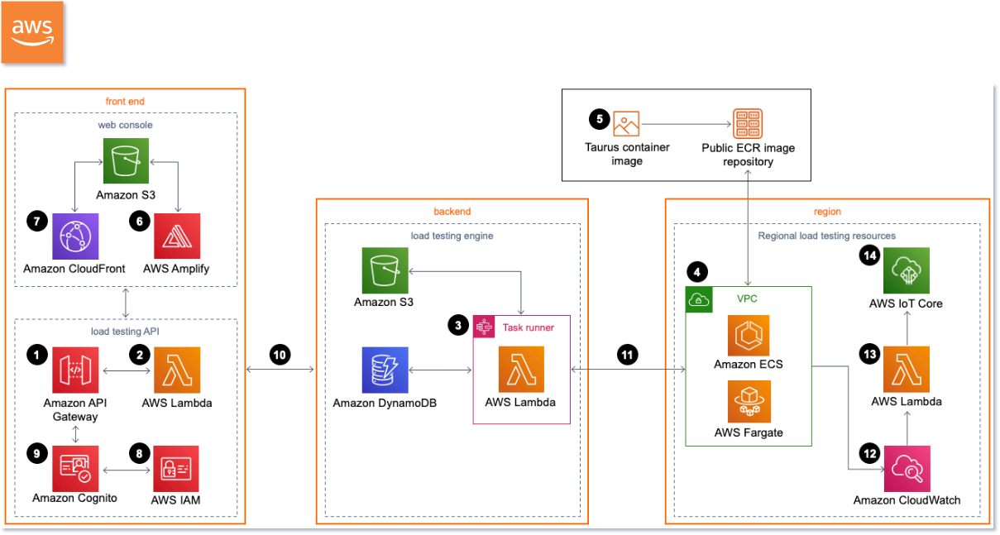
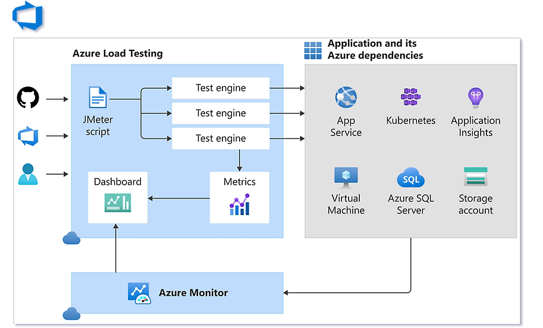
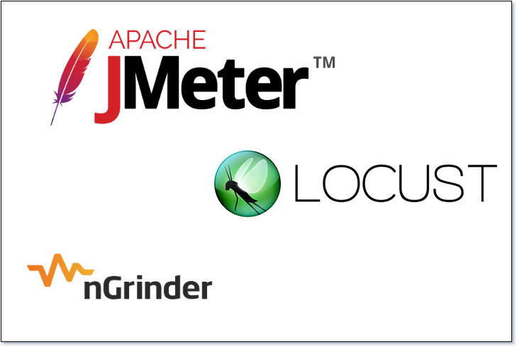
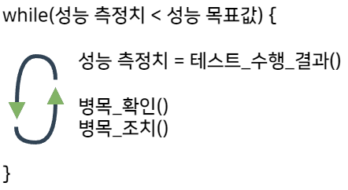
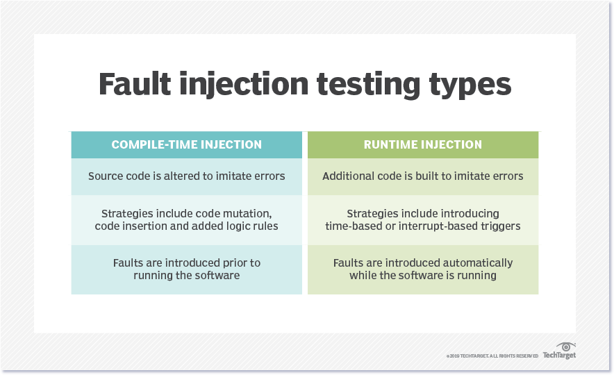
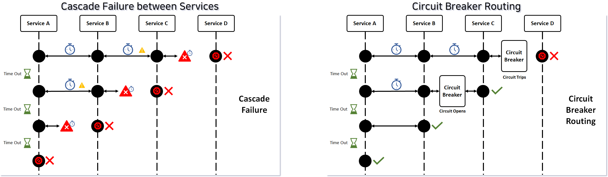

# 4일차 Observability
## Lab6. Monitoring stack을 활용한 성능테스트 실습

<br>

---
- [4일차 Observability](#4일차-observability)
  - [Lab6. Monitoring stack을 활용한 성능테스트 실습](#lab6-monitoring-stack을-활용한-성능테스트-실습)
    - [6-1. 성능테스트란?](#6-1-성능테스트란)
    - [6-2. 성능테스트 Tool을 설치하여 성능을 측정하고자 하는 API를 호출하기](#6-2-성능테스트-tool을-활용하여-성능을-측정하고자-하는-api를-호출하기)
---

ⓘ 실습목표 : 성능테스트를 수행해보고, Grafana에서 TPS, ResponseTime, 자원 리소스 등 주요지표들을 모니터링해본다.

---
### 6-1. 성능테스트란?

6-1-1. 성능테스트 정의

<div style="border: 4px solid gray; padding: 20px; text-align: center; font-weight: bold;">
시스템, 소프트웨어, 하드웨어 또는 네트워크 등의 성능을 측정하고 검증
<br>
특정 부하를 발생시켜 시스템의 반응 시간, 처리량, 안정성, 확장성 측정
</div>

<br>

6-1-2. 성능테스트 목적

> **성능테스트를 수행하여 시스템 운영 상태에서 나타날 수 있는 문제를 사전에 제거 및 튜닝하는 활동**

<br>

<span style="color: red; font-weight: bold;">?</span> 성능에 대한 고민들..

`Q1. 어느 정도의 사용자를 견딜 수 있는가?`<br>
`Q2. 서버/Application 등 병목이 생기진 않는가?`<br>
`Q3. 자원을 효율적으로 사용하는가?`<br>
`Q4. 메모리 누수, 오류는 발생하지 않는가?`<br>
`Q5. 최악의 상황에선 어떤 동작을 하는가?`<br>

<br>

6-1-3. 공동책임의 원칙


<br>

https://aws.amazon.com/ec2/instance-types/?nc1=h_ls
<br>
https://aws.amazon.com/cognito/pricing/?nc1=h_ls
<br>
https://aws.amazon.com/elasticache/pricing/?nc1=h_ls

<br>

6-1-4. 트렌드

- AWS, `Distributed load testing on AWS`(2020년 출시)



https://aws.amazon.com/ko/solutions/implementations/distributed-load-testing-on-aws/

<br>

- Azure, `Azure load testing`(2023년 출시)



https://azure.microsoft.com/ko-kr/products/load-testing/#overview

<br>

- SDS, `Performance Station`(2020년 출시)

- 기타



> **Apache JMeter** : Java기반의 테스팅 툴로, 가장 많은 사용경험을 보유한 오픈소스 소프트웨어이다.

> **Locust** : Python기반의 테스팅 툴로, 유연한 테스트 시나리오 작성이 가능하다.

> **nGrinder** : Jython(Java위에서 실행되는 Python)기반의 테스팅 툴로, Naver에서 개발했으며 웹과 Java 애플리케이션 테스트에 강점이 있다.

<br>

6-1-5. 주요 성능 지표

>|용어|내용|
>|---|---|
>|처리량(Throughtput)|- TPS : Transaction Per Seconds(초당 트랜잭션 처리량)<br>- TPM : Transaction Per Minutes(분당 트랜잭션 처리량)
>|동시사용자(Concurrent User)|- 특정시점에 시스템에 접속하여 시스템을 사용하는 사용자 수
>|응답시간(Response Time)|- 시스템에 요청 후 결과 응답을 받는 데 걸리는 시간
>|자원 사용률(Resource Usage)|- CPU 사용률(%)<br>- Memory 사용률(%)<br>- Network(Mbps)<br>- Disk I/O(Bytes/sec)

<br>

6-1-6. 성능 목표 수립(예제)

>|구분|목표 항목(단위)|목표치|
>|---|---|---|
>|처리량|목표 처리량(TPS)|100TPS|
>|가용성|성공률(%)|99%|
>|응답시간|평균응답시간(초)|1초|
>|효율성|자원 사용률(%)|80%|
>|안정성|테스트 유지 시간(시간)|12시간|
<br>



<br>

6-1-7. Chaos Engineering

> 실제 **운영 중인 시스템**에 **의도적으로 장애**를 일으켜서, **복원력을 확인하고 개선하는 분야**이고, 시스템 뿐 아니라 **각 조직(Human Resource)이 장애에 대응하는 훈련**까지 포함이 된 개념

<br>


> Ref : https://www.infoq.com/presentations/netflix-failure-multiple-regions/

👉 복잡한 분산환경 시스템에서 다양한 장애 상황을 예측하고 대응하기 위해 Chaos Engineering 개념이 탄생함.

<br>

6-1-8. Fault Injection & Circuit Breaker

> **Fault Injection** : 시스템이 오류를 처리하는 방식을 테스트하기 위해 의도적으로 오류나 예외 상황을 주입하는 테스트 기법

- Fault Injection 유형


<br>

- Compile Time Injection 예 : **Chaos Monkey**
<br>

- Run Time Injection 예 : **Istio**

<br>

> **Circuit Breaker** : MSA 아키텍처에서 자주 사용되는 설계 패턴 중 하나로, 시스템의 일부가 실패할 때 전체 시스템의 다운타임을 방지하는 역할을 수행

<br>


<br>

> Ref : https://digitalvarys.com/what-is-circuit-breaker-design-pattern/

<br>
<br>

---
### 6-2. 성능테스트 Tool을 활용하여 성능을 측정하고자 하는 API를 호출하기

▶ 본 Lab에서는 성능테스트 Tool로 Apache Bench를 사용한다.

Official Documents : https://httpd.apache.org/docs/2.4/ko/programs/ab.html

<br>

6-2-1. Cloud9의 Terminal에서 `apache bench`가 설치되었는지 확인 한다.

- `ab -h` 명령어를 입력하여 설치가 잘 되었는지 확인한다.

🧲 (COPY)
```bash
mspuser:~/environment $ ab -h
```

<br>

❗ (Option!!) `apache bench` 설치가 안되있다면 아래의 명령어로 설치를 진행한다.

🧲 (COPY)
```bash
mspuser:~/environment $ yum provides /usr/bin/ab
mspuser:~/environment $ sudo yum install httpd-tools
```

<br>

6-2-2. Grafana에 접속하여 `CTA Monitoring` 대시보드를 준비한다.


👉 부하발생에 따른 성능을 모니터링하기 위해 `Perf Monitoring`과 `Resource Monitoring` View를 활성화한다.

<br>

6-2-3. 다음의 명령어로 Grafana Pod에 부하를 발생시켜본다.

❗ `<<YOUR_DOMAIN>>`의 값은 수강생 개인별 Route53 click 도메인으로 수정한다.

🧲 (COPY & Modify)
```bash
mspuser:~/environment $ ab -n 40000 -c 1000 https://www.<<YOUR_DOMAIN>>/grafana
```

✔ **(수행코드/결과 예시)**
<details>
<summary>Click</summary>
This is ApacheBench, Version 2.3 <$Revision: 1879490 $><br>
Copyright 1996 Adam Twiss, Zeus Technology Ltd, http://www.zeustech.net/<br>
Licensed to The Apache Software Foundation, http://www.apache.org/<br>
<br>
Benchmarking cta.<<YOUR_DOMAIN>> (be patient)<br>
Completed 4000 requests<br>
Completed 8000 requests<br>
Completed 12000 requests<br>
Completed 16000 requests<br>
Completed 20000 requests<br>
Completed 24000 requests<br>
Completed 28000 requests<br>
Completed 32000 requests<br>
Completed 36000 requests<br>
Completed 40000 requests<br>
Finished 40000 requests<br>
<br>
<br>
Server Software:        istio-envoy<br>
Server Hostname:        cta.<<YOUR_DOMAIN>><br>
Server Port:            443<br>
SSL/TLS Protocol:       TLSv1.2,ECDHE-RSA-AES128-GCM-SHA256,2048,128<br>
Server Temp Key:        ECDH P-256 256 bits<br>
TLS Server Name:        cta.<<YOUR_DOMAIN>><br>
<br>
Document Path:          /grafana<br>
Document Length:        16 bytes<br>
<br>
Concurrency Level:      1000<br>
Time taken for tests:   133.660 seconds<br>
Complete requests:      40000<br>
Failed requests:        0<br>
Non-2xx responses:      40000<br>
Total transferred:      6880000 bytes<br>
HTML transferred:       640000 bytes<br>
Requests per second:    299.27 [#/sec] (mean)<br>
Time per request:       3341.499 [ms] (mean)<br>
Time per request:       3.341 [ms] (mean, across all concurrent requests)<br>
Transfer rate:          50.27 [Kbytes/sec] received<br>
<br>
Connection Times (ms)<br>
              min  mean[+/-sd] median   max<br>
Connect:        8 1562 523.1   1589    4777<br>
Processing:  1002 1743 367.8   1785    3447<br>
Waiting:        2  456 413.0    290    2175<br>
Total:       1323 3305 619.9   3344    6918<br>
<br>
Percentage of the requests served within a certain time (ms)<br>
  50%   3344<br>
  66%   3500<br>
  75%   3631<br>
  80%   3718<br>
  90%   3920<br>
  95%   4222<br>
  98%   4573<br>
  99%   4828<br>
 100%   6918 (longest request)<br>
</details>

<br>

6-2-4. Grafana에서 Graph의 변화를 확인해본다.


👉 부하가 발생함에 따라 POD의 리소스가 증가하고, TPS와 Response Time 또한 증가하는 것을 확인할 수 있다.

<br>

6-2-5. (실습)Opensearch Dashboard에 대한 성능테스트를 진행해본다.

<br>
<br>
<br>
<br>
<br>
<br>
<br>
<br>
<br>
<br>
<br>
<br>
<br>
<br>
<br>
<br>
<br>
<br>
<br>
<br>
<br>
<br>
<br>
<br>
<br>
<br>
<br>
<br>
<br>
<br>
<br>
<br>
<br>
<br>
<br>
<br>
<br>
<br>
<br>
<br>

- 다음의 명령어로 Opensearch Dashboard Pod에 부하를 발생시켜본다.

❗ `<<YOUR_DOMAIN>>`의 값은 수강생 개인별 Route53 click 도메인으로 수정한다.

🧲 (COPY & Modify)
```bash
mspuser:~/environment $ ab -n 40000 -c 1000 https://www.<<YOUR_DOMAIN>>/opensearch
```

<br>
<br>

😃 **Lab 6 완료!!!**