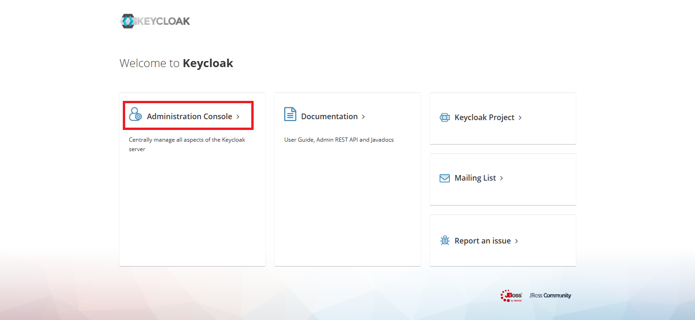
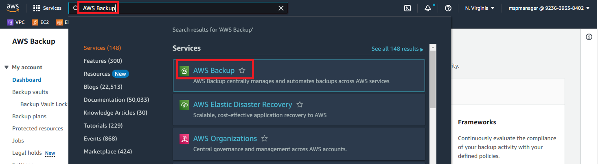
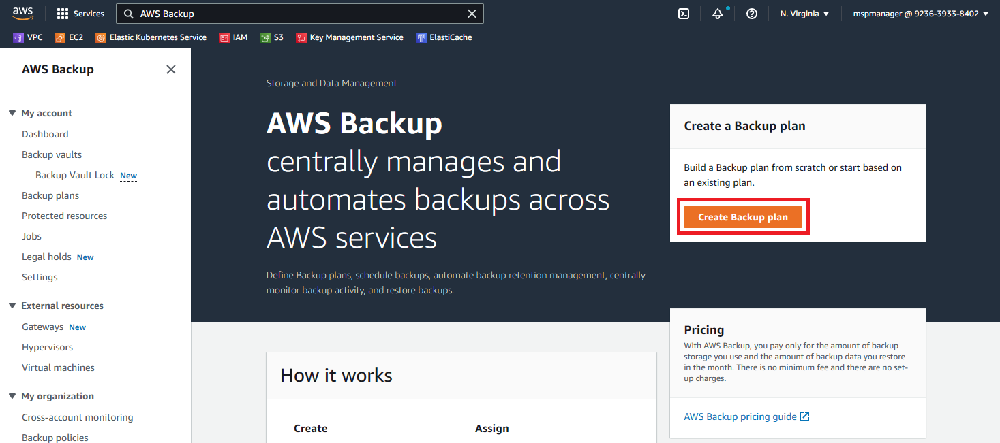
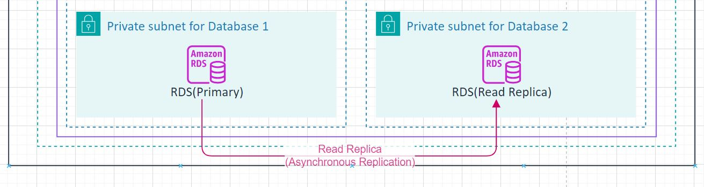

# 5일차 Availability
## Lab2. Backup and Restore

<br>

---
- [5일차 Availability](#5일차-availability)
  - [Lab2. Backup and Restore](#lab2-backup-and-restore)
    - [2-1. Point In Time Recovery 기능을 통한 복구](#2-1-point-in-time-recovery-기능을-통한-복구)
    - [2-2. AWS Backup을 통한 주기적인 Snapshot 등록 및 Cross Region Copy](#2-2-aws-backup을-통한-주기적인-snapshot-등록-및-cross-region-copy)
    - [2-3. Read Replica 생성](#2-3-read-replica-생성)
    - [2-4. Read Replica Promote](#2-4-read-replica-promote)
---

ⓘ 실습목표 : AWS 실습 환경에서 Backup 기능을 통한 Snapshot 저장과 저장된 Snapshot을 통한 Restore 작업을 수행한다.

---

✔️ **Backup의 종류**

- Continuous Backup (Point In Time Recovery)

> 지원 서비스 : RDS, DynamoDB, DocumentDB, Elasticache, S3

> 우발적인 쓰기 혹은 삭제 작업으로 부터 DATA를 보호할 수 있는 기능으로 특정 시점(최대 과거 35일까지 1초 단위)으로 원복할 수 있는 기능 제공

<br>

- Periodic full backup (Snapshot)

> 주기적으로 Database를 Full Backup하여 백업된 시점의 Data로 원복할 수 있음. 백업된 Snapshot은 기본적으로 자원이 위치하고 있는 동일 Region에 저장되며, DR을 목적으로 다른 Region으로 복제(Cross Region Copy)할 수 있음.

<br>

✔️ **Data 복구 시나리오**

- 만약 데이터 손상 혹은 유실이 발생된 경우, 보통 아래와 같은 순서로 복구를 시도한다.

1) Point In Time Recovery 기능을 통해 문제가 발생된 직전 시점으로 복구를 시도

2) 만약 이에 실패하거나, Point In Time Recovery 기능을 사용하지 못할 경우 동일한 Region에 주기적으로 백업된 Snapshot을 통해 복구를 시도

3) 만약 서비스 Region 단위의 장애(Fault)가 발생된 경우에는 Cross Region Copy 기능을 통해 DR Region으로 복제된 Snapshot을 통해 DR 복구를 시도

<br>

👉 Lab2.에선 AWS의 관리형 데이터 베이스 서비스인 RDS를 활용하여 2가지 Backup 기능을 실습해 볼 예정이다.

<br>
<Br>

---

### 2-1. Point In Time Recovery 기능을 통한 복구

2-1-1. Pipeline Catalog를 통해 생성한 mariadb RDS instance에는 이미 Continuous Backup 기능이 Enable 되어 있다. RDS 메뉴에서 직접 확인해보자.

- RDS > Databases 메뉴에서 `rds-cta-dev-kr` 이름의 rds를 클릭한다.


<br>

- `Maintenance & backups` 탭을 클릭한다.


<br>

- 아래 그림과 같이 `Backup` 항목에 `Automated backups` 기능이 `Enabled (1 Day)`로 켜져 있는 것을 확인할 수 있으며, 복구 가능한 가장 최신 시간이 언제인지 `Latest restore time` 항목에서 체크할 수 있다.


<br>

> 👉 RDS와 같은 Relational Database 서비스를 사용하는 경우 Continuous Backup(Automated Backup) 기능은 데이터 복구를 위해 가장 우선적으로 켜두어야 되는 기능임을 명심하자.

<br>

2-1-2. Point in Time Restore 기능을 통한 Data 복구시 데이터 유실 및 RPO(Recovery Point Object)를 체크해보기 위해 Lab1에서와 같이 Keycloak Database에 간단한 데이터를 입력해 볼 예정이다. 우선 Keycloak admin 페이지에 접속해보자.

- Keycloak admin 페이지에 접속하여 좌측의 `Administration Console` 을 클릭한다.

❗ `<<YOUR_DOMAIN>>`의 값은 수강생 개인별 Route53 click 도메인으로 수정한다.

🧲 (COPY & Modify)
```YAML
접속 URL : https://www.<<YOUR_DOMAIN>>/identity/connect/auth
```



<br>

- 아래와 같은 로그인 화면이 나타난다. Username/Password를 입력 후 `Sign in` 버튼을 클릭한다.

> |항목|내용|
> |---|---|
> ➕ Username | `keycloak` |
> ➕ Password | `keycloak` |


<br>

2-1-3. Master realm의 관리 화면에서 신규 User를 추가해보자.

- 관리 화면의 좌측 메뉴에서 Manage > `Users`를 클릭하고, Lookup 탭의 `View all users` 버튼을 클릭한다.


<br>

- `admin@samsung.com`과 `keycloak` 이란 Username을 갖는 User 2개가 등록되어 있는 것을 확인할 수 있다. 새로운 User를 등록해보자. 우측의 `Add user`를 클릭한다.


<br>

- Add User 화면이 나타난다. 아래와 같이 입력 후 `Save` 버튼을 클릭하여 저장한다.

> |항목|내용|
> |---|---|
> ➕ Username | backup@samsung.com |
> ➕ First Name | backup |
> ➕ Last Name | test |


<br>

- 저장이 완료되고 아래와 같이 저장된 시간이 `Created At` 항목에 보여진다. 이 시간을 잘 기억해두자. (아래 예시에선 10:21:03 AM 이다.)


<br>

- 이제 User List에 아래와 같이 3개의 User가 조회된다.


<br>

2-1-4. 방금 등록한 User Data는 쿼리를 통해서도 확인이 가능하다.

- BastionHost에 접속하여 mariadb RDS에 접속해보자.

```bash
mysql -h <<mariadb_endpoint>> -u admin -p
```

```bash
Enter Password: <<db_user_password>> 입력 (Default: password00!)
```

✔ **(수행코드/결과 예시)**

```bash
$ mysql -h db-t3-cta-kr.cuk8nlvrmbrg.ap-northeast-2.rds.amazonaws.com -u admin -p
Enter password:
Welcome to the MariaDB monitor.  Commands end with ; or \g.
Your MariaDB connection id is 82132
Server version: 10.6.14-MariaDB-log managed by https://aws.amazon.com/rds/

Copyright (c) 2000, 2018, Oracle, MariaDB Corporation Ab and others.

Type 'help;' or '\h' for help. Type '\c' to clear the current input statement.

mysql>
```

<br>

- keycloak의 data는 Keycloak Database에 저장되기 때문에 keycloak database를 사용하자.

```bash
use keycloak;
```

✔ **(수행코드/결과 예시)**
```bash
mysql> use keycloak;
Reading table information for completion of table and column names
You can turn off this feature to get a quicker startup with -A

Database changed
mysql>
```

<br>

- Select 쿼리를 통해 Realm의 User 데이터를 조회해보자. 결과적으로 3개의 row가 검색되고, 2-1-3 실습에서 입력했던 `backup@samsung.com`의 email을 갖는 User가 잘 등록되어 있음을 확인할 수 있다.

```bash
select * from USER_ENTITY;
```

```bash
mysql> select * from USER_ENTITY;
+--------------------------------------+-------+--------------------------------------+----------------+---------+-----------------+------------+-----------+----------+--------------------+-------------------+-----------------------------+------------+
| ID                                   | EMAIL | EMAIL_CONSTRAINT                     | EMAIL_VERIFIED | ENABLED | FEDERATION_LINK | FIRST_NAME | LAST_NAME | REALM_ID | USERNAME           | CREATED_TIMESTAMP | SERVICE_ACCOUNT_CLIENT_LINK | NOT_BEFORE |
+--------------------------------------+-------+--------------------------------------+----------------+---------+-----------------+------------+-----------+----------+--------------------+-------------------+-----------------------------+------------+
| 1b6e74b3-a8ab-4aac-97d0-9fbb47b4aaca | NULL  | 95d184d8-c59f-4333-b60d-c625a5302f2b |                |        | NULL            | backup     | test      | master   | backup@samsung.com |     1707787263552 | NULL                        |          0 |
| a63860bd-d6f6-430a-97bc-6ed960750d04 | NULL  | 7a3891fc-2c18-43f7-a0c1-97b47ee23ad2 |                |        | NULL            | NULL       | NULL      | master   | keycloak           |     1707377345808 | NULL                        |          0 |
| f6213263-103a-4690-a3f7-dd73acc5e330 | NULL  | e4d3997a-62f6-4169-b589-c8af3bb2dd15 |                |        | NULL            | samsung    | admin     | master   | admin@samsung.com  |     1707610127401 | NULL                        |          0 |
+--------------------------------------+-------+--------------------------------------+----------------+---------+-----------------+------------+-----------+----------+--------------------+-------------------+-----------------------------+------------+
3 rows in set (0.002 sec)
```

<br>

- mysql client 접속을 종료한다.

```bash
exit
```

✔ **(수행코드/결과 예시)**

```bash
mysql> exit
Bye
```

<br>

2-1-5. 이제 RDS의 Point in Time Recovery 기능을 통해 DB를 복구해보자. 만약 기존 DB instance에 데이터 손상 혹은 유실이 발생된 경우엔 아래와 같이 RDS UI에서 복구가 가능하다.

- RDS > Databases 메뉴에서 `rds-cta-dev-kr` 이름의 rds를 클릭하고


<br>

- 상세 화면에서 우측의 `Actions` 버튼을 클릭하고 `Restore to point in time`을 선택한다.


<br>

- Resore to point in time 화면에서 상세 설정을 할 수 있다. 다음 내용을 입력 및 수정 후 하단의 `Restore to point in time` 버튼을 클릭하여 복구 DB를 생성해주자.

**입력 및 수정 값**

> |항목|내용|
> |---|---|
> ➕ DB instance identifier | `keycloak-pitr` |
> ➕ Multi-AZ deployment | `Do not create a standby instance` 선택 |
> ➕ Enable storage autoscaling | 체크 해제 |
> ➕ DB parameter group | `rds-cta-dev-kr-<<random variable>>` 선택 |
그 외의 설정은 모두 default 상태로 변경 없이 저장

<br>

> ❗❗아래 그림 중 상단의 `Latest restorable time` 을 확인해보자. 2-1-3 실습에서 신규 User 데이터를 입력해준 시간 이후 인지를 확인해보고, 만약 그 이전 시간이면 잠시 대기 후 다시 Restore를 시도해보자.

> 일반적으로 AWS는 5분 이내의 지연 시간으로 로그를 백업한다.


<br>

<br>

<br>

<br>


<br>

- 아래 그림과 같이 새로운 Database가 새로 생성되고 있는 것을 확인할 수 있다. 이와 같이 Backup을 통한 Restore를 수행하는 경우 기존 Database와는 다른 새로운 DB instance가 생성된다.


<br>

- 복구가 완료되어 새로 생성된 db instance에 접속할 수 있기 까지는 <span style="color:red">대략 15 ~ 20분</span> 정도가 소요된다. 아래 그림과 같이 Status가 `Available` 상태로 변경된 것을 확인한다.


<br>

- DB 이름 클릭 후 Connectivity & security 탭메뉴에서 접속가능한 Endpoint 정보를 확인할 수 있다.

>
> **📌 새로 생성된 endpoint 메모**
>
>  ➕ *<<restored_mariadb_endpoint>>* :
>


<br>

2-1-6. 복구된 DB에 mysql client로 접속하여 2-1-3 실습에서 입력했던 User Data가 잘 복구되었는지 확인해보자.

- BastionHost에 접속하여 mariadb RDS에 접속해보자.

```bash
mysql -h <<restored_mariadb_endpoint>> -u admin -p
```

```bash
Enter Password: <<db_user_password>> 입력 (Default: password00!)
```

✔ **(수행코드/결과 예시)**
```bash
$ mysql -h <<restored_mariadb_endpoint>> -u admin -p
Enter password:
Welcome to the MariaDB monitor.  Commands end with ; or \g.
Your MariaDB connection id is 82132
Server version: 10.6.14-MariaDB-log managed by https://aws.amazon.com/rds/

Copyright (c) 2000, 2018, Oracle, MariaDB Corporation Ab and others.

Type 'help;' or '\h' for help. Type '\c' to clear the current input statement.

mysql>
```

<br>

- keycloak database로 변경 후, Select 쿼리를 통해 User 데이터를 조회해보자.

```bash
use KeycloakDb;
```

```bash
select * from USER_ENTITY;
```

```bash
mysql> select * from USER_ENTITY;
+--------------------------------------+-------+--------------------------------------+----------------+---------+-----------------+------------+-----------+----------+--------------------+-------------------+-----------------------------+------------+
| ID                                   | EMAIL | EMAIL_CONSTRAINT                     | EMAIL_VERIFIED | ENABLED | FEDERATION_LINK | FIRST_NAME | LAST_NAME | REALM_ID | USERNAME           | CREATED_TIMESTAMP | SERVICE_ACCOUNT_CLIENT_LINK | NOT_BEFORE |
+--------------------------------------+-------+--------------------------------------+----------------+---------+-----------------+------------+-----------+----------+--------------------+-------------------+-----------------------------+------------+
| 1b6e74b3-a8ab-4aac-97d0-9fbb47b4aaca | NULL  | 95d184d8-c59f-4333-b60d-c625a5302f2b |                |        | NULL            | backup     | test      | master   | backup@samsung.com |     1707787263552 | NULL                        |          0 |
| a63860bd-d6f6-430a-97bc-6ed960750d04 | NULL  | 7a3891fc-2c18-43f7-a0c1-97b47ee23ad2 |                |        | NULL            | NULL       | NULL      | master   | keycloak           |     1707377345808 | NULL                        |          0 |
| f6213263-103a-4690-a3f7-dd73acc5e330 | NULL  | e4d3997a-62f6-4169-b589-c8af3bb2dd15 |                |        | NULL            | samsung    | admin     | master   | admin@samsung.com  |     1707610127401 | NULL                        |          0 |
+--------------------------------------+-------+--------------------------------------+----------------+---------+-----------------+------------+-----------+----------+--------------------+-------------------+-----------------------------+------------+
3 rows in set (0.002 sec)
```
<br>

👉 결과적으로 3개의 row가 검색되고, 2-1-3 실습에서 입력했던 `backup@samsung.com`의 email을 갖는 User가 잘 등록되어 있음을 확인할 수 있다.
<br>
👉 데이터 복구가 성공적으로 되었다.

<br>

- mysql client 접속을 종료한다.

```bash
exit
```

✔ **(수행코드/결과 예시)**

```bash
mysql> exit
Bye
```

<br>

2-1-7. 지금까지 RDS의 Point in Time Recovery 기능을 통한 Database 복구 실습을 수행해봤다. 복구된 Database는 더 이상 사용하지 않을 예정이니 삭제해주도록 하자.

- RDS > Database 메뉴에서 `keycloak-pitr` db를 체크한 다음 `Actions` 버튼을 클릭 후 `Delete`를 선택한다.


- 팝업에서 다음과 같이 체크 및 입력하고 `Delete` 버튼을 클릭한다.

> |항목|내용|
> |---|---|
> ➕ Create final snapshot | 체크 해제 |
> ➕ Retain automated backups | 체크 해제 |
> ➕ acknowledge | 체크 |
> ➕ 확인 입력창 | `delete me` 입력 |
<br>


<br>

- 아래와 같이 복구 DB가 `Deleting` 상태로 변경된 것을 확인할 수 있다. 잠시 뒤, 새로고침을 해보면 DB가 삭제되어 리스트에서 사라지게 된다.


<br>
<br>

---

### 2-2. AWS Backup을 통한 주기적인 Snapshot 등록 및 Cross Region Copy

> 방금 실습해본 Point In Time Recovery는 강력한 Backup & Restore 기능이지만, DR 전략으로서 다른 Region에 Copy 할 수 있는 기능은 제공하고 있지 않다.

> 이를 위해서는 Backup 전략 중 주기적인 Full Backup(Snapshot) 및 Cross Region Copy 기능을 활용해야 하며, AWS에는 이와 같은 Backup을 중앙에서 관리할 수 있는 관리형 서비스인 `AWS Backup`을 제공하고 있다.

> 지금부터는 AWS Backup 서비스를 통해 Snapshot을 생성하고 이를 DR Region에 복제하는 실습을 수행해보자.

<br>

2-2-1. AWS Console 상단에서 Backup으로 검색하여 `AWS Backup` 서비스에 접속한다.

- AWS Backup 서비스 검색하여 상단의 `AWS Backup`을 선택한다.



<br>

- AWS Backup 초기 화면에서 우측 상단의 `Create Backup plan` 버튼을 클릭한다.



<br>

2-2-2. 주기적인 Backup을 수행하기 위한 Plan을 작성해보자.

- AWS에서 미리 작성해놓은 Template을 사용할 수 있는 option이 선택되어 있지만, 본 실습에서는 새로운 Plan을 직접 만들어 볼 예정이다. 가운데 옵션인 `Build a new plan`을 체크하고, 새로운 Backup Plan의 설정 아래와 같이 name을 입력한다.

- Backup frequency 항목에서는 Backup 주기를 정할 수 있다. 시간별/12시간별/일별/주별/월별 등 다양한 주기를 설정 가능하며, 본 실습에서는 `Every 12 hours`를 선택하여 12시간 마다 Backup이 수행되도록 설정한다.

> |항목|내용|
> |---|---|
> ➕ Backup plan name | `cta-backup-plan` |
> ➕ Backup rule name | `cta-backup-rule` |
> ➕ Backup frequency | `Every 12 hours` 선택 |
<br>


<br>

- 주기 설정 바로 아래에는 앞서 2-1 실습에서 경험해봤던 PITR 설정(Continuous backup)을 Enable 할지 선택할 수 있다. 체크해주도록 하자. 또한 Retention period는 `1`로 입력하여 1일간 백업을 유지하도록 설정해주자.

> |항목|내용|
> |---|---|
> ➕ Enable continuous backups (PITR) | 체크박스 체크 |
> ➕ Retention period | `1` 입력 |
<br>


<br>

- Copy to destination에서 백업된 Snapshot을 다른 지역으로 복제할 수 있는 기능(Cross Region Copy)을 선택할 수 있다. 본 실습에서는 DR Region으로 `Asia Pacific (Osaka)`을 선택한다. 나머지 설정은 모두 deafult 값으로 두고 하단의 `Create plan` 버튼을 클릭한다.

```
Copy to destination : Asia Pacific (Osaka) 선택
```

> Osaka에 권한이 없는 경우 `US East (N.Virginia)`를 선택합니다.


<br>


<br>

2-2-3. 생성된 Backup plan에 연결할 자원을 지정할 수 있는 화면이 나타난다. 우선 RDS의 mariadb database를 연결해주도록 하자.

- 아래와 같이 입력 및 선택 후 하단의 `Assign Resources` 버튼을 클릭한다.

> |항목|내용|
> |---|---|
> ➕ Resource assignment name | cta-backup-rds |
> ➕ Include specific resource types | 선택 |
> ➕ Resource type | RDS 선택 |
> ➕ Database names | `rds-cta-dev-kr` 체크 |
<br>


<br>


<br>

2-2-4. 새로운 Backup Plan이 생성되었다. 현재는 해당 Plan으로 RDS DB만 백업되도록 설정되어 있다. 여기에 다른 AWS 자원도 추가 연결해보자. EFS 자원(Elastic File System)도 Backup Plan에 포함해보자.

- Resource assignments 우측의 `Assign resources` 버튼을 클릭한다.


<br>

- 아래와 같이 입력 및 선택 후 하단의 `Assign Resources` 버튼을 클릭한다.

> |항목|내용|
> |---|---|
> ➕ Resource assignment name | `cta-backup-efs` |
> ➕ Include specific resource types | 선택 |
> ➕ Resource type | EFS 선택 |
> ➕ File system IDs | `efs_cta_dev_kr` Volume ID 선택 |
<br>


<br>


<br>

2-2-5. 이제 생성된 Backup Plan에 총 2개의 AWS 자원(RDS, EFS)이 연결되었다. Backup Rule에 지정된 규칙(12시간 주기, 백업 Snapshot Oregon Region으로 복제)으로 Snapshot이 생성될 것이다.


<br>

2-2-6. Backup Plan으로 인해 Snapshot 이 생성된 자원의 리스트는 AWS Backup 서비스의 좌측 `Protected resources` 에서 확인할 수 있다. 현재는 막 Backup Plan이 생성된 상태이기 때문에 Backup으로 보호된 자원이 없는 걸 확인할 수 있다. Backup 서비스에선 주기적으로 동작하는 Backup Plan과 상관없이 수동으로 즉시 백업 Snapshot을 생성할 수도 있다.

- 우측 상단의 `Create on-demand backup`을 클릭한다.


<br>

- Create on-demand backup 팝업이 나타난다. 아래와 같이 입력 및 선택 후 하단의 `Create on-demand backup` 버튼을 클릭한다.

> |항목|내용|
> |---|---|
> ➕ Resource Type | RDS 선택  |
> ➕ Database name | rds-cta-dev-kr 선택 |
> ➕ Retention period| Days 선택, 1 입력  |
<br>


<br>

2-2-7. Jobs 화면으로 이동되고, 해당 화면에서 백업/복제/복구 등의 다양한 Backup과 관련된 작업의 현황과 이력을 확인할 수 있다.

-  Backup job이 하나 Created -> Running 되고 있음을 확인할 수 있다.


<br>

- <span style="color:red">대략 5분</span> 정도 후에 상태가 `Completed`로 변경되어 작업이 완료된다.


<br>

> Vault Official :<br>
https://developer.hashicorp.com/vault/docs?product_intent=vault
<br>
https://developer.hashicorp.com/vault/docs/platform/k8s/injector-csi#vault-sidecar-agent-injector

<br>

2-2-8. 생성된 백업 Snapshot은 Backup Valut에 저장되며, Backup > Backup vaults 메뉴에서 `default` vault를 클릭하여 상세 정보 확인이 가능하다. 생성된 Snapshot을 다른 지역으로 복제해보자.


<br>

- Recovery points 항목 리스트에서 방금 on-demand 기능으로 수동 백업된 복구 포인트를 확인할 수 있다. 해당 ID를 체크해주고 우측 상단의 Actions를 눌러 `Copy`를 클릭한다.


<br>

- 아래와 같이 선택 후 하단의 `Copy` 버튼을 클릭한다.

```
Copy to destination : Asia Pacific (Osaka) 선택
```


<br>


<br>

2-2-9. Jobs 화면으로 이동된다.

- Copy job이 1개 `Created` 상태로 생성된 것을 확인할 수 있다.


<br>

- <span style="color:red">대략 5~8분</span> 정도 후에 상태가 `Completed`로 변경되어 작업이 완료된다.


<br>

- 완료된 Job을 클릭해보면 아래와 같은 Detail 정보를 확인할 수 있으며, Seoul Region이 Source, Osaka Region이 Destination으로 설정되어 있음을 확인 가능하다. Destination Backup vault의 `Default`를 클릭해보자.


<br>

2-2-10. 브라우저의 새 탭으로 Osaka 지역의 AWS Backup > Backup vaults > Default 상세화면이 나타난다.

- 중간의 Recovery points에 Seoul Region으로 부터 복제된 mariadb Snapshot 정보가 리스트에 보여지며, 이를 체크하고 Actions > Restore를 클릭하여 Osaka 지역에 MariaDB RDS Database를 생성해 줄 수 있다.


<br>

- 아래 그림과 같이 Restore Backup 화면에서 정보를 입력 및 선택하면 복구 DB 생성이 가능하다.


> 다만, RDS DB 복구는 2-1. 실습에서 이미 진행해보았으며 <span style="color:red">대략 15 ~ 20분</span> 정도가 소요되기 때문에 이번에는 생략하도록 하겠다.

<br>

2-2-11. 참고로 하루가 지난 후 확인해보면 아래 그림과 같이 Backup Window Time(한국시간 기준 새벽 02:00)에 정상적으로 Backup이 수행된 것을 확인할 수 있다.

- Seoul Region의 Default Backup vault 상세 정보를 보면 3개의 Recovery point가 추가된 것을 볼 수 있다. 특히 RDS의 경우엔 PITR을 지원하기 때문에 Backup Type이 `Continuous` 인 것을 확인 가능하다.


<br>

- 복제 대상 Region인 Osaka Region의 Default Backup vault 상세 정보를 보면 마찬가지로 3개의 Recovery point가 추가된 것을 볼 수 있다. Cross Region Copy는 Full Backup(Snapshot)만 가능하기 때문에 RDS도 `Continuous` Type이 아닌 `Snapshot` Type 인 것을 확인 가능하다.


<br>
<br>

---

### 2-3. Read Replica 생성

▶ RDS의 MariaDB Databaes의 읽기 전용 복제본(Read Replica)을 생성하는 실습을 진행한다. 본 실습은 수강생의 이해를 돕기 위해 AWS Console에서 진행할 예정이다.



<br>

2-3-1. AWS Console에서 RDS 서비스로 이동하고 좌측 메뉴에서 Databases를 선택한다. 리스트에서 설치된 MariaDB 를 클릭한다. 우측 상단의 `Actions` 버튼을 클릭하고 `Create read replica`를 선택한다.


<br>

2-3-2. 읽기 전용 복제본(Read replica)을 생성하기 위한 상세 정보를 입력할 수 있는 화면으로 이동한다. 각 항목별로 아래와 같이 입력하고 최종적으로 하단의 `Create read replica` 버튼을 클릭한다. 참고로 아래 안내되지 않은 항목의 값은 default로 선택 및 입력되어 있는 값을 그대로 사용하면 된다.

> |분류|항목|내용|액션|
> |---|---|---|---|
> ➕ Settings | DB instance identifier | `mariadb-cta-dev-kr` | 🧲복사 & 📋붙여넣기 |
> ➕ Storage | Storage autoscaling | `Enable storage autoscaling` | ✅체크박스 해제 |
> ➕ Availability & Durability| Multi-AZ deployment | `Do not create a standby instance` | 👆🏻라디오버튼 선택 |
> ➕ Additional configuration | Performance Insights | `Turn on Performance Insights` | ✅체크박스 해제 |
- 그 외 항목 : default 값 그대로 사용
<br>


<br>

<br>

<br>


<br>

2-3-3. 아래와 같이 MariaDB의 상태가 Modifying으로 보여지고, 상단에 `Creating replica mariadb-cta-dev-kr in Asia Pacific (Seoul)` 라는 안내 문구를 확인할 수 있다.


<br>

2-3-4. <span style="color:red">대략 20분</span> 정도 지난 후 아래와 같이 읽기 전용 복제본 생성이 완료되고, 사용할 수 있는 상태가 된다.

- DB 상태가 `Available`로 변경되었으며, Role 항목에 `Primary`로 변경된 것을 확인할 수 있다.
<br>

- Replica DB 상태 역시 `Available`로 변경되었으며, Role 항목은 `Replica`로 설정된 것을 확인할 수 있다.


<br>

2-3-5. `mariadb-cta-dev-kr` 을 클릭하여 상세 정보를 확인해보자. Connectivity & Security 항목에서 접속할 수 있는 `Endpoint`를 확인할 수 있다.


<br>
<br>

---

### 2-4. Read Replica Promote

▶ Service 장애가 발생했을 때, Database 자원의 우선 순위를 넘겨주는 Promote 작업을 수행해줘야 한다. Promote 작업을 수행해보자.

<br>

2-4-1. Role이 `Replica`인 데이터베이스를 선택하고, 우측 상단의 `Actions`를 클릭 후 `Promote` 를 선택한다.


<br>

2-4-2. 읽기 전용 복제본을 Primary Database로 만들어 줄 수 있는 Promote read replica 화면이 나타난다. 별다른 수정없이 하단의 `Promote read replica` 버튼을 클릭한다.


<br>

2-4-3. 아래 그림과 같이 `Modifying` 상태로 변경된 것을 확인할 수 있다.


<br>

2-4-4. 대략 5분 정도 뒤에 Status가 `Available`로 바뀌고, Role이 `Replica`에서 `instance`로 변경된 것을 확인할 수 있다.


<br>

> 👉 RDS의 Promote가 완료되었다. Database가 Read/Write가 가능한 단독의 DB Instance로 활용될 수 있다.

<br>
<br>

😃 **Lab 2 완료!!!**