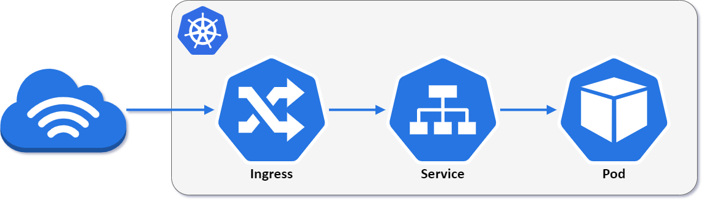
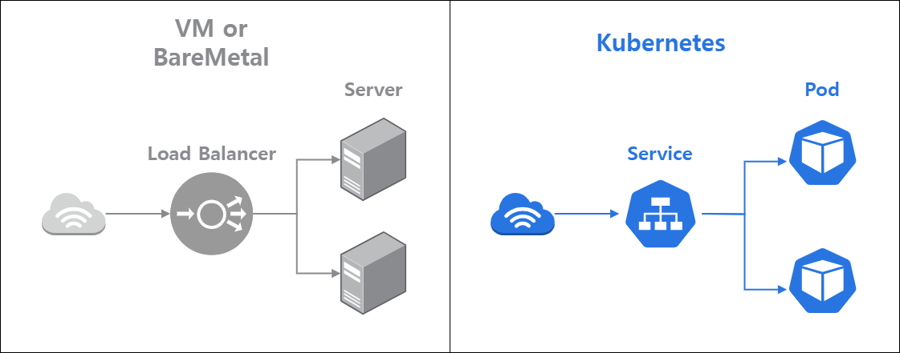
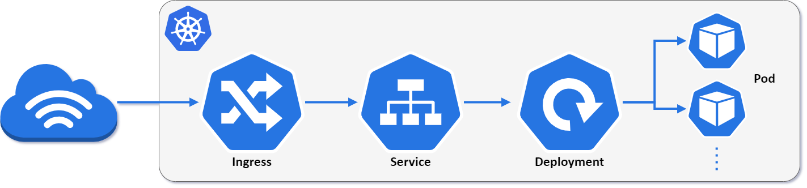
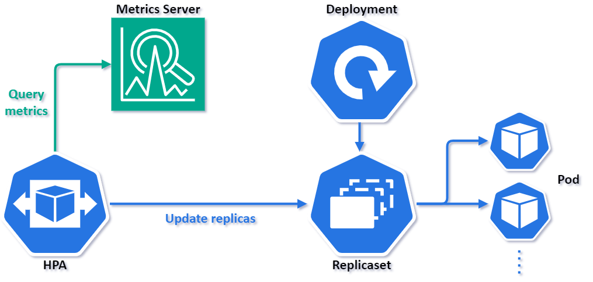

# 5일차 Availability
## Lab3. Kubernetes Replicas을 활용한 POD 가용성 실습

<br>

---
- [5일차 Availability](#5일차-availability)
  - [Lab3. Kubernetes Replicas을 활용한 POD 가용성 실습](#lab3-kubernetes-replicas을-활용한-pod-가용성-실습)
    - [3-1. POD 실행해보기](#3-1-pod-실행해보기)
    - [3-2. 동일 POD를 복제해서 실행해보기](#3-2-동일-pod를-복제해서-실행해보기)
    - [3-3. Deployment를 활용하여 POD 배포해보기](#3-3-deployment를-활용하여-pod-배포해보기)
    - [3-4. HPA(Horizontal Pod Autoscaler) 적용해보기](#3-4-hpahorizontal-pod-autoscaler-적용해보기)
---

ⓘ 실습목표 : 성능테스트를 수행해보고, Grafana에서 TPS, ResponseTime, 자원 리소스 등 주요지표들을 모니터링해본다.

---

### 3-1. POD 실행해보기



👉 Kubernetes에서 인스턴스(App)을 실행하여 서비스를 하기 위한 기본적인 구성이다.

<br>

3-1-1. Cloud9에서 실행하여 실습용 디렉토리 생성

- Terminal에서 실습용 디렉토리 생성

```bash
cd ${HOME}/environment
```

```bash
mkdir k8s-replicas
```

```bash
cd k8s-replicas
```

<br>

✔ **(수행코드/결과 예시)**

```bash
mspuser:~/environment $ mkdir k8s-replicas
mspuser:~/environment $ cd k8s-replicas
mspuser:~/environment/k8s-replicas $
```

<br>

3-1-2. 테스트를 위한 nginx yaml 정의

- Cloud9 왼쪽의 EXPLORER 에서 k8s-replicas 폴더 우클릭 후 > New Files를 누른다.


<br>

- 파일명은 `nginx.yaml`로 입력하고 엔터를 누른다.


<br>

- 아래 내용을 그대로 복사하여 파일 내용에 붙여넣고 "Ctrl+S"를 눌러 저장한다.

🧲 (COPY)
```yaml
apiVersion: networking.istio.io/v1alpha3
kind: VirtualService
metadata:
  name: nginx
spec:
  hosts:
  - "*"
  gateways:
  - istio-system/istio-gateway
  http:
  - match:
    - uri:
        prefix: /
    rewrite:
      uri: /
    route:
    - destination:
        host: nginx
        port:
          number: 80
---
apiVersion: v1
kind: Service
metadata:
  name: nginx
  labels:
    app: nginx
spec:
  ports:
  - port: 80
    name: nginx
  selector:
    app: nginx
---
apiVersion: v1
kind: Pod
metadata:
  name: nginx
  labels:
    app: nginx
spec:
  containers:
  - name: nginx
    image: nginx:latest
    imagePullPolicy: IfNotPresent
```

<br>

3-1-3. nginx.yaml을 배포한다.

- nginx.yaml 배포

```bash
kubectl apply -f nginx.yaml
```

✔ **(수행코드/결과 예시)**

```bash
mspuser:~/environment/k8s-replicas $ kubectl apply -f nginx.yaml
virtualservice.networking.istio.io/nginx created
service/nginx created
pod/nginx created
```

<br>

- 배포된 pod 상태 확인

```bash
kubectl get pods
```

✔ **(수행코드/결과 예시)**

```bash
mspuser:~/environment/k8s-replicas $ kubectl get pods
NAME                    READY   STATUS    RESTARTS   AGE
nginx                   1/1     Running   0          2m50s
```

<br>

3-1-4. Nginx가 잘 작동하는지 웹페이지를 통해 접속해본다.

❗ `<<YOUR_DOMAIN>>`의 값은 수강생 개인별 Route53 click 도메인으로 수정한다.

🧲 (COPY & Modify)
```yaml
접속 URL : https://www.<<YOUR_DOMAIN>>/
```

<br>

- 아래와 같은 화면이 나타나면 Nginx가 정상 작동하는 것이다.


<br>

3-1-5. Nginx Pod를 강제 종료시킨다.

- nginx pod 삭제

```bash
kubectl delete pod nginx
```

✔ **(수행코드/결과 예시)**

```bash
mspuser:~/environment/k8s-replicas $ kubectl delete pod nginx
pod "nginx" deleted
```

<br>

3-1-6. Nginx가 잘 작동하는지 웹페이지를 통해 접속해본다.

❗ `<<YOUR_DOMAIN>>`의 값은 수강생 개인별 Route53 click 도메인으로 수정한다.

🧲 (COPY & Modify)
```yaml
접속 URL : https://www.<<YOUR_DOMAIN>>/
```

<br>

- `no healthy upstream`이라는 메시지가 확인되면서 Nginx가 정상 상태가 아님을 확인할 수 있다.


<br>

3-1-7. 테스트에 사용한 리소스를 삭제한다.

```bash
kubectl delete -f nginx.yaml
```

✔ **(수행코드/결과 예시)**

```bash
mspuser:~/environment/k8s-replicas $ kubectl delete -f nginx.yaml
virtualservice.networking.istio.io "nginx" deleted
service "nginx" deleted
pod "nginx" deleted
```

<br>
<br>

---

### 3-2. 동일 POD를 복제해서 실행해보기

<br>



👉 동일한 역할을 수행하는 인스턴스를 여러개 실행하여 HA(High Availability)를 구성할 수 있다.

<br>

3-2-1. 테스트를 위한 nginx-multi.yaml 정의

- Cloud9 왼쪽의 EXPLORER 에서 k8s-replicas 폴더 우클릭 후 > New Files를 누른다.


<br>

- 파일명은 `nginx-multi.yaml`로 입력하고 엔터를 누른다.


<br>

- 아래 내용을 그대로 복사하여 파일 내용에 붙여넣고 "Ctrl+S"를 눌러 저장한다.

🧲 (COPY)
```yaml
apiVersion: networking.istio.io/v1alpha3
kind: VirtualService
metadata:
  name: nginx
spec:
  hosts:
  - "*"
  gateways:
  - istio-system/istio-gateway
  http:
  - match:
    - uri:
        prefix: /
    rewrite:
      uri: /
    route:
    - destination:
        host: nginx
        port:
          number: 80
---
apiVersion: v1
kind: Service
metadata:
  name: nginx
  labels:
    app: nginx
spec:
  ports:
  - port: 80
    name: nginx
  selector:
    app: nginx
---
apiVersion: v1
kind: Pod
metadata:
  name: nginx
  labels:
    app: nginx
spec:
  containers:
  - name: nginx
    image: nginx:latest
    imagePullPolicy: IfNotPresent
---
apiVersion: v1
kind: Pod
metadata:
  name: nginx-2nd
  labels:
    app: nginx
spec:
  containers:
  - name: nginx
    image: nginx:latest
    imagePullPolicy: IfNotPresent
```

<br>

3-2-2. nginx-multi.yaml을 배포한다.

- nginx-multi.yaml 배포

```bash
kubectl apply -f nginx-multi.yaml
```

✔ **(수행코드/결과 예시)**

```bash
mspuser:~/environment/k8s-replicas $ kubectl apply -f nginx-multi.yaml
virtualservice.networking.istio.io/nginx created
service/nginx created
pod/nginx created
pod/nginx-2nd created
```

<br>

- 배포된 pod 상태 확인

```bash
kubectl get pods
```

✔ **(수행코드/결과 예시)**

```bash
mspuser:~/environment/k8s-replicas $ kubectl get pods
NAME                    READY   STATUS    RESTARTS   AGE
nginx                   1/1     Running   0          84s
nginx-2nd               1/1     Running   0          84s
```

<br>

3-2-3. Nginx가 잘 작동하는지 웹페이지를 통해 접속해본다.

❗ `<<YOUR_DOMAIN>>`의 값은 수강생 개인별 Route53 click 도메인으로 수정한다.

🧲 (COPY & Modify)
```yaml
접속 URL : https://www.<<YOUR_DOMAIN>>/
```

<br>

- 아래와 같은 화면이 나타나면 Nginx가 정상 작동하는 것이다.


<br>

3-2-4. Nginx Pod를 강제 종료시킨다.

- nginx pod 삭제

```bash
kubectl delete pod nginx
```

✔ **(수행코드/결과 예시)**

```bash
mspuser:~/environment/k8s-replicas $ kubectl delete pod nginx
pod "nginx" deleted
```

<br>

3-2-5. Nginx가 잘 작동하는지 웹페이지를 통해 접속해본다.

❗ `<<YOUR_DOMAIN>>`의 값은 수강생 개인별 Route53 click 도메인으로 수정한다.

🧲 (COPY & Modify)
```yaml
접속 URL : https://www.<<YOUR_DOMAIN>>/
```

<br>

- 화면을 새로고침하여도 Nginx가 정상 작동하는 것을 확인할 수 있다.


<br>

3-2-6. pod 상태 확인
```bash
kubectl get pods
```

✔ **(수행코드/결과 예시)**

```bash
mspuser:~/environment/k8s-replicas $ kubectl get pods
NAME                    READY   STATUS    RESTARTS   AGE
nginx-2nd               1/1     Running   0          84s
```

<br>

3-2-7. 테스트에 사용한 리소스를 삭제한다.

```bash
kubectl delete -f nginx-multi.yaml
```

✔ **(수행코드/결과 예시)**

```bash
mspuser:~/environment/k8s-replicas $ kubectl delete -f nginx-multi.yaml
virtualservice.networking.istio.io "nginx" deleted
service "nginx" deleted
pod "nginx-2nd" deleted
```

<br>

👉 아래의 메시지는 실습 중에 삭제한 리소스로 인해 발생할 수 있다. 해당 메시지는 무시해도 좋다.
```bash
Error from server (NotFound): error when deleting "nginx-multi.yaml": pods "nginx" not found
```

<br>
<br>

---

### 3-3. Deployment를 활용하여 POD 배포해보기

<br>



👉 `Deployment`는 Pod의 세트를 관리하며 사용자가 원하는 복제본(replica)의 수를 지정할 수 있다.

<br>

3-3-1. 테스트를 위한 nginx-deploy.yaml 정의

- Cloud9 왼쪽의 EXPLORER 에서 k8s-replicas 폴더 우클릭 후 > New Files를 누른다.


<br>

- 파일명은 `nginx-deploy.yaml`로 입력하고 엔터를 누른다.


<br>

- 아래 내용을 그대로 복사하여 파일 내용에 붙여넣고 "Ctrl+S"를 눌러 저장한다.

🧲 (COPY)
```yaml
apiVersion: networking.istio.io/v1alpha3
kind: VirtualService
metadata:
  name: nginx
spec:
  hosts:
  - "*"
  gateways:
  - istio-system/istio-gateway
  http:
  - match:
    - uri:
        prefix: /
    rewrite:
      uri: /
    route:
    - destination:
        host: nginx
        port:
          number: 80
---
apiVersion: v1
kind: Service
metadata:
  name: nginx
  labels:
    app: nginx
spec:
  ports:
  - port: 80
    name: nginx
  selector:
    app: nginx
---
apiVersion: apps/v1
kind: Deployment
metadata:
  name: nginx
spec:
  replicas: 2
  selector:
    matchLabels:
      app: nginx
  template:
    metadata:
      labels:
        app: nginx
    spec:
      containers:
      - name: nginx
        image: nginx:latest
        imagePullPolicy: IfNotPresent
```

<br>

3-3-2. nginx-deploy.yaml을 배포한다.

- nginx-deploy.yaml 배포

```bash
kubectl apply -f nginx-deploy.yaml
```

✔ **(수행코드/결과 예시)**

```bash
mspuser:~/environment/k8s-replicas $ kubectl apply -f nginx-deploy.yaml
virtualservice.networking.istio.io/nginx created
service/nginx created
deployment.apps/nginx created
```

<br>

- 배포된 pod 상태 확인

```bash
kubectl get pods
```

✔ **(수행코드/결과 예시)**

```bash
mspuser:~/environment/k8s-replicas $ kubectl get pods
NAME                     READY   STATUS    RESTARTS   AGE
nginx-7f7499b7f6-66457   1/1     Running   0          28s
nginx-7f7499b7f6-vkrdn   1/1     Running   0          28s
```

<br>

3-3-3. Nginx가 잘 작동하는지 웹페이지를 통해 접속해본다.

❗ `<<YOUR_DOMAIN>>`의 값은 수강생 개인별 Route53 click 도메인으로 수정한다.

🧲 (COPY & Modify)
```yaml
접속 URL : https://www.<<YOUR_DOMAIN>>/
```

<br>

- 아래와 같은 화면이 나타나면 Nginx가 정상 작동하는 것이다.


<br>

3-3-4. Nginx Pod를 강제 종료시킨다.

- nginx pod 삭제
```bash
kubectl delete pod $(kubectl get pods -l app=nginx -o jsonpath={.items[0]..metadata.name})
```

✔ **(수행코드/결과 예시)**

```bash
mspuser:~/environment/k8s-replicas $ kubectl delete pod $(kubectl get pods -l app=nginx -o jsonpath={.items[0]..metadata.name})
pod "nginx-7f7499b7f6-66457" deleted
```

<br>

3-3-5. Nginx가 잘 작동하는지 웹페이지를 통해 접속해본다.

❗ `<<YOUR_DOMAIN>>`의 값은 수강생 개인별 Route53 click 도메인으로 수정한다.

🧲 (COPY & Modify)
```yaml
접속 URL : https://www.<<YOUR_DOMAIN>>/
```

<br>

- 화면을 새로고침하여도 Nginx가 정상 작동하는 것을 확인할 수 있다.


<br>

3-3-6. pod 상태 확인

```bash
kubectl get pods
```

✔ **(수행코드/결과 예시)**

```bash
mspuser:~/environment/k8s-replicas $ kubectl get pods
NAME                     READY   STATUS    RESTARTS   AGE
nginx-7f7499b7f6-cgsvs   1/1     Running   0          3m34s
nginx-7f7499b7f6-vkrdn   1/1     Running   0          5m51s
```

👉 Pod를 삭제했음에도 불구하고 Pod 수는 2개를 유지하는 것을 확인할 수 있다.

<br>

3-3-7. replicaset 확인

```bash
kubectl get replicaset
```

✔ **(수행코드/결과 예시)**

```bash
mspuser:~/environment/k8s-replicas $ kubectl get replicaset
NAME               DESIRED   CURRENT   READY   AGE
nginx-7f7499b7f6   2         2         2       6m49s
```

👉 POD 수를 `DESIRED`만큼 유지한다. 이것은 Kubernetes의 `Self-healing` 기능 중 하나이다.

<br>
<br>

---

### 3-4. HPA(Horizontal Pod Autoscaler) 적용해보기

<br>



👉 `HPA`는 주기적으로 Pod의 Metrics을 체크하고 사용자가 정의한 기준에 따라 Scaling여부를 결정한다.

<br>

3-4-1. 테스트를 위한 nginx-hpa.yaml 정의

- Cloud9 왼쪽의 EXPLORER 에서 k8s-replicas 폴더 우클릭 후 > New Files를 누른다.


<br>

- 파일명은 `hpa.yaml`로 입력하고 엔터를 누른다.


<br>

- 아래 내용을 그대로 복사하여 파일 내용에 붙여넣고 "Ctrl+S"를 눌러 저장한다.

🧲 (COPY)
```yaml
apiVersion: networking.istio.io/v1alpha3
kind: VirtualService
metadata:
  name: hpa
spec:
  hosts:
  - "*"
  gateways:
  - istio-system/istio-gateway
  http:
  - match:
    - uri:
        prefix: /
    rewrite:
      uri: /
    route:
    - destination:
        host: hpa
        port:
          number: 80
---
apiVersion: v1
kind: Service
metadata:
  name: hpa
  labels:
    app: hpa
spec:
  ports:
  - port: 80
    name: hpa
  selector:
    app: hpa
---
apiVersion: apps/v1
kind: Deployment
metadata:
  name: hpa
spec:
  replicas: 2
  selector:
    matchLabels:
      app: hpa
  template:
    metadata:
      labels:
        app: hpa
    spec:
      containers:
      - name: hpa
        image: registry.k8s.io/hpa-example
        ports:
        - containerPort: 80
        resources:
          requests:
            cpu: 200m
          limits:
            cpu: 200m
---
apiVersion: autoscaling/v2
kind: HorizontalPodAutoscaler
metadata:
  name: hpa
spec:
  scaleTargetRef:
    apiVersion: apps/v1
    kind: Deployment
    name: hpa
  minReplicas: 2
  maxReplicas: 5
  metrics:
  - type: Resource
    resource:
      name: cpu
      target:
        type: Utilization
        averageUtilization: 50
```

<br>

3-4-2. nginx-hpa.yaml을 배포한다.

- nginx-hpa.yaml 배포

```bash
kubectl apply -f nginx-hpa.yaml
```

✔ **(수행코드/결과 예시)**

```bash
mspuser:~/environment/k8s-replicas $ kubectl apply -f nginx-hpa.yaml
virtualservice.networking.istio.io/hpa created
service/hpa created
deployment.apps/hpa created
horizontalpodautoscaler.autoscaling/hpa created
```

<br>

- 배포된 pod 상태 확인

```bash
kubectl get pods
```

✔ **(수행코드/결과 예시)**

```bash
mspuser:~/environment/k8s-replicas $ kubectl get pods
NAME                  READY   STATUS    RESTARTS   AGE
hpa-76b4cc864-29vb5   1/1     Running   0          79s
hpa-76b4cc864-7d5kx   1/1     Running   0          79s
```

<br>

- hpa 확인

```bash
kubectl get hpa
```

✔ **(수행코드/결과 예시)**

```bash
mspuser:~/environment/k8s-replicas $ kubectl get hpa
NAME   REFERENCE        TARGETS   MINPODS   MAXPODS   REPLICAS   AGE
hpa    Deployment/hpa   0%/50%    2         5         2          75s
```

<br>

3-4-3. 모니터링을 위한 대시보드를 준비한다.

❗ `<<YOUR_DOMAIN>>`의 값은 수강생 개인별 Route53 click 도메인으로 수정한다.

🧲 (COPY & Modify)
```yaml
접속 URL : https://www.<<YOUR_DOMAIN>>/grafana
```

<br>

- 아래와 같은 로그인 화면이 나타난다. Username/Password를 입력 후 `Log in` 버튼을 클릭한다.

> |항목|내용|
> |---|---|
> ➕ Username | `admin` |
> ➕ Password | `admin` |


<br>

- 로그인 후 아래와 같이 비밀번호 변경 화면이 나타나면 `Skip`을 클릭한다.


<br>

- `CTA Monitoring` 대시보드를 준비한다.


👉 부하발생에 따른 성능을 모니터링하기 위해 `Perf Monitoring`과 `Resource Monitoring` View를 활성화한다.

<br>

3-4-4. 다음의 명령어로 부하를 발생시켜본다.

❗ `<<YOUR_DOMAIN>>`의 값은 수강생 개인별 Route53 click 도메인으로 수정한다.

🧲 (COPY & Modify)
```bash
/bin/bash -c "while sleep 0.01; do wget -q -O- https://www.<<YOUR_DOMAIN>>; done"
```

✔ **(수행코드/결과 예시)**
<details>
<summary>Click</summary>
OK!OK!OK!OK!OK!OK!OK!OK!OK!OK!OK!OK!OK!OK!OK!OK!OK!OK!OK!OK!OK!OK!OK!OK!OK!OK!OK!OK!OK!OK!OK!OK!OK!OK!OK!OK!OK!OK!OK!OK!OK!OK!OK!OK!OK!OK!OK!OK!OK!OK!OK!OK!OK!OK!OK!OK!OK!OK!OK!OK!OK!OK!OK!OK!OK!OK!OK!OK!
...중략...
</details>

<br>

3-4-5. 터미널 창을 새로 열어서 다음의 명령어로 hpa를 모니터링한다.

🧲 (COPY & Modify)
```bash
mspuser:~/environment/k8s-replicas $ kubectl get hpa --watch
```
✔ **(수행코드/결과 예시)**

```bash
mspuser:~/environment/k8s-replicas $ kubectl get hpa --watch
NAME   REFERENCE        TARGETS   MINPODS   MAXPODS   REPLICAS   AGE
hpa    Deployment/hpa   0%/50%   2         5         2          17m
hpa    Deployment/hpa   35%/50%   2         5         2          17m
hpa    Deployment/hpa   50%/50%   2         5         2          17m
hpa    Deployment/hpa   56%/50%   2         5         3          17m
```

<br>

3-4-6. Grafana 대시보드에서 Pod 및 리소스의 변화를 모니터링해본다.

- cpu가 증가하면서 신규 Pod가 생성되는 것을 확인할 수 있다.


<br>

3-4-7. 부하 발생을 중지한다.

- 부하를 발생시킨 터미널에서 `ctrl + c`를 입력하여 진행 중인 명령을 중지한다.

👉 부하발생 터미널
```bash
OK!OK!OK!OK!OK!OK!^C
mspuser:~/environment/k8s-replicas $
```

<br>

3-4-8. hpa 모니터링을 종료한다.

- 시간이 지나면서 CPU 사용량이 줄고, REPLICAS 수는 다시 2가 됨을 확인할 수 있다.

```bash
...중략...
hpa    Deployment/hpa   0%/50%    2         5         3          65m
hpa    Deployment/hpa   0%/50%    2         5         3          69m
hpa    Deployment/hpa   0%/50%    2         5         2          70m
hpa    Deployment/hpa   0%/50%    2         5         2          70m
```

- `ctrl + c`를 입력하여 진행 중인 명령을 중지한다.

👉 hpa
```bash
...중략...
hpa    Deployment/hpa   0%/50%    2         5         2          70m
hpa    Deployment/hpa   0%/50%    2         5         2          70m
^Cmspuser:~/environment/k8s-replicas $
```

<br>

3-4-9. 리소스를 삭제한다.

- nginx-hpa.yaml 삭제
```bash
kubectl delete -f nginx-hpa.yaml
```

✔ **(수행코드/결과 예시)**

```bash
mspuser:~/environment/k8s-replicas $ kubectl delete -f nginx-hpa.yaml
virtualservice.networking.istio.io/hpa deleted
service/hpa deleted
deployment.apps/hpa deleted
horizontalpodautoscaler.autoscaling/hpa deleted
```

<br>
<br>

😃 **Lab 3 완료!!!**

<br>

⏩ 다음 실습으로 [이동](5-4-Kubernetes-Assign_Pods.md)합니다.