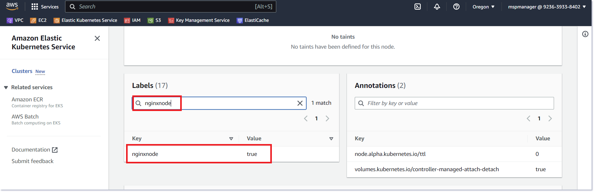

# 5일차 Availability
## Lab4. Kubernetes 노드에 Pod 할당 실습

<br>

---
- [5일차 Availability](#5일차-availability)
  - [Lab4. Kubernetes 노드에 Pod 할당 실습](#lab4-kubernetes-노드에-pod-할당-실습)
    - [4-1. 일반적인 Pod 스케쥴링 확인](#4-1-일반적인-pod-스케쥴링-확인)
    - [4-2. NodeAffinity 적용하기](#4-2-nodeaffinity-적용하기)
    - [4-3. PodAntiAffinity 적용하기](#4-3-podantiaffinity-적용하기)
    - [4-4. 실습에 사용된 오브젝트 정리](#4-4-실습에-사용된-오브젝트-정리)
---

ⓘ 실습목표 : Kubernetes의 NodeSelector, Affinity 사용법을 실습해본다.

---

### 4-1. 일반적인 Pod 스케쥴링 확인

4-1-1. Cloud9에서 실행하여 실습용 디렉토리 생성

- Terminal에서 실습용 디렉토리 생성

```bash
cd ${HOME}/environment
```

```bash
mkdir k8s-assign-pod
```

```bash
cd k8s-assign-pod
```

<br>

✔ **(수행코드/결과 예시)**

```bash
mspuser:~/environment $ mkdir k8s-assign-pod
mspuser:~/environment $ cd k8s-assign-pod
mspuser:~/environment/k8s-assign-pod $
```

<br>

4-1-2. 테스트를 위한 nginx yaml 정의

- Cloud9 왼쪽의 EXPLORER 에서 k8s-assign-pod 폴더 우클릭 후 > New Files를 누른다.


<br>

- 파일명은 `nginx-deploy.yaml`로 입력하고 엔터를 누른다.


<br>

- 아래 내용을 그대로 복사하여 파일 내용에 붙여넣고 "Ctrl+S"를 눌러 저장한다.

🧲 (COPY)
```yaml
apiVersion: v1
kind: Service
metadata:
  name: nginx
  labels:
    app: nginx
    service: nginx
spec:
  ports:
  - port: 80
    name: nginx
  selector:
    app: nginx
---
apiVersion: apps/v1
kind: Deployment
metadata:
  name: nginx
spec:
  replicas: 3          # 노드 갯수에 맞춰 복제본 3개 설정
  selector:
    matchLabels:
      app: nginx
  template:
    metadata:
      labels:
        app: nginx
    spec:
      containers:
      - name: nginx
        image: nginx:latest
        imagePullPolicy: IfNotPresent
```

<br>

4-1-3. nginx를 배포하고, 확인 후 삭제

- nginx 배포

```bash
kubectl apply -f nginx-deploy.yaml
```

✔ **(수행코드/결과 예시)**

```bash
mspuser:~/environment/k8s-assign-pod $ kubectl apply -f nginx-deploy.yaml
service/nginx created
deployment.apps/nginx created
```

<br>

- pod들이 배포된 노드 확인

```bash
kubectl get pods -o wide
```

✔ **(수행코드/결과 예시)**

```bash
mspuser:~/environment/k8s-assign-pod $ kubectl get pods -o wide
NAME                     READY   STATUS    RESTARTS   AGE    IP            NODE                                             NOMINATED NODE   READINESS GATES
nginx-7f7499b7f6-29c2t   1/1     Running   0          66s    10.0.30.152   ip-10-0-30-134.ap-northeast-2.compute.internal   <none>           <none>
nginx-7f7499b7f6-dnjcg   1/1     Running   0          66s    10.0.20.205   ip-10-0-20-163.ap-northeast-2.compute.internal   <none>           <none>
nginx-7f7499b7f6-h6qzb   1/1     Running   0          66s    10.0.30.130   ip-10-0-30-56.ap-northeast-2.compute.internal    <none>           <none>
```

<br>

- nginx를 삭제한다.

```bash
kubectl delete -f nginx-deploy.yaml
```

✔ **(수행코드/결과 예시)**

```bash
mspuser:~/environment/k8s-assign-pod $ kubectl delete -f nginx-deploy.yaml
service "nginx" deleted
deployment.apps "nginx" deleted
```

<br>
<br>

---

### 4-2. NodeAffinity 적용하기

4-2-1. Node label 설정

- 첫번째 노드의 이름을 변수에 담는다. (sed는 스트림 편집기 명령어이다)

```bash
export NODE_NAME=$(kubectl get node -o name | grep ip -m 1 | sed 's/node\///g')
```

<br>

- 해당 노드에 레이블을 설정한다.

```bash
kubectl label nodes $NODE_NAME nodetype=nginx
```

✔ **(수행코드/결과 예시)**

```bash
mspuser:~/environment/k8s-assign-pod $ kubectl label nodes $NODE_NAME nodetype=nginx
node/ip-10-0-20-121.ap-northeast-2.compute.internal labeled
mspuser:~/environment/k8s-assign-pod $
```

<br>

- 적용된 레이블을 확인한다.

```bash
kubectl get node --show-labels
```

✔ **(수행코드/결과 예시)**

```bash
mspuser:~/environment/k8s-assign-pod $ kubectl get node --show-labels
NAME                                             STATUS   ROLES    AGE     VERSION                LABELS
ip-10-0-20-121.ap-northeast-2.compute.internal   Ready    <none>   18d     v1.28.3-eks-e71965b    beta.kubernetes.io/arch=amd64,beta.kubernetes.io/instance-type=m5.2xlarge,beta.kubernetes.io/os=linux,eks.amazonaws.com/capacityType=ON_DEMAND,eks.amazonaws.com/nodegroup-image=ami-0b447cf78d577591e,eks.amazonaws.com/nodegroup=worker_t3_cta_kr,eks.amazonaws.com/sourceLaunchTemplateId=lt-039d58e1474bfb098,eks.amazonaws.com/sourceLaunchTemplateVersion=1,failure-domain.beta.kubernetes.io/region=ap-northeast-2,failure-domain.beta.kubernetes.io/zone=ap-northeast-2a,k8s.io/cloud-provider-aws=0cf45035480f7368942fc27d269531e4,kubernetes.io/arch=amd64,kubernetes.io/hostname=ip-10-0-20-121.ap-northeast-2.compute.internal,kubernetes.io/os=linux,nodetype=nginx,node.kubernetes.io/instance-type=m5.2xlarge,topology.kubernetes.io/region=ap-northeast-2,topology.kubernetes.io/zone=ap-northeast-2a
ip-10-0-20-163.ap-northeast-2.compute.internal   Ready    <none>   18d     v1.28.3-eks-e71965b    beta.kubernetes.io/arch=amd64,beta.kubernetes.io/instance-type=m5.2xlarge,beta.kubernetes.io/os=linux,eks.amazonaws.com/capacityType=ON_DEMAND,eks.amazonaws.com/nodegroup-image=ami-0b447cf78d577591e,eks.amazonaws.com/nodegroup=worker_t3_cta_kr,eks.amazonaws.com/sourceLaunchTemplateId=lt-039d58e1474bfb098,eks.amazonaws.com/sourceLaunchTemplateVersion=1,failure-domain.beta.kubernetes.io/region=ap-northeast-2,failure-domain.beta.kubernetes.io/zone=ap-northeast-2a,k8s.io/cloud-provider-aws=0cf45035480f7368942fc27d269531e4,kubernetes.io/arch=amd64,kubernetes.io/hostname=ip-10-0-20-163.ap-northeast-2.compute.internal,kubernetes.io/os=linux,node.kubernetes.io/instance-type=m5.2xlarge,topology.kubernetes.io/region=ap-northeast-2,topology.kubernetes.io/zone=ap-northeast-2a
ip-10-0-30-132.ap-northeast-2.compute.internal   Ready    <none>   18d     v1.28.3-eks-e71965b    beta.kubernetes.io/arch=amd64,beta.kubernetes.io/instance-type=m5.2xlarge,beta.kubernetes.io/os=linux,eks.amazonaws.com/capacityType=ON_DEMAND,eks.amazonaws.com/nodegroup-image=ami-0b447cf78d577591e,eks.amazonaws.com/nodegroup=worker_t3_cta_kr,eks.amazonaws.com/sourceLaunchTemplateId=lt-039d58e1474bfb098,eks.amazonaws.com/sourceLaunchTemplateVersion=1,failure-domain.beta.kubernetes.io/region=ap-northeast-2,failure-domain.beta.kubernetes.io/zone=ap-northeast-2c,k8s.io/cloud-provider-aws=0cf45035480f7368942fc27d269531e4,kubernetes.io/arch=amd64,kubernetes.io/hostname=ip-10-0-30-132.ap-northeast-2.compute.internal,kubernetes.io/os=linux,node.kubernetes.io/instance-type=m5.2xlarge,topology.kubernetes.io/region=ap-northeast-2,topology.kubernetes.io/zone=ap-northeast-2c
```

<br>

- 원하는 레이블만 조회하기 위해 아래와 같이 다시 확인한다.

```bash
kubectl get node -L nodetype
```

<br>
✔ **(수행코드/결과 예시)**

```bash
mspuser:~/environment/k8s-assign-pod $ kubectl get node -L nodetype
NAME                                             STATUS   ROLES    AGE     VERSION               NGINXNODE
ip-10-0-20-121.ap-northeast-2.compute.internal   Ready    <none>   18d     v1.28.3-eks-e71965b   true
ip-10-0-20-163.ap-northeast-2.compute.internal   Ready    <none>   18d     v1.28.3-eks-e71965b
ip-10-0-30-132.ap-northeast-2.compute.internal   Ready    <none>   18d     v1.28.3-eks-e71965b
```

<br>

- 현재 상태를 그림으로 파악해본다.


<br>

- AWS 콘솔에서 노드에 적용된 레이블을 확인해본다.

> AWS 콘솔 접속 후 상단 검색창에 "EKS"를 입력하고 `Elastic Kubernetes Service` 메뉴를 클릭하여 이동한다.

> Cluster name `eks_cluster_cta_dev_kr` 항목을 클릭한다.


<br>

> Compute 탭을 클릭한 후, nginxnode 레이블을 설정했던 첫번째 노드의 이름을 클릭한다.


<br>

> 노드 상세 조회 화면에서 스크롤을 내리면 `Labels` 항목이 있는데, 여기에 nginxnode label이 있는지 찾아본다.

👉 검색창이 없는 경우, 페이지 조회로 확인해본다.



<br>

4-2-2. `nginx-deploy.yaml` 파일의 내용을 아래로 교체하고 저장한다.

- `nginx-deploy.yaml` 파일의 전체 내용을 지우고 아래내용으로 저장한다.

🧲 (COPY)
```yaml
apiVersion: v1
kind: Service
metadata:
  name: nginx
  labels:
    app: nginx
    service: nginx
spec:
  ports:
  - port: 80
    name: nginx
  selector:
    app: nginx
---
apiVersion: apps/v1
kind: Deployment
metadata:
  name: nginx
spec:
  replicas: 3
  selector:
    matchLabels:
      app: nginx
  template:
    metadata:
      labels:
        app: nginx
    spec:
      affinity:                   ## 노드 어피니티 설정
        nodeAffinity:
          requiredDuringSchedulingIgnoredDuringExecution:
            nodeSelectorTerms:
            - matchExpressions:   ## 노드 레이블 규칙 선언
              - key: nodetype
                operator: In
                values:
                - nginx
      containers:
      - name: nginx
        image: nginx:latest
        imagePullPolicy: IfNotPresent
```

<br>

> |Node Affinity 종류|설명|
> |---|---|
> |➕ `requiredDuringSchedulingIgnoredDuringExecution` | "하드" 어피니티. '스케쥴링하는 동안 꼭 필요한' 조건 |
> |➕ `preferredDuringSchedulingIgnoredDuringExecution` | "소프트" 어피니티. '스케쥴링하는 동안 만족하면 좋은' 조건 |

❗ 위의 값은 <span style="color:red">실행 중에 조건이 바뀌어도 무시</span>한다. 파드가 이미 스케줄링되어 특정 노드에서 실행 중이라면, 중간에 해당 노드의 조건이 변경되더라도 이미 실행 중인 파드는 그대로 실행된다는 뜻이다.

<br>

> |Operator 필드 값|설명|
> |---|---|
> |➕ `In` | values[] 필드에 설정한 값 중 레이블에 있는 값과 일치하는 것이 하나라도 있는지 확인한다. |
> |➕ `NotIn` | In과 반대로 values[]에 있는 값 모두와 맞지 않는 지 확인한다. |
> |➕ `Exists` | key 필드에 설정한 값이 레이블에 존재하는지만 확인한다. (values[] 필드가 필요 없다.) |
> |➕ `DoesNotExist` | Exists와 반대로 노드의 레이블에 key 필드 값이 없는지만 확인한다. (values[] 필드가 필요 없다.) |
> |➕ `Gt` | Greater than의 약자로 values[] 필드에 설정된 값이 설정된 값 보다 더 큰 숫자형 데이터 인지 확인한다.<br>이 때 values[] 필드에는 값이 하나만 있어야 한다. |
> |➕ `Lt` | Lower than의 약자로 values[] 필드에 설정된 값이 설정된 값 보다 더 작은 숫자형 데이터 인지 확인한다.<br>이 때 values[] 필드에는 값이 하나만 있어야 한다. |

<br>

4-2-3. nginx를 배포한다.

```bash
kubectl apply -f nginx-deploy.yaml
```

✔ **(수행코드/결과 예시)**

```bash
mspuser:~/environment/k8s-assign-pod $ kubectl apply -f nginx-deploy.yaml
service/nginx created
deployment.apps/nginx created
```

<br>

4-2-4. pod들이 배포된 노드 확인

```bash
kubectl get pods -o wide
```

✔ **(수행코드/결과 예시)**
```bash
mspuser:~/environment/k8s-assign-pod $ kubectl get pods -o wide
NAME                     READY   STATUS    RESTARTS   AGE   IP            NODE                         NOMINATED NODE   READINESS GATES
nginx-5d44c4586d-4lktg   1/1     Running   0          14s   10.1.10.90    ip-10-1-10-98.ec2.internal   <none>           <none>
nginx-5d44c4586d-ndzmz   1/1     Running   0          14s   10.1.10.203   ip-10-1-10-98.ec2.internal   <none>           <none>
nginx-5d44c4586d-xz9jd   1/1     Running   0          14s   10.1.10.218   ip-10-1-10-98.ec2.internal   <none>           <none>
```

<br>

- 현재 상태를 그림으로 파악해본다.


<br>

4-2-5. nginx를 삭제한다.

```
kubectl delete -f nginx-deploy.yaml
```

✔ **(수행코드/결과 예시)**

```bash
mspuser:~/environment/k8s-assign-pod $ kubectl delete -f nginx-deploy.yaml
service "nginx" deleted
deployment.apps "nginx" deleted
```

<br>

4-2-6. Node Affinity의 내용을 변경해본다.

- `nginx-deploy.yaml` 파일의 nodeAffinity 속성을 수정하고 저장한다.

```yaml
apiVersion: apps/v1
kind: Deployment
metadata:
  name: nginx
spec:
  replicas: 3
  selector:
    matchLabels:
      app: nginx
  template:
    metadata:
      labels:
        app: nginx
    spec:
      affinity:
        nodeAffinity:
          requiredDuringSchedulingIgnoredDuringExecution:
            nodeSelectorTerms:
            - matchExpressions:
              - key: nodetype
                operator: In
                values:            ## value를 변경한다.
                - nginxserver
      containers:
      - name: nginx
        image: nginx:latest
        imagePullPolicy: IfNotPresent
```

<br>

4-2-7. nginx를 배포하고 pod들의 배포상태를 확인한다.

```
kubectl apply -f nginx-deploy.yaml
```

```
kubectl get pods -o wide
```

✔ **(수행코드/결과 예시)**
```bash
mspuser:~/environment/k8s-assign-pod $ kubectl apply -f nginx-deploy.yaml
service/nginx created
deployment.apps/nginx created

mspuser:~/environment/k8s-assign-pod $ kubectl get pods -o wide
NAME                     READY   STATUS    RESTARTS   AGE   IP       NODE     NOMINATED NODE   READINESS GATES
nginx-67d48459cd-4pbp4   0/1     Pending   0          10s   <none>   <none>   <none>           <none>
nginx-67d48459cd-4pwcm   0/1     Pending   0          10s   <none>   <none>   <none>           <none>
nginx-67d48459cd-fbn64   0/1     Pending   0          10s   <none>   <none>   <none>           <none>
```
<br>

4-2-8. pod 하나의 이름을 복사해서, 상태를 상세조회 해본다.

```
kubectl describe pod <<복사한 pod 이름>>
```

```bash
✔ **(수행코드/결과 예시)**

Name:             nginx-56b84c879-cqzg6
Namespace:        default
Priority:         0
Service Account:  default
Node:             <none>
Labels:           app=nginx
                  pod-template-hash=56b84c879
Annotations:      <none>
Status:           Pending
IP:
IPs:              <none>
Controlled By:    ReplicaSet/nginx-56b84c879
Containers:
  nginx:
    Image:        nginx:latest
    Port:         <none>
    Host Port:    <none>
    Environment:  <none>
    Mounts:
      /var/run/secrets/kubernetes.io/serviceaccount from kube-api-access-957df (ro)
Conditions:
  Type           Status
  PodScheduled   False
Volumes:
  kube-api-access-957df:
    Type:                    Projected (a volume that contains injected data from multiple sources)
    TokenExpirationSeconds:  3607
    ConfigMapName:           kube-root-ca.crt
    ConfigMapOptional:       <nil>
    DownwardAPI:             true
QoS Class:                   BestEffort
Node-Selectors:              <none>
Tolerations:                 node.kubernetes.io/not-ready:NoExecute op=Exists for 300s
                             node.kubernetes.io/unreachable:NoExecute op=Exists for 300s
Events:
  Type     Reason            Age   From               Message
  ----     ------            ----  ----               -------
  Warning  FailedScheduling  45s   default-scheduler  0/3 nodes are available: 3 node(s) didn't match Pod's node affinity/selector. preemption: 0/3 nodes are available: 3 Preemption is not helpful for scheduling..
```

<br>

- 현재 상태를 그림으로 파악해본다.


<br>

4-2-9. `nginx-deploy.yaml` 파일의 nodeAffinity 속성을 수정하고 저장한다.

- pod spec의 affinity 부분을 아래 내용으로 교체한다.

```yaml
apiVersion: apps/v1
kind: Deployment
metadata:
  name: nginx
spec:
  replicas: 3
  selector:
    matchLabels:
      app: nginx
  template:
    metadata:
      labels:
        app: nginx
    spec:
      affinity:
        nodeAffinity:
          preferredDuringSchedulingIgnoredDuringExecution:   ## preferred Affinity로 변경
          - weight: 10      ## 선호도 가중치. 복수의 preference가 있을때, 노드별 가중치 합산 후 가장 높은 노드로 스케쥴링
            preference:
              matchExpressions:  ## 노드의 match 조건은 이전과 동일함
              - key: nodetype
                operator: In
                values:
                - nginxserver
      containers:
      - name: nginx
        image: nginx:latest
        imagePullPolicy: IfNotPresent
```

<br>

4-2-10. 변경된 설정을 적용하고 pod들의 배포상태를 확인한다.

```bash
kubectl apply -f nginx-deploy.yaml
```

```bash
kubectl get pods -o wide
```

✔ **(수행코드/결과 예시)**
```bash
mspuser:~/environment/k8s-assign-pod $ kubectl apply -f nginx-deploy.yaml
service/nginx unchanged
deployment.apps/nginx configured

mspuser:~/environment/k8s-assign-pod $ kubectl get pods -o wide
NAME                     READY   STATUS    RESTARTS   AGE   IP            NODE                          NOMINATED NODE   READINESS GATES
nginx-748dc476f5-lf8ql   1/1     Running   0          30s   10.1.11.110   ip-10-1-11-113.ec2.internal   <none>           <none>
nginx-748dc476f5-mxjd4   1/1     Running   0          27s   10.1.10.24    ip-10-1-10-126.ec2.internal   <none>           <none>
nginx-748dc476f5-rzgg5   1/1     Running   0          25s   10.1.11.32    ip-10-1-11-204.ec2.internal   <none>           <none>
```

<br>

- 현재 상태를 그림으로 파악해본다.


<br>

4-2-11. nginx를 삭제한다.

```
kubectl delete -f nginx-deploy.yaml
```

✔ **(수행코드/결과 예시)**

```bash
mspuser:~/environment/k8s-assign-pod $ kubectl delete -f nginx-deploy.yaml
service "nginx" deleted
deployment.apps "nginx" deleted
```

<br>
<br>

---

### 4-3. PodAntiAffinity 적용하기

4-3-1. `nginx-deploy.yaml` 파일의 nodeAffinity 속성을 수정하고 저장한다.

- pod spec의 affinity 부분을 아래 내용으로 교체한다.

```yaml
apiVersion: apps/v1
kind: Deployment
metadata:
  name: nginx
spec:
  replicas: 3
  selector:
    matchLabels:
      app: nginx
  template:
    metadata:
      labels:
        app: nginx
    spec:
      affinity:
        nodeAffinity:
          preferredDuringSchedulingIgnoredDuringExecution:   ## preferred Affinity로 변경
          - weight: 10      ## 선호도 가중치. 복수의 preference가 있을때, 노드별 가중치 합산 후 가장 높은 노드로 스케쥴링
            preference:
              matchExpressions:  ## 노드의 match 조건은 이전과 동일함
              - key: nodetype
                operator: In
                values:
                - nginx
      containers:
      - name: nginx
        image: nginx:latest
        imagePullPolicy: IfNotPresent
```

<br>

4-3-2. nginx를 배포한다.

```bash
kubectl apply -f nginx-deploy.yaml
```

✔ **(수행코드/결과 예시)**

```bash
mspuser:~/environment/k8s-assign-pod $ kubectl apply -f nginx-deploy.yaml
service/nginx created
deployment.apps/nginx created
```

<br>

4-3-3. pod들이 배포된 노드 확인

```bash
kubectl get pods -o wide
```

✔ **(수행코드/결과 예시)**
```bash
mspuser:~/environment/k8s-assign-pod $ kubectl get pods -o wide
NAME                     READY   STATUS    RESTARTS   AGE   IP            NODE                         NOMINATED NODE   READINESS GATES
nginx-5d44c4586d-4lktg   1/1     Running   0          14s   10.1.10.90    ip-10-1-10-98.ec2.internal   <none>           <none>
nginx-5d44c4586d-ndzmz   1/1     Running   0          14s   10.1.10.203   ip-10-1-10-98.ec2.internal   <none>           <none>
nginx-5d44c4586d-xz9jd   1/1     Running   0          14s   10.1.10.218   ip-10-1-10-98.ec2.internal   <none>           <none>
```

<br>

- 현재 상태를 그림으로 파악해본다.


<br>

4-3-4. `nginx-deploy.yaml` 파일에 podAntiAffinity 속성을 추가하고 저장한다.

- pod spec의 affinity 부분을 아래 내용으로 교체한다.

```yaml
apiVersion: apps/v1
kind: Deployment
metadata:
  name: nginx
spec:
  replicas: 3
  selector:
    matchLabels:
      app: nginx
  template:
    metadata:
      labels:
        app: nginx
    spec:
      affinity:
        nodeAffinity:
          preferredDuringSchedulingIgnoredDuringExecution:   ## preferred Affinity로 변경
          - weight: 10      ## 선호도 가중치. 복수의 preference가 있을때, 노드별 가중치 합산 후 가장 높은 노드로 스케쥴링
            preference:
              matchExpressions:  ## 노드의 match 조건은 이전과 동일함
              - key: nodetype
                operator: In
                values:
                - nginx
        podAntiAffinity:
          preferredDuringSchedulingIgnoredDuringExecution:
          - weight: 100
            podAffinityTerm:
              labelSelector:
                matchExpressions:
                - key: app
                  operator: In
                  values:
                  - nginx
              topologyKey: kubernetes.io/hostname
      containers:
      - name: nginx
        image: nginx:latest
        imagePullPolicy: IfNotPresent
```

<br>

4-3-5. 수정한 nginx를 배포한다.

```bash
kubectl apply -f nginx-deploy.yaml
```

✔ **(수행코드/결과 예시)**

```bash
mspuser:~/environment/k8s-assign-pod $ kubectl apply -f nginx-deploy.yaml
service/nginx created
deployment.apps/nginx created
```

<br>

4-3-6. pod들이 배포된 노드 확인

```bash
kubectl get pods -o wide
```

✔ **(수행코드/결과 예시)**
```bash
mspuser:~/environment/k8s-assign-pod $ kubectl get pods -o wide
NAME                     READY   STATUS    RESTARTS   AGE   IP            NODE                                             NOMINATED NODE   READINESS GATES
nginx-5b6484b8c8-5drlc   1/1     Running   0          5s    10.0.30.12    ip-10-0-30-134.ap-northeast-2.compute.internal   <none>           <none>
nginx-5b6484b8c8-btllb   1/1     Running   0          2s    10.0.20.16    ip-10-0-20-163.ap-northeast-2.compute.internal   <none>           <none>
nginx-5b6484b8c8-gthmj   1/1     Running   0          3s    10.0.30.112   ip-10-0-30-56.ap-northeast-2.compute.internal    <none>           <none>
```

<br>

- 현재 상태를 그림으로 파악해본다.


<br>
<br>

---

### 4-4. 실습에 사용된 오브젝트 정리

4-4-1. 실습에 사용된 오브젝트를 제거한다.

```bash
kubectl delete -f nginx-deploy.yaml
```

```bash
kubectl label nodes $NODE_NAME nodetype-
```

```bash
kubectl get node -L nodetype
```

✔ **(수행코드/결과 예시)**
```bash
mspuser:~/environment/k8s-assign-pod $ kubectl delete -f nginx-deploy.yaml
service "nginx" deleted
deployment.apps "nginx" deleted

mspuser:~/environment/k8s-assign-pod $ kubectl label nodes $NODE_NAME nodetype-
node/ip-10-1-10-126.ec2.internal unlabeled

mspuser:~/environment/k8s-assign-pod $ kubectl get node -L nodetype
NAME                          STATUS   ROLES    AGE     VERSION                NODETYPE
ip-10-1-10-126.ec2.internal   Ready    <none>   2d23h   v1.24.13-eks-0a21954
ip-10-1-11-113.ec2.internal   Ready    <none>   2d23h   v1.24.13-eks-0a21954
ip-10-1-11-204.ec2.internal   Ready    <none>   2d23h   v1.24.13-eks-0a21954
```

<br>
<br>

😃 **Lab 4 완료!!!**

<br>

⏩ 다음 실습으로 [이동](5-5-Kubernetes-Probes.md)합니다.