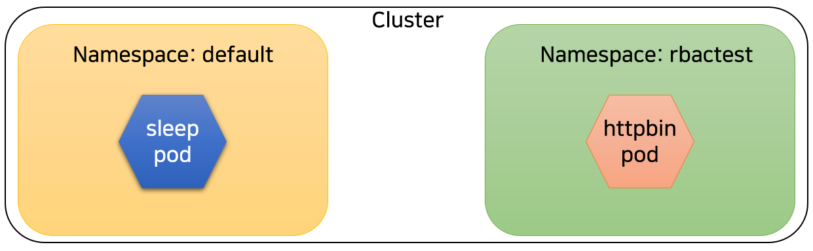
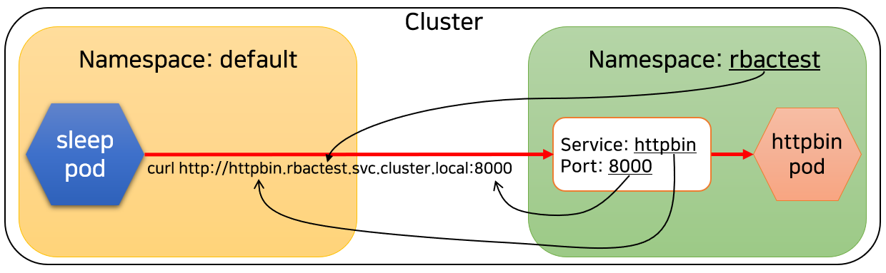
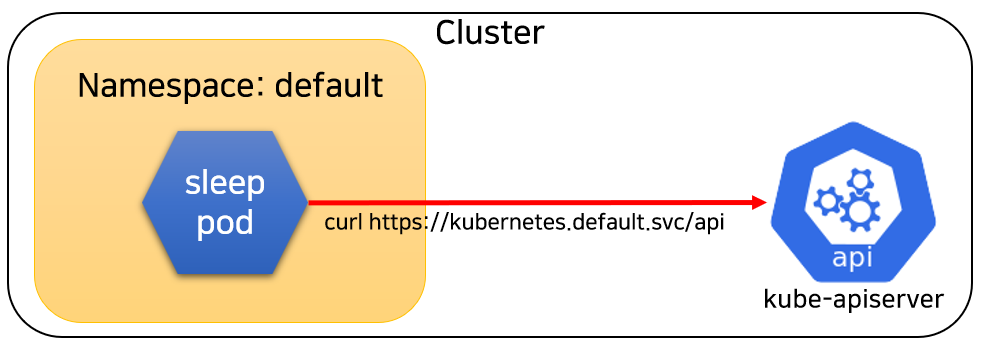

# 6일차 Security
## Lab3. Kubernetes ServiceAccount, RBAC 실습

<br>

---
- [6일차 Security](#6일차-security)
  - [Lab3. Kubernetes ServiceAccount, RBAC 실습](#lab3-kubernetes-serviceaccount-rbac-실습)
    - [3-1. 실습을 위한 샘플 애플리케이션 배포](#3-1-실습을-위한-샘플-애플리케이션-배포)
    - [3-2. Kubernetes REST API에 직접 접근](#3-2-kubernetes-rest-api에-직접-접근)
    - [3-3. Role, RoleBinding 생성](#3-3-role-rolebinding-생성)
    - [3-4. ClusterRole, ClusterRoleBinding 생성](#3-4-clusterrole-clusterrolebinding-생성)
    - [3-5. 권한 핸들링](#3-5-권한-핸들링)
    - [3-6. 실습에 사용된 오브젝트 정리](#3-6-실습에-사용된-오브젝트-정리)
---

ⓘ 실습목표 : Kubernetes의 RBAC(Role-Based Access Control)를 실습해보고 이해한다.

<br>

👉 실습에 사용될 샘플 앱
- httpbin : HTTP 테스트를 위한 간단한 요청/응답 서버 (https://httpbin.org/)
- sleep : curl 이 설치된 ubuntu 컨테이너로, sleep 상태로 대기하는 단순한 서비스. (curl : URL로 서버에 데이터를 보내거나 가져올때 사용하는 CLI)
- nginx : 경량 웹서버 소프트웨어.

<br>

---

### 3-1. 실습을 위한 샘플 애플리케이션 배포

3-1-1. Cloud9에서 실행하여 실습용 디렉토리 생성

- Terminal에서 실습용 디렉토리 생성

```bash
cd ${HOME}/environment
```

```bash
mkdir k8s-rbac
```

```bash
cd k8s-rbac
```

<br>

✔ **(수행코드/결과 예시)**

```bash
mspuser:~/environment $ mkdir k8s-rbac
mspuser:~/environment $ cd k8s-rbac
mspuser:~/environment/k8s-rbac $
```

<br>

3-1-2. sleep 서비스 배포를 위한 yaml 생성

- Cloud9 왼쪽의 EXPLORER 에서 k8s-rbac 폴더 우클릭 후 > New Files를 누른다.


<br>

- 파일명은 `sleep.yaml`로 입력하고 엔터를 누른다.


<br>

- 아래 내용을 그대로 복사하여 파일 내용에 붙여넣고 "Ctrl+S"를 눌러 저장한다.

🧲 (COPY)
```yaml
#############################################
# Sleep service
#############################################
apiVersion: v1
kind: ServiceAccount
metadata:
  name: sleep
---
apiVersion: v1         ## Kubernetes API의 버젼
kind: Service          ## Object의 종류(Resource)
metadata:              ## Object의 Metadata(정보)
  name: sleep
  labels:
    app: sleep
    service: sleep
spec:                  ## Object의 요구되는 상태(Desired state)
  ports:
  - port: 80           ## Service의 포트
    name: http
  selector:
    app: sleep
---
apiVersion: apps/v1
kind: Deployment
metadata:
  name: sleep
spec:
  replicas: 1                           ## Pod 복제본의 갯수
  selector:
    matchLabels:
      app: sleep
  template:                             ## Pod Template
    metadata:                           ## Pod의 Metadata
      labels:
        app: sleep
    spec:                               ## Pod의 요구되는 상태(Desired state)
      serviceAccountName: sleep         ## Pod가 사용할 ServiceAccount의 이름
      containers:                       ## Pod의 컨테이너 리스트
      - name: sleep                     ## 컨테이너 이름
        image: curlimages/curl          ## 컨테이너를 구동할 Docker Image
        command: ["/bin/sleep","3650d"] ## 컨테이너 구동시 수행할 커맨드
        imagePullPolicy: IfNotPresent   ## Docker Image Pulling 정책
```

<br>

3-1-3. httpbin yaml 생성

- 위와 마찬가지로 진행한다.

- Cloud9 왼쪽의 EXPLORER 에서 k8s-rbac 폴더 우클릭 후 > New Files를 누른다.

- 파일명은 `httpbin.yaml`로 입력하고 엔터를 누른다.

- 아래 내용을 그대로 복사하여 파일 내용에 붙여넣고 "Ctrl+S"를 눌러 저장한다.

🧲 (COPY)
```yaml
#############################################
# httpbin service
#############################################
apiVersion: v1
kind: Service
metadata:
  name: httpbin
  labels:
    app: httpbin
    service: httpbin
spec:
  ports:
  - name: http
    port: 8000          ## Service의 포트
    targetPort: 80      ## Container의 포트
  selector:
    app: httpbin
---
apiVersion: apps/v1
kind: Deployment
metadata:
  name: httpbin
spec:
  replicas: 1
  selector:
    matchLabels:
      app: httpbin
      version: v1
  template:
    metadata:
      labels:
        app: httpbin
        version: v1
    spec:
      containers:
      - image: docker.io/kennethreitz/httpbin
        imagePullPolicy: IfNotPresent
        name: httpbin
        ports:
        - containerPort: 80   ## Container의 포트
```

👉 sleep과 httpbin을 각각 다른 네임스페이스에 배포할 것이다.

<br>

3-1-4. sleep을 default namespace에 배포한다.

```bash
kubectl apply -f sleep.yaml
```

<br>

- 배포 확인

```bash
kubectl get pods
```

✔ **(수행코드/결과 예시)**

```bash
mspuser:~/environment/k8s-rbac $ kubectl apply -f sleep.yaml
serviceaccount/sleep created
service/sleep created
deployment.apps/sleep created

mspuser:~/environment/k8s-rbac $ kubectl get pods
NAME                    READY   STATUS    RESTARTS   AGE
sleep-8449d4b96-qhzgj   1/1     Running   0          5s
```

<br>

3-1-5. rbactest namespace를 생성한다.

```bash
kubectl create ns rbactest
```

<br>

- 생성 확인

```bash
kubectl get ns
```

✔ **(수행코드/결과 예시)**

```bash
mspuser:~/environment/k8s-rbac $ kubectl create ns rbactest
namespace/rbactest created

mspuser:~/environment/k8s-rbac $ kubectl get ns
NAME              STATUS   AGE
default           Active   10d
kube-node-lease   Active   10d
kube-public       Active   10d
kube-system       Active   10d
rbactest          Active   5s
```

<br>

3-1-6. httpbin을 rbactest namespace에 배포한다.

```bash
kubectl apply -f httpbin.yaml -n rbactest
```

<br>

- 배포 확인

```bash
kubectl get pods -n rbactest
```

✔ **(수행코드/결과 예시)**

```bash
mspuser:~/environment/k8s-rbac $ kubectl apply -f httpbin.yaml -n rbactest
service/httpbin created
deployment.apps/httpbin created

mspuser:~/environment/k8s-rbac $ kubectl get pods -n rbactest
NAME                       READY   STATUS              RESTARTS   AGE
httpbin-84cddc85d4-z92xw   0/1     ContainerCreating   0          4s
```

<br>

- 현재 배포상태를 그림으로 이해해본다.



<br>

3-1-7. sleep pod 이름을 변수로 가져온다.

```bash
export SLEEP_POD=$(kubectl get pods -l app=sleep -o jsonpath={.items..metadata.name})
```

<br>

- 제대로 가져왔는지 출력해본다.

```bash
echo $SLEEP_POD
```

✔ **(수행코드/결과 예시)**

```bash
mspuser:~/environment/k8s-rbac $ export SLEEP_POD=$(kubectl get pods -l app=sleep -o jsonpath={.items..metadata.name})

mspuser:~/environment/k8s-rbac $ echo $SLEEP_POD
sleep-8449d4b96-qhzgj
```

<br>

3-1-8. sleep pod 안에 들어가서 httpbin을 호출해본다.

```bash
kubectl exec -it $SLEEP_POD -c sleep -- sh
```

```bash
curl http://httpbin.rbactest.svc.cluster.local:8000/get
```

✔ **(수행코드/결과 예시)**

```bash
mspuser:~/environment/k8s-rbac $ kubectl exec -it $SLEEP_POD -c sleep -- sh

/ $ curl http://httpbin.rbactest.svc.cluster.local:8000/get
{
  "args": {},
  "headers": {
    "Accept": "*/*",
    "Host": "httpbin.rbactest.svc.cluster.local:8000",
    "User-Agent": "curl/7.87.0-DEV"
  },
  "origin": "10.0.10.143",
  "url": "http://httpbin.rbactest.svc.cluster.local:8000/get"
}
/ $
```

<br>

👉 쿠버네티스는 클라이언트의 포드가 FQDN으로 서비스의 IP를 알아내는 방법을 제공한다.
- FQDN(Fully Qualified Domain Name, 전체 주소 도메인 이름) 형식 : 서비스이름.네임스페이스이름.svc.cluster.local



<br>
<br>

---

### 3-2. Kubernetes REST API에 직접 접근

- 실행 중인 파드에서, 쿠버네티스의 API Server는 default 네임스페이스의 kubernetes라는 서비스를 통해 접근할 수 있다. 따라서, 파드는 kubernetes.default.svc 호스트 이름을 사용하여 API Server를 쿼리할 수 있다.

- API Server를 인증하는 권장 방법은 서비스 어카운트 자격 증명을 사용하는 것이다.

- 기본적으로, 파드는 서비스 어카운트와 연결되어 있으며, 해당 서비스 어카운트에 대한 자격 증명(토큰)은 해당 파드에 있는 각 컨테이너의 파일시스템 트리의 /var/run/secrets/kubernetes.io/serviceaccount/token 에 있다.

- 인증서 번들은 각 컨테이너의 파일시스템 트리의 /var/run/secrets/kubernetes.io/serviceaccount/ca.crt 에 배치되며, API Server의 제공 인증서를 확인하는 데 사용해야 한다.

- 마지막으로, 네임스페이스가 지정된 API 작업에 사용되는 기본 네임스페이스는 각 컨테이너의 /var/run/secrets/kubernetes.io/serviceaccount/namespace 에 있는 파일에 배치된다

<br>

3-2-1. API-Server에 쉽게 접근하기 위해 변수를 설정한다.

- API Server 호스트 이름을 변수로 저장한다.

```bash
APISERVER=https://kubernetes.default.svc
```

<br>

- sleep 컨테이너 내부의 서비스어카운트(ServiceAccount) 경로를 변수로 저장한다.

```bash
SERVICEACCOUNT=/var/run/secrets/kubernetes.io/serviceaccount
```

<br>

- 서비스어카운트 베어러 토큰을 읽는다.

>👉 Bearer 토큰은 토큰을 소유한 사람에게 액세스 권한을 부여하는 일반적인 토큰 클래스이다.

```bash
TOKEN=$(cat ${SERVICEACCOUNT}/token)
```

<br>

- 인증서 파일(ca) 경로를 변수로 저장한다.

```bash
CACERT=${SERVICEACCOUNT}/ca.crt
```

<br>

- 제대로 변수에 담겼는지 확인한다. (붙여넣고 엔터)

```bash
echo $APISERVER
echo $SERVICEACCOUNT
echo $TOKEN
cat $CACERT
```

✔ **(수행코드/결과 예시)**

```bash
/ $ APISERVER=https://kubernetes.default.svc
/ $ SERVICEACCOUNT=/var/run/secrets/kubernetes.io/serviceaccount
/ $ TOKEN=$(cat ${SERVICEACCOUNT}/token)
/ $ CACERT=${SERVICEACCOUNT}/ca.crt
/ $
/ $ echo $APISERVER
https://kubernetes.default.svc

/ $ echo $SERVICEACCOUNT
/var/run/secrets/kubernetes.io/serviceaccount

/ $ echo $TOKEN
eyJhbGciOiJSUzI1NiIsImtpZCI6IjU2ODIwYWFlZTc2OGYwOTgwZWRkMmVkNjhmNTFhMWZmMDYwZGM2MWEifQ.eyJhdWQiOlsiaHR0cHM6Ly9rdWJlcm5ldGVzLmRlZmF1bHQuc3ZjIl0sImV4cCI6MTcwODA2MjE5NiwiaWF0IjoxNjc2NTI2MTk2LCJpc3MiOiJodHRwczovL29pZGMuZWtzLnVzLXdlc3QtMi5hbWF6b25hd3MuY29tL2lkL0UxNjMzMjRDM0U0MzcyRjA3MTMzMTFGQkU4NEI1NzA3Iiwia3ViZXJuZXRlcy5pbyI6eyJuYW1lc3BhY2UiOiJkZWZhdWx0IiwicG9kIjp7Im5hbWUiOiJzbGVlcC04NDQ5ZDRiOTYtcWh6Z2oiLCJ1aWQiOiJkMmIwY2RjYi01MTY4LTRmZDEtYTNiMy00NjU5MWI2ZWZiODMifSwic2VydmljZWFjY291bnQiOnsibmFtZSI6InNsZWVwIiwidWlkIjoiYmY2OTIwNWMtZmI4NC00ZDE2LTgxZGQtMDExMmI1YmFjNDE2In0sIndhcm5hZnRlciI6MTY3NjUyOTgwM30sIm5iZiI6MTY3NjUyNjE5Niwic3ViIjoic3lzdGVtOnNlcnZpY2VhY2NvdW50OmRlZmF1bHQ6c2xlZXAifQ.UjK0iDejaxi3-kRTGPZgrHLyW7GXmxPEvwTNT2vwxwKGPonuzU8p9XqNqp_jRmM1IHW9DH4Nt2MJ5ASqzaFc5BSt-r_kI05blKSl5IMec-hXdl5TVvwWGtMUev-2k7hVIvFu61p8nLOp02zmf7aomrhrGwzwR0qETvg9ML4a448viL6xIHWB4IXM-KiEQrOPh542hU2CLxAory6BU3LbfWUbf6x5yl3dGeEipGwYd3Bv3rGqCC3EcZPNfaFm6QeEx5h9mQ9oJDEmh-m0KmRafG0DZwcrzSoYj5fzJCqk88Oz679rPZFOj51Maj7jj0mn03EINzYNOuCr-6i28AZ_5Q

/ $ cat $CACERT
-----BEGIN CERTIFICATE-----
MIIC/jCCAeagAwIBAgIBADANBgkqhkiG9w0BAQsFADAVMRMwEQYDVQQDEwprdWJl
cm5ldGVzMB4XDTIzMDIwNjAyMTcyNFoXDTMzMDIwMzAyMTcyNFowFTETMBEGA1UE
AxMKa3ViZXJuZXRlczCCASIwDQYJKoZIhvcNAQEBBQADggEPADCCAQoCggEBAKpB
fN+gJyS2tXXhQrmp9wK6Vpaf6yoV/pQQ2qUegUV72EaA/N2VSIlnpCPDHF45D8Xx
JhEvOLoUem2KtjCD4vSm3HcrmOuj8BOkiyPyUGitctPLmwB8guudQIEOOQc9tiNC
1aHJeT3m6OA2beaFTgR18lEi8nIViaojGM9ORDtrSjhCRNiOjgXzj7NhruKgdp7U
ZbWVwleJiyFrpN1qu7svChWhJELPu/Mq9XgAyegCFh0KksQ39VclH/lyKYN7JpOA
9wECUMzYONnv+79WrawT2oy3ifa/g4LoTauI62wRDHTOyKCviBoGXLOaVpRzdaKZ
XIqd4TVGWAhTiv4nJR8CAwEAAaNZMFcwDgYDVR0PAQH/BAQDAgKkMA8GA1UdEwEB
/wQFMAMBAf8wHQYDVR0OBBYEFL3nJtH/j0jRv/4KVcp512uj7OQZMBUGA1UdEQQO
MAyCCmt1YmVybmV0ZXMwDQYJKoZIhvcNAQELBQADggEBAIXONAjGMxnDSzqOjYpx
1NBF1iJZpc+BQ4inCyFIGyQtSE4uog307PQ2o2Z+HBFleTW8SPBWkyJHnL+lD+Xs
TF8cKf/wNJaDog0l7+nAVS0VKhO7PNcDgvAEvf/Mjek+T5DblfzdAVonSnLoRXM7
lp8u1NFNFGHVP6IskMc4iN/kfQZLkHHCTgMy0K928IDxeO9A3lg95zwjPQsOzzqH
9uK517gU6AU2uz73TGiVREBBiHJTPr78gk2/K7Xmpg1qrMfOF7J07De8XyQ9Y1i6
15EWYuUfB/XOhgNpFMvcsV7ZYbA50mroRcgAGDBgQtsHmXBREW8YO3l6OvRhg5IK
RG8=
-----END CERTIFICATE-----
```

<br>

- [참고] 세션이 끊겨서 다시 sleep pod에 접속한 경우, 아래 내용을 실행해서 한번에 변수를 설정하도록 한다.

```bash
APISERVER=https://kubernetes.default.svc
SERVICEACCOUNT=/var/run/secrets/kubernetes.io/serviceaccount
TOKEN=$(cat ${SERVICEACCOUNT}/token)
CACERT=${SERVICEACCOUNT}/ca.crt
```

<br>

3-2-2. API-Server를 호출해본다.

```bash
curl --cacert ${CACERT} --header "Authorization: Bearer ${TOKEN}" -X GET ${APISERVER}/api
```

✔ **(수행코드/결과 예시)**
```bash
/ $ curl --cacert ${CACERT} --header "Authorization: Bearer ${TOKEN}" -X GET ${APISERVER}/api
{
  "kind": "APIVersions",
  "versions": [
    "v1"
  ],
  "serverAddressByClientCIDRs": [
    {
      "clientCIDR": "0.0.0.0/0",
      "serverAddress": "ip-172-16-126-40.us-west-2.compute.internal:443"
    }
  ]
}
/ $
```

<br>



<br>

3-2-3. apiVersion v1에 해당하는 기본적인 API 리소스 정보를 다 조회해본다. (/api/v1 경로)

```bash
curl --cacert ${CACERT} --header "Authorization: Bearer ${TOKEN}" -X GET ${APISERVER}/api/v1
```

✔ **(수행코드/결과 예시)**
```bash
/ $ curl --cacert ${CACERT} --header "Authorization: Bearer ${TOKEN}" -X GET ${APISERVER}/api/v1
{
  "kind": "APIResourceList",
  "groupVersion": "v1",
  "resources": [
...(중략)...
    {
      "name": "configmaps",
      "singularName": "",
      "namespaced": true,
      "kind": "ConfigMap",
      "verbs": [
        "create",
        "delete",
        "deletecollection",
        "get",
        "list",
        "patch",
        "update",
        "watch"
      ],
      "shortNames": [
        "cm"
      ],
      "storageVersionHash": "qFsyl6wFWjQ="
    },
...(중략)...
    {
      "name": "namespaces",
      "singularName": "",
      "namespaced": false,
      "kind": "Namespace",
      "verbs": [
        "create",
        "delete",
        "get",
        "list",
        "patch",
        "update",
        "watch"
      ],
      "shortNames": [
        "ns"
      ],
      "storageVersionHash": "Q3oi5N2YM8M="
    },
...(중략)...
    {
      "name": "nodes",
      "singularName": "",
      "namespaced": false,
      "kind": "Node",
      "verbs": [
        "create",
        "delete",
        "deletecollection",
        "get",
        "list",
        "patch",
        "update",
        "watch"
      ],
      "shortNames": [
        "no"
      ],
      "storageVersionHash": "XwShjMxG9Fs="
    },
...(중략)...
    {
      "name": "persistentvolumes",
      "singularName": "",
      "namespaced": false,
      "kind": "PersistentVolume",
      "verbs": [
        "create",
        "delete",
        "deletecollection",
        "get",
        "list",
        "patch",
        "update",
        "watch"
      ],
      "shortNames": [
        "pv"
      ],
      "storageVersionHash": "HN/zwEC+JgM="
    },
...(중략)...
    {
      "name": "pods",
      "singularName": "",
      "namespaced": true,
      "kind": "Pod",
      "verbs": [
        "create",
        "delete",
        "deletecollection",
        "get",
        "list",
        "patch",
        "update",
        "watch"
      ],
      "shortNames": [
        "po"
      ],
      "categories": [
        "all"
      ],
      "storageVersionHash": "xPOwRZ+Yhw8="
    },
...(중략)...
    {
      "name": "services",
      "singularName": "",
      "namespaced": true,
      "kind": "Service",
      "verbs": [
        "create",
        "delete",
        "get",
        "list",
        "patch",
        "update",
        "watch"
      ],
      "shortNames": [
        "svc"
      ],
      "categories": [
        "all"
      ],
      "storageVersionHash": "0/CO1lhkEBI="
    },
...(중략)...
  ]
}/
```

- `kubectl api-resources -o wide` 명령어를 실행한 것과 유사한 결과를 제공받는다.

<br>

3-2-4. default namespace의 pod 정보를 조회해본다.

```bash
curl --cacert ${CACERT} --header "Authorization: Bearer ${TOKEN}" -X GET ${APISERVER}/api/v1/namespaces/default/pods
```

✔ **(수행코드/결과 예시)**
```bash
/ $ curl --cacert ${CACERT} --header "Authorization: Bearer ${TOKEN}" -X GET ${APISERVER}/api/v1/namespaces/default/pods
{
  "kind": "Status",
  "apiVersion": "v1",
  "metadata": {

  },
  "status": "Failure",
  "message": "pods is forbidden: User \"system:serviceaccount:default:sleep\" cannot list resource \"pods\" in API group \"\" in the namespace \"default\"",
  "reason": "Forbidden",
  "details": {
    "kind": "pods"
  },
  "code": 403
}
/ $
```

- pod에 대한 조회 권한이 없기 때문에, status가 <span style="color:red">Failure</span>, HTTP status code는 <span style="color:red">403</span> 인 것을 알 수 있다.

- 403 Forbidden : 클라이언트는 콘텐츠에 접근할 권리를 가지고 있지 않다.

<br>
<br>

---

### 3-3. Role, RoleBinding 생성

3-3-1. sleep이 사용하는 ServiceAccount에 대한 Role과 RoleBinding을 정의한다.

- VSCode 왼쪽의 EXPLORER 에서 k8s-rbac 폴더 우클릭 후 > New Files를 누른다. (위의 sleep.yaml 생성 참고)
- 파일명 `sleep-role.yaml` 을 입력하고 엔터
- 아래 내용 그대로 파일 내용에 붙여넣고 Ctrl+S를 눌러 저장

🧲 (COPY)
```yaml
apiVersion: rbac.authorization.k8s.io/v1
kind: Role              ## 권한 정의
metadata:
  name: sleep-role
  namespace: default    ## 권한이 적용될 네임스페이스
rules:
- apiGroups:
  - ""
  resources:            ## 권한이 영향을 미칠 리소스들
  - pods
  - pods/log
  - services
  verbs:                ## 리소스에 대한 권한들
  - get
  - list
  - watch
---
apiVersion: rbac.authorization.k8s.io/v1
kind: RoleBinding       ## 권한과 서비스어카운트를 바인딩
metadata:
  name: sleep-rolebinding
  namespace: default    ## 적용될 네임스페이스
roleRef:
  apiGroup: rbac.authorization.k8s.io
  kind: Role
  name: sleep-role      ## Role의 이름 명시
subjects:
- kind: ServiceAccount
  name: sleep           ## 서비스어카운트의 이름 명시
  namespace: default    ## 서비스어카운트가 있는 네임스페이스
```

<br>

3-3-2. 새로운 터미널을 추가로 열고, 실습 파일이 있는 폴더로 이동한다.


```bash
cd ~/environment
```

```bash
cd k8s-rbac
```

<br>

3-3-3. 정의된 Role과 RoleBiding을 클러스터에 생성한다.

```bash
kubectl apply -f sleep-role.yaml
```

✔ **(수행코드/결과 예시)**

```bash
mspuser:~/environment/k8s-rbac $ kubectl apply -f sleep-role.yaml
role.rbac.authorization.k8s.io/sleep-role created
rolebinding.rbac.authorization.k8s.io/sleep-rolebinding created
```

<br>

3-3-4. sleep pod의 쉘이 떠있는 터미널로 돌아와서 실패했었던 pod 정보 조회 API를 다시 호출해본다.

- sleep pod의 쉘에서 실행

```
curl --cacert ${CACERT} --header "Authorization: Bearer ${TOKEN}" -X GET ${APISERVER}/api/v1/namespaces/default/pods
```

✔ **(수행코드/결과 예시)**

```bash
/ $ curl --cacert ${CACERT} --header "Authorization: Bearer ${TOKEN}" -X GET ${APISERVER}/api/v1/namespaces/default/pods
{
  "kind": "PodList",
  "apiVersion": "v1",
  "metadata": {
    "resourceVersion": "72420"
  },
  "items": [
    {
      "metadata": {
        "name": "sleep-8449d4b96-q428c",
        "generateName": "sleep-8449d4b96-",
        "namespace": "default",
        "uid": "69c341e2-9324-45f9-b67c-b88203636fb1",
        "resourceVersion": "59124",
        "creationTimestamp": "2023-02-06T07:11:54Z",
        "labels": {
          "app": "sleep",
          "pod-template-hash": "8449d4b96"
        },
        "annotations": {
          "kubernetes.io/psp": "eks.privileged"
        },
        "ownerReferences": [
          {
            "apiVersion": "apps/v1",
            "kind": "ReplicaSet",
            "name": "sleep-8449d4b96",
            "uid": "b384d34f-bb16-451e-8cfb-16b64394be1f",
            "controller": true,
            "blockOwnerDeletion": true
          }
        ],
        "managedFields": [
          {
            "manager": "kube-controller-manager",
            "operation": "Update",
            "apiVersion": "v1",
            "time": "2023-02-06T07:11:54Z",
            "fieldsType": "FieldsV1",
            "fieldsV1": {"f:metadata":{"f:generateName":{},"f:labels":{".":{},"f:app":{},"f:pod-template-hash":{}},"f:ownerReferences":{".":{},"k:{\"uid\":\"b384d34f-bb16-451e-8cfb-16b64394be1f\"}":{}}},"f:spec":{"f:containers":{"k:{\"name\":\"sleep\"}":{".":{},"f:command":{},"f:image":{},"f:imagePullPolicy":{},"f:name":{},"f:resources":{},"f:terminationMessagePath":{},"f:terminationMessagePolicy":{}}},"f:dnsPolicy":{},"f:enableServiceLinks":{},"f:restartPolicy":{},"f:schedulerName":{},"f:securityContext":{},"f:serviceAccount":{},"f:serviceAccountName":{},"f:terminationGracePeriodSeconds":{}}}
          },
          {
            "manager": "kube-scheduler",
            "operation": "Update",
            "apiVersion": "v1",
            "time": "2023-02-06T07:11:54Z",
            "fieldsType": "FieldsV1",
            "fieldsV1": {"f:status":{"f:conditions":{".":{},"k:{\"type\":\"PodScheduled\"}":{".":{},"f:lastProbeTime":{},"f:lastTransitionTime":{},"f:message":{},"f:reason":{},"f:status":{},"f:type":{}}}}},
            "subresource": "status"
          },
          {
            "manager": "kubelet",
            "operation": "Update",
            "apiVersion": "v1",
            "time": "2023-02-06T07:42:58Z",
            "fieldsType": "FieldsV1",
            "fieldsV1": {"f:status":{"f:conditions":{"k:{\"type\":\"ContainersReady\"}":{".":{},"f:lastProbeTime":{},"f:lastTransitionTime":{},"f:status":{},"f:type":{}},"k:{\"type\":\"Initialized\"}":{".":{},"f:lastProbeTime":{},"f:lastTransitionTime":{},"f:status":{},"f:type":{}},"k:{\"type\":\"Ready\"}":{".":{},"f:lastProbeTime":{},"f:lastTransitionTime":{},"f:status":{},"f:type":{}}},"f:containerStatuses":{},"f:hostIP":{},"f:phase":{},"f:podIP":{},"f:podIPs":{".":{},"k:{\"ip\":\"10.0.20.187\"}":{".":{},"f:ip":{}}},"f:startTime":{}}},
            "subresource": "status"
          }
        ]
      },
      "spec": {
        "volumes": [
          {
            "name": "kube-api-access-5qs87",
            "projected": {
              "sources": [
                {
                  "serviceAccountToken": {
                    "expirationSeconds": 3607,
                    "path": "token"
                  }
                },
                {
                  "configMap": {
                    "name": "kube-root-ca.crt",
                    "items": [
                      {
                        "key": "ca.crt",
                        "path": "ca.crt"
                      }
                    ]
                  }
                },
                {
                  "downwardAPI": {
                    "items": [
                      {
                        "path": "namespace",
                        "fieldRef": {
                          "apiVersion": "v1",
                          "fieldPath": "metadata.namespace"
                        }
                      }
                    ]
                  }
                }
              ],
              "defaultMode": 420
            }
          }
        ],
        "containers": [
          {
            "name": "sleep",
            "image": "curlimages/curl",
            "command": [
              "/bin/sleep",
              "3650d"
            ],
            "resources": {

            },
            "volumeMounts": [
              {
                "name": "kube-api-access-5qs87",
                "readOnly": true,
                "mountPath": "/var/run/secrets/kubernetes.io/serviceaccount"
              }
            ],
            "terminationMessagePath": "/dev/termination-log",
            "terminationMessagePolicy": "File",
            "imagePullPolicy": "IfNotPresent"
          }
        ],
        "restartPolicy": "Always",
        "terminationGracePeriodSeconds": 30,
        "dnsPolicy": "ClusterFirst",
        "serviceAccountName": "sleep",
        "serviceAccount": "sleep",
        "nodeName": "ip-10-0-20-54.us-west-2.compute.internal",
        "securityContext": {

        },
        "schedulerName": "default-scheduler",
        "tolerations": [
          {
            "key": "node.kubernetes.io/not-ready",
            "operator": "Exists",
            "effect": "NoExecute",
            "tolerationSeconds": 300
          },
          {
            "key": "node.kubernetes.io/unreachable",
            "operator": "Exists",
            "effect": "NoExecute",
            "tolerationSeconds": 300
          }
        ],
        "priority": 0,
        "enableServiceLinks": true,
        "preemptionPolicy": "PreemptLowerPriority"
      },
      "status": {
        "phase": "Running",
        "conditions": [
          {
            "type": "Initialized",
            "status": "True",
            "lastProbeTime": null,
            "lastTransitionTime": "2023-02-06T07:42:49Z"
          },
          {
            "type": "Ready",
            "status": "True",
            "lastProbeTime": null,
            "lastTransitionTime": "2023-02-06T07:42:58Z"
          },
          {
            "type": "ContainersReady",
            "status": "True",
            "lastProbeTime": null,
            "lastTransitionTime": "2023-02-06T07:42:58Z"
          },
          {
            "type": "PodScheduled",
            "status": "True",
            "lastProbeTime": null,
            "lastTransitionTime": "2023-02-06T07:42:49Z"
          }
        ],
        "hostIP": "10.0.20.54",
        "podIP": "10.0.20.187",
        "podIPs": [
          {
            "ip": "10.0.20.187"
          }
        ],
        "startTime": "2023-02-06T07:42:49Z",
        "containerStatuses": [
          {
            "name": "sleep",
            "state": {
              "running": {
                "startedAt": "2023-02-06T07:42:57Z"
              }
            },
            "lastState": {

            },
            "ready": true,
            "restartCount": 0,
            "image": "curlimages/curl:latest",
            "imageID": "docker-pullable://curlimages/curl@sha256:f7f265d5c64eb4463a43a99b6bf773f9e61a50aaa7cefaf564f43e42549a01dd",
            "containerID": "docker://b321cafce73b8b5966a76e5b895844bba5b6d80781f7519b21b4158c78219403",
            "started": true
          }
        ],
        "qosClass": "BestEffort"
      }
    }
  ]
/ $
```

- 권한을 획득하여 sleep pod의 정보를 조회할 수 있게 되었다.

<br>

3-3-5. API를 이용해 rbactest namespace의 pod 정보도 조회해본다.

```bash
curl --cacert ${CACERT} --header "Authorization: Bearer ${TOKEN}" -X GET ${APISERVER}/api/v1/namespaces/rbactest/pods
```

✔ **(수행코드/결과 예시)**
```bash
/ $ curl --cacert ${CACERT} --header "Authorization: Bearer ${TOKEN}" -X GET ${APISERVER}/api/v1/namespaces/rbactest/pods
{
  "kind": "Status",
  "apiVersion": "v1",
  "metadata": {

  },
  "status": "Failure",
  "message": "pods is forbidden: User \"system:serviceaccount:default:sleep\" cannot list resource \"pods\" in API group \"\" in the namespace \"rbactest\"",
  "reason": "Forbidden",
  "details": {
    "kind": "pods"
  },
  "code": 403
}/ $
```

- rbactest namespace의 pod 정보는 아직은 권한이 없어 조회가 불가능하다.
  status <span style=color:red>Failure</span> 확인

<br>
<br>

---

### 3-4. ClusterRole, ClusterRoleBinding 생성

3-4-1. ClusterRole, ClusterRoleBinding을 정의한다.

- Cloud9 왼쪽의 EXPLORER 에서 k8s-rbac 폴더 우클릭 후 > New Files를 누른다. (위의 sleep.yaml 생성 참고)
- 파일명 `sleep-clusterrole.yaml` 을 입력하고 엔터
- 아래 내용 그대로 파일 내용에 붙여넣고 Ctrl+S를 눌러 저장

🧲 (COPY)
```yaml
apiVersion: rbac.authorization.k8s.io/v1
kind: ClusterRole         ## 클러스터 롤 정의
metadata:
  name: sleep-clusterrole
  labels:
    app: sleep
rules:
- apiGroups: [""]
  resources:              ## 권한이 영향을 미칠 리소스들
  - configmaps
  - endpoints
  - namespaces
  - pods
  - pods/log
  - replicationcontrollers
  - services
  verbs:                  ## 리소스에 대한 권한들
  - get
  - list
  - watch
  - delete
---
apiVersion: rbac.authorization.k8s.io/v1
kind: ClusterRoleBinding  ## 권한과 서비스어카운트를 바인딩
metadata:
  name: sleep-rolebinding
  labels:
    app: sleep
roleRef:
  apiGroup: rbac.authorization.k8s.io
  kind: ClusterRole
  name: sleep-clusterrole ## ClusterRole의 이름 명시
subjects:
- kind: ServiceAccount
  name: sleep             ## 서비스어카운트의 이름 명시
  namespace: default      ## 서비스어카운트가 있는 네임스페이스
```

<br>

3-4-2. sleep pod의 쉘이 떠있는 터미널이 아닌, 다른 터미널에 접속하여 ClusterRole, ClusterRoleBinding을 생성한다.

```
kubectl apply -f sleep-clusterrole.yaml
```

✔ **(수행코드/결과 예시)**

```bash
mspuser:~/environment/k8s-rbac $ kubectl apply -f sleep-clusterrole.yaml
clusterrole.rbac.authorization.k8s.io/sleep-clusterrole created
clusterrolebinding.rbac.authorization.k8s.io/sleep-rolebinding created
```

<br>

3-4-3. sleep pod의 쉘이 떠있는 터미널로 돌아와서 실패했었던 rbactest namespace의 pod 정보를 다시 조회해본다.

```
curl --cacert ${CACERT} --header "Authorization: Bearer ${TOKEN}" -X GET ${APISERVER}/api/v1/namespaces/rbactest/pods
```

✔ **(수행코드/결과 예시)**

```bash
/ $ curl --cacert ${CACERT} --header "Authorization: Bearer ${TOKEN}" -X GET ${APISERVER}/api/v1/namespaces/rbactest/pods
{
  "kind": "PodList",
  "apiVersion": "v1",
  "metadata": {
    "resourceVersion": "74936"
  },
  "items": [
    {
      "metadata": {
        "name": "httpbin-84cddc85d4-z7kkz",
        "generateName": "httpbin-84cddc85d4-",
        "namespace": "rbactest",
        "uid": "105cfa84-8f92-42a0-a1cb-3d4e9111940d",
        "resourceVersion": "59163",
        "creationTimestamp": "2023-02-06T07:15:45Z",
        "labels": {
          "app": "httpbin",
          "pod-template-hash": "84cddc85d4",
          "version": "v1"
        },
        "annotations": {
          "kubernetes.io/psp": "eks.privileged"
        },
        "ownerReferences": [
          {
            "apiVersion": "apps/v1",
            "kind": "ReplicaSet",
            "name": "httpbin-84cddc85d4",
            "uid": "3bebb34a-cc2e-43ca-ac92-4963a5d98cb0",
            "controller": true,
            "blockOwnerDeletion": true
          }
        ],
        "managedFields": [
          {
            "manager": "kube-controller-manager",
            "operation": "Update",
            "apiVersion": "v1",
            "time": "2023-02-06T07:15:45Z",
            "fieldsType": "FieldsV1",
            "fieldsV1": {"f:metadata":{"f:generateName":{},"f:labels":{".":{},"f:app":{},"f:pod-template-hash":{},"f:version":{}},"f:ownerReferences":{".":{},"k:{\"uid\":\"3bebb34a-cc2e-43ca-ac92-4963a5d98cb0\"}":{}}},"f:spec":{"f:containers":{"k:{\"name\":\"httpbin\"}":{".":{},"f:image":{},"f:imagePullPolicy":{},"f:name":{},"f:ports":{".":{},"k:{\"containerPort\":80,\"protocol\":\"TCP\"}":{".":{},"f:containerPort":{},"f:protocol":{}}},"f:resources":{},"f:terminationMessagePath":{},"f:terminationMessagePolicy":{}}},"f:dnsPolicy":{},"f:enableServiceLinks":{},"f:restartPolicy":{},"f:schedulerName":{},"f:securityContext":{},"f:terminationGracePeriodSeconds":{}}}
          },
          {
            "manager": "kube-scheduler",
            "operation": "Update",
            "apiVersion": "v1",
            "time": "2023-02-06T07:15:45Z",
            "fieldsType": "FieldsV1",
            "fieldsV1": {"f:status":{"f:conditions":{".":{},"k:{\"type\":\"PodScheduled\"}":{".":{},"f:lastProbeTime":{},"f:lastTransitionTime":{},"f:message":{},"f:reason":{},"f:status":{},"f:type":{}}}}},
            "subresource": "status"
          },
          {
            "manager": "kubelet",
            "operation": "Update",
            "apiVersion": "v1",
            "time": "2023-02-06T07:43:06Z",
            "fieldsType": "FieldsV1",
            "fieldsV1": {"f:status":{"f:conditions":{"k:{\"type\":\"ContainersReady\"}":{".":{},"f:lastProbeTime":{},"f:lastTransitionTime":{},"f:status":{},"f:type":{}},"k:{\"type\":\"Initialized\"}":{".":{},"f:lastProbeTime":{},"f:lastTransitionTime":{},"f:status":{},"f:type":{}},"k:{\"type\":\"Ready\"}":{".":{},"f:lastProbeTime":{},"f:lastTransitionTime":{},"f:status":{},"f:type":{}}},"f:containerStatuses":{},"f:hostIP":{},"f:phase":{},"f:podIP":{},"f:podIPs":{".":{},"k:{\"ip\":\"10.0.20.125\"}":{".":{},"f:ip":{}}},"f:startTime":{}}},
            "subresource": "status"
          }
        ]
      },
      "spec": {
        "volumes": [
          {
            "name": "kube-api-access-h7f5h",
            "projected": {
              "sources": [
                {
                  "serviceAccountToken": {
                    "expirationSeconds": 3607,
                    "path": "token"
                  }
                },
                {
                  "configMap": {
                    "name": "kube-root-ca.crt",
                    "items": [
                      {
                        "key": "ca.crt",
                        "path": "ca.crt"
                      }
                    ]
                  }
                },
                {
                  "downwardAPI": {
                    "items": [
                      {
                        "path": "namespace",
                        "fieldRef": {
                          "apiVersion": "v1",
                          "fieldPath": "metadata.namespace"
                        }
                      }
                    ]
                  }
                }
              ],
              "defaultMode": 420
            }
          }
        ],
        "containers": [
          {
            "name": "httpbin",
            "image": "docker.io/kennethreitz/httpbin",
            "ports": [
              {
                "containerPort": 80,
                "protocol": "TCP"
              }
            ],
            "resources": {

            },
            "volumeMounts": [
              {
                "name": "kube-api-access-h7f5h",
                "readOnly": true,
                "mountPath": "/var/run/secrets/kubernetes.io/serviceaccount"
              }
            ],
            "terminationMessagePath": "/dev/termination-log",
            "terminationMessagePolicy": "File",
            "imagePullPolicy": "IfNotPresent"
          }
        ],
        "restartPolicy": "Always",
        "terminationGracePeriodSeconds": 30,
        "dnsPolicy": "ClusterFirst",
        "serviceAccountName": "default",
        "serviceAccount": "default",
        "nodeName": "ip-10-0-20-54.us-west-2.compute.internal",
        "securityContext": {

        },
        "schedulerName": "default-scheduler",
        "tolerations": [
          {
            "key": "node.kubernetes.io/not-ready",
            "operator": "Exists",
            "effect": "NoExecute",
            "tolerationSeconds": 300
          },
          {
            "key": "node.kubernetes.io/unreachable",
            "operator": "Exists",
            "effect": "NoExecute",
            "tolerationSeconds": 300
          }
        ],
        "priority": 0,
        "enableServiceLinks": true,
        "preemptionPolicy": "PreemptLowerPriority"
      },
      "status": {
        "phase": "Running",
        "conditions": [
          {
            "type": "Initialized",
            "status": "True",
            "lastProbeTime": null,
            "lastTransitionTime": "2023-02-06T07:42:49Z"
          },
          {
            "type": "Ready",
            "status": "True",
            "lastProbeTime": null,
            "lastTransitionTime": "2023-02-06T07:43:06Z"
          },
          {
            "type": "ContainersReady",
            "status": "True",
            "lastProbeTime": null,
            "lastTransitionTime": "2023-02-06T07:43:06Z"
          },
          {
            "type": "PodScheduled",
            "status": "True",
            "lastProbeTime": null,
            "lastTransitionTime": "2023-02-06T07:42:49Z"
          }
        ],
        "hostIP": "10.0.20.54",
        "podIP": "10.0.20.125",
        "podIPs": [
          {
            "ip": "10.0.20.125"
          }
        ],
        "startTime": "2023-02-06T07:42:49Z",
        "containerStatuses": [
          {
            "name": "httpbin",
            "state": {
              "running": {
                "startedAt": "2023-02-06T07:43:05Z"
              }
            },
            "lastState": {

            },
            "ready": true,
            "restartCount": 0,
            "image": "kennethreitz/httpbin:latest",
            "imageID": "docker-pullable://kennethreitz/httpbin@sha256:599fe5e5073102dbb0ee3dbb65f049dab44fa9fc251f6835c9990f8fb196a72b",
            "containerID": "docker://cf196f0012c7d4d8a208defba46929a0ed674eb1a05234bcf37db951ba022a44",
            "started": true
          }
        ],
        "qosClass": "BestEffort"
      }
    }
  ]
}/ $
```

<br>
<br>

---

### 3-5. 권한 핸들링

3-5-1. sleep pod의 쉘이 떠있는 터미널이 아닌, 다른 터미널에 접속하여 CLI를 이용해 nginx pod를 생성하고, 출력되는 로그 맨 마지막 줄에서 사용하는 API를 확인한다.

```bash
kubectl run nginx --image nginx --port=80 -n rbactest -v 6
```

- -v (verbose) 옵션은 상세한 로그 출력 옵션이다.
- CLI도 결국 쿠버네티스의 API를 이용하는 것이다.

✔ **(수행코드/결과 예시)**

```bash
mspuser:~/environment/k8s-rbac$ kubectl run nginx --image nginx --port=80 -n rbactest -v 6
I0216 05:59:43.444308   82708 loader.go:372] Config loaded from file:  /home/ubuntu/.kube/config
I0216 05:59:44.049455   82708 round_trippers.go:454] POST https://E163324C3E4372F0713311FBE84B5707.gr7.us-west-2.eks.amazonaws.com/api/v1/namespaces/rbactest/pods?fieldManager=kubectl-run 201 Created in 594 milliseconds
pod/nginx created
```

<br>

3-5-2. nginx pod가 생성되었는지 확인한다.

```
kubectl get pods -n rbactest
```

✔ **(수행코드/결과 예시)**

```bash
mspuser:~/environment/k8s-rbac $ kubectl get pods -n rbactest
NAME                       READY   STATUS    RESTARTS   AGE
httpbin-84cddc85d4-z92xw   1/1     Running   0          15m
nginx                      1/1     Running   0          11s
```

<br>

3-5-3. sleep pod의 쉘이 떠있는 터미널로 돌아와서 API를 이용해서 두번째 nginx pod를 생성해본다.

🧲 (COPY)
```bash
curl --cacert ${CACERT} --header "Authorization: Bearer ${TOKEN}" -X POST -H 'Content-Type: application/yaml' ${APISERVER}/api/v1/namespaces/rbactest/pods --data '
apiVersion: v1
kind: Pod
metadata:
  name: second-nginx
spec:
  containers:
  - name: nginx
    image: nginx:latest
    ports:
    - containerPort: 80
'
```

✔ **(수행코드/결과 예시)**

- 아직은 권한이 없어서 status <span style=color:red>Failure</span> 상태로 확인된다.

```bash
/ $ curl --cacert ${CACERT} --header "Authorization: Bearer ${TOKEN}" -X POST -H 'Content-Type: application/yaml' ${APISERVER}/api/v1/
namespaces/rbactest/pods --data '
> apiVersion: v1
> kind: Pod
> metadata:
>   name: second-nginx
> spec:
>   containers:
>   - name: nginx
>     image: nginx:latest
>     ports:
>     - containerPort: 80
> '
{
  "kind": "Status",
  "apiVersion": "v1",
  "metadata": {

  },
  "status": "Failure",
  "message": "pods is forbidden: User \"system:serviceaccount:default:sleep\" cannot create resource \"pods\" in API group \"\" in the namespace \"rbactest\"",
  "reason": "Forbidden",
  "details": {
    "kind": "pods"
  },
  "code": 403
}/ $
```

<br>

3-5-4. sleep pod의 쉘이 떠있는 터미널이 아닌, 다른 터미널에 접속하여 ClusterRole에 pod에 대한 생성 권한을 추가한다.

- Cloud9 왼쪽의 EXPLORER의 k8s-rbac 폴더 > `sleep-clusterrole.yaml`을 클릭하고,
오른쪽 편집창에서 ClusterRole verbs에 **create**를 추가한 후 저장한다.


<br>

3-5-5. 수정된 ClusterRole을 적용한다.

```
kubectl apply -f sleep-clusterrole.yaml
```

<br>

3-5-6. sleep pod의 쉘이 떠있는 터미널로 돌아와서 다시 API로 두번째 nginx pod를 생성해본다.

- sleep pod의 쉘에서 실행

🧲 (COPY)
```
curl --cacert ${CACERT} --header "Authorization: Bearer ${TOKEN}" -X POST -H 'Content-Type: application/yaml' ${APISERVER}/api/v1/namespaces/rbactest/pods --data '
apiVersion: v1
kind: Pod
metadata:
  name: second-nginx
spec:
  containers:
  - name: nginx
    image: nginx:latest
    ports:
    - containerPort: 80
'
```

✔ **(수행코드/결과 예시)**

```bash
/ $ curl --cacert ${CACERT} --header "Authorization: Bearer ${TOKEN}" -X POST -H 'Content-Type: application/yaml' ${APISERVER}/api/v1/
namespaces/rbactest/pods --data '
> apiVersion: v1
> kind: Pod
> metadata:
>   name: second-nginx
> spec:
>   containers:
>   - name: nginx
>     image: nginx:latest
>     ports:
>     - containerPort: 80
> '
{
  "kind": "Pod",
  "apiVersion": "v1",
  "metadata": {
    "name": "second-nginx",
    "namespace": "rbactest",
    "uid": "18e41faa-cdc7-46ac-a84f-f5b6c4418e3f",
    "resourceVersion": "77129",
    "creationTimestamp": "2023-02-06T09:17:06Z",
    "annotations": {
      "kubernetes.io/psp": "eks.privileged"
    },
    "managedFields": [
      {
        "manager": "curl",
        "operation": "Update",
        "apiVersion": "v1",
        "time": "2023-02-06T09:17:06Z",
        "fieldsType": "FieldsV1",
        "fieldsV1": {"f:spec":{"f:containers":{"k:{\"name\":\"nginx\"}":{".":{},"f:image":{},"f:imagePullPolicy":{},"f:name":{},"f:ports":{".":{},"k:{\"containerPort\":80,\"protocol\":\"TCP\"}":{".":{},"f:containerPort":{},"f:protocol":{}}},"f:resources":{},"f:terminationMessagePath":{},"f:terminationMessagePolicy":{}}},"f:dnsPolicy":{},"f:enableServiceLinks":{},"f:restartPolicy":{},"f:schedulerName":{},"f:securityContext":{},"f:terminationGracePeriodSeconds":{}}}
      }
    ]
  },
  "spec": {
    "volumes": [
      {
        "name": "kube-api-access-9cvtx",
        "projected": {
          "sources": [
            {
              "serviceAccountToken": {
                "expirationSeconds": 3607,
                "path": "token"
              }
            },
            {
              "configMap": {
                "name": "kube-root-ca.crt",
                "items": [
                  {
                    "key": "ca.crt",
                    "path": "ca.crt"
                  }
                ]
              }
            },
            {
              "downwardAPI": {
                "items": [
                  {
                    "path": "namespace",
                    "fieldRef": {
                      "apiVersion": "v1",
                      "fieldPath": "metadata.namespace"
                    }
                  }
                ]
              }
            }
          ],
          "defaultMode": 420
        }
      }
    ],
    "containers": [
      {
        "name": "nginx",
        "image": "nginx:latest",
        "ports": [
          {
            "containerPort": 80,
            "protocol": "TCP"
          }
        ],
        "resources": {

        },
        "volumeMounts": [
          {
            "name": "kube-api-access-9cvtx",
            "readOnly": true,
            "mountPath": "/var/run/secrets/kubernetes.io/serviceaccount"
          }
        ],
        "terminationMessagePath": "/dev/termination-log",
        "terminationMessagePolicy": "File",
        "imagePullPolicy": "Always"
      }
    ],
    "restartPolicy": "Always",
    "terminationGracePeriodSeconds": 30,
    "dnsPolicy": "ClusterFirst",
    "serviceAccountName": "default",
    "serviceAccount": "default",
    "securityContext": {

    },
    "schedulerName": "default-scheduler",
    "tolerations": [
      {
        "key": "node.kubernetes.io/not-ready",
        "operator": "Exists",
        "effect": "NoExecute",
        "tolerationSeconds": 300
      },
      {
        "key": "node.kubernetes.io/unreachable",
        "operator": "Exists",
        "effect": "NoExecute",
        "tolerationSeconds": 300
      }
    ],
    "priority": 0,
    "enableServiceLinks": true,
    "preemptionPolicy": "PreemptLowerPriority"
  },
  "status": {
    "phase": "Pending",
    "qosClass": "BestEffort"
  }
/ $
```

<br>

3-5-7. sleep pod의 쉘이 떠있는 터미널이 아닌, 다른 터미널에 접속하여 새로운 nginx pod가 생성되었는지 확인한다.

```bash
kubectl get pods -n rbactest
```

✔ **(수행코드/결과 예시)**

```bash
mspuser:~/environment/k8s-rbac $ kubectl get pods -n rbactest
NAME                       READY   STATUS    RESTARTS   AGE
httpbin-84cddc85d4-z92xw   1/1     Running   0          18m
nginx                      1/1     Running   0          2m57s
second-nginx               1/1     Running   0          18s
```

<br>

3-5-8. sleep pod의 쉘이 떠있는 터미널로 돌아와서 API로 방금 생성한 second-nginx pod의 로그를 조회 해본다.

- sleep pod의 쉘에서 실행

```bash
curl --cacert ${CACERT} --header "Authorization: Bearer ${TOKEN}" -X GET ${APISERVER}/api/v1/namespaces/rbactest/pods/second-nginx/log
```

✔ **(수행코드/결과 예시)**

```bash
/ $ curl --cacert ${CACERT} --header "Authorization: Bearer ${TOKEN}" -X GET ${APISERVER}/api/v1/namespaces/rbactest/pods/second-nginx
/log
/docker-entrypoint.sh: /docker-entrypoint.d/ is not empty, will attempt to perform configuration
/docker-entrypoint.sh: Looking for shell scripts in /docker-entrypoint.d/
/docker-entrypoint.sh: Launching /docker-entrypoint.d/10-listen-on-ipv6-by-default.sh
10-listen-on-ipv6-by-default.sh: info: Getting the checksum of /etc/nginx/conf.d/default.conf
10-listen-on-ipv6-by-default.sh: info: Enabled listen on IPv6 in /etc/nginx/conf.d/default.conf
/docker-entrypoint.sh: Launching /docker-entrypoint.d/20-envsubst-on-templates.sh
/docker-entrypoint.sh: Launching /docker-entrypoint.d/30-tune-worker-processes.sh
/docker-entrypoint.sh: Configuration complete; ready for start up
2023/02/06 09:17:08 [notice] 1#1: using the "epoll" event method
2023/02/06 09:17:08 [notice] 1#1: nginx/1.23.3
2023/02/06 09:17:08 [notice] 1#1: built by gcc 10.2.1 20210110 (Debian 10.2.1-6)
2023/02/06 09:17:08 [notice] 1#1: OS: Linux 5.4.228-131.415.amzn2.x86_64
2023/02/06 09:17:08 [notice] 1#1: getrlimit(RLIMIT_NOFILE): 1048576:1048576
2023/02/06 09:17:08 [notice] 1#1: start worker processes
2023/02/06 09:17:08 [notice] 1#1: start worker process 29
2023/02/06 09:17:08 [notice] 1#1: start worker process 30
/ $
```

<br>

3-5-9. API로 nginx pod 두개를 삭제 해본다.

```bash
curl --cacert ${CACERT} --header "Authorization: Bearer ${TOKEN}" -X DELETE ${APISERVER}/api/v1/namespaces/rbactest/pods/nginx
```

```bash
curl --cacert ${CACERT} --header "Authorization: Bearer ${TOKEN}" -X DELETE ${APISERVER}/api/v1/namespaces/rbactest/pods/second-nginx
```

✔ **(수행코드/결과 예시)**

```bash
/ $ curl --cacert ${CACERT} --header "Authorization: Bearer ${TOKEN}" -X DELETE ${APISERVER}/api/v1/namespaces/rbactest/pods/nginx
{
  "kind": "Pod",
  "apiVersion": "v1",
  "metadata": {
    "name": "nginx",
    "namespace": "rbactest",
    "uid": "105ec978-9767-42af-bde5-c520683400c5",
    "resourceVersion": "77751",
    "creationTimestamp": "2023-02-06T09:07:25Z",
    "deletionTimestamp": "2023-02-06T09:20:49Z",
    "deletionGracePeriodSeconds": 30,
    "labels": {
      "run": "nginx"
    },
    "annotations": {
      "kubernetes.io/psp": "eks.privileged"
    },
..................(중략)..................
  }
}/ $

/ $ curl --cacert ${CACERT} --header "Authorization: Bearer ${TOKEN}" -X DELETE ${APISERVER}/api/v1/namespaces/rbactest/pods/second-ng
inx
{
  "kind": "Pod",
  "apiVersion": "v1",
  "metadata": {
    "name": "second-nginx",
    "namespace": "rbactest",
    "uid": "18e41faa-cdc7-46ac-a84f-f5b6c4418e3f",
    "resourceVersion": "77784",
    "creationTimestamp": "2023-02-06T09:17:06Z",
    "deletionTimestamp": "2023-02-06T09:20:57Z",
    "deletionGracePeriodSeconds": 30,
    "annotations": {
      "kubernetes.io/psp": "eks.privileged"
    },
..................(중략)..................
  }
}/ $
```

<br>

3-5-10. sleep pod의 쉘이 떠있는 터미널이 아닌, 다른 터미널에 접속하여 nginx pod 두개가 모두 삭제되었는지 확인한다.

```bash
kubectl get pods -n rbactest
```

✔ **(수행코드/결과 예시)**

```bash
mspuser:~/environment/k8s-rbac $ kubectl get pods -n rbactest
NAME                       READY   STATUS    RESTARTS   AGE
httpbin-84cddc85d4-z92xw   1/1     Running   0          19m
```

<br>
<br>

---

### 3-6. 실습에 사용된 오브젝트 정리

3-6-1. 실습에 사용된 오브젝트를 모두 제거한다.

```bash
kubectl delete -f sleep-clusterrole.yaml
kubectl delete -f sleep-role.yaml
kubectl delete -f sleep.yaml
kubectl delete -f httpbin.yaml -n rbactest
kubectl delete ns rbactest
```

✔ **(수행코드/결과 예시)**
```bash
mspuser:~/environment/k8s-rbac $ kubectl delete -f sleep-clusterrole.yaml
kubectl delete -f sleep-role.yaml
kubectl delete -f sleep.yaml
kubectl delete -f httpbin.yaml -n rbactest
kubectl delete ns rbactest
clusterrole.rbac.authorization.k8s.io "sleep-clusterrole" deleted
clusterrolebinding.rbac.authorization.k8s.io "sleep-rolebinding" deleted
role.rbac.authorization.k8s.io "sleep-role" deleted
rolebinding.rbac.authorization.k8s.io "sleep-rolebinding" deleted
serviceaccount "sleep" deleted
service "sleep" deleted
deployment.apps "sleep" deleted
service "httpbin" deleted
deployment.apps "httpbin" deleted
namespace "rbactest" deleted
```

<br>
<br>

😃 **Lab 3 완료!!!**

<br>

⏩ 다음 실습으로 [이동](6-4-Kubernetes-SecurityContext.md)합니다.