# 6일차 Security
## Lab5. Kubernetes Network Security 실습

<br>

---
- [6일차 Security](#6일차-security)
  - [Lab5. Kubernetes Network Security 실습](#lab5-kubernetes-network-security-실습)
    - [5-1. PeerAuthentication을 통한 보안 강화 실습](#5-1-peerauthentication을-통한-보안-강화-실습)
    - [5-2. AuthorizationPolicy를 통한 접근제어 실습 - ServiceAccount](#5-2-authorizationpolicy를-통한-접근제어-실습---serviceaccount)
    - [5-3. AuthorizationPolicy를 통한 접근제어 실습 - Namespace](#5-3-authorizationpolicy를-통한-접근제어-실습---namespace)
    - [5-4. AuthorizationPolicy를 통한 접근제어 실습 - Port](#5-4-authorizationpolicy를-통한-접근제어-실습---port6-4-efs를-활용한-multi-az-가용성-확보5-4-readinessprobe-실습)
---

ⓘ 실습목표 : Kubernetes 환경에서 Network 관련 정책을 실습해보고 이해한다.

---

### 5-1. PeerAuthentication을 통한 보안 강화 실습

<br>



▶ 서비스간 mTLS 인증을 적용하여 보안을 강화해보자.

▶ https://istio.io/latest/docs/reference/config/security/peer_authentication/

<br>

5-1-1. Cloud9에서 실행하여 실습용 디렉토리 생성

- Terminal에서 실습용 디렉토리 생성

```bash
cd ${HOME}/environment
```

```bash
mkdir k8s-ns
```

```bash
cd k8s-ns
```

<br>

✔ **(수행코드/결과 예시)**

```bash
mspuser:~/environment $ mkdir k8s-ns
mspuser:~/environment $ cd k8s-ns
mspuser:~/environment/k8s-ns $
```

<br>

5-1-2. 테스트를 위한 네임스페이스 Label 추가

```bash
kubectl label ns default istio-injection=enabled
```

✔ **(수행코드/결과 예시)**

```bash
mspuser:~/environment/k8s-ns $ kubectl label ns default istio-injection=enabled
namespace/default labeled
```

<br>

5-1-3. 테스트를 위한 peerAuthentication.yaml 정의

- Cloud9 왼쪽의 EXPLORER 에서 k8s-ns 폴더 우클릭 후 > New Files를 누른다.


<br>

- 파일명은 `peerAuthentication.yaml`로 입력하고 엔터를 누른다.


<br>

- 아래 내용을 복사하여 파일 내용에 붙여넣고, `Ctrl + S`를 눌러 저장한다.

🧲 (COPY)
```yaml
apiVersion: v1
kind: Pod
metadata:
  name: server
  labels:
    app: server
spec:
  containers:
  - name: nginx
    image: nginx
    ports:
    - containerPort: 80
---
apiVersion: v1
kind: Service
metadata:
  name: server
spec:
  selector:
    app: server
  ports:
  - protocol: TCP
    port: 80
    targetPort: 80
---
apiVersion: v1
kind: Pod
metadata:
  name: client-mtls
  labels:
    app: client-mtls
spec:
  containers:
  - name: curl
    image: curlimages/curl
    command: ["sleep", "infinity"]
---
apiVersion: v1
kind: Pod
metadata:
  name: client
  labels:
    app: client
  annotations:
    sidecar.istio.io/inject: "false"
spec:
  containers:
  - name: curl
    image: curlimages/curl
    command: ["sleep", "infinity"]
```

<br>

5-1-4. peerAuthentication.yaml을 배포한다.

```bash
kubectl apply -f peerAuthentication.yaml
```

✔ **(수행코드/결과 예시)**

```bash
mspuser:~/environment/k8s-ns $ kubectl apply -f peerAuthentication.yaml
pod/server created
service/server created
pod/client-mtls created
pod/client created
```

<br>

- 배포된 pod 상태 확인

```bash
kubectl get pods
```

✔ **(수행코드/결과 예시)**

```bash
mspuser:~/environment/k8s-ns $ kubectl get pods
NAME          READY   STATUS    RESTARTS   AGE
client        1/1     Running   0          18s
client-mtls   2/2     Running   0          18s
server        2/2     Running   0          18s
```

<br>

5-1-5. `client` pod와 `client-mtls` pod에서 server파드로 연결을 시도한다.

- `client`에서 server 파드로 요청

```bash
kubectl exec client -- curl http://server
```

✔ **(수행코드/결과 예시)**

```bash
mspuser:~/environment/k8s-ns $ kubectl exec client -- curl http://server
  % Total    % Received % Xferd  Average Speed   Time    Time     Time  Current
                                 Dload  Upload   Total   Spent    Left  Speed
100   615  100   615    0     0   605k      0 --:--:-- --:--:-- --:--:--  600k
<!DOCTYPE html>
<html>
<head>
<title>Welcome to nginx!</title>
<style>
html { color-scheme: light dark; }
body { width: 35em; margin: 0 auto;
font-family: Tahoma, Verdana, Arial, sans-serif; }
</style>
</head>
<body>
<h1>Welcome to nginx!</h1>
<p>If you see this page, the nginx web server is successfully installed and
working. Further configuration is required.</p>

<p>For online documentation and support please refer to
<a href="http://nginx.org/">nginx.org</a>.<br/>
Commercial support is available at
<a href="http://nginx.com/">nginx.com</a>.</p>

<p><em>Thank you for using nginx.</em></p>
</body>
</html>
```

<br>

- `client-mtls`에서 server 파드로 요청

```bash
kubectl exec client-mtls -- curl http://server
```

✔ **(수행코드/결과 예시)**

```bash
mspuser:~/environment/k8s-ns $ kubectl exec client-mtls -- curl http://server
  % Total    % Received % Xferd  Average Speed   Time    Time     Time  Current
                                 Dload  Upload   Total   Spent    Left  Speed
100   615  100   615    0     0   605k      0 --:--:-- --:--:-- --:--:--  600k
<!DOCTYPE html>
<html>
<head>
<title>Welcome to nginx!</title>
<style>
html { color-scheme: light dark; }
body { width: 35em; margin: 0 auto;
font-family: Tahoma, Verdana, Arial, sans-serif; }
</style>
</head>
<body>
<h1>Welcome to nginx!</h1>
<p>If you see this page, the nginx web server is successfully installed and
working. Further configuration is required.</p>

<p>For online documentation and support please refer to
<a href="http://nginx.org/">nginx.org</a>.<br/>
Commercial support is available at
<a href="http://nginx.com/">nginx.com</a>.</p>

<p><em>Thank you for using nginx.</em></p>
</body>
</html>
```

👉 모든 Pod에서 Server Pod로 요청을 보낼 수 있다.

<br>

5-1-6. peerAuthentication을 활용하여 Pod의 요청 제한해보기

- `peerAuthentication.yaml` 파일에 아래와 같이 peerAuthentication을 추가하고, "Ctrl+S"를 눌러 저장한다.

🧲 (COPY)
```yaml
apiVersion: v1
kind: Pod
metadata:
  name: server
  labels:
    app: server
spec:
  containers:
  - name: nginx
    image: nginx
    ports:
    - containerPort: 80
---
apiVersion: v1
kind: Service
metadata:
  name: server
spec:
  selector:
    app: server
  ports:
  - protocol: TCP
    port: 80
    targetPort: 80
---
apiVersion: v1
kind: Pod
metadata:
  name: client-mtls
  labels:
    app: client-mtls
spec:
  containers:
  - name: curl
    image: curlimages/curl
    command: ["sleep", "infinity"]
---
apiVersion: v1
kind: Pod
metadata:
  name: client
  labels:
    app: client
  annotations:
    sidecar.istio.io/inject: "false"
spec:
  containers:
  - name: curl
    image: curlimages/curl
    command: ["sleep", "infinity"]
---
apiVersion: security.istio.io/v1beta1
kind: PeerAuthentication
metadata:
 name: strict-mtls-for-server
spec:
 selector:
   matchLabels:
     app: server
 mtls:
   mode: STRICT
```

<br>

5-1-7. 수정한 `peerAuthentication.yaml`을 배포한다.

```bash
kubectl apply -f peerAuthentication.yaml
```

✔ **(수행코드/결과 예시)**

```bash
mspuser:~/environment/k8s-ns $ kubectl apply -f peerAuthentication.yaml
pod/server configured
service/server unchanged
pod/client-mtls configured
pod/client unchanged
peerauthentication.security.istio.io/strict-mtls-for-server created
```

<br>

5-1-8. `client` pod와 `client-mtls` pod에서 server파드로 연결을 시도한다.

- `client`에서 server 파드로 요청

```bash
kubectl exec client -- curl http://server
```

✔ **(수행코드/결과 예시)**

```bash
mspuser:~/environment/k8s-ns $ kubectl exec client -- curl http://server
  % Total    % Received % Xferd  Average Speed   Time    Time     Time  Current
                                 Dload  Upload   Total   Spent    Left  Speed
  0     0    0     0    0     0      0      0 --:--:-- --:--:-- --:--:--     0
curl: (56) Recv failure: Connection reset by peer
command terminated with exit code 56
```

<br>

- `client-mtls`에서 server 파드로 요청

```bash
kubectl exec client-mtls -- curl http://server
```

✔ **(수행코드/결과 예시)**

```bash
mspuser:~/environment/k8s-ns $ kubectl exec client-mtls -- curl http://server
  % Total    % Received % Xferd  Average Speed   Time    Time     Time  Current
                                 Dload  Upload   Total   Spent    Left  Speed
100   615  100   615    0     0   605k      0 --:--:-- --:--:-- --:--:--  600k
<!DOCTYPE html>
<html>
<head>
<title>Welcome to nginx!</title>
<style>
html { color-scheme: light dark; }
body { width: 35em; margin: 0 auto;
font-family: Tahoma, Verdana, Arial, sans-serif; }
</style>
</head>
<body>
<h1>Welcome to nginx!</h1>
<p>If you see this page, the nginx web server is successfully installed and
working. Further configuration is required.</p>

<p>For online documentation and support please refer to
<a href="http://nginx.org/">nginx.org</a>.<br/>
Commercial support is available at
<a href="http://nginx.com/">nginx.com</a>.</p>

<p><em>Thank you for using nginx.</em></p>
</body>
</html>
```

👉 mTLS가 적용된 Pod에서만 Server Pod로 요청을 보낼 수 있다.

<br>

5-1-9. 리소스 정리

```bash
kubectl delete -f peerAuthentication.yaml
```

✔ **(수행코드/결과 예시)**

```bash
mspuser:~/environment/k8s-ns $ kubectl delete -f peerAuthentication.yaml
pod "server" deleted
service "server" deleted
pod "client-mtls" deleted
pod "client" deleted
peerauthentication.security.istio.io "strict-mtls-for-server" deleted
```

<br>
<br>

---

### 5-2. AuthorizationPolicy를 통한 접근제어 실습 - ServiceAccount

<br>



▶ SA를 바탕으로 접근제어를 적용하여 보안을 강화해보자.

▶ https://istio.io/latest/docs/reference/config/security/authorization-policy/

<br>

5-2-1. 테스트를 위한 ap-serviceaccount.yaml 정의

- Cloud9 왼쪽의 EXPLORER 에서 k8s-ns 폴더 우클릭 후 > New Files를 누른다.


<br>

- 파일명은 `ap-serviceaccount.yaml`로 입력하고 엔터를 누른다.


<br>

- 아래 내용을 복사하여 파일 내용에 붙여넣고, `Ctrl + S`를 눌러 저장한다.

🧲 (COPY)
```yaml
apiVersion: v1
kind: Pod
metadata:
  name: server
  labels:
    app: server
spec:
  containers:
  - name: nginx
    image: nginx
    ports:
    - containerPort: 80
---
apiVersion: v1
kind: Service
metadata:
  name: server
spec:
  selector:
    app: server
  ports:
  - protocol: TCP
    port: 80
    targetPort: 80
---
apiVersion: v1
kind: ServiceAccount
metadata:
  name: authorizationpolicy-sa
---
apiVersion: v1
kind: Pod
metadata:
  name: client-sa
  labels:
    app: client-sa
spec:
  serviceAccountName: authorizationpolicy-sa
  containers:
  - name: curl
    image: curlimages/curl
    command: ["sleep", "infinity"]
---
apiVersion: v1
kind: Pod
metadata:
  name: client
  labels:
    app: client
spec:
  containers:
  - name: curl
    image: curlimages/curl
    command: ["sleep", "infinity"]
```

<br>

5-2-2. ap-serviceaccount.yaml을 배포한다.

```bash
kubectl apply -f ap-serviceaccount.yaml
```

✔ **(수행코드/결과 예시)**

```bash
mspuser:~/environment/k8s-ns $ kubectl apply -f ap-serviceaccount.yaml
pod/server created
service/server created
serviceaccount/authorizationpolicy-sa created
pod/client-sa created
pod/client created
```

<br>

- 배포된 pod 상태 확인

```bash
kubectl get pods
```

✔ **(수행코드/결과 예시)**

```bash
mspuser:~/environment/k8s-ns $ kubectl get pods
NAME          READY   STATUS    RESTARTS   AGE
client        2/2     Running   0          18s
client-sa     2/2     Running   0          18s
server        2/2     Running   0          18s
```

<br>

5-2-3. `client` pod와 `client-sa` pod에서 server파드로 연결을 시도한다.

- `client`에서 server 파드로 요청

```bash
kubectl exec client -- curl http://server
```

✔ **(수행코드/결과 예시)**

```bash
mspuser:~/environment/k8s-ns $ kubectl exec client -- curl http://server
  % Total    % Received % Xferd  Average Speed   Time    Time     Time  Current
                                 Dload  Upload   Total   Spent    Left  Speed
100   615  100   615    0     0   605k      0 --:--:-- --:--:-- --:--:--  600k
<!DOCTYPE html>
<html>
<head>
<title>Welcome to nginx!</title>
<style>
html { color-scheme: light dark; }
body { width: 35em; margin: 0 auto;
font-family: Tahoma, Verdana, Arial, sans-serif; }
</style>
</head>
<body>
<h1>Welcome to nginx!</h1>
<p>If you see this page, the nginx web server is successfully installed and
working. Further configuration is required.</p>

<p>For online documentation and support please refer to
<a href="http://nginx.org/">nginx.org</a>.<br/>
Commercial support is available at
<a href="http://nginx.com/">nginx.com</a>.</p>

<p><em>Thank you for using nginx.</em></p>
</body>
</html>
```

<br>

- `client-sa`에서 server 파드로 요청

```bash
kubectl exec client-sa -- curl http://server
```

✔ **(수행코드/결과 예시)**

```bash
mspuser:~/environment/k8s-ns $ kubectl exec client-sa -- curl http://server
  % Total    % Received % Xferd  Average Speed   Time    Time     Time  Current
                                 Dload  Upload   Total   Spent    Left  Speed
100   615  100   615    0     0   605k      0 --:--:-- --:--:-- --:--:--  600k
<!DOCTYPE html>
<html>
<head>
<title>Welcome to nginx!</title>
<style>
html { color-scheme: light dark; }
body { width: 35em; margin: 0 auto;
font-family: Tahoma, Verdana, Arial, sans-serif; }
</style>
</head>
<body>
<h1>Welcome to nginx!</h1>
<p>If you see this page, the nginx web server is successfully installed and
working. Further configuration is required.</p>

<p>For online documentation and support please refer to
<a href="http://nginx.org/">nginx.org</a>.<br/>
Commercial support is available at
<a href="http://nginx.com/">nginx.com</a>.</p>

<p><em>Thank you for using nginx.</em></p>
</body>
</html>
```

👉 모든 Pod에서 Server Pod로 요청을 보낼 수 있다.

<br>

5-2-4. AuthorizationPolicy를 활용하여 Pod의 요청 제한해보기

- `ap-serviceaccount.yaml` 파일에 아래와 같이 AuthorizationPolicy를 추가하고, "Ctrl+S"를 눌러 저장한다.

🧲 (COPY)
```yaml
apiVersion: v1
kind: Pod
metadata:
  name: server
  labels:
    app: server
spec:
  containers:
  - name: nginx
    image: nginx
    ports:
    - containerPort: 80
---
apiVersion: v1
kind: Service
metadata:
  name: server
spec:
  selector:
    app: server
  ports:
  - protocol: TCP
    port: 80
    targetPort: 80
---
apiVersion: v1
kind: ServiceAccount
metadata:
  name: authorizationpolicy-sa
---
apiVersion: v1
kind: Pod
metadata:
  name: client-sa
  labels:
    app: client-sa
spec:
  serviceAccountName: authorizationpolicy-sa
  containers:
  - name: curl
    image: curlimages/curl
    command: ["sleep", "infinity"]
---
apiVersion: v1
kind: Pod
metadata:
  name: client
  labels:
    app: client
spec:
  containers:
  - name: curl
    image: curlimages/curl
    command: ["sleep", "infinity"]
---
apiVersion: security.istio.io/v1beta1
kind: AuthorizationPolicy
metadata:
  name: restrict-server-access
spec:
  selector:
    matchLabels:
      app: server
  action: ALLOW
  rules:
  - from:
    - source:
        principals: ["cluster.local/ns/default/sa/authorizationpolicy-sa"]
```

<br>

5-2-5. 수정한 `ap-serviceaccount.yaml`을 배포한다.

```bash
kubectl apply -f ap-serviceaccount.yaml
```

✔ **(수행코드/결과 예시)**

```bash
mspuser:~/environment/k8s-ns $ kubectl apply -f ap-serviceaccount.yaml
pod/server configured
service/server unchanged
serviceaccount/authorizationpolicy-sa unchanged
pod/client-sa configured
pod/client configured
authorizationpolicy.security.istio.io/restrict-server-access created
```

<br>

5-2-6. `client` pod와 `client-sa` pod에서 server파드로 연결을 시도한다.

- `client`에서 server 파드로 요청

```bash
kubectl exec client -- curl http://server
```

✔ **(수행코드/결과 예시)**

```bash
mspuser:~/environment/k8s-ns $ kubectl exec client -- curl http://server
  % Total    % Received % Xferd  Average Speed   Time    Time     Time  Current
                                 Dload  Upload   Total   Spent    Left  Speed
100    19  100    19    0     0   2043      0 --:--:-- --:--:-- --:--:--  2111
RBAC: access denied
```

<br>

- `client-sa`에서 server 파드로 요청

```bash
kubectl exec client-sa -- curl http://server
```

✔ **(수행코드/결과 예시)**

```bash
mspuser:~/environment/k8s-ns $ kubectl exec client-sa -- curl http://server
  % Total    % Received % Xferd  Average Speed   Time    Time     Time  Current
                                 Dload  Upload   Total   Spent    Left  Speed
100   615  100   615    0     0   605k      0 --:--:-- --:--:-- --:--:--  600k
<!DOCTYPE html>
<html>
<head>
<title>Welcome to nginx!</title>
<style>
html { color-scheme: light dark; }
body { width: 35em; margin: 0 auto;
font-family: Tahoma, Verdana, Arial, sans-serif; }
</style>
</head>
<body>
<h1>Welcome to nginx!</h1>
<p>If you see this page, the nginx web server is successfully installed and
working. Further configuration is required.</p>

<p>For online documentation and support please refer to
<a href="http://nginx.org/">nginx.org</a>.<br/>
Commercial support is available at
<a href="http://nginx.com/">nginx.com</a>.</p>

<p><em>Thank you for using nginx.</em></p>
</body>
</html>
```

👉 `authorizationpolicy-sa` ServiceAccount로 실행된 Pod에서만 Server Pod로 요청을 보낼 수 있다.

<br>

5-2-7. 리소스 정리

```bash
kubectl delete -f ap-serviceaccount.yaml
```

✔ **(수행코드/결과 예시)**

```bash
mspuser:~/environment/k8s-ns $ kubectl delete -f ap-serviceaccount.yaml
pod "server" deleted
service "server" deleted
serviceaccount "authorizationpolicy-sa" deleted
pod "client-sa" deleted
pod "client" deleted
authorizationpolicy.security.istio.io "restrict-server-access" deleted
```

<br>
<br>

---

### 5-3. AuthorizationPolicy를 통한 접근제어 실습 - Namespace

<br>


▶ Namespace를 바탕으로 접근제어를 적용하여 보안을 강화해보자.

▶ https://istio.io/latest/docs/reference/config/security/authorization-policy/

<br>

5-3-1. 테스트를 위한 네임스페이스 생성 및 label 추가

- 네임스페이스 생성

```bash
kubectl create ns test
```

✔ **(수행코드/결과 예시)**

```bash
mspuser:~/environment/k8s-ns $ kubectl create ns
namespace/test created
```

<br>

- Istio Injection을 위한 Label 추가

```bash
kubectl label ns test istio-injection=enabled
```

✔ **(수행코드/결과 예시)**

```bash
mspuser:~/environment/k8s-ns $ kubectl label ns test istio-injection=enabled
namespace/test labeled
```

<br>

5-3-2. 테스트를 위한 ap-namespace.yaml 정의

- Cloud9 왼쪽의 EXPLORER 에서 k8s-ns 폴더 우클릭 후 > New Files를 누른다.


<br>

- 파일명은 `ap-namespace.yaml`로 입력하고 엔터를 누른다.


<br>

- 아래 내용을 복사하여 파일 내용에 붙여넣고, `Ctrl + S`를 눌러 저장한다.

🧲 (COPY)
```yaml
apiVersion: v1
kind: Pod
metadata:
  name: server
  labels:
    app: server
spec:
  containers:
  - name: nginx
    image: nginx
    ports:
    - containerPort: 80
---
apiVersion: v1
kind: Service
metadata:
  name: server
spec:
  selector:
    app: server
  ports:
  - protocol: TCP
    port: 80
    targetPort: 80
---
apiVersion: v1
kind: Pod
metadata:
  name: client-ns
  namespace: test
  labels:
    app: client-ns
spec:
  containers:
  - name: curl
    image: curlimages/curl
    command: ["sleep", "infinity"]
---
apiVersion: v1
kind: Pod
metadata:
  name: client
  labels:
    app: client
spec:
  containers:
  - name: curl
    image: curlimages/curl
    command: ["sleep", "infinity"]
```

<br>

5-3-3. ap-namespace.yaml을 배포한다.

```bash
kubectl apply -f ap-namespace.yaml
```

✔ **(수행코드/결과 예시)**

```bash
mspuser:~/environment/k8s-ns $ kubectl apply -f ap-namespace.yaml
pod/server created
service/server created
pod/client-ns created
pod/client created
```

<br>

- 배포된 pod 상태 확인

```bash
kubectl get pods
```

✔ **(수행코드/결과 예시)**

```bash
mspuser:~/environment/k8s-ns $ kubectl get pods
NAME     READY   STATUS    RESTARTS   AGE
client   2/2     Running   0          17s
server   2/2     Running   0          17s
```

<br>

- `test` 네임스페이스에 배포된 pod 상태 확인

```bash
kubectl get pods -n test
```

✔ **(수행코드/결과 예시)**

```bash
mspuser:~/environment/k8s-ns $ kubectl get pods -n test
NAME        READY   STATUS    RESTARTS   AGE
client-ns   2/2     Running   0          49s
```

<br>

5-3-4. `client` pod와 `client-ns` pod에서 server파드로 연결을 시도한다.

- `client`에서 server 파드로 요청

```bash
kubectl exec client -- curl http://server
```

✔ **(수행코드/결과 예시)**

```bash
mspuser:~/environment/k8s-ns $ kubectl exec client -- curl http://server
  % Total    % Received % Xferd  Average Speed   Time    Time     Time  Current
                                 Dload  Upload   Total   Spent    Left  Speed
100   615  100   615    0     0   605k      0 --:--:-- --:--:-- --:--:--  600k
<!DOCTYPE html>
<html>
<head>
<title>Welcome to nginx!</title>
<style>
html { color-scheme: light dark; }
body { width: 35em; margin: 0 auto;
font-family: Tahoma, Verdana, Arial, sans-serif; }
</style>
</head>
<body>
<h1>Welcome to nginx!</h1>
<p>If you see this page, the nginx web server is successfully installed and
working. Further configuration is required.</p>

<p>For online documentation and support please refer to
<a href="http://nginx.org/">nginx.org</a>.<br/>
Commercial support is available at
<a href="http://nginx.com/">nginx.com</a>.</p>

<p><em>Thank you for using nginx.</em></p>
</body>
</html>
```

<br>

- `test`네임스페이스의 `client-ns`에서 server 파드로 요청

```bash
kubectl exec -n test client-ns -- curl http://server.default
```

✔ **(수행코드/결과 예시)**

```bash
mspuser:~/environment/k8s-ns $ kubectl exec -n test client-ns -- curl http://server.default
  % Total    % Received % Xferd  Average Speed   Time    Time     Time  Current
                                 Dload  Upload   Total   Spent    Left  Speed
100   615  100   615    0     0   605k      0 --:--:-- --:--:-- --:--:--  600k
<!DOCTYPE html>
<html>
<head>
<title>Welcome to nginx!</title>
<style>
html { color-scheme: light dark; }
body { width: 35em; margin: 0 auto;
font-family: Tahoma, Verdana, Arial, sans-serif; }
</style>
</head>
<body>
<h1>Welcome to nginx!</h1>
<p>If you see this page, the nginx web server is successfully installed and
working. Further configuration is required.</p>

<p>For online documentation and support please refer to
<a href="http://nginx.org/">nginx.org</a>.<br/>
Commercial support is available at
<a href="http://nginx.com/">nginx.com</a>.</p>

<p><em>Thank you for using nginx.</em></p>
</body>
</html>
```

👉 모든 Pod에서 Server Pod로 요청을 보낼 수 있다.

<br>

5-3-5. AuthorizationPolicy를 활용하여 Pod의 요청 제한해보기

- `ap-namespace.yaml` 파일에 아래와 같이 AuthorizationPolicy를 추가하고, "Ctrl+S"를 눌러 저장한다.

🧲 (COPY)
```yaml
apiVersion: v1
kind: Pod
metadata:
  name: server
  labels:
    app: server
spec:
  containers:
  - name: nginx
    image: nginx
    ports:
    - containerPort: 80
---
apiVersion: v1
kind: Service
metadata:
  name: server
spec:
  selector:
    app: server
  ports:
  - protocol: TCP
    port: 80
    targetPort: 80
---
apiVersion: v1
kind: Pod
metadata:
  name: client-ns
  namespace: test
  labels:
    app: client-ns
spec:
  containers:
  - name: curl
    image: curlimages/curl
    command: ["sleep", "infinity"]
---
apiVersion: v1
kind: Pod
metadata:
  name: client
  labels:
    app: client
spec:
  containers:
  - name: curl
    image: curlimages/curl
    command: ["sleep", "infinity"]
---
apiVersion: security.istio.io/v1beta1
kind: AuthorizationPolicy
metadata:
  name: allow-namespace-test-to-default
spec:
  action: ALLOW
  rules:
  - from:
    - source:
        namespaces: ["test"]
```

<br>

5-3-6. 수정한 `ap-namespace.yaml`을 배포한다.

```bash
kubectl apply -f ap-namespace.yaml
```

✔ **(수행코드/결과 예시)**

```bash
mspuser:~/environment/k8s-ns $ kubectl apply -f ap-namespace.yaml
pod/server configured
service/server unchanged
pod/client-ns configured
pod/client configured
authorizationpolicy.security.istio.io/allow-namespace-test-to-default created
```

<br>

5-3-7. `client` pod와 `client-sa` pod에서 server파드로 연결을 시도한다.

- `client`에서 server 파드로 요청

```bash
kubectl exec client -- curl http://server
```

✔ **(수행코드/결과 예시)**

```bash
mspuser:~/environment/k8s-ns $ kubectl exec client -- curl http://server
  % Total    % Received % Xferd  Average Speed   Time    Time     Time  Current
                                 Dload  Upload   Total   Spent    Left  Speed
100    19  100    19    0     0   2043      0 --:--:-- --:--:-- --:--:--  2111
RBAC: access denied
```

<br>

- `test`네임스페이스의 `client-ns`에서 server 파드로 요청

```bash
kubectl exec -n test client-ns -- curl http://server.default
```

✔ **(수행코드/결과 예시)**

```bash
mspuser:~/environment/k8s-ns $ kubectl exec -n test client-ns -- curl http://server.default
  % Total    % Received % Xferd  Average Speed   Time    Time     Time  Current
                                 Dload  Upload   Total   Spent    Left  Speed
100   615  100   615    0     0   605k      0 --:--:-- --:--:-- --:--:--  600k
<!DOCTYPE html>
<html>
<head>
<title>Welcome to nginx!</title>
<style>
html { color-scheme: light dark; }
body { width: 35em; margin: 0 auto;
font-family: Tahoma, Verdana, Arial, sans-serif; }
</style>
</head>
<body>
<h1>Welcome to nginx!</h1>
<p>If you see this page, the nginx web server is successfully installed and
working. Further configuration is required.</p>

<p>For online documentation and support please refer to
<a href="http://nginx.org/">nginx.org</a>.<br/>
Commercial support is available at
<a href="http://nginx.com/">nginx.com</a>.</p>

<p><em>Thank you for using nginx.</em></p>
</body>
</html>
```

👉 `test` 네임스페이스에서 실행된 Pod에서만 Server Pod로 요청을 보낼 수 있다.

<br>

5-3-8. 리소스 정리

```bash
kubectl delete -f ap-namespace.yaml
```

✔ **(수행코드/결과 예시)**

```bash
mspuser:~/environment/k8s-ns $ kubectl delete -f ap-namespace.yaml
pod "server" deleted
service "server" deleted
serviceaccount "authorizationpolicy-sa" deleted
pod "client-sa" deleted
pod "client" deleted
authorizationpolicy.security.istio.io "restrict-server-access" deleted
```

<br>

- `test` 네임스페이스 삭제

```bash
kubectl delete ns test
```

✔ **(수행코드/결과 예시)**

```bash
mspuser:~/environment/k8s-ns $ kubectl delete ns test
namespace "test" deleted
```

<br>
<br>

---

### 5-4. AuthorizationPolicy를 통한 접근제어 실습 - Port

<br>



▶ 특정 Port에 대한 접근제어를 적용하여 보안을 강화해보자.

▶ https://istio.io/latest/docs/reference/config/security/authorization-policy/

<br>

5-4-1. 테스트를 위한 ap-port.yaml 정의

- Cloud9 왼쪽의 EXPLORER 에서 k8s-ns 폴더 우클릭 후 > New Files를 누른다.


<br>

- 파일명은 `ap-port.yaml`로 입력하고 엔터를 누른다.


<br>

- 아래 내용을 복사하여 파일 내용에 붙여넣고, `Ctrl + S`를 눌러 저장한다.

🧲 (COPY)
```yaml
apiVersion: v1
kind: Service
metadata:
  name: server
spec:
  selector:
    app: server
  ports:
  - name: http
    protocol: TCP
    port: 80
  - name: custom
    protocol: TCP
    port: 8080
---
apiVersion: v1
kind: Pod
metadata:
  name: server
  labels:
    app: server
spec:
  containers:
  - name: nginx
    image: nginx
    ports:
    - containerPort: 80
  - name: httpbin
    image: docker.io/kong/httpbin
    ports:
    - containerPort: 8080
    command:
    - gunicorn
    - -b
    - 0.0.0.0:8080
    - httpbin:app
    - -k
    - gevent
---
apiVersion: v1
kind: Pod
metadata:
  name: client
  labels:
    app: client
spec:
  containers:
  - name: curl
    image: curlimages/curl
    command: ["sleep", "infinity"]
```

<br>

5-4-2. ap-port.yaml을 배포한다.

```bash
kubectl apply -f ap-port.yaml
```

✔ **(수행코드/결과 예시)**

```bash
mspuser:~/environment/k8s-ns $ kubectl apply -f ap-port.yaml
service/server created
pod/server created
pod/client created
```

<br>

- 배포된 pod 상태 확인

```bash
kubectl get pods
```

✔ **(수행코드/결과 예시)**

```bash
mspuser:~/environment/k8s-ns $ kubectl get pods
NAME     READY   STATUS    RESTARTS   AGE
client   2/2     Running   0          12s
server   3/3     Running   0          12s
```

<br>

5-4-3. `client` pod에서 server파드로 연결을 시도한다.

- `client`에서 server 파드로 80 port를 사용한 요청

```bash
kubectl exec client -- curl http://server
```

✔ **(수행코드/결과 예시)**

```bash
mspuser:~/environment/k8s-ns $ kubectl exec client -- curl http://server
  % Total    % Received % Xferd  Average Speed   Time    Time     Time  Current
                                 Dload  Upload   Total   Spent    Left  Speed
100   615  100   615    0     0   605k      0 --:--:-- --:--:-- --:--:--  600k
<!DOCTYPE html>
<html>
<head>
<title>Welcome to nginx!</title>
<style>
html { color-scheme: light dark; }
body { width: 35em; margin: 0 auto;
font-family: Tahoma, Verdana, Arial, sans-serif; }
</style>
</head>
<body>
<h1>Welcome to nginx!</h1>
<p>If you see this page, the nginx web server is successfully installed and
working. Further configuration is required.</p>

<p>For online documentation and support please refer to
<a href="http://nginx.org/">nginx.org</a>.<br/>
Commercial support is available at
<a href="http://nginx.com/">nginx.com</a>.</p>

<p><em>Thank you for using nginx.</em></p>
</body>
</html>
```

<br>

- `client`에서 server 파드로 8080 port를 사용한 요청

```bash
kubectl exec client -- curl http://server:8080
```

✔ **(수행코드/결과 예시)**

```bash
mspuser:~/environment/k8s-ns $ kubectl exec client -- curl http://server:8080
  % Total    % Received % Xferd  Average Speed   Time    Time     Time  Current
                                 Dload  Upload   Total   Spent    Left  Speed
100  9593  100  9593    0     0   529k      0 --:--:-- --:--:-- --:--:--  551k
<!DOCTYPE html>
<html lang="en">

<head>
    <meta charset="UTF-8">
    <title>httpbin.org</title>
    <link href="https://fonts.googleapis.com/css?family=Open+Sans:400,700|Source+Code+Pro:300,600|Titillium+Web:400,600,700"
        rel="stylesheet">
    <link rel="stylesheet" type="text/css" href="/flasgger_static/swagger-ui.css">
    <link rel="icon" type="image/png" href="/static/favicon.ico" sizes="64x64 32x32 16x16" />
...중략...
    </script>  <div class='swagger-ui'>
    <div class="wrapper">
        <section class="block col-12 block-desktop col-12-desktop">
            <div>

                <h2>Other Utilities</h2>

                <ul>
                    <li>
                        <a href="/forms/post">HTML form</a> that posts to /post /forms/post</li>
                </ul>

                <br />
                <br />
            </div>
        </section>
    </div>
</div>
</body>

</html>
```

👉 80, 8080 두 Port에서 모두 응답을 받을 수 있다.

<br>

5-4-4. AuthorizationPolicy를 활용하여 Pod의 요청 제한해보기

- `ap-port.yaml` 파일에 아래와 같이 AuthorizationPolicy를 추가하고, "Ctrl+S"를 눌러 저장한다.

🧲 (COPY)
```yaml
apiVersion: v1
kind: Service
metadata:
  name: server
spec:
  selector:
    app: server
  ports:
  - name: http
    protocol: TCP
    port: 80
  - name: custom
    protocol: TCP
    port: 8080
---
apiVersion: v1
kind: Pod
metadata:
  name: server
  labels:
    app: server
spec:
  containers:
  - name: nginx
    image: nginx
    ports:
    - containerPort: 80
  - name: httpbin
    image: docker.io/kong/httpbin
    ports:
    - containerPort: 8080
    command:
    - gunicorn
    - -b
    - 0.0.0.0:8080
    - httpbin:app
    - -k
    - gevent
---
apiVersion: v1
kind: Pod
metadata:
  name: client
  labels:
    app: client
spec:
  containers:
  - name: curl
    image: curlimages/curl
    command: ["sleep", "infinity"]
---
apiVersion: security.istio.io/v1beta1
kind: AuthorizationPolicy
metadata:
  name: restrict-port-access
spec:
  selector:
    matchLabels:
      app: server
  action: ALLOW
  rules:
  - to:
    - operation:
        ports: ["80"]
```

<br>

5-4-5. 수정한 `ap-port.yaml`을 배포한다.

```bash
kubectl apply -f ap-port.yaml
```

✔ **(수행코드/결과 예시)**

```bash
mspuser:~/environment/k8s-ns $ kubectl apply -f ap-port.yaml
service/server unchanged
pod/server configured
pod/client configured
authorizationpolicy.security.istio.io/restrict-port-access created
```

<br>

5-4-6. `client` pod에서 server파드로 연결을 시도한다.

- `client`에서 server 파드로 80 port를 사용한 요청

```bash
kubectl exec client -- curl http://server
```

✔ **(수행코드/결과 예시)**

```bash
mspuser:~/environment/k8s-ns $ kubectl exec client -- curl http://server
  % Total    % Received % Xferd  Average Speed   Time    Time     Time  Current
                                 Dload  Upload   Total   Spent    Left  Speed
100   615  100   615    0     0   605k      0 --:--:-- --:--:-- --:--:--  600k
<!DOCTYPE html>
<html>
<head>
<title>Welcome to nginx!</title>
<style>
html { color-scheme: light dark; }
body { width: 35em; margin: 0 auto;
font-family: Tahoma, Verdana, Arial, sans-serif; }
</style>
</head>
<body>
<h1>Welcome to nginx!</h1>
<p>If you see this page, the nginx web server is successfully installed and
working. Further configuration is required.</p>

<p>For online documentation and support please refer to
<a href="http://nginx.org/">nginx.org</a>.<br/>
Commercial support is available at
<a href="http://nginx.com/">nginx.com</a>.</p>

<p><em>Thank you for using nginx.</em></p>
</body>
</html>
```

<br>

- `client`에서 server 파드로 8080 port를 사용한 요청

```bash
kubectl exec client -- curl http://server:8080
```

✔ **(수행코드/결과 예시)**

```bash
mspuser:~/environment/k8s-ns $ kubectl exec client -- curl http://server:8080
  % Total    % Received % Xferd  Average Speed   Time    Time     Time  Current
                                 Dload  Upload   Total   Spent    Left  Speed
100    19  100    19    0     0   2271      0 --:--:-- --:--:-- --:--:--  2375RBAC: access denied
```

👉 Server Pod는 `80` Port만 수신할 수 있다.

<br>

5-4-7. 리소스 정리

```bash
kubectl delete -f ap-port.yaml
```

✔ **(수행코드/결과 예시)**

```bash
mspuser:~/environment/k8s-ns $ kubectl delete -f ap-port.yaml
service "server" deleted
pod "server" deleted
pod "client" deleted
authorizationpolicy.security.istio.io "restrict-port-access" deleted
```

<br>
<br>

😃 **Lab 5 완료!!!**

<br>

⏩ 다음 실습으로 [이동](6-6-Kubernetes-imageScan_kube-bench.md)합니다.