# 7일차 - Lab 2. Application 배포 - Blue/Green, Canary Deploy

> [!NOTE]
> 실습목표 : ArgoCD와 ArgoRollout을 이용하여 Application 배포에 대해 실습합니다.

---

- [7일차 - Lab 2. Application 배포 - Blue/Green, Canary Deploy](#7일차---lab-2.-application-배포---blue%2Fgreen%2C-canary-deploy)
  - [0. 환경 설정](#0.-환경-설정)
  - [1. argocd 설치](#1.-argocd-설치)
  - [2. argo-rollouts 설치](#2.-argo-rollouts-설치)
  - [3. Cloud9 Git config](#3.-cloud9-git-config)
  - [4. Helm 차트 생성](#4.-helm-차트-생성)
  - [5. Helm 차트 Github Push](#5.-helm-차트-github-push)
  - [6. Argocd Project 등록](#6.-argocd-project-등록)
  - [6. Argocd Repository 등록](#6.-argocd-repository-등록)
  - [7. Argocd Application 등록](#7.-argocd-application-등록)
  - [8. Sub Domain 등록](#8.-sub-domain-등록)
  - [9. 페이지 확인](#9.-페이지-확인)
  - [10. Argo Rollout - Bluegreen 배포](#10.-argo-rollout---bluegreen-배포)
  - [11. Argo Rollout - Canary 배포 준비](#11.-argo-rollout---canary-배포-준비)
  - [12. Argo Rollout - Canary 배포](#12.-argo-rollout---canary-배포)

---

## 0. 환경 설정

### ✔ 0-1. 환경변수 설정

- 나의 사번을 환경 변수로 설정합니다.
- <<사번>>를 나의 사번으로 변경후 명령어를 수행합니다.

```bash
export MY_ID=<<사번>>
```

- 예시 : `export MY_ID=33333`

### ✔ 0-2. 환경변수 확인

```bash
echo $MY_ID
```

- 결과 예시

```
mspmanager:~/environment $ echo $MY_ID
33333
```

### ✔ 0-3. namespace 생성

```bash
kubectl create ns $MY_ID
```


<br>

## 1. argocd 접속

### ✔ 1-1. argocd 접속

- 브라우저에 `argocd ui address` 를 입력하여 페이지를 확인합니다. 

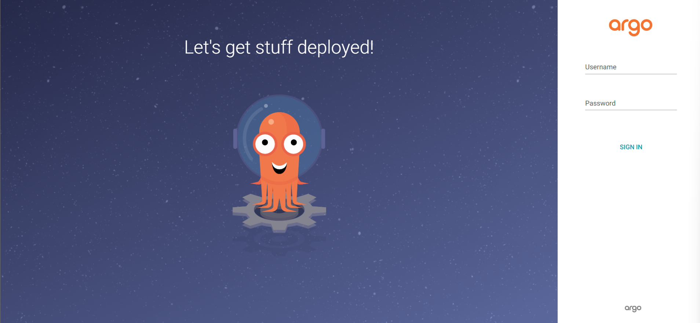


### ✔ 1-2. argocd 접속 확인

- Username : admin
- Password : xxxxx

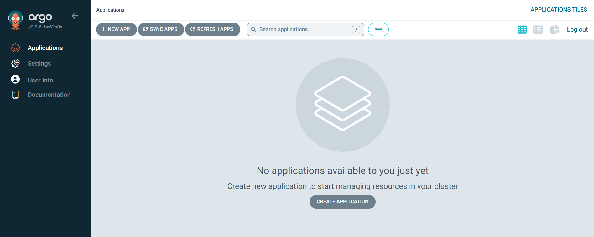

<details>
<summary> 😎 [참고 - 펼치기👇] 만약 비밀번호가 xxxxx이 아니라면</summary>

<br>

- k8s의 secret을 통해 비밀번호를 얻습니다.

- 아래 명령어를 cloud9에서 수행하여 argocd의 password을 얻습니다.

```bash
kubectl -n argocd get secret argocd-initial-admin-secret -o jsonpath="{.data.password}" | base64 -d; echo
```

</details>

<br>

## 2. argo-rollouts 설치

### ✔ 2-1. argo-rollouts 설치를 위한 네임스페이스 생성

```bash
kubectl create namespace argo-rollouts
```

### ✔ 2-2. argo-rollouts 네임스페이스 생성확인

```bash
kubectl get ns
```

- 결과 예시

```
NAME              STATUS   AGE
argo-rollouts     Active   23s
argocd            Active   7d
default           Active   7d6h
istio-system      Active   7d6h
kube-node-lease   Active   7d6h
kube-public       Active   7d6h
kube-system       Active   7d6h
```

``

### ✔ 2-3. pac workspace에서 Appliaction 추가화면 진입

- `Gitops Console` > `Workspace` > `PaC Workspace` > 나의 workspace 클릭
- `Create App`을 클릭

### ✔ 2-4. argo-rollouts create

**📌 [입력]**

> | 항목               | 내용                                       | 액션              |
> | ------------------ | ------------------------------------------ | ----------------- |
> | ➕ PaC Source Type | `Catalog`                                  | 👆🏻라디오박스 선택 |
> | ➕ Title           | `Search Catalog` 클릭 > argo-rollouts 선택 | 선택 후 `Select`  |

- `Create` 버튼 클릭

### ✔ 2-5. argo-rollouts pac detail 화면 진입

- pac 리스트에서 `argo-rollouts` 클릭

### ✔ 2-6. argo-rollouts register

**📌 [입력]**

> | 항목                | 내용                       | 액션                |
> | ------------------- | -------------------------- | ------------------- |
> | ➕ Target Namespace | `argo-rollouts`            | 🧲복사 & 📋붙여넣기 |
> | ➕ Select File      | `override-values-sds.yaml` | 👆🏻셀렉트박스 선택   |

- 입력후 register 클릭

### ✔ 2-7. argo-rollouts sync

- `sync` 클릭 후 health가 될떄까지 대기 (새로고침 및 Sync버튼 다시 클릭)

### ✔ 2-8. argo-rollouts 접속

- 브라우저에 `www.<<나의도메인>>.click` 을 입력하여 페이지를 확인합니다.

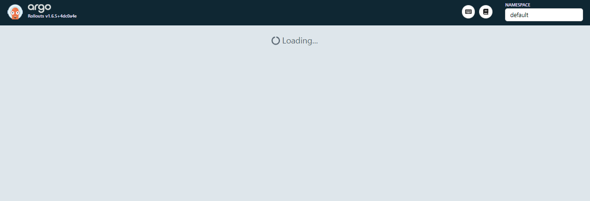

- 🔥🔥🔥CAA수강생 필독🔥🔥🔥

  - CAA수강생 분들은 미리 만들어 놓은 argocd-rollout으로 들어가시면 됩니다.
  - `www.caa-2024.click` 입니다

<br>

## 3. Cloud9 Git config

- 아래 명령어를 입력하여 cloud9의 git config 설정을 합니다.

```bash
git config --global user.email "<<나의 깃헙 계정 email>>"
```

```bash
git config --global user.name "<<나의 깃헙 username>>"
```


<br>

## 4. Helm 차트 생성

### ✔ 4-1. Github Repository 생성

- 자신의 Github에 `rollouts-demo`라는 이름의 Repository를 생성합니다.

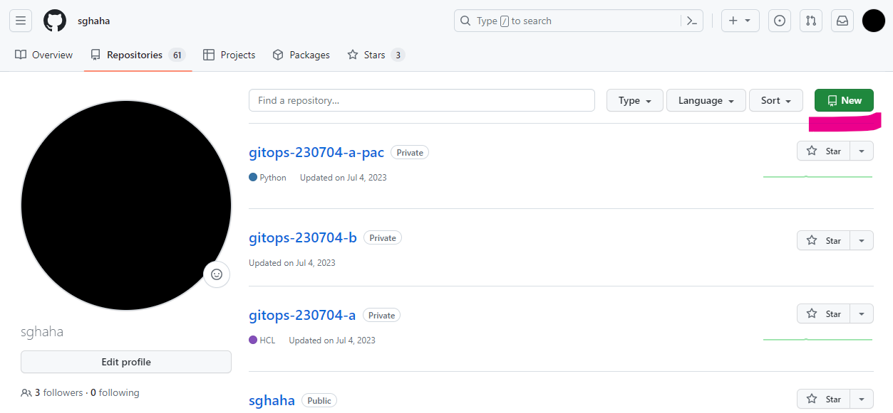

**📌 [입력]**

> | 항목               | 내용            | 액션                |
> | ------------------ | --------------- | ------------------- |
> | ➕ Repository name | `rollouts-demo` | 🧲복사 & 📋붙여넣기 |
> | ➕ 공개여부        | `Private`       | 👆🏻라디오버튼 선택   |

- `Create repository` 클릭

### ✔ 4-2. repo url 복사 및 메모

- 생성된 url을 `rollouts-demo URL`에 메모합니다.

### ✔ 4-3. Clone

- argocd 디렉토리를 생성합니다.

```bash
mkdir -p ~/environment/argocd
```

- 디렉토리로 이동

```bash
cd ~/environment/argocd
```

- git clone

```bash
git clone <<메모한 rollouts-demo url>>
```

- 나의 github username과 토큰을 입력합니다.

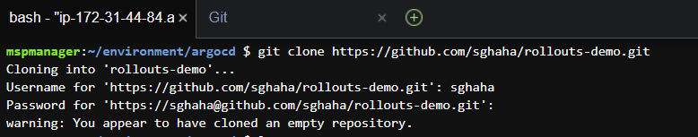

- clone 받은 디렉토리로 이동

```bash
cd rollouts-demo
```

### ✔ 4-4. helm차트 생성 (1)

- 🔥🔥🔥~/environment/argocd/rollouts-demo 디렉토리에서 작업합니다.🔥🔥🔥

```bash
cd ~/environment/argocd/rollouts-demo
```

<br>

- templates와 charts 생성

```bash
mkdir templates charts
```

- .helmignore 생성

```bash
cat << EOF > .helmignore
# Patterns to ignore when building packages.
# This supports shell glob matching, relative path matching, and
# negation (prefixed with !). Only one pattern per line.
.DS_Store
# Common VCS dirs
.git/
.gitignore
.bzr/
.bzrignore
.hg/
.hgignore
.svn/
# Common backup files
*.swp
*.bak
*.tmp
*.orig
*~
# Various IDEs
.project
.idea/
*.tmproj
.vscode/
EOF
```

- .helmignore 파일이 안보인다면 cloud9세팅에서 숨긴파일 보기를 해줍니다.

<br>

- Chart.yaml 생성

```bash
cat << EOF > Chart.yaml
apiVersion: v2
name: rollouts-demo
description: rollouts-demo chart for Kubernetes
version: 0.1.0
EOF
```

<br>


<br>

- `<<나의도메인>>` 부분을 수정합니다.

```bash
cat << EOF > values.yaml
replicas: 3
port: 8000

image:
  repository: public.ecr.aws/q2w5i2w9/biz-order
  tag: v1
  imagePullPolicy: IfNotPresent
  containerPort: 8081

domain: caa-2024.click
subdomain: $MY_ID
EOF
```

### ✔ 4-5. helm차트 생성 (2)

```bash
cd ~/environment/argocd/rollouts-demo
```

- templates 디렉토리 내부에 파일을 생성합니다.

<br>

- rollout

```bash
cat << EOF > templates/rollouts-demo-rollout.yaml
apiVersion: argoproj.io/v1alpha1
kind: Rollout
metadata:
  name: {{ .Release.Name }}
spec:
  replicas: {{ .Values.replicas }}
  selector:
    matchLabels:
      app: {{ .Release.Name }}
      version: v1
  template:
    metadata:
      labels:
        app: {{ .Release.Name }}
        version: v1
    spec:
      containers:
        - image: {{ .Values.image.repository }}:{{ .Values.image.tag }}
          imagePullPolicy: {{ default "Always" .Values.image.imagePullPolicy }}
          name: {{ .Release.Name }}
          ports:
            - containerPort: {{ .Values.image.containerPort }}
  strategy:
    blueGreen:
      activeService: {{ .Release.Name }}-active
      previewService: {{ .Release.Name }}-preview
      autoPromotionEnabled: false
EOF
```

<br>

- service

```bash
cat << EOF > templates/rollouts-demo-service.yaml
apiVersion: v1
kind: Service
metadata:
  name: {{ .Release.Name }}-active
  labels:
    app: {{ .Release.Name }}
spec:
  selector:
    app: {{ .Release.Name }}
  ports:
  - protocol: TCP
    port: {{ .Values.port }}
    targetPort: {{ .Values.image.containerPort }}
---
apiVersion: v1
kind: Service
metadata:
  name: {{ .Release.Name }}-preview
  labels:
    app: {{ .Release.Name }}
spec:
  selector:
    app: {{ .Release.Name }}
  ports:
    - protocol: TCP
      port: {{ .Values.port }}
      targetPort: {{ .Values.image.containerPort }}
EOF
```

<br>

- virtualService

```bash
cat << EOF > templates/istio-virtual-service.yaml
---
apiVersion: networking.istio.io/v1alpha3
kind: VirtualService
metadata:
  name: {{ .Release.Name }}-vs
spec:
  hosts:
  - "{{ .Values.subdomain }}.{{ .Values.domain }}"
  gateways:
  - istio-system/istio-gateway
  http:
  - match:
    - uri:
        exact: /
    - uri:
        prefix: /
    route:
    - destination:
        host: {{ .Release.Name }}-active ## 서비스명
        port:
          number: {{ .Values.port }}
EOF
```

<br>

## 5. Helm 차트 Github Push

### ✔ 5-1. cloud9 Source Control 이동

- 왼쪽 아이콘을 클릭하여 Source Control로 이동합니다.

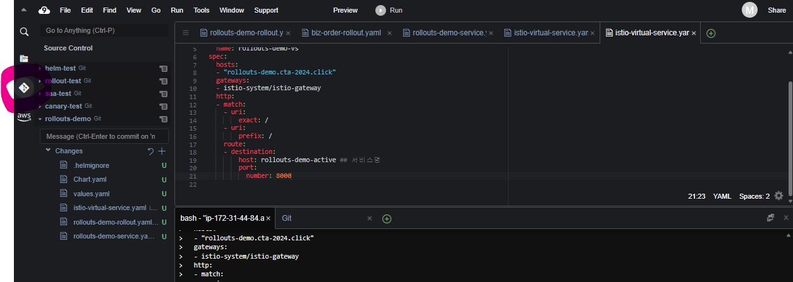

### ✔ 5-2. Commit

- rollouts-demo의 Changes부분을 화인하고 `+` 버튼을 클릭하여 Staged Changes 상태로 변경합니다.

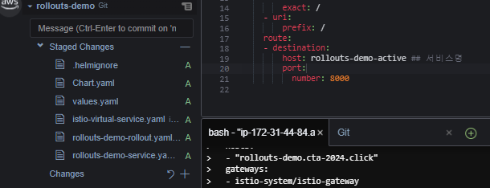

<br>

- commit 메시지를 입력하고 `Ctrl+Enter`

### ✔ 5-3. Push

- `오른쪽 아이콘` 클릭 > `Push` 클릭

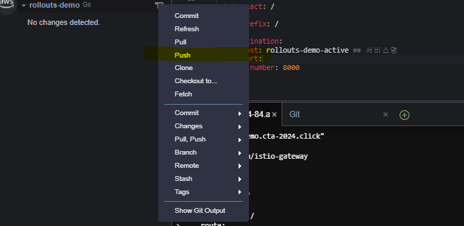

- `rollouts-demo` 클릭

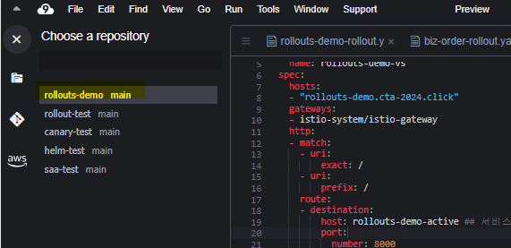

- Username 입력

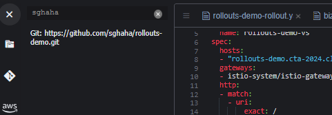

- Github token 입력

### ✔ 5-4. Github 확인

- 나의 Github > `rollouts-demo` repository에서 파일을 확인합니다.

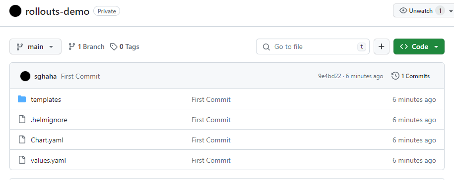

<br>

## 6. Argocd Project 등록

### ✔ 6-1. Projects 페이지 이동

- `Argocd 페이지` > `Settings` > `Projects`

### ✔ 6-2. Projects 등록 페이지 이동

- `NEW PROJECTS` 클릭

### ✔ 6-3. Projects 등록

**📌 [입력]**

> | 항목            | 내용            | 액션                                |
> | --------------- | --------------- | ----------------------------------- |
> | ➕ Project Name | `<<사번>>`      | 본인의 사번을 넣습니다. 예시: 33333 |
> | ➕ Description  | `<<본인 이름>>` | 각자의 이름을 넣습니다.             |

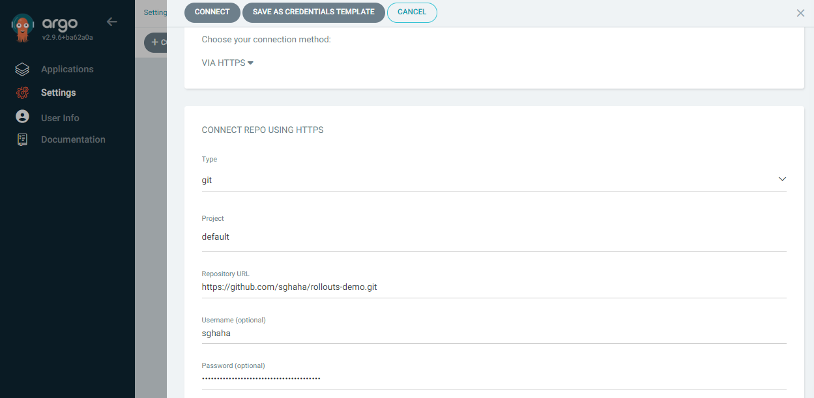

- 입력후 `Connect` 클릭

### ✔ 6-4. Destinations 추가

- 생성된 project 클릭 하여 상세 보기화면으로 이동
- `Destinations`의 `Edit` 클릭
- `ADD DESTINATION` 클릭
- `SAVE` 클릭

## 6. Argocd Repository 등록

### ✔ 6-1. Repository 페이지 이동

- `Argocd 페이지` > `Settings` > `Repositories`

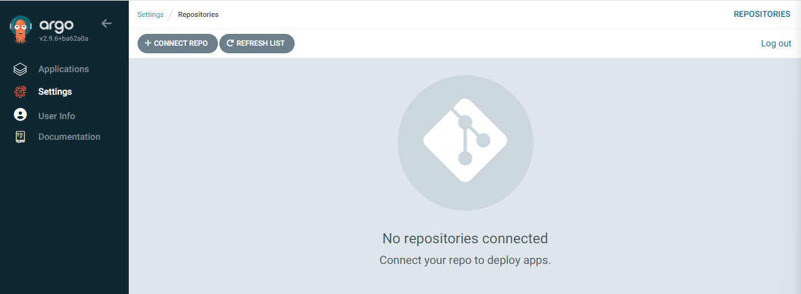

### ✔ 6-2. Repository 등록 페이지 이동

- `CONNECT REPO` 클릭

### ✔ 6-3. Repository 등록

**📌 [입력]**

> | 항목                             | 내용                           | 액션                                   |
> | -------------------------------- | ------------------------------ | -------------------------------------- |
> | ➕ Choose your connection method | `VIA HTTPS`                    | 👆🏻드롭박스 선택                        |
> | ➕ Project                       | `<<나의 Project>>`             | 윗챕터에서 만든 프로젝트를 선택합니다. |
> | ➕ Repository URL                | `<<rollouts-demo repo의 url>>` | 🧲복사 & 📋붙여넣기                    |
> | ➕ Username                      | `<<나의 Github Username>>`     | 🧲복사 & 📋붙여넣기                    |
> | ➕ Password                      | `<<나의 Github Token>>`        | 🧲복사 & 📋붙여넣기                    |


- 입력후 `Connect` 클릭

### ✔ 6-4. Repository 등록 확인

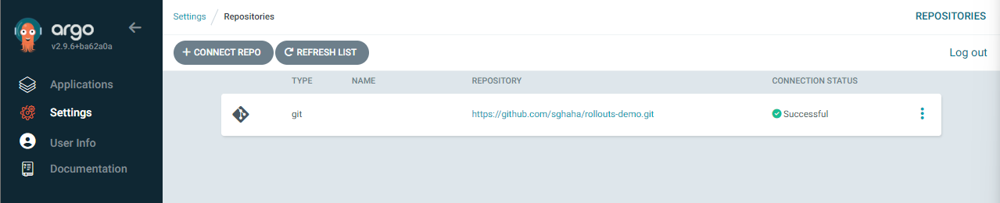

<br>

## 7. Argocd Application 등록

### ✔ 7-1. Application 등록 페이지 이동

- 생성된 Repository의 `...`버튼 클릭 > `Create application` 클릭

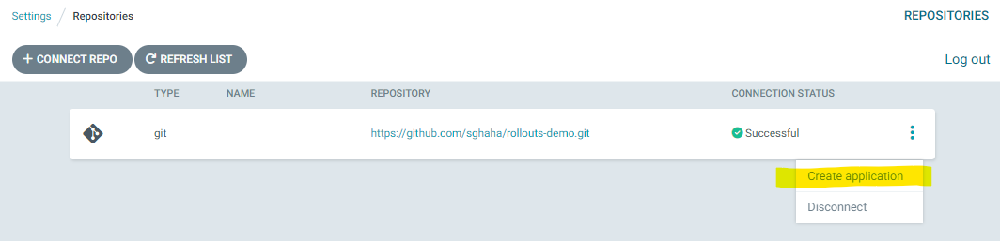

### ✔ 7-2. Application 등록

**📌 [입력]**

> | 항목                         | 내용                             | 액션                                   |
> | ---------------------------- | -------------------------------- | -------------------------------------- |
> | ➕ Application Name          | `rollouts-demo`                  | 🧲복사 & 📋붙여넣기                    |
> | ➕ Project Name              | `<<나의 Project>>`               | 윗챕터에서 만든 프로젝트를 선택합니다. |
> | ➕ SOURCE > Repo url         | `<<rollouts-demo repo url>>`     | 👆🏻드롭박스 선택                        |
> | ➕ SOURCE > Path             | `.`                              | 🧲복사 & 📋붙여넣기                    |
> | ➕ DESTINATION > Cluster URL | `https://kubernetes.default.svc` | 👆🏻드롭박스 선택                        |
> | ➕ DESTINATION > Namespace   | `<<사번>>`                       | 🧲복사 & 📋붙여넣기                    |

- 입력후 `Create`

### 7-3. Application 등록 확인

- 오른쪽 프로젝트에서 나의 프로젝트를 필터링 합니다.

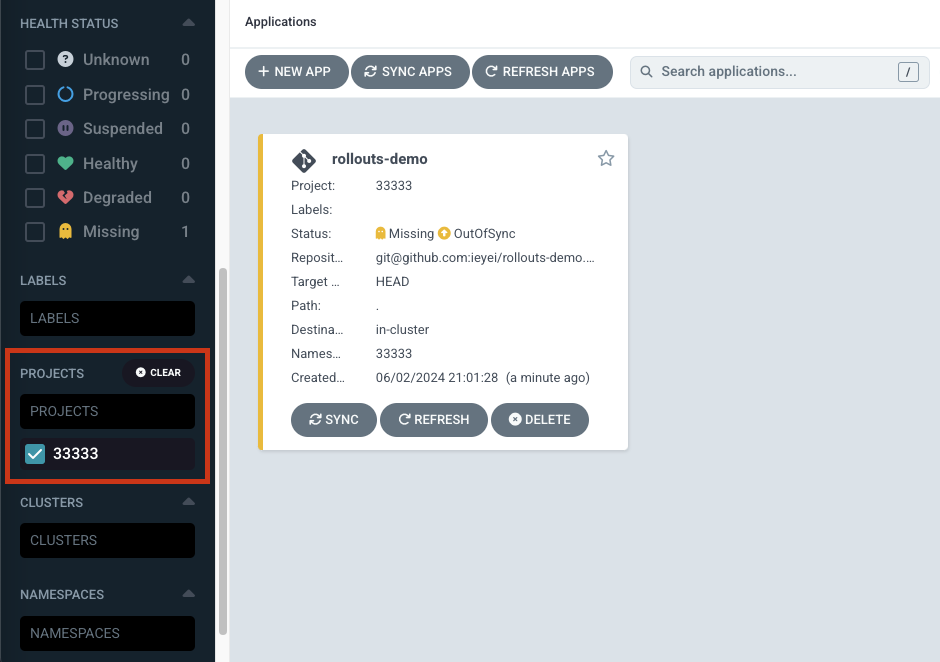

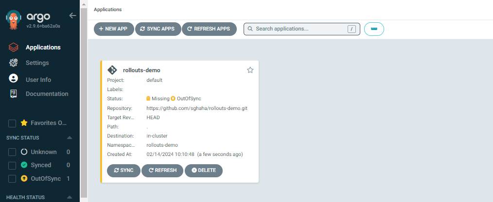

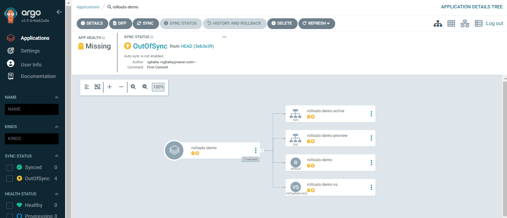

### 7-4. Sync

- `SYNC` > `SYNCHRONIZE` 버튼을 클릭하여 Sync 합니다.

### 7-5. Sync 확인

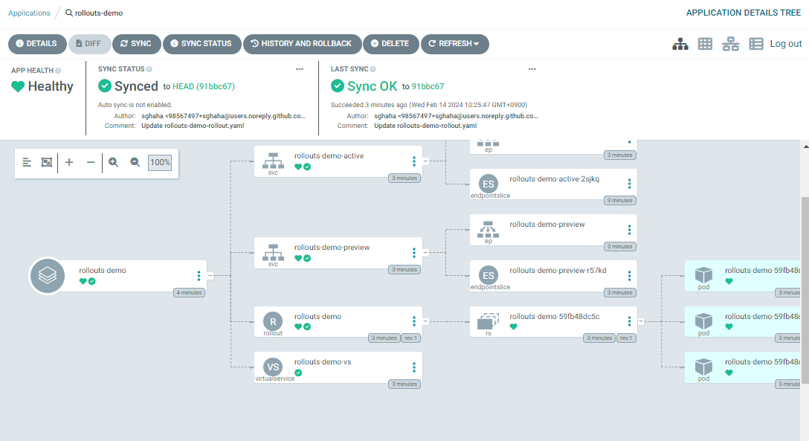

<br>

## 8. Sub Domain 등록

- rollouts-demo 페이지 확인을 위해 서브도메인을 등록합니다.

- 🔥🔥🔥CAA 수강생분들🔥🔥🔥
  - 여러분은 `<<사번>>.caa-2024.click`으로 바로 확인 가능합니다. 예시) 33333.caa-2024.click

### ✔ 8-1. Route53 콘솔 접속

- AWS Console에서 🔗[Route53](https://us-east-1.console.aws.amazon.com/route53/v2/home?region=ap-northeast-2#) 서비스로 이동한다.
- AWS Console > Route53

### ✔ 8-2. Hosted Zones 이동

- `Hosted Zones` 클릭 > 나의 도메인 클릭

### ✔ 8-3. Create Record

- `Create Record`클릭

<br>

**📌 [입력]**

> | 항목                            | 내용                             | 액션                |
> | ------------------------------- | -------------------------------- | ------------------- |
> | ➕ subdomain                    | `rollouts-demo`                  | 🧲복사 & 📋붙여넣기 |
> | ➕ Record Type                  | `A`                              | 👆🏻드롭박스 선택     |
> | ➕ Alias                        | `on`                             | 🟢스위치 ON         |
> | ➕ Choose endpoint              | `Alias to Network Load Balancer` | 👆🏻드롭박스 선택     |
> | ➕ Choose Region                | `Asia Pacific`                   | 👆🏻드롭박스 선택     |
> | ➕ Choose network load balancer | `<<나의 NLB>>`                   | 👆🏻드롭박스 선택     |

- 입력후 `Create records`

<br>

## 9. 페이지 확인

- https://rollouts-demo.`<나의도메인>`.click 을 통해 접속합니다.

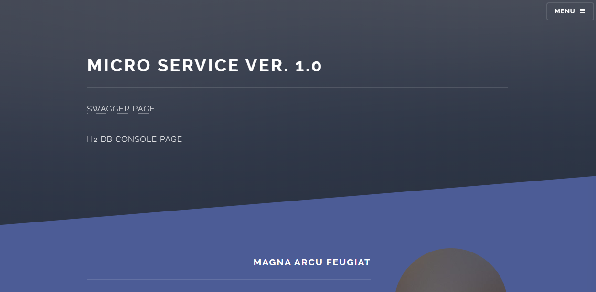

<br>

## 10. Argo Rollout - Bluegreen 배포

- argo rollout을 이용한 bluegreen 배포를 실습합니다.

### ✔ 10-1. 현재 버전 확인

- 현재버전은 main 버전입니다. (`MICRO SERVICE VER. 1.0`)

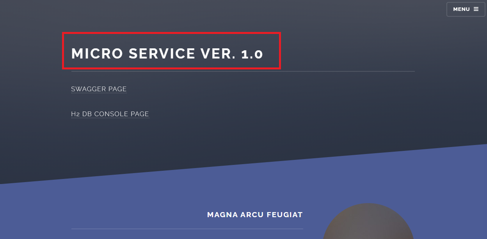

### ✔ 10-2. rollouts-demo-rollout.yaml 확인

- `rollouts-demo-rollout.yaml` 파일을 확하면 23번 라인부터 아래 내용을 확인 할 수 있습니다.

```
  strategy:
    blueGreen:
      activeService: {{ .Release.Name }}-active   ##
      previewService: {{ .Release.Name }}-preview
      autoPromotionEnabled: false
```

- 설명
  - 블루그린 방식을 사용하여 배포전략 정의
  - `activeService` : 활성 상태의 서비스 이름으로, {{ .Release.Name }}-active로 설정
  - `previewService`: 미리보기(프리뷰) 상태의 서비스 이름으로, {{ .Release.Name }}-preview로 설정됩니다. 이는 새 버전을 배포하기 전에 테스트하거나 검증 목적으로 사용할 수 있는 프리뷰 버전의 서비스를 나타냅니다.
  - `autoPromotionEnabled` : 자동 승격 기능을 활성화할지 여부를 설정합니다. 여기서는 false로 설정되어 있어, 자동으로 프리뷰 버전을 활성 버전으로 승격시키지 않겠다는 의미입니다.

### ✔ 10-3. image tag 변경

- `~/environment/argocd/rollouts-demo/values.yaml` 의 내용을 아래와 같이 수정합니다.

```
<<생략>>
image:
  repository: public.ecr.aws/q2w5i2w9/biz-order
  tag: v2 ################################# v2로 변경
<<생략>>

```

### ✔ 10-4. cloud9 Source Control 이동

- 왼쪽 아이콘을 클릭하여 Source Control로 이동합니다.


### ✔ 10-5. Commit

- rollouts-demo의 Changes부분을 화인하고 `+` 버튼을 클릭하여 Staged Changes 상태로 변경합니다.

- commit 메시지를 입력하고 `Ctrl+Enter`

### ✔ 10-6. Push

- `오른쪽 아이콘` 클릭 > `Push` 클릭

- `rollouts-demo` 클릭

- Username 입력

- Github token 입력

### ✔ 10-7. Sync

- argocd의 application으로 들어가 sync합니다.

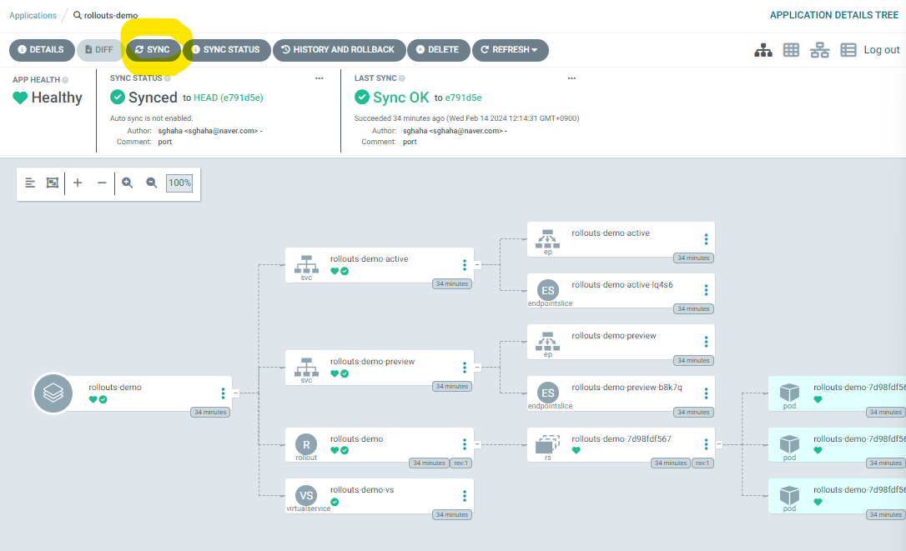

### ✔ 10-8. Sync 확인

1. pod가 두배로 늘어납니다
2. App Health가 Suspended 상태로 머물러 있습니다.

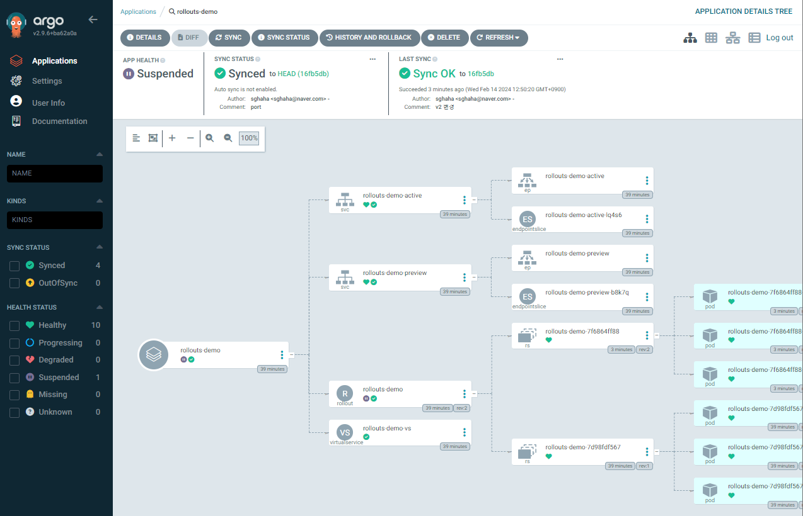

### ✔ 10-9. 페이지 확인

- https://rollouts-demo.`<나의도메인>`.click 을 통해 나의 페이지를 확인합니다. (CAA : https://<<사번>>.caa-2024.click )
- 여러번 새로고침 합니다.(Ctrl+F5도 해봅니다)
- 아직 배포가 되지 않은 것을 확인할 수 있습니다.

### ✔ 10-10. argo rollout 페이지 접속

- https://www.`<나의도메인>`.click/rollouts/rollouts-demo 을 통해 argo-rollout페이지에 접속합니다. (CAA : https://www.caa-2024.click )

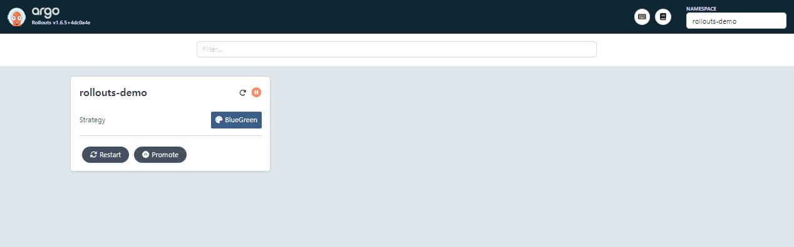

<br>

- 🔥🔥🔥상단의 namespace에서 나의 namespace를 선택합니다.🔥🔥🔥

- `rollouts-demo` 앱을 클릭하여 상세보기 화면에 접속합니다.

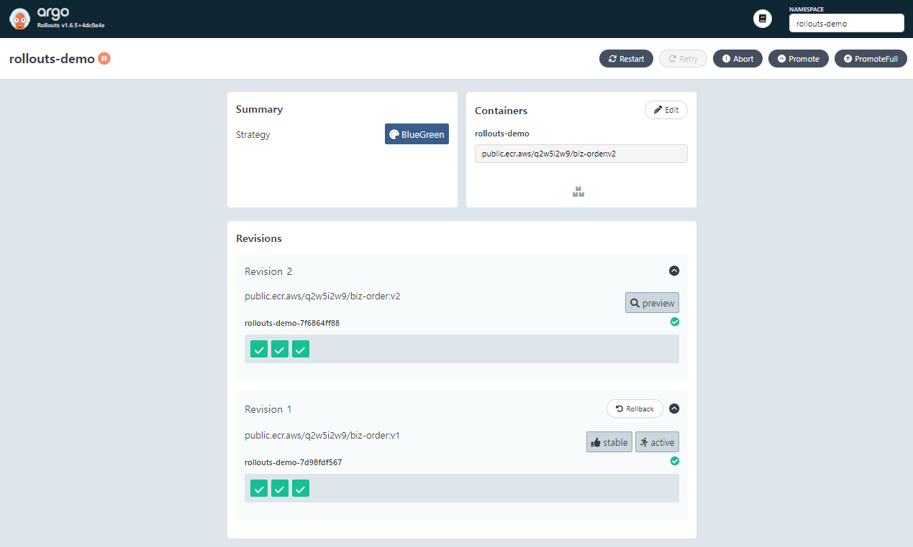

### ✔ 10-11. Promote

- 상단의 `Promote`버튼을 클릭하여 배포를 진행합니다.
- `Are you sure?` > `yes`

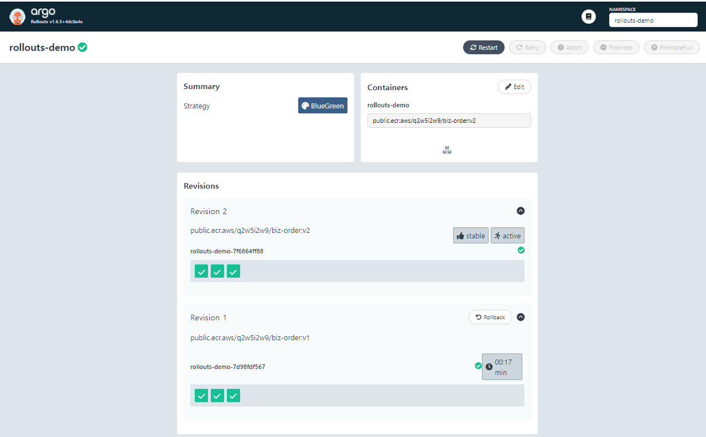

- 시간이 지나면 old버전의 pod들은 destroy됩니다.

### ✔ 10-12. 페이지 확인

- https://rollouts-demo.`<나의도메인>`.click 을 통해 나의 페이지를 확인합니다. (CAA : https://<<사번>>.caa-2024.click )
- 여러번 새로고침 합니다.(Ctrl+F5도 해봅니다)
- DEV 버전으로 배포가 된것을 확인할 수 있습니다.

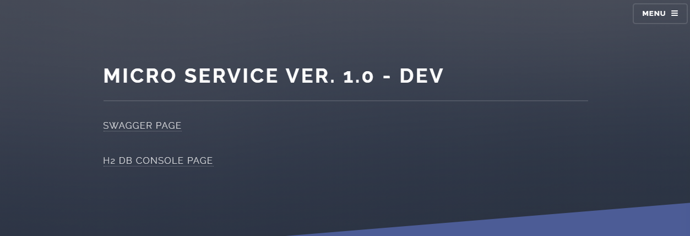

<br>

## 11. Argo Rollout - Canary 배포 준비

- argo rollout을 이용한 Canary 배포를 실습하기위한 준비과정 입니다.

### ✔ 11-1. Helm차트 수정 설명

- Cnanry배포를 좀 더 시각적으로 확인할수 App으로 교체합니다.
- 배포방식을 카나리 방식으로 변경합니다.

### ✔ 11-2. value.yaml 변경

- `~/environment/argocd/rollouts-demo/values.yaml`을 아래와 같이 수정합니다.

```
replicas: 10 ## pod 개수 10개
port: 8000

image:
  repository: argoproj/rollouts-demo ###이미지 변경
  tag: blue ##태그는 blue
  imagePullPolicy: IfNotPresent
  containerPort: 8080 ###컨테이너 포트 변경
<<생략>>
```

### ✔ 11-3. rollouts-demo-rollout.yaml 변경

- `~/environment/argocd/rollouts-demo/templates/rollouts-demo-rollout.yaml`을 아래와 같이 수정합니다.

```yaml
apiVersion: argoproj.io/v1alpha1
kind: Rollout
metadata:
  name: {{ .Release.Name }}
spec:
  replicas: {{ .Values.replicas }}
  selector:
    matchLabels:
      app: {{ .Release.Name }}
      version: v1
  template:
    metadata:
      labels:
        app: {{ .Release.Name }}
        version: v1
    spec:
      containers:
        - image: {{ .Values.image.repository }}:{{ .Values.image.tag }}
          imagePullPolicy: {{ default "Always" .Values.image.imagePullPolicy }}
          name: {{ .Release.Name }}
          ports:
            - containerPort: {{ .Values.image.containerPort }}
  strategy:  #### 이 라인부터 수정내용입니다.
    canary:
      maxSurge: "25%"
      maxUnavailable: 0
      steps:
      - setWeight: 20
      - pause: {}
      - setWeight: 50
      - pause: {duration: 60}
      - setWeight: 100
```

### ✔ 11-4. rollouts-demo-rollout.yaml 변경내용 설명

- 배포전략을 canary방식으로 설정합니다.
- `maxSurge` : 추가적으로 생성될 수 있는 파드의 수 또는 비율을 정의합니다. "25%"로 설정되어 있어서, 배포 중에 요청된 파드 수의 최대 25%까지 추가로 생성할 수 있음을 의미합니다.
- `maxUnavailable` : 서비스가 이용할 수 없게 되는 최대 파드의 수 또는 비율을 정의합니다. 여기서는 0으로 설정되어 있어, 배포 동안 모든 파드가 이용 가능해야 함을 의미합니다.
- `steps` : 배포 프로세스를 단계별로 정의합니다.
- `setWeight: 20` : 첫 스텝입니다. 새 버전의 파드에 20%의 트래픽을 전송하도록 설정합니다.
- `pause: {}` : 수동으로 진행을 재개할 때까지 배포를 일시 중지합니다
- `pause: {duration: 60}` : 배포를 60초 동안 일시 중지합니다.

### ✔ 11-5. cloud9 Source Control 이동

- Cloud9의 Source Control로 이동합니다.

### ✔ 11-6. Commit

- rollouts-demo의 Changes부분을 화인하고 `+` 버튼을 클릭하여 Staged Changes 상태로 변경합니다.

- commit 메시지를 입력하고 `Ctrl+Enter`

### ✔ 11-7. Push

- `오른쪽 아이콘` 클릭 > `Push` 클릭

- `rollouts-demo` 클릭

- Username 입력

- Github token 입력

### ✔ 11-8. Sync

- argocd의 application으로 들어가 sync합니다.

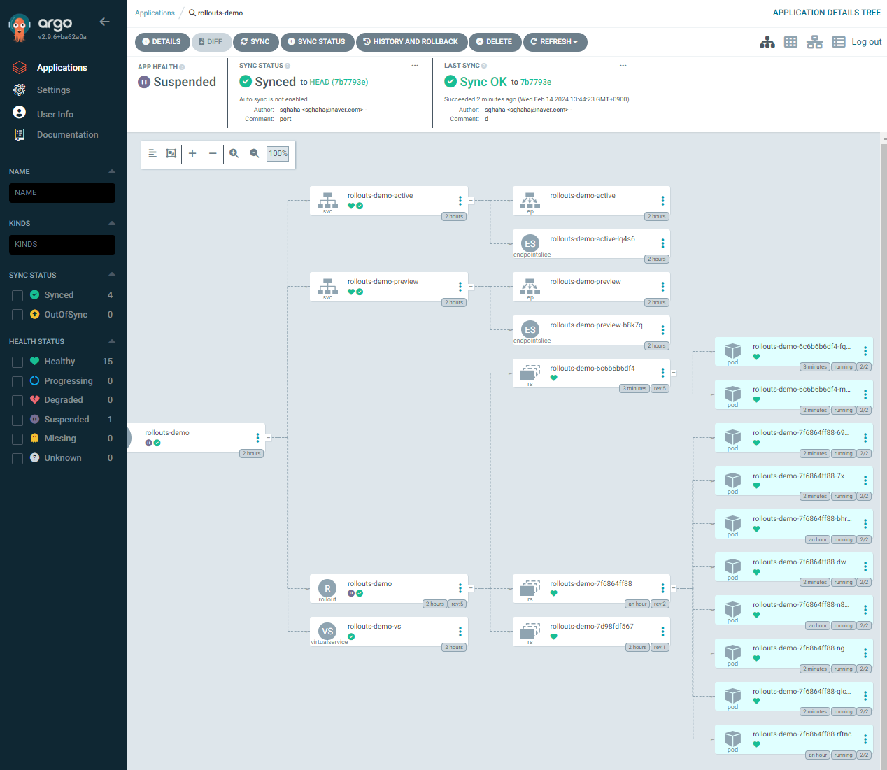

### ✔ 11-9. 서비스 교체

- 현재 같은 argo application에서 컨테이너 이미지 자체를 바꾸었기 때문에 서비스가 불안정합니다.
- 우선 새버전으로 배포해줍니다.

### ✔ 11-10. argo rollout promote

- argo rollout 페이지에 접속하여 `promote` 합니다.
- 시간이 지나면 배포가 완료됩니다.

<br>
- promote 전
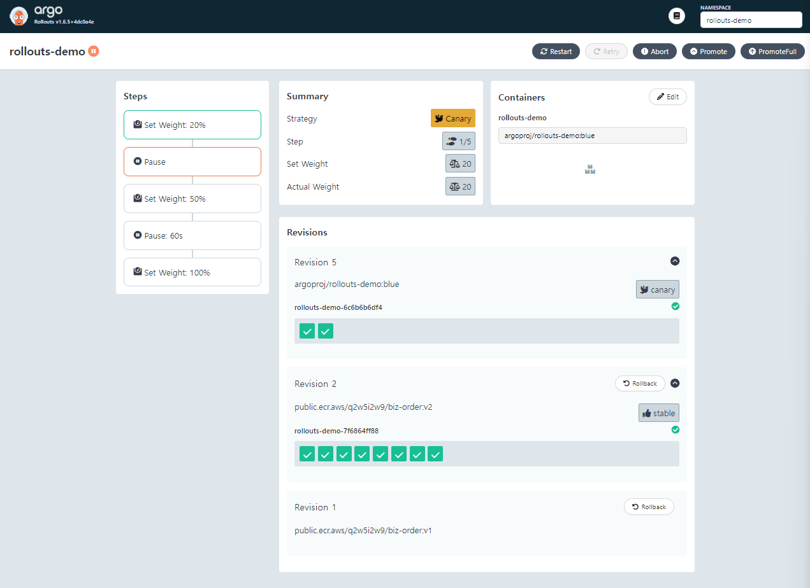

<br>

- 배포 완료 후

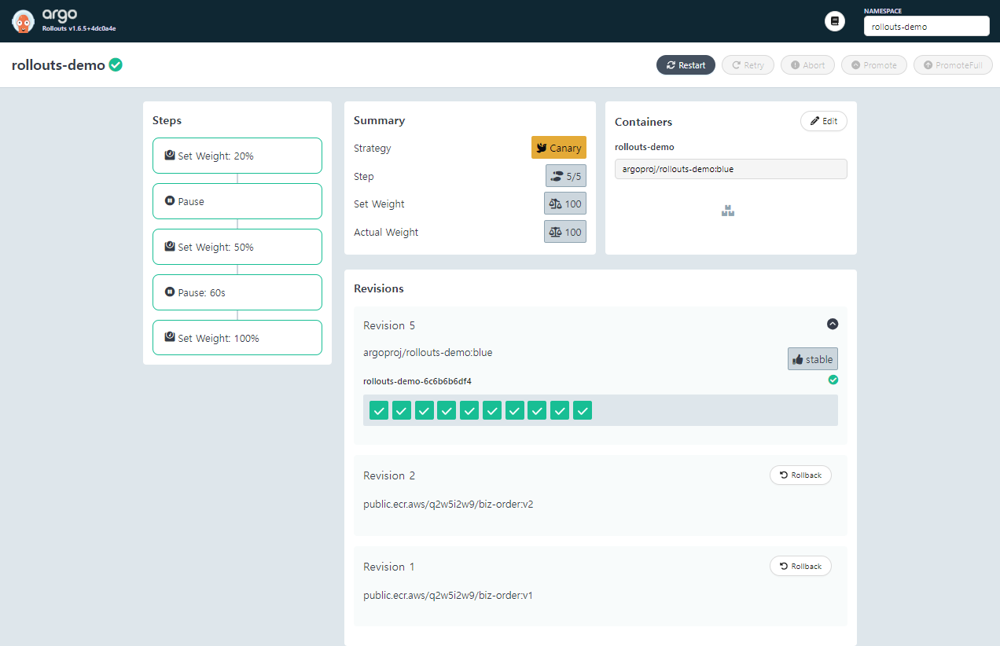

<br>

- 배포 완료 후 argocd 화면

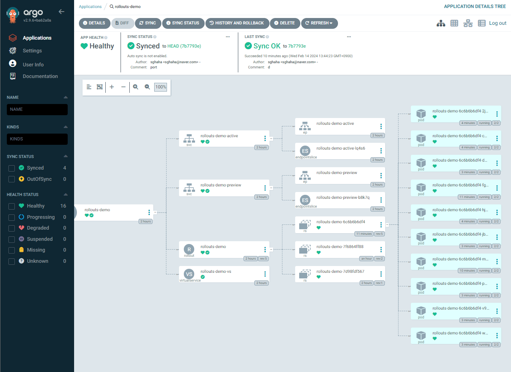

### ✔ 11-11. 서비스 확인

- https://rollouts-demo.`<나의도메인>`.click 을 통해 나의 페이지를 확인합니다. (CAA : https://<<사번>>.caa-2024.click)
- 여러번 새로고침 합니다.(Ctrl+F5도 해봅니다)

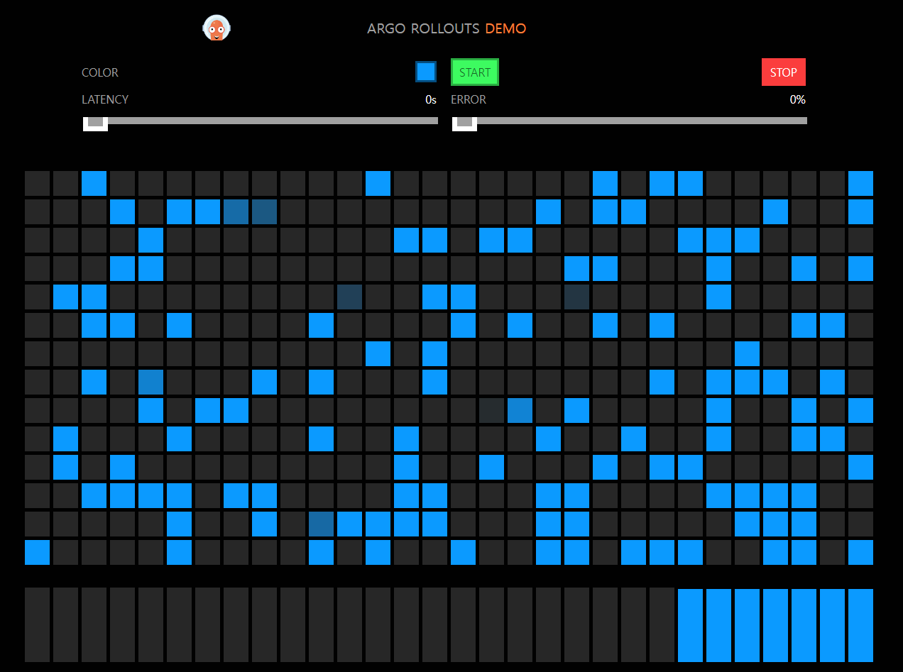

- 모든 서비스가 blue 버전으로 서비스 되는것을 확인할 수 있습니다.

<br>

## 12. Argo Rollout - Canary 배포

### ✔ 12-1. image tag 변경

- `~/environment/argocd/rollouts-demo/values.yaml` 의 내용을 아래와 같이 수정합니다.

```yaml
replicas: 10
port: 8000

image:
  repository: argoproj/rollouts-demo
  tag: green ############################### green으로 변경
  imagePullPolicy: IfNotPresent
  containerPort: 8080
```

### ✔ 12-2. cloud9 Source Control 이동

- 왼쪽 아이콘을 클릭하여 Source Control로 이동합니다.

### ✔ 12-3. Commit

- rollouts-demo의 Changes부분을 화인하고 `+` 버튼을 클릭하여 Staged Changes 상태로 변경합니다.

- commit 메시지를 입력하고 `Ctrl+Enter`

### ✔ 12-4. Push

- `오른쪽 아이콘` 클릭 > `Push` 클릭

- `rollouts-demo` 클릭

- Username 입력

- Github token 입력

### ✔ 12-5. Sync

- argocd의 application으로 들어가 sync합니다.

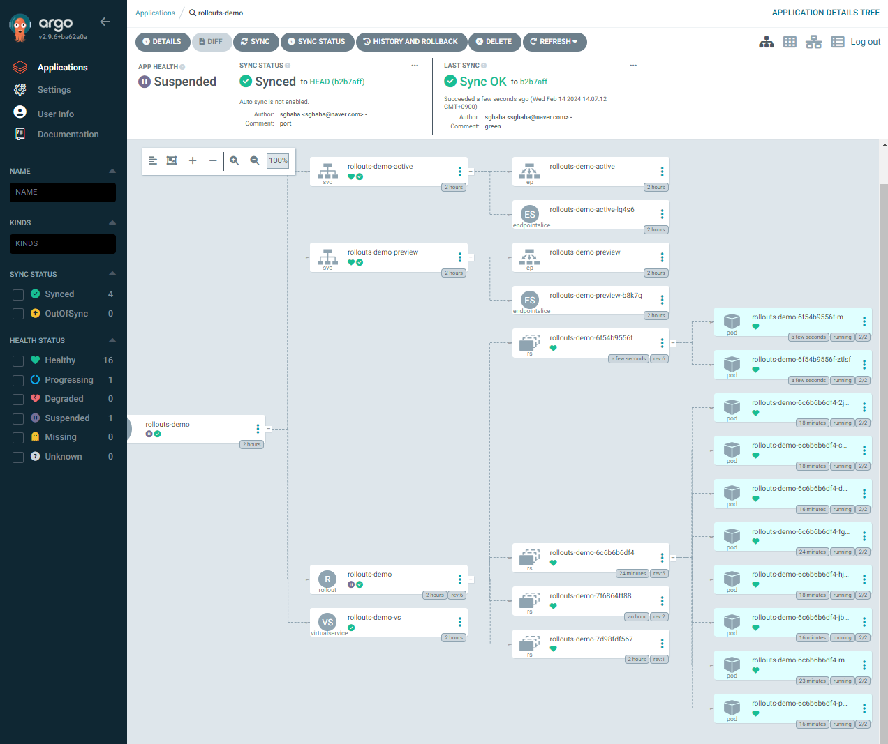

### ✔ 12-6. 서비스 확인

- https://rollouts-demo.`<나의도메인>`.click 을 통해 나의 페이지를 확인합니다. (CAA : https://<<사번>>.caa-2024.click)
- 여러번 새로고침 합니다.(Ctrl+F5도 해봅니다)

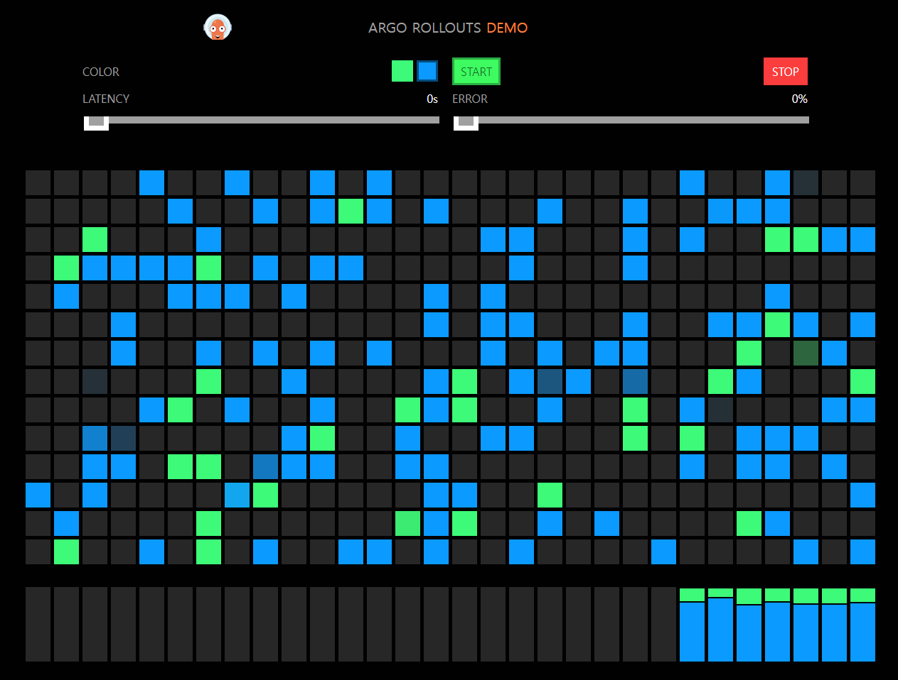

- 20%정도의 서비스가 green 버전으로 서비스 되는것을 확인할 수 있습니다.

### ✔ 12-7. argo rollout 페이지 확인

- 일시정지 상태로 된것을 확인 할 수 있습니다.

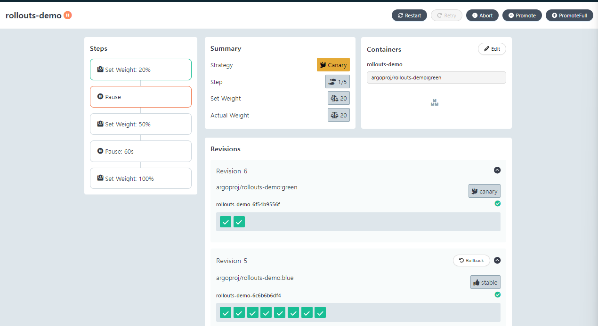

- `Promote` > Are you sure? > `Yes` 를 클릭합니다.

### ✔ 12-8. 서비스 확인

- https://rollouts-demo.`<나의도메인>`.click 을 통해 나의 페이지를 확인합니다. (CAA : https://<<사번>>.caa-2024.click)
- 여러번 새로고침 합니다.(Ctrl+F5도 해봅니다)

- 5:5의 비율로 blue 버전과 green 버전이 서비스 됨을 확인 할 수 있습니다.

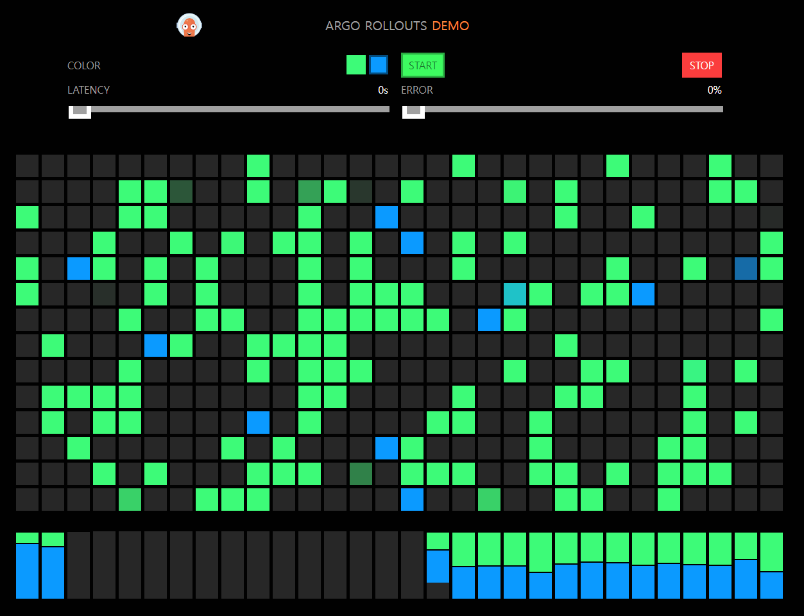

- 시간이 지난후엔 green 버전으로 모두 배포가 됩니다.

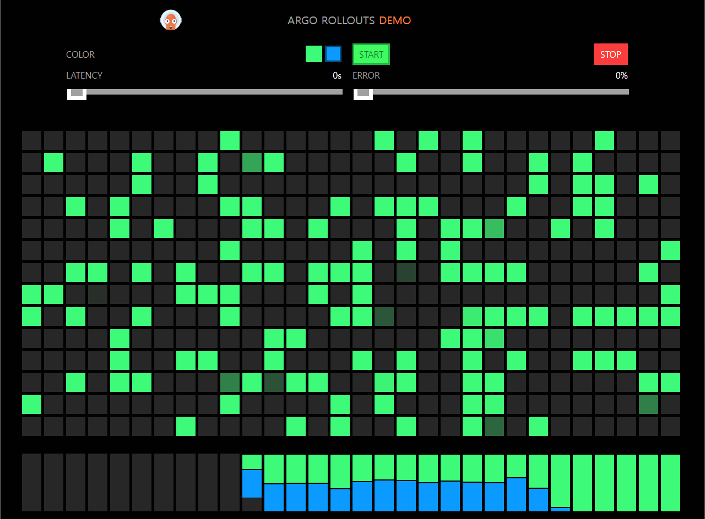
