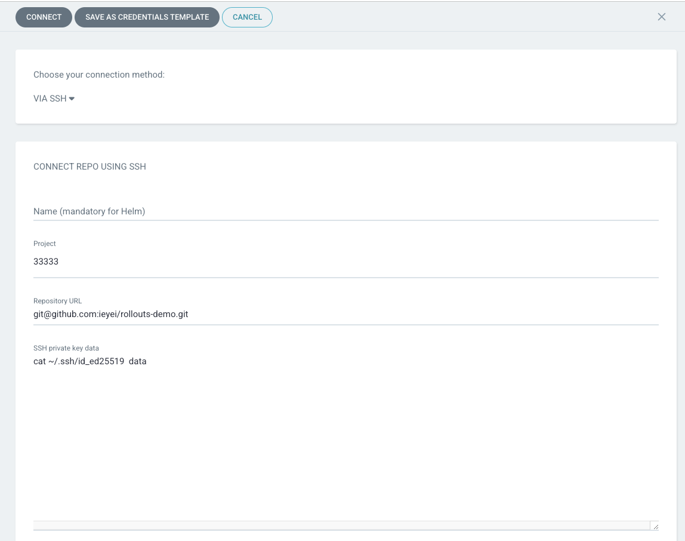
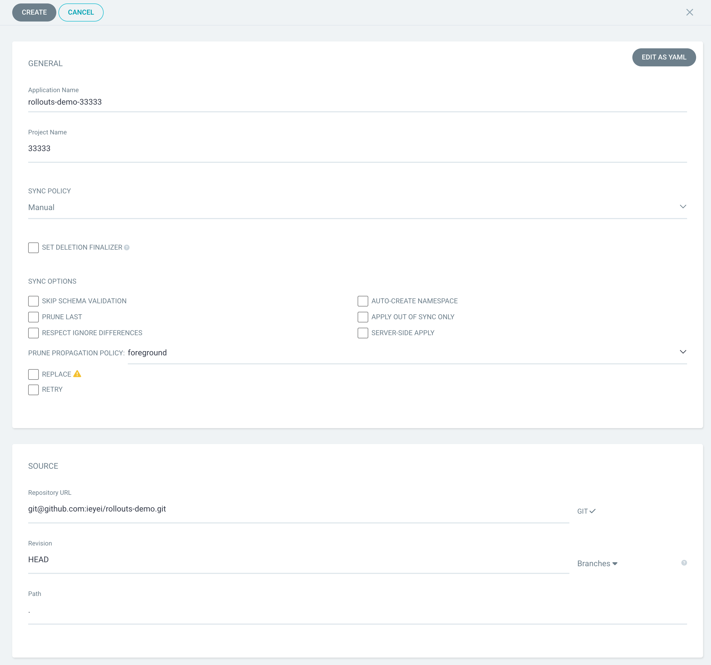
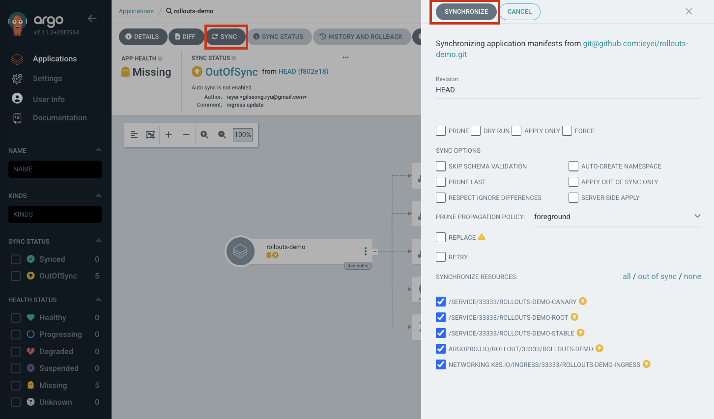
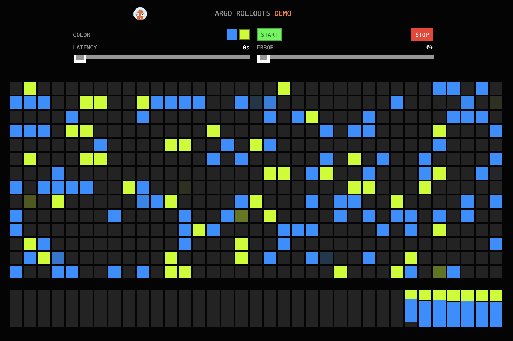
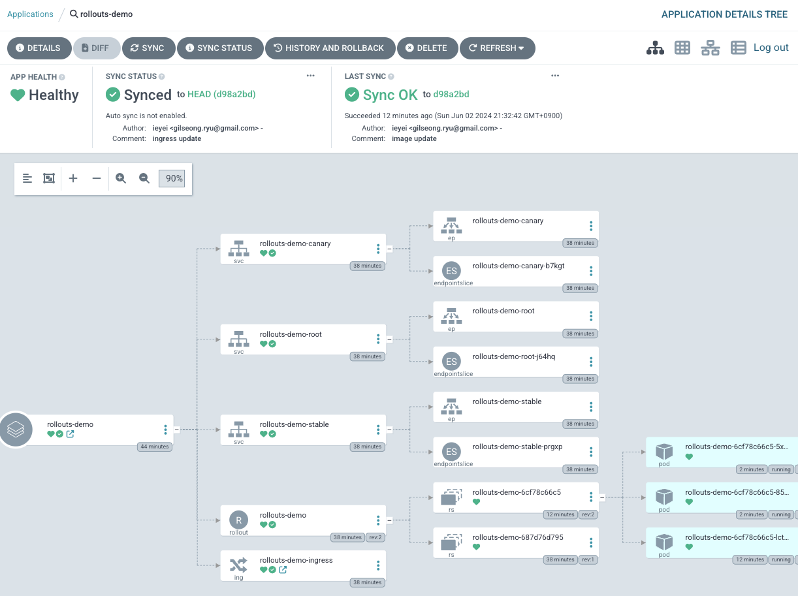
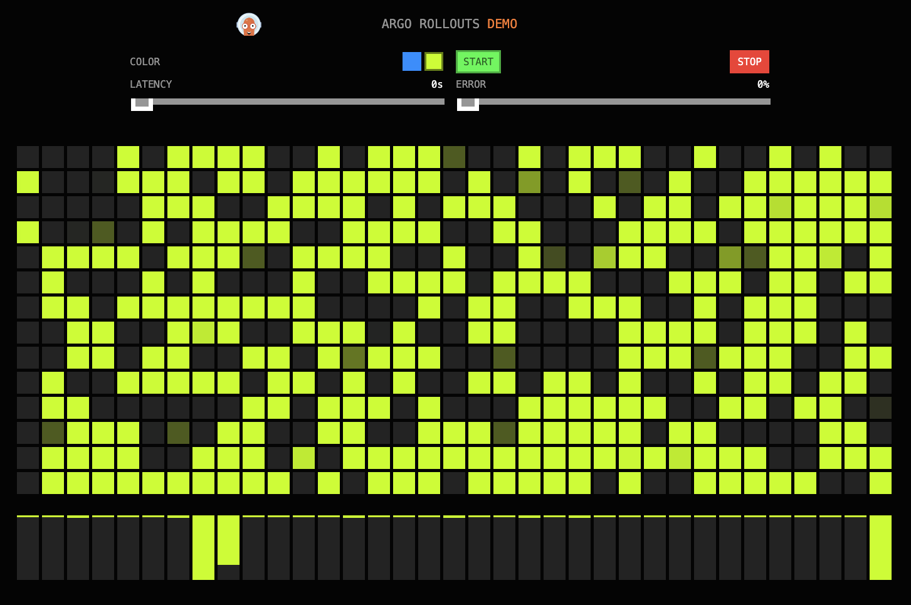

# 7일차 - Lab 2. Application 배포 - Canary Deploy

> [!NOTE]
> 실습목표 : ArgoCD와 Rollout을 이용하여 Application 배포에 대해 실습합니다.

---

- [7일차 - Lab 2. Application 배포]
  - [0. 환경 설정](#0-환경-설정)
  - [1. argocd 접속](#1-argocd-접속)
  - [2. argo-rollouts 설치](#2-argo-rollouts-설치)
  - [3. Cloud9 Git config](#3-cloud9-git-config)
  - [4. Rollout code 생성](#4-Rollout-code-생성)
  - [5. Code Push](#5-Code-Push)
  - [6. Argocd Project 등록](#6-argocd-project-등록)
  - [7. Argocd Repository 등록](#7-argocd-repository-등록)
  - [8. Argocd Application 등록](#8-argocd-application-등록)
  - [9. Argo Rollout - Canary 배포](#9-Argo-Rollout-Canary-배포)

---


## 0. 환경 설정

### 0-1. 환경변수 설정

- 나의 사번을 환경 변수로 설정합니다.
- <<사번>>를 나의 사번으로 변경후 명령어를 수행합니다.

```bash
export MY_ID=<<사번>>
```

- 예시 : `export MY_ID=33333`

### 0-2. 환경변수 확인

```bash
echo $MY_ID
```

- 결과 예시

```
mspmanager:~/environment $ echo $MY_ID
22222
```

### 0-3. namespace 생성

```bash
kubectl create ns $MY_ID
```

### 0-4. kubeconfig context 설정 
```bash
kubectl config set-context --current --namespace $MY_ID
```

<br>

## 1. argocd 접속

### 1-1. argocd 접속

- 브라우저에 `argocd ui address` 를 입력하여 페이지를 확인합니다. 


### 1-2. argocd 접속 확인

- Username : admin
- Password : xxxxx


<details>
<summary> 😎 [참고 - 펼치기👇] 만약 비밀번호가 xxxxx이 아니라면</summary>

<br>

- k8s의 secret을 통해 비밀번호를 얻습니다.

- 아래 명령어를 cloud9에서 수행하여 argocd의 password을 얻습니다.

```bash
kubectl -n argocd get secret argocd-initial-admin-secret -o jsonpath="{.data.password}" | base64 -d; echo
```

</details>

<br>

## 2. argo-rollouts 설치

### 2-1. argo-rollouts 설치를 위한 네임스페이스 생성

```bash
kubectl create namespace argo-rollouts
```

### 2-2. argo-rollouts 네임스페이스 생성확인

```bash
kubectl get ns
```

- 결과 예시

```
NAME              STATUS   AGE
argo-rollouts     Active   21h
argocd            Active   6d23h
default           Active   8d
kube-node-lease   Active   8d
kube-public       Active   8d
kube-system       Active   8d
```

``

### 2-3. argo-rollouts 설치

```bash
kubectl apply -n argo-rollouts -f https://github.com/argoproj/argo-rollouts/releases/latest/download/install.yaml
```

### 2-4. Kubectl Plugin Installation

1. Install Argo Rollouts Kubectl plugin with curl
```bash
curl -LO https://github.com/argoproj/argo-rollouts/releases/latest/download/kubectl-argo-rollouts-linux-amd64
```


2. Make the kubectl-argo-rollouts binary executable.
```bash
chmod +x ./kubectl-argo-rollouts-linux-amd64
```

3. Move the binary into your PATH.
```bash
sudo mv ./kubectl-argo-rollouts-linux-amd64 /usr/local/bin/kubectl-argo-rollouts
```

4. 확인
```bash
kubectl argo rollouts version
```


## 3. Cloud9 Git config

- 아래 명령어를 입력하여 cloud9의 git config 설정을 합니다.

```bash
git config --global user.email "<<나의 깃헙 계정 email>>"
```

```bash
git config --global user.name "<<나의 깃헙 username>>"
```


<br>

## 4. Rollout code 생성

### 4-1. Github Repository 생성

- 자신의 Github에 `rollouts-demo`라는 이름의 Repository를 생성합니다.


** [입력]**

> | 항목               | 내용            | 액션                |
> | ------------------ | --------------- | ------------------- |
> | ➕ Repository name | `rollouts-demo` | Copy & Paste |
> | ➕ 공개여부        | `Private`       | 라디오버튼 선택   |
> | ➕ README        | `Add a README file`       | Check   |

- `Create repository` 클릭

### 4-2. repo url 설정

```bash
export ROLLOUTS_DEMO_URL="<< my github repo url >>"
```

### 4-3. Clone

- 디렉토리로 이동

```bash
cd ~/environment
```

- git clone

```bash
git clone $ROLLOUTS_DEMO_URL
```


- clone 받은 디렉토리로 이동

```bash
cd rollouts-demo
```


### 4-4. rollouts-demo 생성


- ingress.yaml 생성

```bash
cat << EOF > ingress.yaml
apiVersion: networking.k8s.io/v1
kind: Ingress
metadata:
  name: rollouts-demo-ingress
  annotations:
    kubernetes.io/ingress.class: alb
    alb.ingress.kubernetes.io/scheme: internet-facing
    alb.ingress.kubernetes.io/target-type: ip
spec:
  rules:
  - http:
      paths:
      - path: /
        pathType: Prefix
        backend:
          service:
            name: rollouts-demo-root
            port:
              name: use-annotation
EOF
```

- service.yaml 생성

```bash
cat << EOF > service.yaml
apiVersion: v1
kind: Service
metadata:
  name: rollouts-demo-root
spec:
  type: NodePort
  ports:
  - port: 80
    targetPort: http
    protocol: TCP
    name: http
  selector:
    app: rollouts-demo

---
apiVersion: v1
kind: Service
metadata:
  name: rollouts-demo-canary
spec:
  type: NodePort
  ports:
  - port: 80
    targetPort: http
    protocol: TCP
    name: http
  selector:
    app: rollouts-demo
    # This selector will be updated with the pod-template-hash of the canary ReplicaSet. e.g.:
    # rollouts-pod-template-hash: 7bf84f9696

---
apiVersion: v1
kind: Service
metadata:
  name: rollouts-demo-stable
spec:
  type: NodePort
  ports:
  - port: 80
    targetPort: http
    protocol: TCP
    name: http
  selector:
    app: rollouts-demo
    # This selector will be updated with the pod-template-hash of the stable ReplicaSet. e.g.:
    # rollouts-pod-template-hash: 789746c88d
EOF
```

- rollout.yaml

```bash
cat << EOF > rollout.yaml
apiVersion: argoproj.io/v1alpha1
kind: Rollout
metadata:
  name: rollouts-demo
spec:
  replicas: 1
  strategy:
    canary:
      canaryService: rollouts-demo-canary
      stableService: rollouts-demo-stable
      trafficRouting:
        alb:
          ingress: rollouts-demo-ingress
          servicePort: 80
          rootService: rollouts-demo-root
      steps:
      - setWeight: 5
      - pause: {}
  revisionHistoryLimit: 2
  selector:
    matchLabels:
      app: rollouts-demo
  template:
    metadata:
      labels:
        app: rollouts-demo
    spec:
      containers:
      - name: rollouts-demo
        image: argoproj/rollouts-demo:blue
        ports:
        - name: http
          containerPort: 8080
          protocol: TCP
        resources:
          requests:
            memory: 32Mi
            cpu: 5m
EOF
```


## 5. Code Push

```bash
git add .

git commit -m "first commit"

git push

```

## 6. Argocd Project 등록

### 6-1. Projects 페이지 이동

- `Argocd 페이지` > `Settings` > `Projects`

### 6-2. Projects 등록 페이지 이동

- `NEW PROJECTS` 클릭

### 6-3. Projects 등록

** [입력]**

> | 항목            | 내용            | 액션                                |
> | --------------- | --------------- | ----------------------------------- |
> | ➕ Project Name | `<<사번>>`      | 본인의 사번을 넣습니다. 예시: 33333 |
> | ➕ Description  | `<<본인 이름>>` | 각자의 이름을 넣습니다.             |


- 입력후 `Connect` 클릭

### 6-4. Destinations 추가

- 생성된 project 클릭 하여 상세 보기화면으로 이동
- `Destinations`의 `Edit` 클릭
- `ADD DESTINATION` 클릭
- `SAVE` 클릭

## 7. Argocd Repository 등록

### 7-1. Repository 페이지 이동

- `Argocd 페이지` > `Settings` > `Repositories`


### 7-2. Repository 등록 페이지 이동

- `CONNECT REPO` 클릭

### 7-3. Repository 등록

** [입력]**

> | 항목                              | 내용                            | 액션                                   |
> |---------------------------------|-------------------------------| -------------------------------------- |
> | ➕ Choose your connection method | `VIA SSH`                     | 드롭박스 선택                        |
> | ➕ Project                       | `<<나의 Project>>`              | 윗챕터에서 만든 프로젝트를 선택합니다. |
> | ➕ Repository URL                | `<<rollouts-demo repo의 url>>` | Copy & Paste                    |
> | ➕ SSH private key data          | `SSH private key`              | Copy & Paste                    |

SSH private key data 항목에는 다음 결과를 붙인다.
```bash
cat ~/.ssh/id_ed25519
```



- 입력후 `Connect` 클릭

### 7-4. Repository 등록 확인


<br>

## 8. Argocd Application 등록

### 8-1. Application 등록 페이지 이동

- 생성된 Repository의 `...`버튼 클릭 > `Create application` 클릭


### 8-2. Application 등록

** [입력]**

> | 항목                         | 내용                             | 액션                                   |
> | ---------------------------- | -------------------------------- | -------------------------------------- |
> | ➕ Application Name          | `rollouts-demo`                  | Copy & Paste                    |
> | ➕ Project Name              | `<<나의 Project>>`               | 윗챕터에서 만든 프로젝트를 선택합니다. |
> | ➕ SOURCE > Repo url         | `<<rollouts-demo repo url>>`     | 드롭박스 선택                        |
> | ➕ SOURCE > Path             | `.`                              | Copy & Paste                    |
> | ➕ DESTINATION > Cluster URL | `https://kubernetes.default.svc` | 드롭박스 선택                        |
> | ➕ DESTINATION > Namespace   | `<<사번>>`                       | Copy & Paste                    |



- 입력후 `Create`

### 8-3. Application 등록 확인

- 오른쪽 프로젝트에서 나의 프로젝트를 필터링 합니다.


### 8-4. Sync

- `SYNC` > `SYNCHRONIZE` 버튼을 클릭하여 Sync 합니다.



### 8-5. Sync 확인


rollout 확인
```bash
$ kubectl argo rollouts get rollout rollouts-demo -n $MY_ID
Name:            rollouts-demo
Namespace:       33333
Status:          Healthy
Strategy:        Canary
  Step:          2/2
  SetWeight:     100
  ActualWeight:  100
Images:          argoproj/rollouts-demo:blue (stable)
Replicas:
  Desired:       1
  Current:       1
  Updated:       1
  Ready:         1
  Available:     1

NAME                                       KIND        STATUS     AGE  INFO
⟳ rollouts-demo                            Rollout     Healthy  11m  
└──# revision:1                                                        
   └──⧉ rollouts-demo-687d76d795           ReplicaSet  Healthy  11m  stable
      └──□ rollouts-demo-687d76d795-7tbjl  Pod         Running  11m  ready:1/1
```
<br>

### 8-6. 페이지 확인

```bash
kubectl get ing -n $MY_ID
```


<br>

## 9. Argo Rollout Canary 배포

rollout.yaml 변경
```yaml
apiVersion: argoproj.io/v1alpha1
kind: Rollout
metadata:
  name: rollouts-demo
spec:
  replicas: 3  #update
  strategy:
    canary:
      canaryService: rollouts-demo-canary
      stableService: rollouts-demo-stable
      trafficRouting:
        alb:
          ingress: rollouts-demo-ingress
          servicePort: 80
          rootService: rollouts-demo-root
      steps:
      - setWeight: 30 #update
      - pause: {}
  revisionHistoryLimit: 2
  selector:
    matchLabels:
      app: rollouts-demo
  template:
    metadata:
      labels:
        app: rollouts-demo
    spec:
      containers:
      - name: rollouts-demo
        image: argoproj/rollouts-demo:yellow #update
        ports:
        - name: http
          containerPort: 8080
          protocol: TCP
        resources:
          requests:
            memory: 32Mi
            cpu: 5m

```
git push
```bash
git add .
git commit -m "image update"
git push
```
argocd ui 에서 sync

cloud9에서 rollout 확인
```bash
mspmanager:~/environment/chart/rollouts-demo (main) $ kubectl argo rollouts get rollout rollouts-demo -n $MY_ID
Name:            rollouts-demo
Namespace:       33333
Status:          ॥ Paused
Message:         CanaryPauseStep
Strategy:        Canary
  Step:          1/2
  SetWeight:     30
  ActualWeight:  30
Images:          argoproj/rollouts-demo:blue (stable)
                 argoproj/rollouts-demo:yellow (canary)
Replicas:
  Desired:       3
  Current:       4
  Updated:       1
  Ready:         4
  Available:     4

NAME                                       KIND        STATUS     AGE    INFO
⟳ rollouts-demo                            Rollout     ॥ Paused   28m    
├──# revision:2                                                          
│  └──⧉ rollouts-demo-6cf78c66c5           ReplicaSet  Healthy  2m50s  canary
│     └──□ rollouts-demo-6cf78c66c5-lctwt  Pod         Running  2m50s  ready:1/1
└──# revision:1                                                          
   └──⧉ rollouts-demo-687d76d795           ReplicaSet  Healthy  28m    stable
      ├──□ rollouts-demo-687d76d795-7tbjl  Pod         Running  28m    ready:1/1
      ├──□ rollouts-demo-687d76d795-b8kdz  Pod         Running  2m50s  ready:1/1
      └──□ rollouts-demo-687d76d795-krlhq  Pod         Running  2m50s  ready:1/1
```

화면에서 확인합니다.


Promote
```bash
mspmanager:~/environment/chart/rollouts-demo (main) $ kubectl argo rollouts promote rollouts-demo -n $MY_ID                             
rollout 'rollouts-demo' promoted
mspmanager:~/environment/chart/rollouts-demo (main) $ kubectl argo rollouts get rollout rollouts-demo -n $MY_ID
Name:            rollouts-demo
Namespace:       33333
Status:          Healthy
Strategy:        Canary
  Step:          2/2
  SetWeight:     100
  ActualWeight:  100
Images:          argoproj/rollouts-demo:yellow (stable)
Replicas:
  Desired:       3
  Current:       3
  Updated:       3
  Ready:         3
  Available:     3

NAME                                       KIND        STATUS        AGE  INFO
⟳ rollouts-demo                            Rollout     Healthy     36m  
├──# revision:2                                                           
│  └──⧉ rollouts-demo-6cf78c66c5           ReplicaSet  Healthy     10m  stable
│     ├──□ rollouts-demo-6cf78c66c5-lctwt  Pod         Running     10m  ready:1/1
│     ├──□ rollouts-demo-6cf78c66c5-5xgkv  Pod         Running     55s  ready:1/1
│     └──□ rollouts-demo-6cf78c66c5-85xzs  Pod         Running     55s  ready:1/1
└──# revision:1                                                           
   └──⧉ rollouts-demo-687d76d795           ReplicaSet  • ScaledDown  36m  
```

argocd ui로 promote 진행 확인



Yellow 버전으로 변경된 사항 확인


