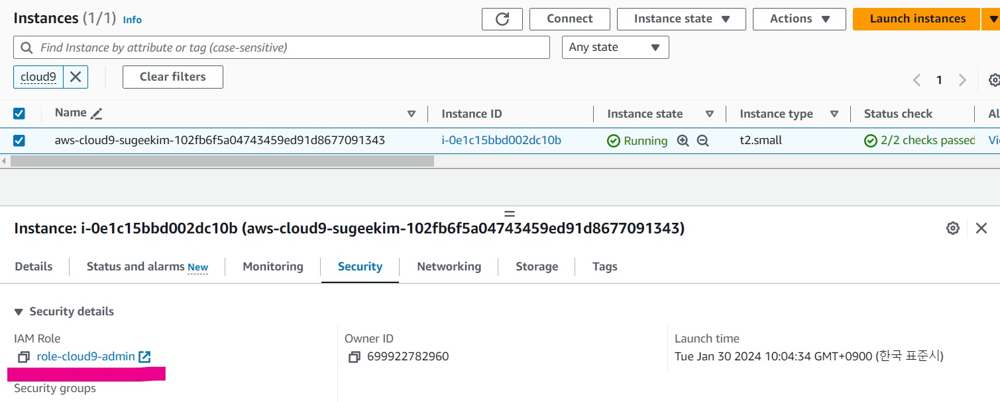
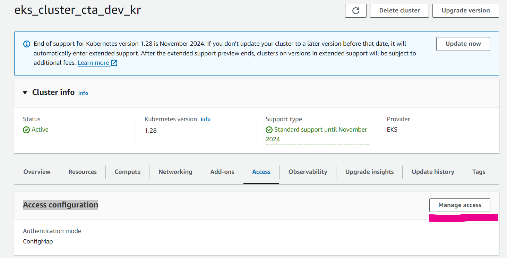
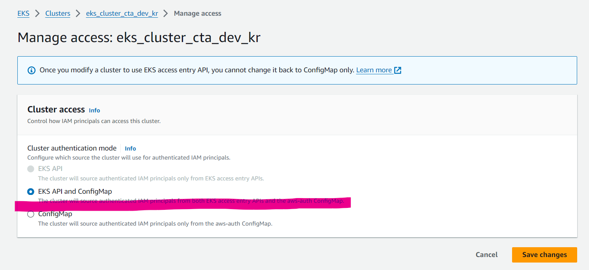
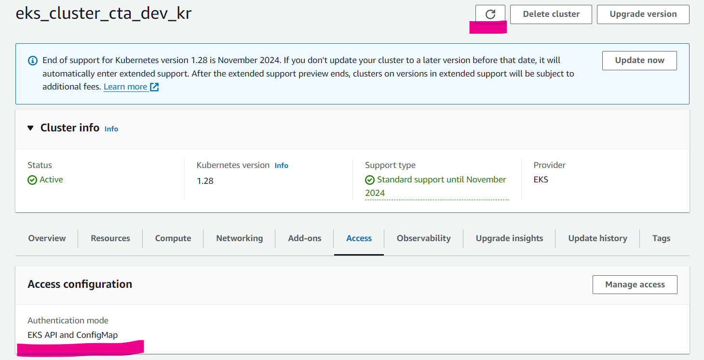
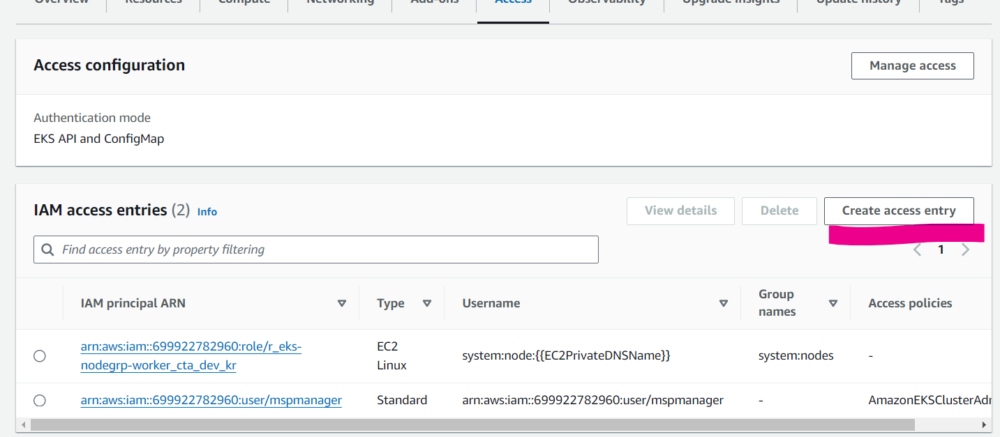

## 문제 gitops 콘솔에 cluster 생성이 안됨

### case 1. 잘못된 url을 넣음

```json
{
  "timestamp": null,
  "message": "Cannot register Kubernetes Cluster",
  "debugMessage": "Get \"https://2888FCEF7AF91B5CBDA02BF004DE2FAC.gr7.ap-southeast-1.eks.amazonaws.com/version?timeout=32s\": dial tcp: lookup 2888FCEF7AF91B5CBDA02BF004DE2FAC.gr7.ap-southeast-1.eks.amazonaws.com on 172.20.0.10:53: no such host",
  "subErrors": null,
  "status": "INTERNAL_SERVER_ERROR"
}
```

### case 2. 잘못된 Certificate Authority Data를 넣음

```json
{
  "timestamp": null,
  "message": "Cannot register Kubernetes Cluster",
  "debugMessage": "Get \"https://9BD4C2DB82F9058078EAAED9E953D52E.gr7.ap-southeast-1.eks.amazonaws.com/version?timeout=32s\": x509: certificate signed by unknown authority (possibly because of \"crypto/rsa: verification error\" while trying to verify candidate authority certificate \"kubernetes\")",
  "subErrors": null,
  "status": "INTERNAL_SERVER_ERROR"
}
```

### case 3. 잘못된 token을 넣음

```json
{
  "timestamp": null,
  "message": "Cannot register Kubernetes Cluster",
  "debugMessage": "Get \"https://9BD4C2DB82F9058078EAAED9E953D52E.gr7.ap-southeast-1.eks.amazonaws.com/version?timeout=32s\": net/http: invalid header field value \"Bearer \\neyJhbGciOiJSUzI1NiIsImtpZCI6InEyNGIyaTFiMXI5OWwtT0JDVmNpMVM3cnN5eEtTbi0zclEyZ3pSSEowSncifQ.eyJpc3MiOiJrdWJlcm5ldGVzL3NlcnZpY2VhY2NvdW50Iiwia3ViZXJuZXRlcy5pby9zZXJ2aWNlYWNjb3VudC9uYW1lc3BhY2UiOiJrdWJlLXN5c3RlbSIsImt1YmVybmV0ZXMuaW8vc2VydmljZWFjY291bnQvc2VjcmV0Lm5hbWUiOiJwYWMtYWNjb3VudC1zZWNyZXQiLCJrdWJlcm5ldGVzLmlvL3NlcnZpY2VhY2NvdW50L3NlcnZpY2UtYWNjb3VudC5uYW1lIjoicGFjLWFjY291bnQiLCJrdWJlcm5ldGVzLmlvL3NlcnZpY2VhY2NvdW50L3NlcnZpY2UtYWNjb3VudC51aWQiOiIwNDg5OWNhZi04YzM5LTQ1MTEtOWUzMi1hOWY5MGNhN2JhYTIiLCJzdWIiOiJzeXN0ZW06c2VydmljZWFjY291bnQ6a3ViZS1zeXN0ZW06cGFjLWFjY291bnQifQ.R9uU9nRYZOYqpd4w4wwyexVmOo5OrMspE0Nk1d0R8iYplO0FRwCJd6FgoYh0ViPz8ECCQr1vkjXJw4PN6EZirhyk5aizyTISx_9I5DzlNfg5jG054cFJECHZLb7Ca8mJPaox_EePVMQamHgvfUmQj3R5ThZdFxXo38c3Pm6bN6RaLN6DeLQ5ByJNPypLoY-GBxQVu6miJdu7wvoDuRzc5AF5JO9G0SpN5A78Y4gdxNLPRM3PbW4FlaDg7_d9g8pIzDvwRSnv7TVe1tagVOD5b5pVxQWRS3rIcYHa3CwuJZGNux0BHXUCNW00hZ1a1vBeKNuqWZCKj6CMf4tO8hZL0Q\" for key Authorization",
  "subErrors": null,
  "status": "INTERNAL_SERVER_ERROR"
}
```

---

---

## 🔴 10. EKS 추가 설정

- cloud9에서 eks에 접근하기위해 cloud9 ec2에 적용된 IAM role을 eks에 설정한다.
  <br>

### ✔ 10-1. EC2 콘솔 접속

- AWS Console에서 🔗[EC2](https://ap-northeast-2.console.aws.amazon.com/ec2/home?region=ap-northeast-2#Instances:) 서비스로 이동한다.
- AWS Console > EC2 > Instances

### ✔ 10-2. Cloud9의 Role 확인

- Cloud9 EC2 클릭 > `Security` 탭 클릭 하여 IAM Role을 확인한다.
- 메모✏️



### ✔ 10-3. EKS 콘솔 접속

- AWS Console에서 🔗[EKS](https://ap-northeast-2.console.aws.amazon.com/eks/home?region=ap-northeast-2#/clusters) 서비스로 이동한다.
- AWS Console > EKS > Clusters

### ✔ 10-4. Access configuration 설정 (1)

- 생성된 EKS 클릭 > `Access` 탭 클릭 > `Manager Access` 클릭



### ✔ 10-5. Access configuration 설정 (2)

- `EKS API And ConfigMap` 선택 > `Save changes` 클릭



### ✔ 10-6. Access configuration 설정변경 확인

- 설정 변경 시간이 몇분정도 걸릴수 있습니다.
- 상단의 🔃새로고침 버튼을 클릭하여
- Authentication mode가 `EKS API and ConfigMap`로 변경되는 것을 확인



### ✔ 10-7. IAM access entreis 추가 (1)

- `IAM access entreis`의 `Create access entry` 클릭



### ✔ 10-8. IAM access entreis 추가 (2)

**📌 [입력]**

> | 항목                 | 내용                         | 액션                     |
> | -------------------- | ---------------------------- | ------------------------ |
> | ➕ IAM principal ARN | `<<Cloud9의 IAM role 선택>>` | 👆🏻검색후 셀렉트박스 선택 |

- `Next` 버튼 클릭

<br>
<br>

**📌 [입력]**

> | 항목           | 내용                          | 액션              |
> | -------------- | ----------------------------- | ----------------- |
> | ➕ Policy name | `AmazonEKSClusterAdminPolicy` | 👆🏻셀렉트박스 선택 |

- `Add policy` 버튼 클릭 (🔥중요🔥)
- `Next` 버튼 클릭
- `Create` 버튼 클릭

<br>
